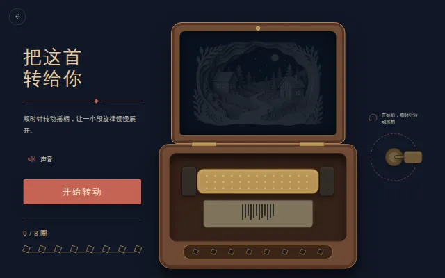
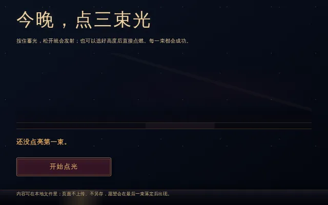
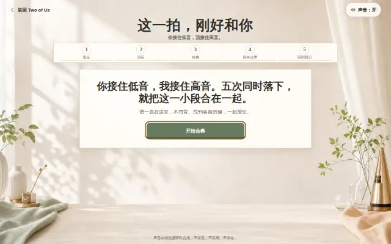
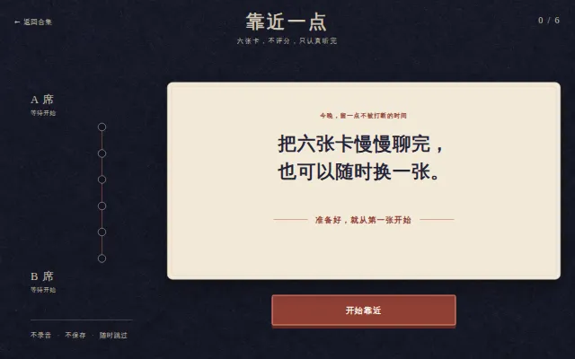
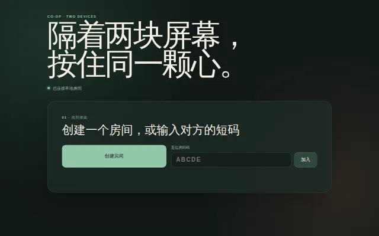
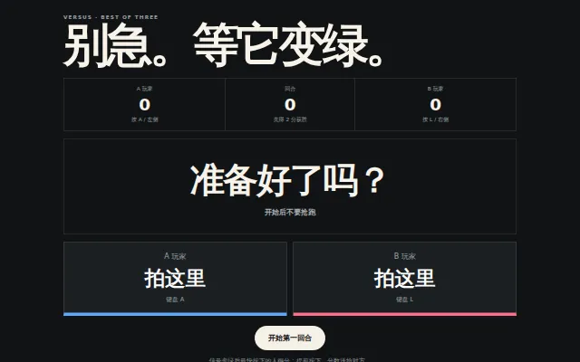
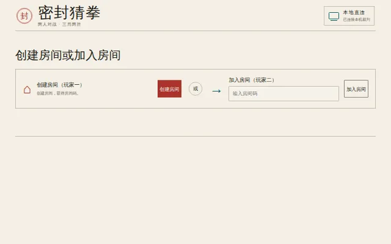
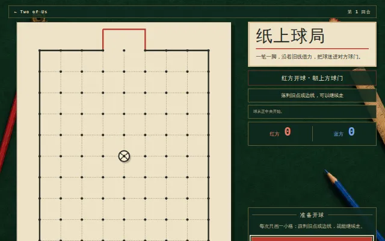

# Two of Us

> A local playground for couples, partners, friends — or any two people.<br>
> Private by default. Local first. Made for two.

*中文：[README.md](./README.md)*

Two of Us is a collection of small interactive web pieces that you open and play right away: prepare a surprise for someone, finish a challenge together, or compete face to face. Nothing here asks for an account, none of it depends on a cloud room, and private photos, recordings and messages are never uploaded to an outside service.

The catalog currently ships **76 installed experiences**:

| Solo surprises | Two-player co-op | Two-player versus | Launch levels |
| ---: | ---: | ---: | --- |
| 25 | 27 | 24 | 68 level A · 1 level B · 6 level C · 1 level D |

## Start with these nine

Seventy-six is too many to look at in one sitting. These nine cover all three categories and all three ways of playing — one person preparing for another, two people on one screen, and two people on two devices. Switching the portal's **精选 (featured)** filter to “only featured” gives you the same set.

| | | |
| --- | --- | --- |
| [](./experiences/surprises/hand-crank-music-box/)<br>**[把这首转给你 · Hand-crank music box](./experiences/surprises/hand-crank-music-box/)** · surprise · A<br>Turn the crank to play an original melody note by note as a paper-cut night scene unfolds. | [](./experiences/surprises/scratch-surprise/)<br>**[爱的刮刮卡 · Scratch card](./experiences/surprises/scratch-surprise/)** · surprise · A<br>Scratch the coating away by hand to reveal a customizable date voucher. | [](./experiences/surprises/wish-fireworks/)<br>**[今晚，点三束光 · Three fireworks](./experiences/surprises/wish-fireworks/)** · surprise · A<br>Hold to charge and release three fireworks; each one leaves a single word behind. |
| [](./experiences/co-op/four-hands-harmony/)<br>**[这一拍，刚好和你 · Four hands, one chord](./experiences/co-op/four-hands-harmony/)** · co-op · A<br>One device, two people: the low and high seats press the same beat together. | [](./experiences/co-op/closer-cards/)<br>**[靠近一点 · Closer cards](./experiences/co-op/closer-cards/)** · co-op · A<br>Six original conversation cards. No scoring, no recording, swap any card at any time. | [](./experiences/co-op/together-lock/)<br>**[同心解锁 · Together lock](./experiences/co-op/together-lock/)** · co-op · C<br>Hold both screens for 2.5 seconds at the same moment to open the lock together. |
| [](./experiences/versus/reaction-duel/)<br>**[反应力对决 · Reaction duel](./experiences/versus/reaction-duel/)** · versus · A<br>Wait for green, then race to press. Jump the gun and the point goes to the other player. | [](./experiences/versus/sealed-rps/)<br>**[密封猜拳 · Sealed rock-paper-scissors](./experiences/versus/sealed-rps/)** · versus · C<br>Both players seal a throw; the local referee reveals them only once both have arrived. | [](./experiences/versus/paper-soccer/)<br>**[纸上球局 · Paper soccer](./experiences/versus/paper-soccer/)** · versus · A<br>Draw lines across a dot grid to bounce the ball into the opponent's goal. |

> The interface and the writing inside each experience are in Chinese. This page describes the project in English; the pieces themselves have not been translated.

## Getting started in a minute

### Option one: just open it

Double-click [`index.html`](./index.html) in the repository root to browse the portal and open **68 of the level-A experiences** directly.

This route needs no dependency install, no local service, and works for solo surprises, same-screen co-op and face-to-face versus play. The address bar will show `file://`, and level B/C/D capabilities stay unavailable.

### Option two: run the full local portal

The full portal enables B/C/D experiences, local rooms, a LAN address and a join QR code.

First time:

- macOS: double-click `setup.command`
- Windows: double-click `setup.bat`

After that:

- macOS: double-click `start.command`
- Windows: double-click `start.bat`

Or use a terminal:

```bash
# install the shared dependencies, skipping the large optional local capabilities
npm run setup -- --skip-optional

# start the portal
npm start
```

The default local entry point is [http://127.0.0.1:4173/](http://127.0.0.1:4173/). If the port is taken, the runtime looks for the next free one.

> **Before scanning the QR code, make sure the phone and the computer running the portal are on the same Wi-Fi / LAN.**<br>
> Cellular data, guest Wi-Fi, a VPN or a router's client-isolation setting can all block access. The LAN address is derived from the current network and should not be bookmarked.

## Picking an experience

Every card in the portal carries a preview image and three filter groups — featured, level and category — plus a “random” button that picks from the current results.

| Category | Directory | Good for |
| --- | --- | --- |
| Solo surprises | [`experiences/surprises/`](./experiences/surprises/) | One person prepares, the other opens: letters, anniversaries, photos, music, small rituals |
| Two-player co-op | [`experiences/co-op/`](./experiences/co-op/) | Finishing something together: timing, rhythm, deduction, handling, communication |
| Two-player versus | [`experiences/versus/`](./experiences/versus/) | Comparing scores or playing to win: reaction, strategy, memory, same-screen races |

[`experiences/catalog.json`](./experiences/catalog.json) is the single source of truth for the count, entry points, previews, player counts, devices, levels, featured flags and install state.

### Preview images

The `preview.webp` beside each experience is the cover used by the portal and by this page. [`scripts/previews.mjs`](./scripts/previews.mjs) generates them by driving a local Chromium over the DevTools protocol, screenshotting each experience's own screen and encoding straight to WebP:

```bash
npm run previews              # regenerate every preview
npm run previews -- --only=love-tree,sealed-rps
```

- Almost every preview is simply the experience's opening screen. Only pieces whose opening has nothing to look at get a minimal scripted recipe that takes a few steps first.
- Previews are **not a runtime dependency**: no experience ever loads one, and the portal falls back to a text-only card when an image is missing or fails to load.
- Chromium is only used while authoring previews. It is not in `package.json` and takes no part in running any experience.
- Every preview is a screenshot of this repository's own pages and introduces no new third-party material. For assets that appear inside a shot, the per-experience `README.md` / `ATTRIBUTION.md` remains the source of record.

## What A / B / C / D mean

The level describes how a piece is launched and connected. It says nothing about quality or how hard it was to build.

| Level | How it launches | Typical capabilities |
| --- | --- | --- |
| **A · open directly** | double-click the experience's `index.html` | plain HTML/CSS/JS, Canvas, Web Audio, local files |
| **B · one-click local service** | double-click a launcher, opened by a local service | ES modules, `fetch()`, WebAssembly, local browser dependencies |
| **C · two devices over LAN** | one computer starts it, another device joins by QR code | local HTTP, Socket.IO, two-player rooms and QR codes |
| **D · heavy local capability** | install an optional model or large asset, then launch | local speech recognition, workers, WASM, verifiable capability packs |

All four levels aim to complete their core experience offline. Optional level-D capabilities are never downloaded silently when a piece starts, and declining to install one does not affect any A/B/C experience.

## Local-first and privacy boundaries

- **No accounts.** The core experiences never require registration or sign-in.
- **No public-network dependency by default.** After setup, core play happens on this machine or within the same LAN.
- **Private material stays on the device.** Photos, recordings and custom content are processed only in the current page or the local runtime.
- **Level C only transmits over the LAN.** The two devices talk through a local Node service the user started.
- **Level D models run locally.** Each capability pack has its own manifest, hash, size and license record.
- **Trusted-host model.** A local room trusts the computer running the service. This is not end-to-end encryption, and it is not meant for untrusted public networks.

## Project layout

```text
two-of-us/
├── index.html                 # the catalog-driven portal
├── setup.command / setup.bat  # first-time install
├── start.command / start.bat  # unified launcher
├── experiences/
│   ├── catalog.json           # the single source of truth for all 76 experiences
│   ├── surprises/             # solo surprises
│   ├── co-op/                 # two-player co-op
│   └── versus/                # two-player versus
├── shared/
│   ├── runtime/               # HTTP, QR codes, rooms, static file serving
│   └── ...                    # components shared across experiences
├── capabilities/              # optional level-D capability definitions and browser assets
├── scripts/                   # setup, launch, previews, tests, repository validation
├── docs/                      # research, specs, design, plans and acceptance records
├── bugs/                      # reproduced defects, root causes and regression evidence
└── learn/                     # engineering notes reusable across experiences
```

Each experience usually carries its own `README.md`, entry point, logic, styles, tests, `preview.webp` and attribution record. B/C/D experiences add a thin launcher but share the root dependencies and local runtime.

## Development

Requirements:

- Node.js 18 or newer (regenerating previews needs Node 22+ and a local Chromium);
- macOS or Windows for the double-click launchers;
- a current Chromium, Safari or Firefox browser.

Common commands:

| Command | What it does |
| --- | --- |
| `npm run setup -- --skip-optional` | install shared dependencies without the optional level-D capabilities |
| `npm start` | start the portal |
| `npm start -- --experience <id>` | start and jump straight to one experience |
| `npm run previews` | regenerate experience previews with a local Chromium |
| `npm run capabilities` | show the local capability CLI help |
| `npm test` | run every test the repository discovers |
| `npm run verify` | validate the catalog, entry points, resource closure and attribution records |

When adding or changing an experience, at minimum keep:

1. the catalog consistent with the real file entry points;
2. a `preview` declared in the catalog, generated with `npm run previews -- --only=<id>`;
3. the declared A/B/C/D launch path reproducibly verifiable;
4. private data, public-network dependencies and permission boundaries written down;
5. the core of the play deterministic, replayable and testable;
6. references, code, assets and dependency provenance traceable;
7. `npm test` and `npm run verify` passing.

## Documentation and engineering records

- [Documentation index](./docs/README.md): research, specs, design, implementation plans, acceptance records
- [Classification spec](./docs/01-classification-spec.md): categories, tags and the A/B/C/D level definitions
- [Implementation program spec](./docs/04-implementation-program-spec.md): the shared runtime architecture and delivery boundaries
- [Reference and attribution spec](./docs/05-reference-and-attribution-spec.md)
- [Shared local runtime](./shared/runtime/README.md)
- [Bug records](./bugs/README.md)
- [Engineering notes](./learn/README.md)

## FAQ

### The QR code will not open on my phone

Check that the phone and the computer are on the same Wi-Fi / LAN, and temporarily turn off cellular data or a VPN. Guest networks and AP isolation can keep devices on the same Wi-Fi from reaching each other.

### There is no sound

Browsers block autoplay that was not started by a user gesture. Click the page's main button or interactive area first, then check the tab and system volume.

### Port 4173 is already in use

The launcher scans a bounded range for the next free port and prints the real address in the terminal and the portal. Trust the address and QR code shown by that particular run.

### I do not want to install the local speech model

Use `npm run setup -- --skip-optional`. Level-D capabilities are optional and do not affect anything else.

## Provenance and licensing

The repository contains independent implementations, locally generated or self-made assets, and pinned third-party dependencies. The actual scope of every reference, along with code, asset, model and license records, lives in each experience's `README.md` / `ATTRIBUTION.md` and in [`shared/runtime/README.md`](./shared/runtime/README.md).

There is currently no single root license covering everything here. Before reusing or redistributing an experience, go by the provenance and license records in that directory — “publicly visible” does not mean “free to copy”.
