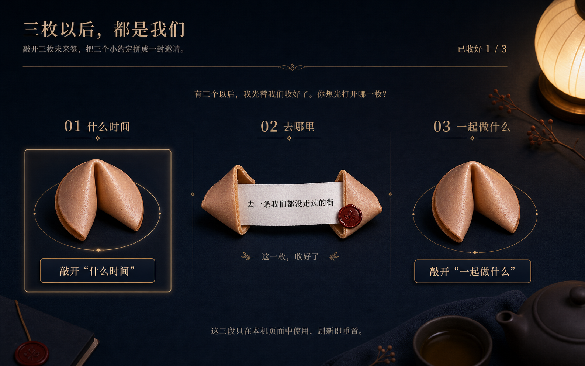
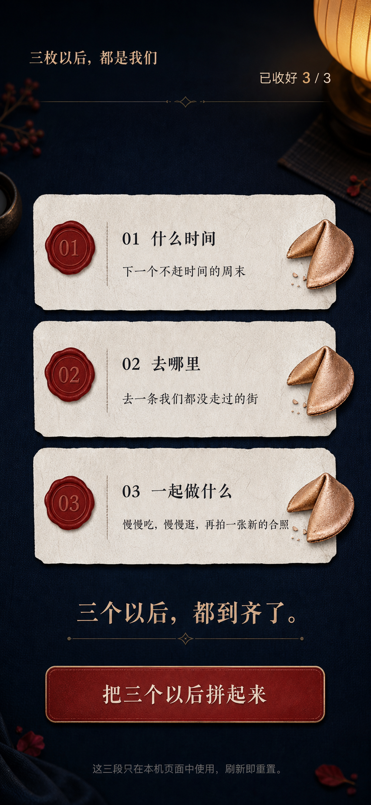
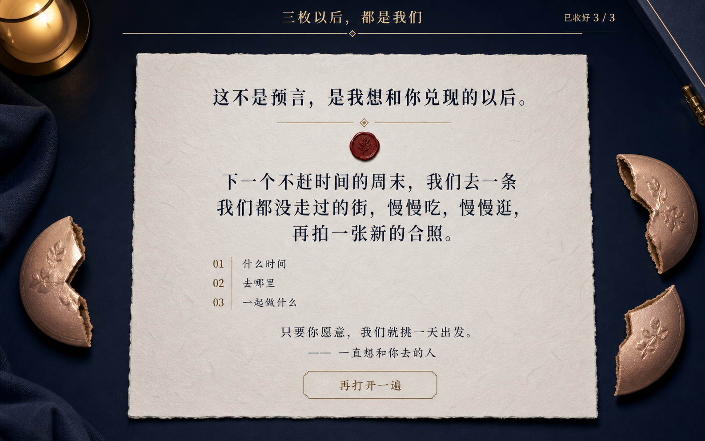
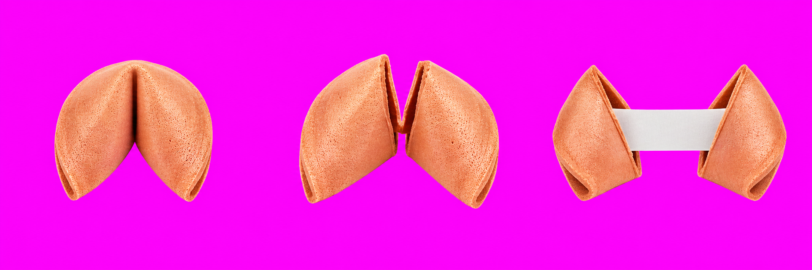

# “三枚以后，都是我们”视觉概念与生产资产

- 日期：2026-07-19
- 状态：概念、设计系统与生产资产已冻结
- 对应规格：[132-future-cookie-notes-spec.md](./132-future-cookie-notes-spec.md)
- 概念路径：`docs/assets/future-cookie-notes/`
- 生产资产：`experiences/surprises/future-cookie-notes/assets/`

## 1. 接受的视觉方向

最终方向是“深夜茶桌上的三封未来信”：深墨蓝织物桌面是安静底色，球形纸灯只在边缘提供少量温光，粉金烤色饼干是唯一大体量对象，奶白纤维纸和深红封签承担内容层级，黄铜线只用于序号、分隔与焦点。

它的对比不是“可爱粉红派对”，而是“准备好的小型仪式”：物件有真实质感，交互层级却保持干净、安静和易读。

## 2. 三张完整状态概念

### 2.1 collecting：桌面三列



- 原尺寸：1586×992；
- 左上标题/副题、右上进度和细黄铜长线建立安静横栏；
- “什么时候 / 去哪里 / 一起做什么”三个语义位置始终固定；
- 只打开中间一枚，直观说明用户可以任意顺序探索；
- 左侧未打开项使用可见黄铜焦点环，不用颜色以外的隐式反馈；
- 中间纸条与两半饼干为一个开放 article，没有再套第二层卡片。

概念文字接受为布局证据，生产实现仍以规格中的精确文案为唯一源。

### 2.2 ready：移动三签齐套



- 原尺寸：852×1846；
- 短标题与 `3 / 3` 位于同一顶行，不在移动端重复长副题；
- 三条已打开签以纵向紧凑节奏排列，序号封签、标题、正文和饼干半片的层级统一；
- 齐套 H2 和深红唯一主按钮位于三条签下方，形成明确的第二节拍；
- 保留 390×844 实装中“主按钮无需滚动即可见”的硬 Gate；概念原尺寸只是高清设计证据，不放宽这一 Gate。

拒绝概念中第一段少一个“个”的生成误差；生产文案必须是“下一个不赶时间的周末”。

### 2.3 finale：一封长邀请



- 原尺寸：1586×992；
- 中央只有一张大面积奶白长信，不再使用三张对等大卡；
- 结尾 H2、连续邀请、三条序号边注、结语、署名和重开构成一条单向阅读路径；
- 四片饼干只在长信外缘表达“已打开”，不会和正文争抢焦点；
- 次按钮是细线框，不与合成阶段的深红主按钮混淆。

拒绝概念中署名首字的生成误差；生产文案必须是“—— 一直想和你去的人”。

## 3. 上首屏文案锁

### collecting 允许列表

```text
三枚以后，都是我们
敲开三枚未来签，把三个小约定拼成一封邀请。
已收好 {opened} / 3
有三个以后，我先替我们收好了。你想先打开哪一枚？
01 什么时候
02 去哪里
03 一起做什么
敲开“{label}”
这一枚，收好了
已打开项的当前正文
这三段只在本机页面中使用，刷新即重置。
```

### ready 允许增量

```text
三个以后，都到齐了。
把三个以后拼起来
```

### finale 允许增量

```text
这不是预言，是我想和你兑现的以后。
下一个不赶时间的周末，我们去一条我们都没走过的街，慢慢吃，慢慢逛，再拍一张新的合照。
只要你愿意，我们就挑一天出发。
—— 一直想和你去的人
再打开一遍
```

禁止在上述列表外增加可见 eyebrow、英文副标、badge、pill、模式、当前时间、倒计时、随机提示、奖杯、统计、分享、下载、声音、设置或二维码。

## 4. 设计 token

### 4.1 色彩

| token | 值 | 用途 |
| --- | --- | --- |
| `--ink-950` | `#06111d` | 页面底色和图片失效回退 |
| `--ink-900` | `#0b1a2b` | 容器深色面 |
| `--ink-700` | `#243447` | 深色线框 |
| `--paper-100` | `#f2ede3` | 主纸面 |
| `--paper-200` | `#e1d7c7` | 纸面次层与暗边 |
| `--paper-ink` | `#142235` | 纸上主文字 |
| `--brass-500` | `#b88b54` | 编号、分隔线和焦点环 |
| `--brass-300` | `#d9b77f` | 深色底上标题和进度 |
| `--seal-700` | `#7b1f1b` | 主按钮、封签 |
| `--seal-500` | `#a13a31` | 主按钮悬停/强调 |
| `--cookie-300` | `#e5a78f` | CSS 饼干回退 |
| `--focus` | `#f1c37f` | 唯一高对比焦点环 |

颜色锁：背景是深墨蓝，纸是中性奶白，不在实现中改成粉色渐变、暖黄泥色或纯黑赛博底。背景图上不覆盖额外色洗层；如需保证文字可读，使用不透明纸面或边缘阴影，不修改图片色温。

### 4.2 字体

```css
--font-display: "Songti SC", "STSong", "Noto Serif CJK SC", Georgia, serif;
--font-body: -apple-system, BlinkMacSystemFont, "Segoe UI", "PingFang SC", "Microsoft YaHei", sans-serif;
--font-number: ui-monospace, "SFMono-Regular", Menlo, Consolas, monospace;
```

| 角色 | 桌面 | 移动 | 字重 / 行高 |
| --- | --- | --- | --- |
| H1 | `clamp(2.15rem, 4vw, 4rem)` | `clamp(1.65rem, 7vw, 2.15rem)` | 600 / 1.12 |
| H2 | `clamp(1.75rem, 3vw, 3rem)` | `clamp(1.5rem, 6vw, 2rem)` | 600 / 1.22 |
| 邀请正文 | `clamp(1.4rem, 2.2vw, 2rem)` | `1.1–1.25rem` | 500 / 1.75 |
| 普通正文 | `1rem` | `1rem` | 400 / 1.65 |
| 按钮 | `1.05rem` | `1rem` | 650 / 1.2 |
| 序号 | `1.3rem` | `1.05rem` | 500 / 1 |

所有控件明确设定字号、字重、字体和行高，不依赖浏览器默认 button typography。

### 4.3 几何、间距与阴影

- 间距：`4 / 8 / 12 / 16 / 24 / 32 / 48px`；
- 普通纸签圆角：`8px`；长信：`6px`；按钮：`6px`；
- 纸面边框：`1px solid rgba(184, 139, 84, .34)`；
- 纸面阴影：`0 18px 52px rgba(0, 0, 0, .28)`；
- 焦点：`3px solid var(--focus)` + `4px` 外偏移，不被裁切；
- 主按钮内边：一条低亮黄铜线，不加多层 glow。

## 5. 元件家族

### `QuietHeader`

- 桌面：左标题/副题，右进度，下方单根黄铜线；
- 移动：短 H1 + 进度，不重复副题；
- 无品牌图标、导航、返回、设置或模式切换。

### `FutureNote`

- `closed`：原生 button + closed sprite + 序号 + 公开标题 + 完整动作文案；
- `open`：article + open sprite + 奶白纸条 + 序号 + 标题 + 正文 + 已收好；
- 两个变体共用相同容器尺寸和排版 token，不因打开大幅跳动。

### `PrimaryAssemble`

- 只在 ready 出现；
- 深红底、奶白文字、黄铜内线，至少 48px 高；
- 无图标、无粒子、无跳动或循环发光。

### `FinalLetter`

- 一张长信容纳 H2、连续邀请、三条边注、结语、署名和次按钮；
- 边注是开放列表，不是嵌套卡片；
- 移动端只重排内容，不改变阅读顺序。

### `StatusRegion`

- 持久存在、视觉隐藏、`role=status`、polite + atomic；
- 只宣告规格冻结的四类完整消息。

## 6. 图标和媒体清单

没有导航图标、分享图标、音量图标、设置图标或庆祝图标。允许的非文本元素只有：

1. 饼干 closed / cracked / open 生产 sprite；
2. 黄铜细分隔线与中心小菱形，用 CSS 线框实现，不是交互图标；
3. 深红封签圆形，用 CSS 背景 + 序号实现，不重建生成图中的植物压印；
4. `favicon.svg` 使用独立原创的左右半饼干轮廓，不从候选项目或生成图追踪。

交互热区、序号、标题、正文、焦点、状态与所有按钮始终是代码原生。

## 7. 动效合同

| 动效 | 标准 | 降低动效 |
| --- | --- | --- |
| closed → cracked | `opacity` + 最多 `2deg` 短旋转，`110ms` | 即时替换 |
| cracked → open | `opacity` + 纸签上移 `8px`，`220ms` | 即时替换 |
| ready 主动作出现 | 淡入 `180ms` | 即时出现 |
| finale 长信 | 上移 `12px` + 淡入 `320ms` | 即时出现 |
| hover / active | 边框与 `translateY(-1px / 0)`，`140ms` | 只变边框 |

没有循环、自动晃动、震屏、闪烁、颗粒、视差、跟随指针或必须等待完成的转场。`cracked` 是 UI 临时帧，不是 reducer 阶段；下一个 action 永远可立即处理。

## 8. 布局数据

### 8.1 桌面

- 页面内边：`clamp(20px, 4vw, 56px)`；
- 内容最大宽：`1120px`；
- header：标题区自由宽 + 进度固定右对齐；
- collecting / ready 三列：`repeat(3, minmax(0, 1fr))`，gap `24–32px`；
- FutureNote 最小高：`360px`，图像区高 `190–220px`；
- ready 动作区最大宽 `520px`，居中；
- finale 长信最大宽 `760px`，水平居中。

### 8.2 平板

- `600–899px`：三列保留，缩小图像区与 gap；
- 标题和进度不换为两个独立卡片；
- ready 主动作在 768×1024 首屏可见。

### 8.3 移动

- `< 600px`：页面内边 `16px`，header 两列，副题放入 collecting 内容顶部；
- collecting：三个 FutureNote 均可见；未开按钮使用紧凑横条，图像 `92–112px`，标题和动作文字在同一条；
- open：纸签高度随正文自适应，不强制三条等高；
- ready：三条 `120–140px` 左右的纸签 + H2 + 主按钮，390×844 全部可见；
- finale：长信全宽，三条边注改为紧凑纵列，重开在文档流中；
- 320×700 允许纵向滚动，禁止横向滚动和固定底栏。

## 9. 生产资产

### 9.1 夜茶桌背景


- 源图：`docs/assets/future-cookie-notes/production-background-source.png`；
- 生产图：`experiences/surprises/future-cookie-notes/assets/night-tea-table.jpg`；
- 尺寸：1586×992；
- 中央广阔深墨蓝织物留空，灯、茶具、本子和干枝只在边缘；
- 图中无 UI、文字、签语、饼干、人物、标识或交互热区；
- 生产处理：`ffmpeg -i production-background-source.png -q:v 2 night-tea-table.jpg`；
- 背景直接显示，不加全局颜色覆盖或染色层。

### 9.2 三态饼干图集



- 源图：`docs/assets/future-cookie-notes/future-cookie-atlas-chroma-source.png`；
- 生产图：`experiences/surprises/future-cookie-notes/assets/future-cookie-atlas.png`；
- 尺寸：2172×724，严格 3×1，每格 724×724；
- 顺序：closed / cracked / open；
- 源图背景为纯 `#ff00ff`，无文字、阴影、碎屑、餐具或额外物体；
- 生产处理：`ffmpeg -vf "chromakey=0xFF00FF:0.085:0.06,format=rgba" -frames:v 1`；
- 生产图模式：RGBA；
- alpha 统计：全透明 `1,166,392`，部分透明 `3,970`，全不透明 `402,166`，范围 `0..255`；
- CSS：`background-size: 300% 100%`，定位 `0% / 50% / 100%` + `50%` 垂直中线。

`view_image` 的原始 RGBA 查看会显示透明像素中保留的色键 RGB，不代表 alpha 失效。最终仍必须在浏览器的深墨蓝底上检查实际合成结果、边缘色溢、三格定位和故障回退。

## 10. ImageGen 输入与选择记录

全部五张图均为纯文本新生成，没有参考图、候选项目图片、真实人物照片或第三方品牌。

1. collecting：要求完整 16:10 桌面交互界面，中间一枚已开，两侧未开，左侧焦点，三列稳定，不得添加随机或抽奖语义。
2. ready：要求完整移动界面，三条签按语义顺序齐套，齐套 H2 与唯一合成主按钮在屏幕内。
3. finale：要求完整 16:10 桌面界面，一张长信容纳结尾 H2、连续邀请、三条边注、结语、署名和次按钮。
4. 背景：要求俯拍 16:10 深墨蓝茶桌，道具只在极端边缘，中央 75% 低对比留白，不含 UI、文字、签语或饼干。
5. 图集：要求严格 3×1，同角度/同缩放/同材质的 closed / cracked / open，纯 `#ff00ff` 色键，无文字、阴影、碎屑或额外物体。

接受：三张概念的布局、层级、色彩、媒体处理与交互焦点；两张生产图的构图、物件角度和留空。

拒绝：移动概念第一段漏字、finale 概念署名首字误差、概念中不能取代代码文字的所有嵌图文字，以及任何未在上首屏文案锁里的装饰文字。

## 11. 资产哈希

| 文件 | SHA-256 |
| --- | --- |
| `concept-collecting-desktop.png` | `1abe19b20521f06f89f2694172eb17e41252f5dfd726b78849b5efa00e908fbe` |
| `concept-ready-mobile.png` | `723ce5512bea9bb69f7f0fe76fc137d6cb476178abdae798cfadfc045b6bac8d` |
| `concept-finale-desktop.png` | `42e2988cef21abf387ff33011acf264f0dc05627459901ef825feb159df631ad` |
| `production-background-source.png` | `cbb754ebf2aeee130a2fb7747912e8e5f01023b79672a4783e4273c409f52788` |
| `future-cookie-atlas-chroma-source.png` | `6899fc0669c92e679e16d6f590af670b261c369e6edfe211720f7b15d76ee723` |
| `night-tea-table.jpg` | `b0b28bc39afbc2d0001f34f0718cc6b4b693f32f31d0772edecfd68f244879ea` |
| `future-cookie-atlas.png` | `c763b6ef888320af449589359680ab3d575fe58fdfe18905e464cd164b8fc8ce` |

## 12. 初始 fidelity 账本

| 概念证据 | 生产决定 | 最终验收 |
| --- | --- | --- |
| 标题/副题 + 右侧进度的安静横栏 | `QuietHeader` 只有这三类文字和一根细线 | 待实装截图对照 |
| 三列固定为 when / where / together | DOM 始终按 `NOTE_IDS` 排列，不按打开顺序重排 | 待打开中间项截图对照 |
| 已开与未开占位稳定 | 共用 FutureNote 容器尺寸，仅内容变体 | 待测量三列与 layout shift |
| 左侧未开项有黄铜焦点环 | 原生 button + 3px focus-visible 环 | 待键盘截图对照 |
| 移动三条签 + 唯一深红主按钮 | 390×844 压缩头部、签高与间距 | 待确认主按钮首屏可见 |
| finale 只有一张长信 | `FinalLetter` 单容器，边注不做三张卡 | 待桌面/移动对照 |
| 背景图不承载交互 | 原图直接背景，图失效用纯深墨蓝 | 待 Network 和禁图实玩 |
| 饼干写实但不承载文字 | 三态透明 sprite + 代码序号/标题/按钮 | 待三格定位与边缘色溢 |
| 深墨蓝/奶白/深红/黄铜的低饱和系统 | 使用本文 token，不加粉色渐变或背景染色 | 待计算样式与截图对照 |
| 文字层级为宋体标题 + 易读正文 | 本机字体栈、明确字号/字重/行高 | 待桌面和 390px 换行审计 |
| 生成图的两处文字错误 | 生产只渲染规格中的精确代码文字 | 待 above-the-fold copy diff |

## 13. 发布 Gate

- [x] collecting、ready、finale 三个完整状态已生成并检查；
- [x] 夜茶桌背景和三态图集已生成、处理、验尺寸与哈希；
- [x] 图集 RGBA、alpha 范围与透明统计已验证；
- [x] 生成图中的两处文字错误已明确拒绝；
- [x] 上首屏文案、token、字体、元件、媒体、布局、动效和故障回退已冻结；
- [ ] 实现后截取桌面 collecting、移动 ready、桌面 finale 与移动 finale；
- [ ] 在同一 QA 轮次对概念与最新实装截图同时使用 `view_image`；
- [ ] 检查至少五项 fidelity、上首屏文案 diff、图标、字体、资产混合、响应式和动效；
- [ ] 禁背景/禁图集、降低动效和强制颜色下规则仍完整；
- [ ] 修复所有可修复视觉差异后，再标记 agency sign-off。
