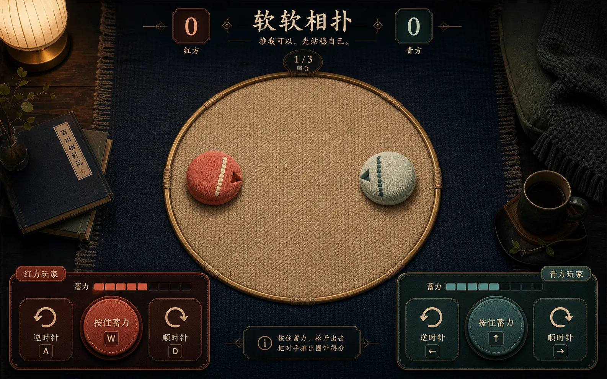
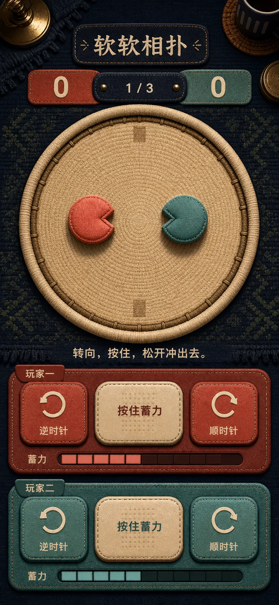
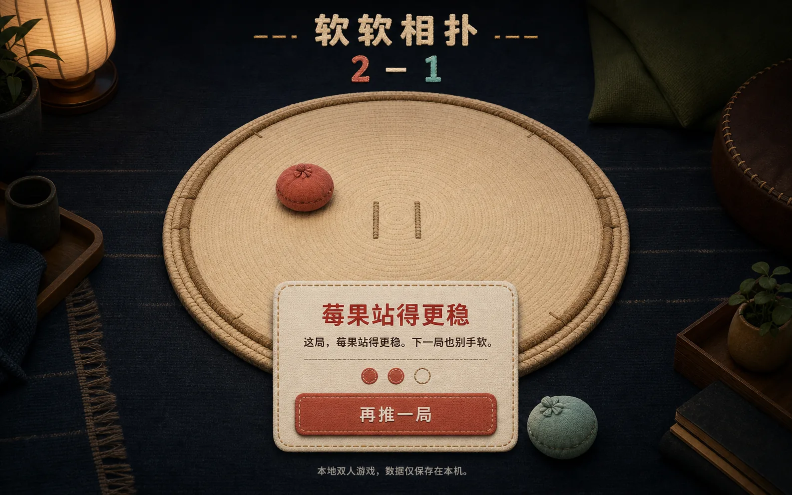

# “软软相扑”视觉设计

- 日期：2026-07-19
- 对应规格：[`137-soft-sumo-spec.md`](./137-soft-sumo-spec.md)
- 概念方式：OpenAI 内置 ImageGen，先概念、后生产资产
- 状态：桌面进行、移动进行、桌面赛果、生产背景和棋子状态图集已接受

## 1. 视觉结论

核心句：**把一场双人推挤，放进深夜客厅里的一只柔软圆垫。**

作品不是传统相扑模拟器，也不是霓虹派对小游戏。竞技感来自圆形边界、双方朝向、蓄力和比分；亲密感来自编织物、低照度客厅、并排共享一台设备的控制布局。

- 页面底色：墨蓝地毯与深森林绿；
- 竞技场：奶油色编织圆垫，细黄铜边界；
- 玩家 0：珊瑚莓果布垫，奶油缝线；
- 玩家 1：海盐青绿布垫，深色点状缝线；
- 主动作：奶油或席位色，不使用高饱和霓虹；
- 状态：名字、方向缺口、纹样和文字共同表达，不能只靠颜色；
- 动效：棋子平移、旋转、压缩、拉伸和很短的接触回弹；不使用纸屑、奖杯、镜头震动或持续发光。

## 2. 接受的概念

### 2.1 桌面进行态



- 原生尺寸：1586 × 992；
- 采纳：中央大圆场、顶部紧凑比分、左右同权控制、材质与暖冷双席；
- 不采纳：概念中的“红方/青方”、额外得分说明、仿古书名、过密黄铜装饰和生成式文字；
- 实现：玩家名只取清洗配置，规则只显示冻结文案，三个控制使用原生 button。

### 2.2 移动进行态



- 原生尺寸：853 × 1844，是纵向层级参考，不是 390 × 844 的像素照抄；
- 采纳：标题/比分/场地/规则/两席控制的自上而下顺序，圆垫仍是视觉中心；
- 不采纳：超过真实首屏的整体高度、两套过厚皮革面板、始终填充一半的假蓄力条；
- 实现：真实 390 × 844 允许自然纵向滚动；场地优先，双方控制纵向等权，每个触控按钮至少 48px。

### 2.3 桌面赛果态



- 原生尺寸：1586 × 992；
- 采纳：场地保留在背景、出圈棋子仍可见、单一赛果纸片、2–1 比分和唯一主动作；
- 不采纳：概念把“再推一局”误写成“再推一层”、生成式本地说明和棋子顶部花结；
- 实现：HTML 输出精确配置文案；三轮记录是中性语义列表，平局不伪造赢家。

## 3. 生产资产

| 文件 | 原生尺寸 / 格式 | 体积 | 用途 | 失败降级 |
| --- | --- | ---: | --- | --- |
| `experiences/versus/soft-sumo/assets/arena-background.webp` | 1586 × 992，RGB WebP | 约 324KB | 无字圆垫与客厅底图 | 墨蓝纯色、CSS 圆垫和黄铜边界 |
| `experiences/versus/soft-sumo/assets/token-atlas.webp` | 1536 × 1024，RGBA 无损 WebP | 约 880KB | 2 行 × 3 列的 idle / charging / dashing 棋子 | 席位色 CSS 圆形、纹样和方向缺口 |
| `docs/assets/soft-sumo/token-atlas-chroma-source.png` | 1536 × 1024，RGB PNG | 约 2.1MB | 透明图集的可复现色键源，只用于文档 | 不进入运行页面 |

生产背景没有文字、按钮、比分、玩家或规则。中央低对比且圆垫完整，DOM 棋子与状态覆盖后仍清晰。图集每格的理论裁切是 512 × 512：第一行莓果，第二行海盐；第一列 idle，第二列 charging，第三列 dashing。

透明图集生成命令使用工作区统一 Python：

```sh
/Users/zenith/.cache/codex-runtimes/codex-primary-runtime/dependencies/python/bin/python3 \
  "${CODEX_HOME:-$HOME/.codex}/skills/.system/imagegen/scripts/remove_chroma_key.py" \
  --input docs/assets/soft-sumo/token-atlas-chroma-source.png \
  --out experiences/versus/soft-sumo/assets/token-atlas.png \
  --key-color '#ff00ff' --soft-matte \
  --transparent-threshold 36 --opaque-threshold 105 \
  --edge-feather 0.6 --edge-contract 0 --spill-cleanup
```

生成的透明 PNG 再无损转为 WebP。统计结果为 1,055,641 个完全透明像素、28,308 个部分透明边缘像素；原尺寸检查未见洋红底残留或明显缝线侵蚀。

## 4. 设计令牌

```css
:root {
  --night-950: #071018;
  --night-900: #0b1720;
  --forest-800: #102923;
  --rug-line: #2d3b3c;
  --arena-100: #e9d4ad;
  --arena-200: #c8aa78;
  --brass-500: #b88945;
  --brass-300: #d7b977;
  --berry-500: #d65f4f;
  --berry-700: #7f302b;
  --salt-400: #9bc2b9;
  --salt-700: #295c59;
  --cream: #f4e8ca;
  --cream-muted: #c6b99d;
  --ink: #172129;
  --focus: #ffe19a;
  --surface: rgb(7 16 24 / 90%);
  --line: rgb(244 232 202 / 24%);
}
```

- 席位色只用于身份与局部状态；长正文仍用 cream；
- focus 必须是 3px 实线 outline 加 offset，不靠发光；
- forced-colors 下移除背景图和图集，保留 border、文字、方向符号与系统颜色；
- 禁用背景图时，CSS 圆垫和两枚棋子仍能完整玩三轮。

## 5. 字体与层级

- 标题、比分、赛果：`"Iowan Old Style", "Songti SC", STSong, serif`；
- 规则、按钮、状态：`-apple-system, BlinkMacSystemFont, "Segoe UI", "PingFang SC", sans-serif`；
- H1：桌面 42–54px，移动 30–36px；
- 比分：桌面 34–48px，移动 28–36px；
- 主规则：16–20px；按钮：15–18px、600；辅助文案不小于 13px；
- 图片不承担文字；配置内容只经 `textContent` 输出。

## 6. 页面骨架

```text
page-shell
├── utility-bar      返回 / 玩法 / 暂停
├── match-header     H1 / 副句 / 比分 / 轮次
├── arena-stage      圆垫背景 / DOM 棋子 / 倒数或赛果
├── rule-line        转向，按住，松开冲出去。
├── player-controls  莓果三键 / 海盐三键
└── local-only       本机、刷新重置
```

桌面 900px 以上把两席控制置于场地下方左右两列；移动端顺序固定为场地、莓果、海盐。桌面场地不超过可用高度的约 62%，移动端使用 `min(92vw, 58vh)`，不能为追求概念图比例把第二席永久压到首屏外。

arena 是带语义 heading 的 `section`，不是 Canvas。棋子是绝对定位的 DOM 元素，背景图只是材质。CSS 使用逻辑层提供的 `x/y/aimIndex/chargeRatio` 设置 transform；不能从 CSS 动画读取游戏位置。

## 7. 棋子图集合同

- 每个棋子元素使用同一 3×2 `background-image`；
- 席位决定 y 方向：0% 或 100%；状态决定 x 方向：0%、50%、100%；
- idle 与 charging 的视觉中心对齐；dashing 图可通过容器的补偿 scale 保持碰撞圆心不漂移；
- 方向旋转施加到最外层 token，图集状态只施加到内层 sprite；
- `prefers-reduced-motion` 取消视觉缓动和接触抖动，但逻辑 tick、速度和碰撞完全不变；
- 资产加载失败时，CSS token 保留圆形、席位纹样、文字替代名和方向缺口。

## 8. 阶段视觉

- intro：场地与出生棋子可见，中央只放一句规则和“开始第一轮”；
- countdown：中央显示 3 / 2 / 1，不响应双方控制；
- playing：控制可见，蓄力条只反映逻辑比例，冷却显示文字与短刻度；
- paused：移除控制，场地变暗但不模糊，单一“继续比赛”；
- round-result：保留出圈位置，显示“莓果得 1 分 / 海盐得 1 分 / 同时出圈”；
- match-result：控制消失，显示 0–3 的真实比分、三轮记录、结语和“再推一局”。

不新增音效、振动、设置、主题、全屏、排行榜或统计面板。

## 9. 可访问与响应式 Gate

- 320 × 700、390 × 844、1440 × 900 都无横向滚动；
- 200% 文本缩放不裁掉规则、比分或唯一主动作；
- 六个触控控制与阶段动作的可点击高度至少 48px；
- 键盘 A/W/D 与方向键只在 playing 生效，焦点按钮仍可用 Space/Enter；
- 指针丢失、取消、blur、hidden 和长帧必须取消蓄力并进入安全暂停；
- 席位身份同时有名字、位置、纹样与方向，不只靠珊瑚/海盐颜色；
- 背景关闭、图集失败、reduced motion、forced colors 都不改变胜负规则。

## 10. 借鉴与原创边界

- 三张概念、背景与棋子图集由 OpenAI 内置 ImageGen 根据本项目原创提示生成；
- 玩法规则只抽象借鉴互相推动、固定步模拟和冲量教学资料，固定来源与许可证见 [`136-soft-sumo-research.md`](./136-soft-sumo-research.md)；
- 未复制任何参考仓库代码、贴图、字体、声音、关卡、文案或品牌；
- 生成概念中的错误中文和多余元素被明确拒绝，生产 UI 全部由原生 HTML/CSS/JS 实现。
