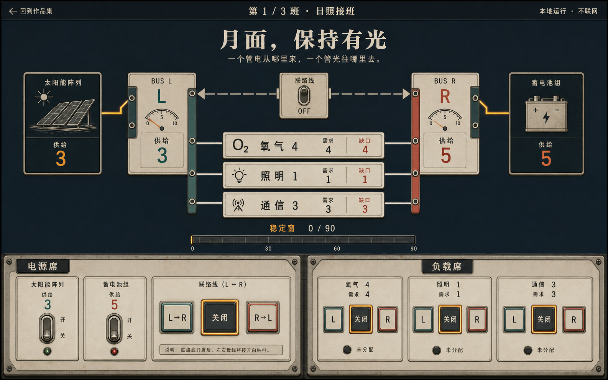
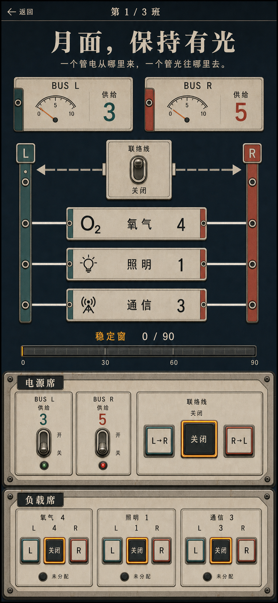
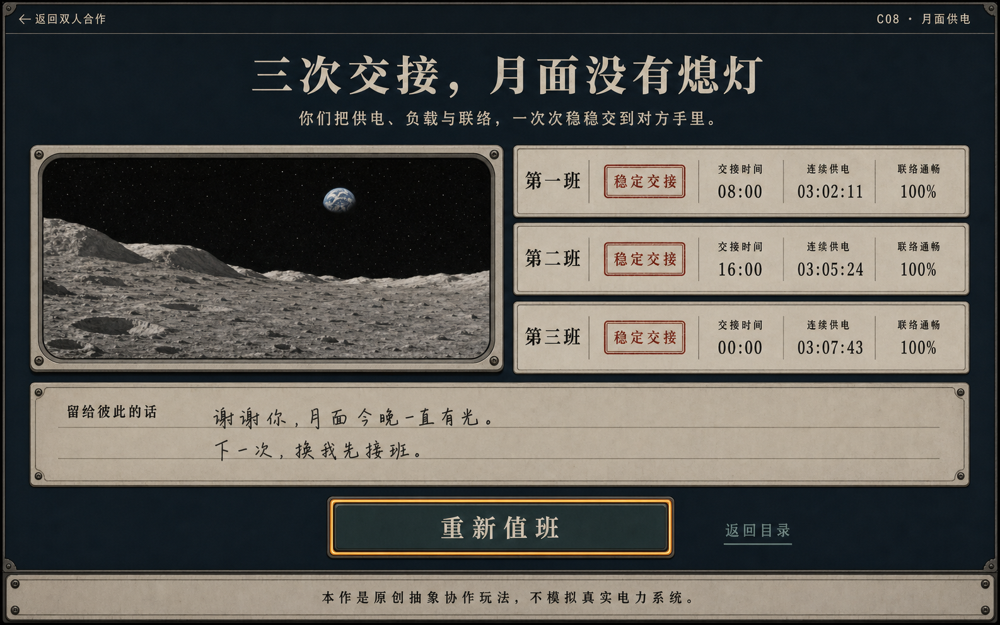

# “月面，保持有光”视觉设计

- 日期：2026-07-20
- 对应规格：[`142-moon-base-power-spec.md`](./142-moon-base-power-spec.md)
- 概念方式：OpenAI 内置 ImageGen，先完整状态概念、后独立生产背景
- 状态：桌面进行、移动进行、桌面完成和生产背景源稿已接受

## 1. 视觉结论

核心句：**把一次需要彼此信任的供电交接，放进一间安静的七十年代虚构月面控制室。**

它不是工业仿真器，也不是霓虹科幻游戏。技术感来自双母线、机械开关、刻度和清晰的能量流；亲密感来自两个并列席位、暖色实用照明、稳定交接的共同目标，以及完成后留给彼此的话。

- 页面底色：炭黑月海蓝与低对比金属墙；
- 工作面：暖象牙仪表板、拉丝铝、细黄铜边；
- 电源席：琥珀色，负责太阳能、蓄电池和联络开关；
- 负载席：低饱和青绿，负责氧气、照明和通信；
- 安全状态：琥珀、青绿、文字、数值和线路形态共同表达，不能只靠颜色；
- 动效：电流短划线、机械拨杆、稳定轨迹；不使用持续辉光、震屏、纸屑或胜利烟花。

## 2. 接受的概念

### 2.1 桌面进行态



- 原生尺寸：1586 × 992；
- 采纳：顶部安静导航、大标题、左右电源、中央双母线、三条负载轨、连续稳定轨和底部双席控制台；
- 不采纳：概念中的生成式小字、非冻结数值、装饰性微型按钮和过密仪表；
- 实现：页面只显示规格中的供应、需求、传输量、故障和 0–90 tick 稳定进度，所有控件使用原生 button。

### 2.2 移动进行态



- 原生尺寸：853 × 1844，是窄屏纵向结构参考，不是 390 × 844 的像素照抄；
- 采纳：班次信息、双母线、联络、三条负载、稳定轨、电源席、负载席的自上而下次序；
- 不采纳：一次塞满整页的超长首屏、重复总量面板、概念中不属于冻结模型的指示文字；
- 实现：390 × 844 首屏至少露出标题、班次、完整双母线和稳定反馈；控制席允许自然滚动，每个触控目标至少 48px。

### 2.3 桌面完成态



- 原生尺寸：1586 × 992；
- 采纳：情绪标题、月面观察窗、三条班次记录、共享留言、唯一主动作和中性免责声明；
- 不采纳：概念把第二条误写成“第一班”、虚构时长/百分比、生成式手写内容；
- 实现：严格渲染“第一班／第二班／第三班”和真实摘要，只保留“重新值班”一个主按钮及“返回目录”文字链接。

## 3. 生产资产

| 文件 | 原生尺寸 / 格式 | 体积 | 用途 | 失败降级 |
| --- | --- | ---: | --- | --- |
| `docs/assets/moon-base-power/control-room-background-source.png` | 1586 × 992，RGB PNG | 约 1.8MB | 无字月面控制室背景源稿 | 炭黑纯色、CSS 金属接缝和原生仪表板 |
| 三张 `*-concept.png` | 1586 × 992 / 853 × 1844，PNG | 各约 2MB | 设计与验收参照，不进入运行页面 | 文档文字规格仍完整 |

生产背景没有文字、数字、控件、线路、人物、飞船、NASA 标识或第三方品牌。实现阶段从源稿导出运行用轻量图片；即使图片加载失败，双母线、控件、状态和完整玩法仍由 HTML/CSS/SVG 保证。

没有另做按钮、仪表或线路位图。这个作品的核心视觉就是状态 UI，本轮刻意让它们保持代码原生，以便准确同步逻辑、适配移动端、支持键盘焦点和 forced-colors。

## 4. 设计令牌

```css
:root {
  --void-950: #071017;
  --void-900: #0b171e;
  --panel-900: #111d22;
  --panel-800: #19272b;
  --ivory-100: #eadfc7;
  --ivory-200: #cbbda3;
  --aluminum-400: #9a9a91;
  --brass-500: #a77a3f;
  --amber-400: #d99a42;
  --amber-600: #9b5d22;
  --teal-400: #79aaa2;
  --teal-700: #315f5b;
  --danger-400: #c66a54;
  --ink: #172126;
  --focus: #ffe19a;
  --line: rgb(234 223 199 / 24%);
  --surface: rgb(7 16 23 / 92%);
}
```

- 不使用 CSS 渐变；材质来自低对比背景图、纯色层、边框和阴影；
- focus 是 3px 实线 outline 加 offset，不用发光代替；
- 电源席/负载席身份同时使用标题、位置、快捷键和色彩；
- 危险态必须附带明确故障文字，不能只把线路变红；
- forced-colors 下隐藏背景图，保留系统色边框、按钮、线路箭头和所有文字。

## 5. 字体与层级

- 标题、完成语：`"Iowan Old Style", "Songti SC", STSong, serif`；
- 仪表、按钮、状态：`ui-monospace, "SFMono-Regular", Menlo, monospace`；
- 正文：`-apple-system, BlinkMacSystemFont, "Segoe UI", "PingFang SC", sans-serif`；
- H1：桌面 44–58px，移动 32–38px；
- 母线数值：28–42px；状态和控制：15–18px；辅助文案不小于 13px；
- 图片不承担文字，配置内容只经 `textContent` 输出。

## 6. 页面骨架

```text
page-shell
├── utility-bar       返回 / C08 / 暂停
├── mission-header    H1 / 副句 / 班次
├── grid-stage
│   ├── source-row    太阳能 / BUS L / BUS R / 蓄电池
│   ├── tie-control   L→R / 断开 / R→L
│   ├── load-rows     氧气 / 照明 / 通信
│   ├── fault-list    有序故障说明
│   └── stable-rail   0–90 tick 连续安全窗
├── role-consoles     电源席 / 负载席
└── local-only        本机运行 / 刷新重置
```

桌面在 980px 以上使用宽控制室构图，双席控制台等宽并列。移动端把示意图压成竖向母线，控制席依次排列，但不改变按钮顺序和键盘映射。页面可以纵向滚动，不允许横向滚动。

## 7. 组件与图标合同

- 线路、箭头、断路位置和月面小标记使用内联 SVG 或 CSS，不加载图标库；
- 每条母线必须有 `BUS L/R`、供应、需求和余量文字；
- 联络开关显示“断开 / L→R / R→L”三态，箭头只作冗余提示；
- 三个负载各自显示名称、需求和 `关闭/L/R` 中当前合法状态；
- 稳定轨使用原生 progress 语义或等价 ARIA，并显示“稳定 x / 90”；
- 故障列表按 evaluator 冻结顺序显示，安全时明确显示“供电稳定”；
- 所有可操作按钮至少 48px，高对比焦点不被金属边框吞没。

## 8. 阶段视觉与文案锁

首屏允许文案：

- `返回双人合作`
- `C08 · 月面供电`
- `月面，保持有光`
- `一人守住供电，一人安顿负载。稳定三秒，把这一班交到对方手里。`
- `第 N 班 · 电源席 / 负载席`
- `太阳能`、`蓄电池`、`BUS L`、`BUS R`、`联络`
- `氧气`、`照明`、`通信`
- `供电稳定` 或冻结故障对应的短句
- `稳定 x / 90`
- `本作是原创抽象协作玩法，不模拟真实电力系统。`

阶段规则：

- intro：显示两席职责、快捷键和“开始第一班”；
- handoff：隐藏下一席的操作细节，只显示交接提示和单一“已经换好位置”；
- operating：显示完整电网、双席控制和稳定轨；
- paused：冻结进度，移除控制可用性，只保留“继续值班”；
- shift-result：显示本班真实路由摘要和“交给下一班”；
- complete：标题固定为“三次交接，月面没有熄灯”，显示三班摘要、`composeCompletionNote(summary)` 生成的本地留言、唯一主按钮“重新值班”。

不新增音效、振动、设置、主题、排行榜、星级、计时榜或在线分享。

## 9. Fidelity ledger

| # | 概念中的关键特征 | 实现要求 | 验收证据 |
| --- | --- | --- | --- |
| 1 | 大标题与安静顶部栏 | 桌面/移动首屏层级一致 | 同轮浏览器截图 |
| 2 | 双母线是页面视觉中心 | 数值、线路、传输方向同时可读 | 进行态截图 + DOM 检查 |
| 3 | 双席控制清晰分权 | A/S/D 与 J/K/L 席位、按钮严格对应 | 键盘/点击实玩 |
| 4 | 琥珀/青绿双身份 | 颜色外另有标题、位置与快捷键 | 灰度/forced-colors 检查 |
| 5 | 连续安全轨显著 | 0–90 tick 可读，故障立即归零 | 逻辑测试 + 实玩 |
| 6 | 完成态月面窗口与三班记录 | 三条真实摘要，无伪造数据 | 完成态截图 |
| 7 | 金属控制室但不喧闹 | 无渐变、无多余卡片/徽章/发光 | CSS 与截图对照 |

最终视觉验收必须在同一轮查看本文件接受的概念原图和最新浏览器截图；桌面使用原生尺寸截图，移动同时检查 390 × 844 首屏与 390px 宽全页结构。

## 10. 借鉴与原创边界

- 三张概念与背景源稿由 OpenAI 内置 ImageGen 根据本项目原创提示生成；
- PipeWalker、Grid2Op、Power Overload 只用于网络完整性、拓扑动作分离、容量/隔离机制研究，固定版本、许可证与借鉴边界见 [`141-moon-base-power-research.md`](./141-moon-base-power-research.md)；
- NASA 页面只用于“月面基地系统包含供电等子系统”的事实背景，不使用其名称、标识、照片、图示或背书；
- 未复制任何参考项目的代码、参数、关卡、贴图、字体、声音、文案或界面；
- 概念稿中的错误文字与虚构数据已明确拒绝，生产 UI 全部由原创 HTML/CSS/JS 实现。
