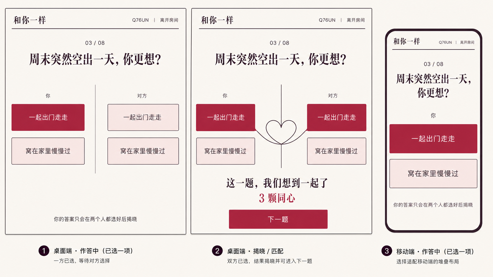

# 「和你一样」视觉规格

## 1. 概念基准

这张概念图是实现基准，覆盖桌面作答、桌面揭晓和移动端作答三种状态。它只用于提取布局与视觉语言；页面中的题目、答案、进度、按钮和房间信息必须继续由 HTML/CSS 渲染。

## 2. 设计意图

- 关键词：温暖、编辑感、双人并置、私密但不神秘。
- 桌面端以左右两列表示两个人，中间的一条细线在揭晓时变成相接的两半心线。
- 移动端把答案改为纵向全宽色带，保留同样的字号层级和选择反馈。
- 不使用渐变、玻璃拟态、发光、卡片网格、装饰性徽章或悬浮大容器。

## 3. 设计令牌

| 用途 | 值 |
| --- | --- |
| 页面底色 | `#f7f2ea` 真正的暖纸色 |
| 主要文字与线条 | `#2a1722` 深李子色 |
| 选中态与主按钮 | `#a83f58` 莓果红 |
| 次要强调 | `#d9a6ad` 灰粉色 |
| 未选答案底色 | `#f1dede` 浅腮红 |
| 细边框 | `1px solid #2a1722` |
| 主圆角 | `12px`，仅用于答案和按钮 |
| 阴影 | 默认无阴影 |
| 动效 | `180–320ms`；尊重 `prefers-reduced-motion` |

标题和题目使用 `Songti SC`、`STSong`、`Noto Serif CJK SC` 一类高对比中文衬线回退；房间信息、进度、状态和控件使用系统无衬线字体。按钮和答案选项必须显式设置字号、字重与行高，不依赖浏览器默认值。

## 4. 状态与组件

### 页头

左侧只显示「和你一样」，右侧显示房间码与「离开房间」，下方是一条贯穿内容宽度的细线。移动端仍保持同一行，但压缩间距和字号。

### 作答

- 进度格式固定为 `03 / 08`。
- 问题是首要视觉焦点，桌面端居中且保持一行优先，移动端允许自然换行。
- 桌面端两侧都能看见相同的两个候选，但只有自己的列可操作；对方列只表达等待状态。
- 自己选中的答案使用莓果红底和白字，未选项使用浅腮红底与深色细边框。
- 选择后本机答案锁定，显示「已选好，等你」；底部保留隐私说明。

### 揭晓

- 双方答案同时可见，中间细线过渡为两半相接的心线。
- 匹配文案使用「这一题，我们想到一起了」，累计值使用「3 颗同心」。
- 主操作只保留「下一题」。不匹配时使用中性文案，不扣分，也不作关系判断。

### 完成

沿用揭晓页的开放布局，展示最终同心数与重新开始操作；不得新增诊断、排名、分享或历史模块。

## 5. 响应式与无障碍

- 桌面内容宽度上限约 `1180px`；答案区域为两列，中间保留明确分隔。
- `720px` 以下改为单列，移除需要横向并排才能成立的标签，但不删减题目、隐私说明或作答状态。
- 可操作区域至少 `44px` 高；键盘焦点必须清晰，不能只用颜色表示选中或禁用。
- 320px 宽度不得横向溢出，题目和按钮文字不得裁切。

## 6. 可见文案锁

首屏只允许出现玩法所需的标题、房间信息、进度、当前问题、两个答案、等待/隐私状态和离开操作。不得额外添加说明性眉题、类别标签、徽章、伪指标或导航项。

## 7. 图标清单

唯一的视觉符号是揭晓态的相接心线；它作为状态反馈使用精简的内联 SVG 绘制。其他操作采用文字，不引入通用图标库或网络素材。
