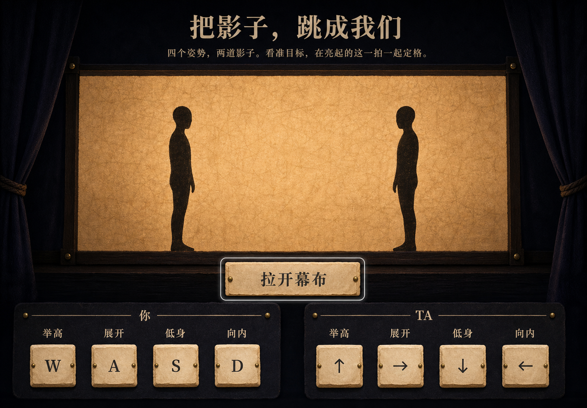
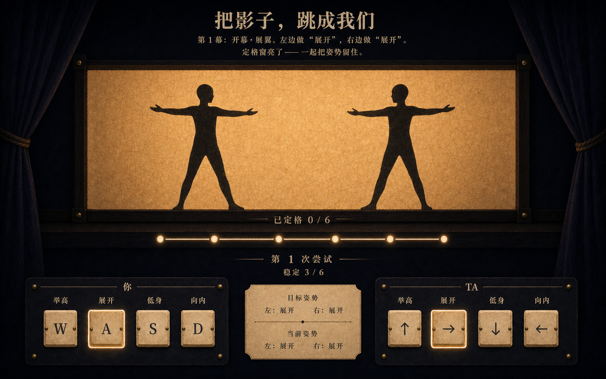
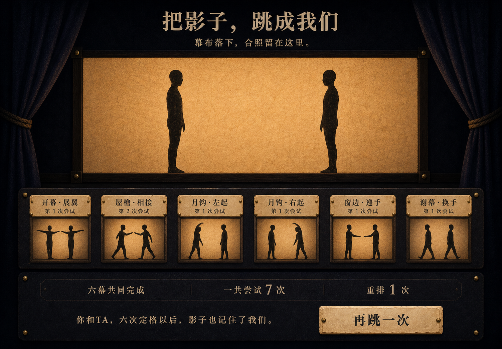
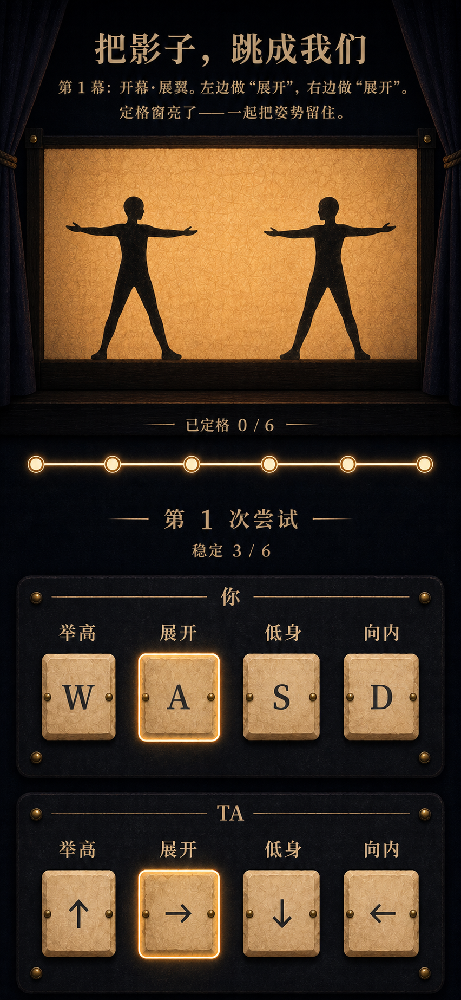
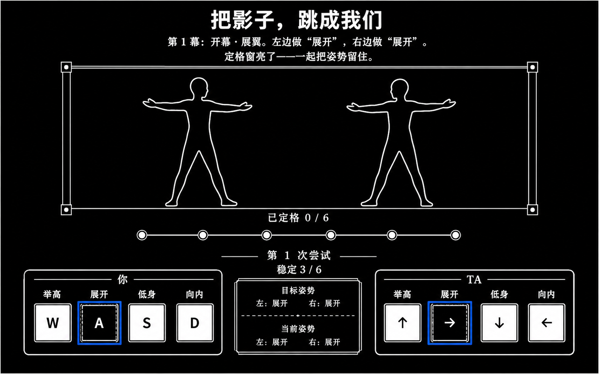
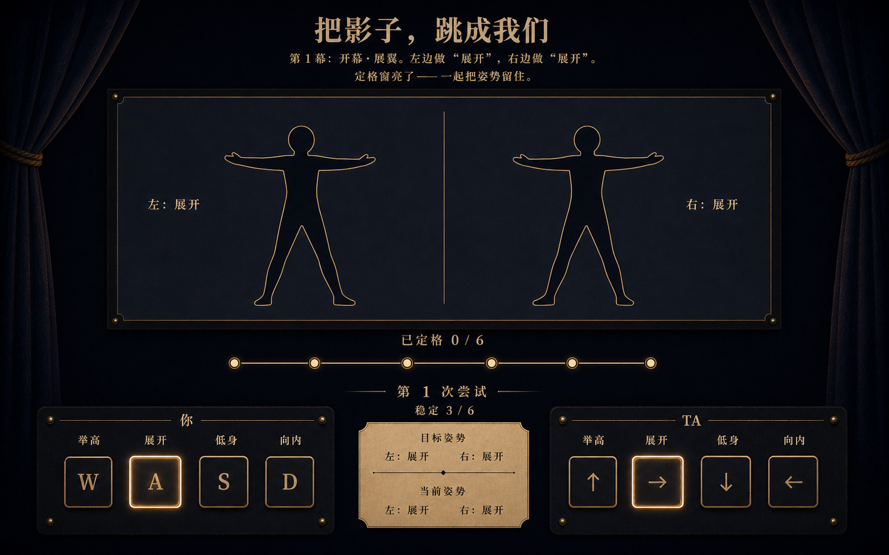

# “把影子，跳成我们”视觉概念提案

- 日期：2026-07-24
- 状态：等待用户确认；确认前不创建生产 `index.html`、`app.js` 或 `style.css`
- 调研：[171-shadow-duet-research.md](./171-shadow-duet-research.md)
- 规格：[172-shadow-duet-spec.md](./172-shadow-duet-spec.md)
- 实施计划：[203-shadow-duet-plan.md](./203-shadow-duet-plan.md)
- 视觉简报：[204-shadow-duet-imagegen-brief.md](./204-shadow-duet-imagegen-brief.md)
- 生成台账：[assets/shadow-duet/GENERATION.md](./assets/shadow-duet/GENERATION.md)
- 运行时图片：无；16 张 PNG 仅供设计评审

## 1. 推荐方向

采用“午夜背光纸幕小剧场”：

- 深靛房间和厚幕边压低环境，琥珀纸幕成为唯一大形体；
- 两道深墨剪影严格左右分区，不做人脸、摄像头或写实身体；
- 横向六拍灯、真实状态文字和纸片键共同表达定格，不借音游 HUD；
- 两席是同一组件族，姿势中文比物理键更重要；
- 成功只形成共同接触印，不比较个人快慢、准确率或失败；
- 完成页像落幕后的合照册，不出现分享、保存、排行榜或庆祝弹窗。

### desktop intro

### desktop dancing window

### desktop complete

### mobile dancing window

### forced-colors

### image blocked

## 2. 十六态覆盖

| ID | 文件 | 评审职责 |
| --- | --- | --- |
| S1 | `s01-desktop-intro.png` | 中性舞台、禁用双席、唯一开幕动作 |
| S2 | `s02-desktop-scene-intro.png` | 公开目标、未开始、唯一开始动作 |
| S3 | `s03-desktop-dancing-ready.png` | 一边正确一边未对、pressed 与稳定 0/6 |
| S4 | `s04-desktop-dancing-window.png` | 两边正确、静态亮窗、稳定 3/6 |
| S5 | `s05-desktop-pose-result.png` | 单幕共同记录、释放控制、下一幕 |
| S6 | `s06-desktop-missed.png` | 中性错位说明、无个人责怪、重排 |
| S7 | `s07-desktop-act-result.png` | 六条记录、7 次尝试、1 次重排 |
| S8 | `s08-desktop-complete.png` | 共同摘要、默认结语、再跳一次 |
| S9 | `s09-mobile-dancing-window.png` | 390px 单列双触控 |
| S10 | `s10-mobile-complete.png` | 390px 完成长流 |
| S11 | `s11-narrow-missed.png` | 320px 两席恰好四键与可达主动作 |
| S12 | `s12-narrow-no-js.png` | no-JS 最小语义与本地隐私 |
| S13 | `s13-landscape-dancing-window.png` | 844×390 舞台左置、控制右置 |
| S14 | `s14-reduced-motion-dancing-window.png` | 静态窗口、静态 pressed 与状态冗余 |
| S15 | `s15-forced-colors-dancing-window.png` | 系统色、真实 outline/border |
| S16 | `s16-image-blocked-dancing-window.png` | CSS 轮廓与文字承担正式降级 |

## 3. 概念不是生产截图

生成图只冻结视觉方向。以下边界必须在生产中纠正：

- S10 把共同摘要画在六条记录之前；生产 DOM 必须按
  `phase → stage → records → summary → note → action`；
- 中文近似字形、标点空隙和字体形态不作为可复制文本；
- 输出像素不是 CSS 断点，真实 390/320/844/1280 由浏览器验证；
- 键帽、按钮、记录、纸幕文字和进度全部重新用 code-native HTML/CSS 创建；
- 概念中的纸纹、木框、幕边和剪影不能从截图裁切进入运行时；
- 姿势、成功与 stable 计数只能来自 reducer/public view，不能来自图片像素。

## 4. 设计系统

### 4.1 颜色

| token | 建议值 | 用途 |
| --- | --- | --- |
| `--night` | `#070b13` | 页面背景 |
| `--indigo` | `#101629` | 幕布、控制底板 |
| `--indigo-raised` | `#171b25` | 两席 fieldset 与结果底 |
| `--paper` | `#d7a05b` | 背光纸幕 |
| `--paper-hot` | `#f0bc72` | 定格窗亮起的静态边缘 |
| `--paper-card` | `#d8b47e` | 目标、摘要和结语纸片 |
| `--ink` | `#12100f` | 剪影与纸上正文 |
| `--brass` | `#b98548` | 分隔线、场记刻痕 |
| `--text` | `#ddbd8c` | 深色背景正文 |
| `--muted` | `#a98e6b` | 次级说明 |
| `--focus` | `#fff2c9` | 至少 3px 实线焦点环 |

纸幕亮度只承担氛围；窗口、pressed、成功与失败必须另有真实文字和边框。

### 4.2 字体

- H1、阶段主句：`"Songti SC", STSong, "Noto Serif CJK SC", serif`；
- 正文、按钮、数字：`-apple-system, BlinkMacSystemFont, "Segoe UI",
  "PingFang SC", sans-serif`；
- H1 desktop 48–64px、mobile 36–44px；
- 阶段句 desktop 20–26px、mobile 18–22px；
- 正文 16–18px，键位不低于 20px，姿势名不低于 16px；
- 行高正文 1.55–1.75；不用远程字体，也不把生成字形变成图片。

### 4.3 间距与形体

- 最大内容宽 1240px；desktop 安全边距 40–64px，mobile 16–20px；
- spacing scale：4 / 8 / 12 / 16 / 24 / 32 / 48 / 64；
- 纸幕 desktop 约占内容宽 62–72%，mobile 使用完整宽度；
- 桌面剪影高度约为纸幕可用高度 62–74%，两席中线不越界；
- 线条 1–2px；focus 3px；圆角仅 0–8px，不建立 pill 家族；
- 按钮 desktop 最小高 56px，touch 最小命中 44×44px，主动作至少 48px。

## 5. 组件 inventory

| 组件 | 冻结方向 |
| --- | --- |
| title block | 单一 H1 + 固定说明，无导航、Logo、badge |
| stage copy | 当前幕/阶段的真实 H2 与目标句 |
| paper stage | 装饰背景 + 两道 CSS/atlas 剪影；语义另有文字 |
| act rail | 六个静态刻度 + `已定格 n / 6` |
| freeze rail | 静态边框与 `稳定 n / 6`，不做下落音符 |
| target/current | `<dl>` 或等价结构，左右目标/当前均可朗读 |
| seat controls | 两个持久 fieldset，各恰好四个原生 button |
| pose button | 姿势名主层、键位次层、pressed/disabled/focus 冗余 |
| record list | 只增量创建已完成记录，固定幕序 |
| shared summary | 六幕、总尝试、重排，绝不拆个人贡献 |
| completion note | complete 才创建的真实段落 |
| primary action | 每阶段最多一个，靠近阶段结果 |
| live region | 单一状态节点，不重复完整可见内容 |

## 6. 阶段布局

### intro / scene-intro

标题与规则在上，纸幕居中，两席控制复用生产节点但 disabled；主动作靠近阶段说明。
intro 的剪影保持中性，scene-intro 才公开第一幕答案。

### dancing

目标始终公开；纸幕、六拍灯和 `稳定 n / 6` 构成同一视线。左右 fieldset 保持稳定
DOM 身份，按住时同时改变 `aria-pressed`、实线边框和凹下形态。没有主动作。

### pose-result / missed

保留同一舞台和控制节点，释放全部持有并 disabled。pose-result 增量加入一条共同
记录；missed 只说明窗口结束时的左右姿势和目标差异，不记个人失败。

### act-result / complete

六条记录沿舞台下方按幕序展开，随后是共同摘要。act-result 仍无私人结语；
complete 才创建 note。两个阶段分别只有“让幕布落下”和“再跳一次”。

## 7. 响应式

### 1504×1046 / 1280×800

- 标题、阶段句、舞台、状态、双席、记录形成单一纵向剧场流；
- 双席可以左右并列，目标/当前纸片位于两席之间；
- 1280×800 允许首屏包含舞台与主要控制，记录自然向下滚。

### 390×844 / 320×568

- 顺序固定为目标 → 完整舞台 → 状态 → 你四键 → TA 四键 → 记录/主动作；
- 不用 sticky/footer；允许纵滚；
- 320px 可让两席并列到 200% text 前，空间不足时改为纵向，绝不缩小命中区；
- 舞台不裁切，记录不横向滚，主动作不受 safe area 遮挡。

### 844×390

- 舞台左置约 360–420px，右侧为目标/状态与两个 2×4 控制；
- DOM 阅读顺序不为布局改写；可用 grid areas 重排；
- 必要时纵滚，零横滚，不锁方向。

## 8. 焦点、运动与降级

- 阶段进入后聚焦阶段 H2，Tab 再进入当前唯一动作或 enabled 控制；
- 非 dancing 八键 native disabled；dancing 才可 pressed；
- 普通模式只允许 160–240ms 的一次姿势/幕光过渡；
- reduced-motion 完全静态，规则仍按 30Hz 整数 tick 执行；
- forced-colors 使用系统 Canvas/CanvasText/ButtonFace/ButtonText/Highlight；
- 背景和 atlas 失败时显示 CSS 基本轮廓、左右标签和姿势文字；
- no-JS 不伪造玩法，只显示中性纸幕、开启提示和本地隐私；
- 不依赖透明、颜色、glow、闪烁、移动或音效表达状态。

## 9. 生产资产决定

当前 16 张完整页面 PNG 全部 docs-only。确认视觉后，生产批次有两个可选实现层：

1. **首选最小依赖**：纸幕、幕边、木框、拍灯、键帽和轮廓全部用 HTML/CSS；
2. **条件资产层**：另行生成无字 `paper-stage-bg.webp` 与固定 2×4 透明
   `shadow-duet-poses.png`，仅在独立原尺寸与透明通道审计通过后使用。

不从概念图裁切，不把生产资产生成视为已授权；必须先通过本提案确认 Gate。

## 10. 采纳、拒绝与 fidelity ledger

| 项目 | 概念决定 | 生产约束 |
| --- | --- | --- |
| 深靛房间 + 琥珀纸幕 | 采纳 | CSS token，不靠整图 |
| 两道深墨剪影 | 采纳 | 左右严格分区，文字冗余姿势 |
| 纸片双席按键 | 采纳 | 原生 button，不裁键帽 |
| 横向六拍灯 | 采纳 | 静态 rail + `稳定 n / 6` |
| 幕边六进度刻痕 | 采纳 | 真实 `已定格 n / 6` |
| 开放标题，无导航 | 采纳 | 单 H1 + 固定说明 |
| 共同接触印记录 | 采纳 | 真实 `<ol>`，固定六幕顺序 |
| summary 早于 records | 拒绝 | 使用规格 DOM 顺序 |
| glow 单独表示 pressed | 拒绝 | `aria-pressed` + 边框 + 凹下 |
| 生成中文作为正文 | 拒绝 | 冻结字符串逐字写入 DOM |
| 概念 PNG 运行时依赖 | 拒绝 | docs-only |
| 摄像头/姿态识别 | 拒绝 | 键盘与 pointer 离散输入 |
| score/combo/perfect | 拒绝 | 只显示共同进度与尝试 |
| mobile 固定底栏 | 拒绝 | 正常流与纵滚 |
| reduced-motion 开关 | 拒绝 | 跟随系统媒体查询 |
| forced-colors 自定义模式 | 拒绝 | 使用系统颜色与真实边框 |
| 图片失败错误卡 | 拒绝 | CSS 轮廓是正式可玩降级 |

后续 QA 至少逐项比较：文案、phase 内容、DOM 顺序、舞台比例、剪影方向、配色、
字体、间距、按钮基数、pressed/disabled/focus、记录求和、移动重排、横屏、
reduced-motion、forced-colors、图片阻断和 no-JS。

## 11. 来源与借鉴声明

- 16 张概念由 OpenAI 内置 ImageGen 按本作原创文字 brief 生成；
- 没有提供第三方截图、UI、人物、姿势照片、字体、图标、Logo 或品牌资产；
- 后续状态只引用本轮 S1/S4/S8 等生成概念保持材质一致；
- Bemuse、osu!、PixiJS 和 MediaPipe 仅是 171/172 已登记的通用时间线、场景职责
  和依赖排除参考，不是图像输入或运行依赖；
- 不复制这些项目的代码、截图、谱面、品牌、模型、WASM、角色或 trade dress；
- “本轮生成候选”不等于排他原创、不侵权保证或唯一输出；
- 逐图尺寸、哈希、prompt、淘汰稿和运行时排除见生成台账。

## 12. 确认 Gate

请确认是否接受以下四个决定：

1. 采用“深靛午夜房间 + 琥珀背光纸幕 + 两道深墨剪影”的整体视觉；
2. 采用“公开目标 + 静态六拍灯 + 两席纸片按钮 + 共同接触印”的组件语言；
3. mobile 使用纵向剧场流，横屏舞台左置；forced-colors 和图片失效保持可玩；
4. 16 张概念只用于评审，生产先走 code-native；若确需背景/姿势图集，再单独生成
   和审计，不从完整截图裁切。

只有得到明确确认后，才开始生产 UI、生产资产和 Chrome 验证批次。可直接回复：

> 确认影子双人舞，按这套做
