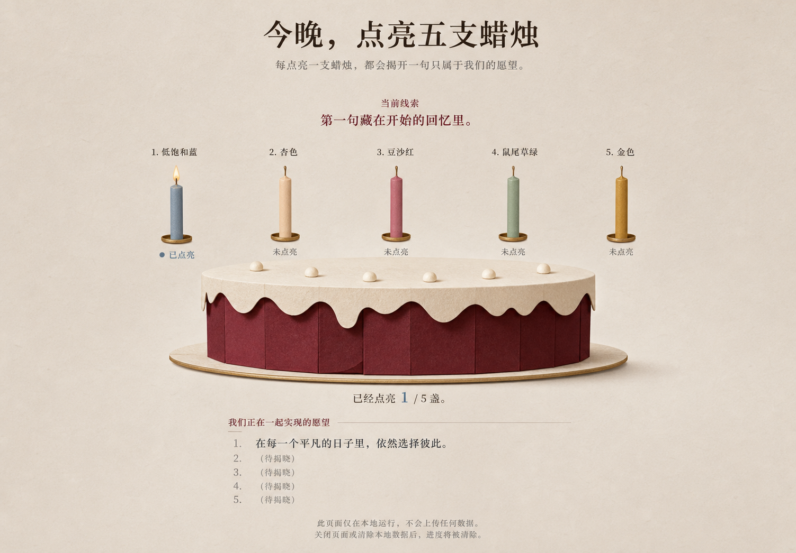
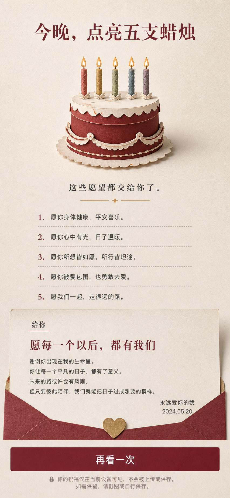

# “把愿望，一盏一盏点亮”视觉概念提案

- 日期：2026-07-23
- 状态：等待用户确认；确认前不创建生产 `index.html`、`app.js` 或 `styles.css`
- 对应规格：[215-candle-wishes-spec.md](./215-candle-wishes-spec.md)
- 对应计划：[216-candle-wishes-plan.md](./216-candle-wishes-plan.md)
- 生成台账：[assets/candle-wishes/GENERATION.md](./assets/candle-wishes/GENERATION.md)
- 运行时图片：无；概念 PNG 仅供设计评审

## 1. 推荐方向

采用“安静餐桌上的纸艺小蛋糕”：

- 暖灰纸面作为完整页面背景，不套 dashboard 或巨大圆角容器；
- 深莓纸艺蛋糕是唯一大形体，奶油糖霜和细金边只提供层次；
- 五支蜡烛同时是原生 button 的视觉主体，使用低饱和蓝、杏、豆沙、鼠尾草和金；
- lighting 把线索置于蜡烛上方，把进度和已揭晓愿望放在蛋糕下方；
- complete 缩小蛋糕，把视觉重心交给五句愿望与最终信；
- 正确点亮只出现一次克制火焰，不做彩纸、烟花、音频或持续 glow。

## 2. 设计系统 inventory

### 2.1 颜色

| token | 建议值 | 用途 |
| --- | --- | --- |
| `--paper` | `#f3ecdf` | 页面背景 |
| `--paper-deep` | `#e8dcc9` | 纸面分隔、信笺底线 |
| `--ink` | `#2d241f` | 正文与未点亮状态 |
| `--muted` | `#776a61` | 隐私说明、辅助状态 |
| `--berry` | `#782536` | 标题、蛋糕体、主动作 |
| `--berry-dark` | `#561923` | hover/active 与蛋糕暗面 |
| `--cream` | `#f4ead8` | 糖霜、信笺开放区域 |
| `--gold` | `#ba8434` | 火焰、细分隔和极少量重点 |
| `--focus` | `#245f72` | 3px 高对比焦点环 |

forced-colors 下全部材质色让位于系统色；火焰不是唯一状态来源。

### 2.2 字体与节奏

- H1 / final title：`Iowan Old Style, Songti SC, STSong, serif`，深莓色；
- 正文 / 控件：`-apple-system, BlinkMacSystemFont, "Segoe UI", sans-serif`；
- 桌面 H1 48–60px，移动 H1 34–42px；正文 16–18px，控件不低于 16px；
- 页面最大内容宽约 1120px；desktop 垂直节奏 16/24/32/48，mobile 12/20/28/40；
- 不增加 eyebrow、badge、pill、导航、统计或假系统状态。

### 2.3 组件

| 组件 | 冻结方向 |
| --- | --- |
| 页面标题 | 单一 H1，无顶部导航或副品牌 |
| current cue | 独立 H2，莓红色，lighting 才创建 |
| cake stage | CSS/inline SVG primitive；蛋糕是唯一大形体 |
| candle button | 原生 button；蜡烛、label 与“未点亮/已点亮”同一命中区 |
| flame | CSS primitive，180–260ms 单次出现；reduced-motion 直接静态 |
| progress | 蛋糕下方居中，不做仪表盘或进度条 |
| wishes | 开放式有序列表，只创建已揭晓前缀，不渲染等待占位 |
| final letter | 页面流中的开放信笺段落，不使用信封、模态或浮层 |
| primary action | 深莓实底、奶油文字、至少 48px 高、3px focus |
| privacy note | 页面末尾纯文本，不增加锁图标或“截图保存”建议 |

## 3. 状态布局

### intro

标题、固定说明、简化的未点亮蛋糕、进度、persistent “开始点亮”和隐私说明。
不创建五个 label、cue、wish 或 final 子树。

### lighting

沿用 desktop 概念的上 cue / 中五支 / 下蛋糕与进度 / 已揭晓愿望结构。五支 DOM
与 Tab 顺序必须是 `journey/home/rain/quiet/noodle`；概念中的 1–5 编号不采纳。
未揭晓愿望不创建“待揭晓”占位。

### ready-to-receive

删除 current cue；五支都为已点亮；显示五句愿望和“收下这些愿望”。最终标题、
留言和署名仍不存在。

### complete

采用移动概念的纵向节奏，但最终信是开放的页面段落，不是信封或卡片。只显示规格
冻结的 `recipientLine/title/message/signature`；不显示日期、锁图标或保存建议。

## 4. 响应式

- 1504×1046：五支横排，蛋糕宽约 720–820px；lighting 主循环同屏；
- 1280×800：蛋糕约 620–700px，缩短上/下留白；
- 768×1024：五支 3+2，蛋糕约 520px；
- 390×844：五支 2+3 或单列，蛋糕约 300–330px，final 允许自然纵滚；
- 320×568：内容宽 288–304px，蜡烛按钮最小 48px，零横溢；
- 844×390：cue/cake 双栏，DOM 顺序不逆转，动作可滚动到达。

概念图是 1503×1046 与 853×1844；生产验收仍以规格六档逻辑视口为准。

## 5. 采纳与拒绝台账

| 概念元素 | 决定 | 理由 |
| --- | --- | --- |
| 暖灰纸面、深莓蛋糕、奶油糖霜 | 采纳 | 与规格视觉方向一致，可由 CSS 实现 |
| 五支低饱和彩色蜡烛 | 采纳 | 帮助辨识，但文字状态仍是权威 |
| 五支横排 / mobile 收紧 | 采纳 | 清楚表达主玩法与响应式 |
| 开放式愿望列表 | 采纳 | 已揭晓前缀自然增长 |
| 深莓主动作 | 采纳 | 层级清楚，能满足命中区与焦点 |
| 1–5 编号 | 拒绝 | 容易暗示路线且规格未要求 |
| “待揭晓”占位 | 拒绝 | 未授权未来 DOM，违反阶段隐私 |
| 生成图内替换文案 | 拒绝 | 215 的固定文案是唯一内容依据 |
| 信封、悬浮信卡 | 拒绝 | 规格要求开放页面流，不增加容器家族 |
| 日期、锁图标、保存提示 | 拒绝 | 都是未要求的产品行为 |
| PNG 作为运行时背景 | 拒绝 | A 级首版零图片依赖、可降级 |

## 6. 确认 Gate

请确认是否接受以下三个决定：

1. 以 desktop lighting 的“横排五支 + 大纸艺蛋糕 + 开放愿望区”为主构图；
2. 以 mobile complete 的纵向节奏和莓红/奶油配色为响应式方向；
3. 按第 5 节拒绝编号、占位、信封、日期、锁图标和额外保存说明。

只有得到明确确认后，才从本提案提取生产 token 并开始 UI 批次。确认不等于允许
复制概念 PNG 到运行目录；生产仍是原创 HTML/CSS/inline SVG。

