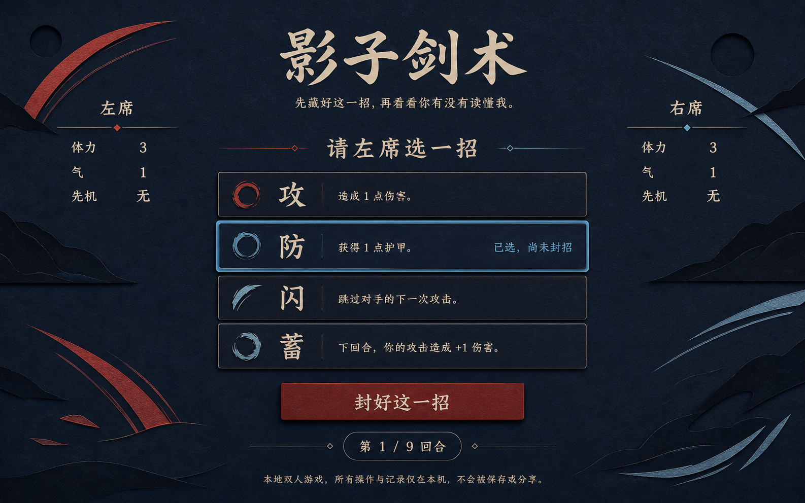
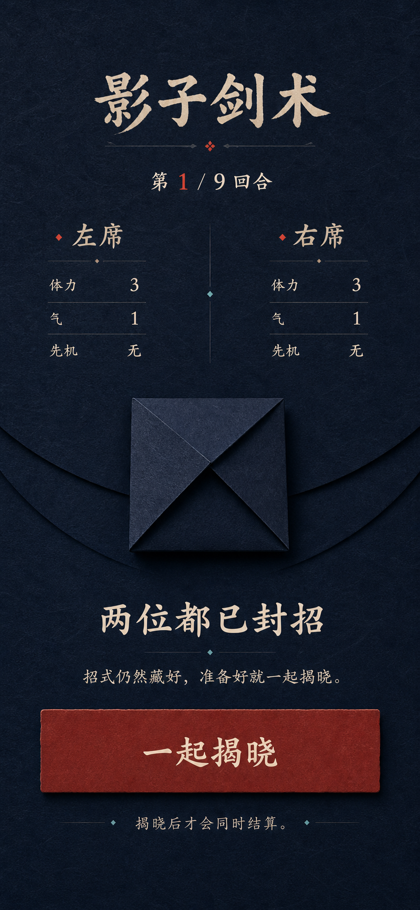
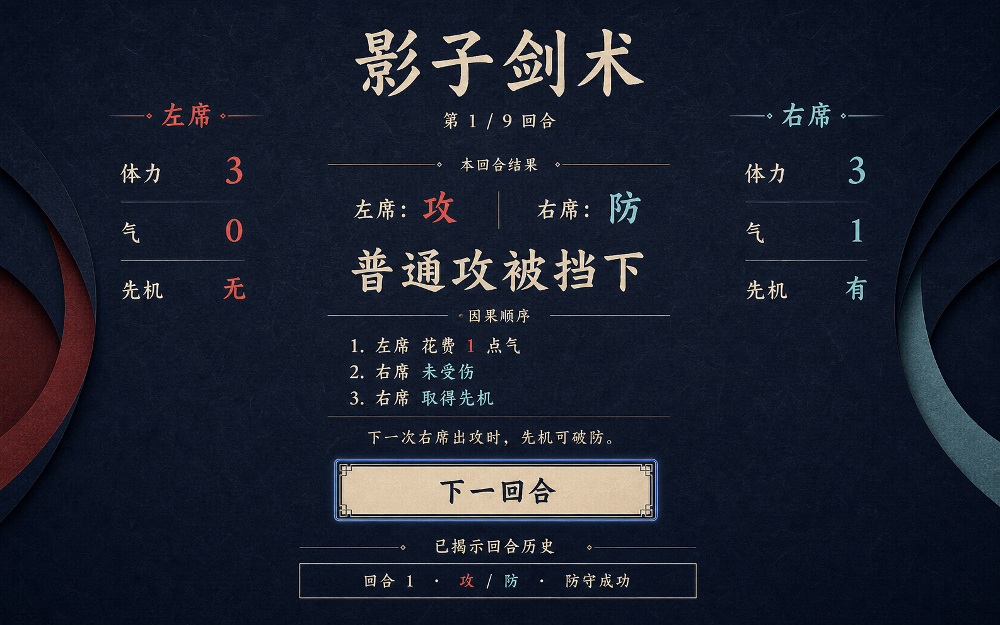

# “影子剑术”视觉概念提案

- 日期：2026-07-23
- 状态：等待用户确认；确认前不创建生产 `index.html`、`app.js` 或 `styles.css`
- 对应规格：[220-shadow-sword-duel-spec.md](./220-shadow-sword-duel-spec.md)
- 对应计划：[221-shadow-sword-duel-plan.md](./221-shadow-sword-duel-plan.md)
- 生成台账：[assets/shadow-sword-duel/GENERATION.md](./assets/shadow-sword-duel/GENERATION.md)
- 运行时图片：无；三张 PNG 仅供设计评审

## 1. 推荐方向

采用“午夜纸影决斗台”：

- 深靛纤维纸铺满页面，不套 dashboard、玻璃面板或巨大圆角容器；
- 暖象牙色承担标题与正文，朱砂红只标左席，淡青只标右席；
- 左右资源是公开边栏，中轴承载当前唯一任务；
- choosing 的四招是纵向原生 button，不是图标轮盘；
- ready 用中性闭合纸折表达“两份都已提交”，绝不编码具体动作；
- result 把双方动作、命中原因和资源变化排成可朗读的因果顺序；
- 抽象纸切圆弧只作边缘装饰，不使用角色、写实刀剑、商业游戏画面或现成素材。

### choosing · desktop



### ready-to-reveal · mobile



### round-result · desktop



## 2. 概念图先审计，不直接照抄

三张图都是设计方向，不是生产截图。尤其 choosing 图中的四条动作说明与冻结规则
冲突：

| 生成图文字 | 冻结规则 | 决定 |
| --- | --- | --- |
| 攻“造成 1 点伤害” | 攻可能被防住或被闪开，只有命中才造成 1 点伤害 | 拒绝生成文字 |
| 防“获得 1 点护甲” | 防住普通攻才取得公开先机，没有护甲资源 | 拒绝生成文字 |
| 闪“跳过对手的下一次攻击” | 闪只避开当前回合攻击，不改变下一回合 | 拒绝生成文字 |
| 蓄“下回合攻击 +1 伤害” | 本回合未受伤才加 1 气，伤害恒为 1 | 拒绝生成文字 |

生产动作摘要必须来自规格：

```text
攻：花 1 点气；普通攻会被防住，先机攻可以破防。
防：挡住普通攻并取得先机；空防没有收益。
闪：避开本回合任意攻击。
蓄：本回合没受伤就回复 1 点气，最多 2 点。
```

生成图的 1586×992 和 853×1844 也不是生产断点；它们只帮助判断层级和节奏。

## 3. 设计系统

### 3.1 颜色

| token | 建议值 | 用途 |
| --- | --- | --- |
| `--night` | `#0c1725` | 页面主背景 |
| `--night-raised` | `#142233` | 动作行、纸折的轻微层次 |
| `--night-line` | `#304154` | 分隔线与中性边界 |
| `--ivory` | `#ead8b8` | 标题、主要正文 |
| `--ivory-muted` | `#a99d88` | 规则摘要、隐私说明 |
| `--left` | `#cf5847` | 左席标签与本回合左席动作 |
| `--right` | `#78c3c8` | 右席标签与本回合右席动作 |
| `--focus` | `#9bd5ff` | 3px 实线焦点环 |
| `--danger` | `#f18b74` | 体力减少的文字冗余，不独立承担含义 |

左/右颜色永远与“左席/右席”文字同时出现。体力、气、先机都用数字或“有/无”
表达，不只用条长、亮度、圆点或颜色。

### 3.2 字体

- H1 与结果主句：`STKaiti, KaiTi, "Songti SC", serif`；
- 数字、正文、控件：`-apple-system, BlinkMacSystemFont, "Segoe UI", sans-serif`；
- H1 desktop 52–68px、mobile 40–52px；不能像生成图一样占移动首屏三分之一；
- 结果主句 desktop 36–48px、mobile 28–36px；
- 正文 16–18px，动作名 24–30px，按钮摘要不低于 15px；
- 不加载远程书法字体；系统没有楷体时回落到宋体/serif 仍可用。

### 3.3 间距与线条

- 内容最大宽 1240px，左右安全边距 desktop 48–72px、mobile 20–24px；
- 节奏使用 8/12/16/24/32/48/64；
- 分隔线 1px，动作选中与焦点不能只靠阴影；
- 圆角控制在 0–8px；主动作可用 4px，不建立 pill 家族；
- 纸张纹理仅用低对比 CSS 多层背景或完全省略，不能依赖 PNG。

## 4. 组件 inventory

| 组件 | 冻结方向 |
| --- | --- |
| title block | 单一 H1 + 一句固定副标题，无导航、logo、badge |
| round marker | “第 n / 9 回合”纯文本，不做进度条 |
| resource rail | 左右各一组 `<dl>`，显示体力、气、先机 |
| action list | 四个原生 button，固定攻/防/闪/蓄顺序 |
| selected copy | “已选，尚未封招”进入按钮可访问文本 |
| handoff cover | 当前席名字 + “我拿好了”；不显示上一席动作 |
| sealed fold | CSS 中性四折几何，ready 才出现，无动作 class |
| effect ledger | `<ol>` 依次说清花气、命中、得气、得先机 |
| revealed history | 只含已揭晓回合；窄屏可横向自然换行，不做表格滚动区 |
| primary action | 朱砂或象牙高对比实底，至少 48px 高 |
| privacy note | 页面末尾纯文本，说明同机热座边界，无锁图标 |
| live region | 单一 `role=status`，视觉上接近结果区但不重复完整正文 |

## 5. 六阶段布局

### intro

H1、副标题、两席初始资源、五句以内规则和“开始决斗”。纸影圆弧可以在左右边缘
形成未交锋的留白，中轴不创建四招按钮或 sealed fold。

### choosing

采用 desktop 概念：

- 左右资源 rail 常驻；
- 中轴先显示“请 {player} 选一招”，再显示四个动作；
- 选中项用 3px focus + 内部“已选，尚未封招”，不能靠青色外发光；
- “封好这一招”是唯一主动作；
- 当前席可以看见自己的 draft，已封动作仍不存在于 screen view/DOM。

### choosing · covered

删除动作列表和 draft，只显示当前席名字、“页面已遮住”和“继续选招”。不要保留
半透明动作轮廓，也不要用 CSS blur 覆盖旧节点。

### handoff

- `second-seat`：写“请把设备交给 {player}”，不显示上一席选了什么；
- `round-start`：写“下一回合，请 {player} 先选”；
- 两者共用中性纸折，但视觉上比 ready 更轻；
- 只有“我拿好了”一个主动作。

### ready-to-reveal

采用 mobile 概念的层级：

- 两席公开资源并列；
- 中性闭合纸折；生成图实际过于像信封，只采纳“闭合”层级，生产改成没有封口、
  邮寄或封印语义的抽象对称折纸；
- “两位都已封招”和“一起揭晓”；
- 不创建攻/防/闪/蓄按钮、选中颜色、动作图标或一席一边的暗示；
- desktop 也保持中轴窄列，不扩展成两张秘密卡。

### round-result / match-result

采用 desktop result：

- 左右 rail 先显示结算后的资源；
- 中轴公开双方本回合动作；
- 结果主句后按固定顺序列 effect；
- round-result 显示“下一回合”；
- match-result 改为终局原因、finalNote 和“再来一场”；
- 已揭晓历史位于主动作后，不抢占首屏结论。

## 6. 响应式

### 1440×900

- 三列 `minmax(180px, 0.7fr) / minmax(520px, 1.6fr) / minmax(180px, 0.7fr)`；
- rail 顶部与主任务标题对齐；
- 四动作保持单列，避免鼠标视线在二维矩阵中往返；
- result 中央最大宽 640px。

### 768×1024

- 资源 rail 移到标题下方的左右两列；
- 主任务占下一整行；
- action list 最大宽 620px；
- 历史自然纵向追加。

### 375×667

- 标题收至 40px 左右；
- 两席资源用两列 `<dl>`，每列不小于 150px；
- 四动作紧凑但按钮仍至少 48px；
- ready 中性纸折约 116–148px，不像生成图占据半屏；
- 主动作可占满内容宽。

### 320×568

- 页面宽 288–304px；
- 两席资源仍并列；若 200% 文本时改为纵向，不挤压数字；
- 动作摘要允许两行；
- result effect 使用编号列表；
- 所有内容可自然纵滚，零横向溢出。

生产只以这四档和 200% 文本验证，不把概念 PNG 的像素尺寸当断点。

## 7. 焦点、运动与降级

- START 后聚焦 choosing H2；
- CHOOSE 后焦点留在按钮，文字变为“已选，尚未封招”；
- CONFIRM 后聚焦 handoff/ready H2；
- REVEAL 后聚焦结果 H2，再由 Tab 到主动作；
- COVER 必须先销毁动作 DOM，再聚焦遮屏标题；
- 3px focus 环不能被纸张阴影吞掉；
- reduced-motion 下纸折、圆弧、动作揭晓全部静态；
- 普通模式最多使用 160–240ms 的一次 opacity/translate，不做挥剑、震屏或闪白；
- CSS 纹理、圆弧和纸折全部缺失时，文字、按钮和结果顺序仍完整；
- 系统楷体缺失时不改变布局或按钮高度。

## 8. 采纳与拒绝台账

| 概念元素 | 决定 | 理由 |
| --- | --- | --- |
| 深靛纸面 + 暖象牙字 | 采纳 | 安静、有仪式感，纯 CSS 可表达 |
| 左朱砂 / 右淡青 | 采纳 | 帮助追踪席位，文字仍冗余表达 |
| 两侧资源 / 中轴任务 | 采纳 | 三个核心状态共享稳定阅读骨架 |
| 四招纵向大按钮 | 采纳 | 键盘、触控和规则摘要都清楚 |
| ready 中性纸折 | 条件采纳 | 图中信封造型拒绝；生产只保留无邮寄/加密语义的抽象折纸 |
| result 因果编号列表 | 采纳 | 比动画更容易理解与朗读 |
| 生成图中的错误动作说明 | 拒绝 | 与 220 规格冲突 |
| choosing 选框与 result 主按钮的蓝色 glow | 拒绝 | 统一改为 3px 实线 focus + 文字 |
| 巨大书法标题 | 限制 | 移动端收小，给资源和主动作留首屏空间 |
| 写实刀剑、角色、武侠场景 | 拒绝 | 无需商业 IP，也会把 UI 变成海报 |
| ready 图中的信封、封印或锁图标 | 拒绝 | 容易暗示加密；本作只有同机正常流程隐私 |
| PNG 纹理/背景进入生产 | 拒绝 | 保持 A 级零图片依赖与降级能力 |
| timer、比分、胜率、连胜 | 拒绝 | 规格没有真实时间或长期数据 |
| action wheel / 手势滑动 | 拒绝 | 固定 button 更易验证且输入等价 |

## 9. 来源与资产边界

- 三张概念由 OpenAI ImageGen 在 Codex 中按本作原创提示生成；
- 未提供参考图片，没有复制、编辑或上传任何外部项目截图；
- 概念只借鉴 219/220 已声明的通用状态与无障碍原则；
- 不借鉴 PrinceJS 或《Prince of Persia》的角色、关卡、地图、精灵、图像、音频、
  品牌和视觉表达；
- 概念文件只在 `docs/assets/shadow-sword-duel/`；
- 生产 UI 使用原创 HTML/CSS 基本形，不读取、复制或链接这些 PNG；
- 若确认后确需生产资产，必须单独生成/审计/登记，不能默认搬用概念图。

## 10. 确认 Gate

请确认是否接受这三个决定：

1. 采用“深靛纸影 + 暖象牙 + 左朱砂/右淡青”的整体视觉；
2. 采用“左右公开资源 rail + 中轴唯一任务”的 desktop 骨架，以及 mobile 的资源
   双列、任务纵向结构；
3. ready 使用不编码动作的中性纸折，result 使用文本因果列表；拒绝错误动作说明、
   图中的信封造型、发光 HUD、写实角色、锁图标和概念 PNG 运行时依赖。

只有得到明确确认后，才从本提案提取生产 token 并开始 UI 批次。确认不等于允许
把概念 PNG 复制到运行目录。
