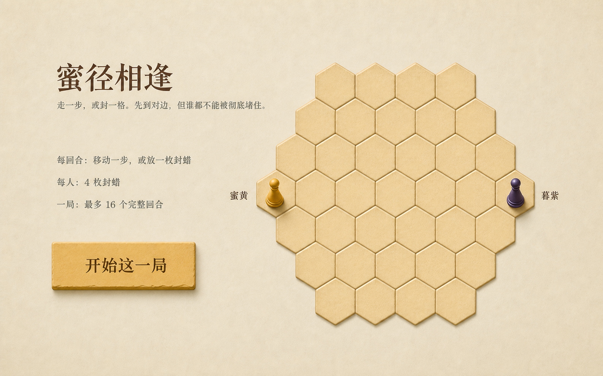
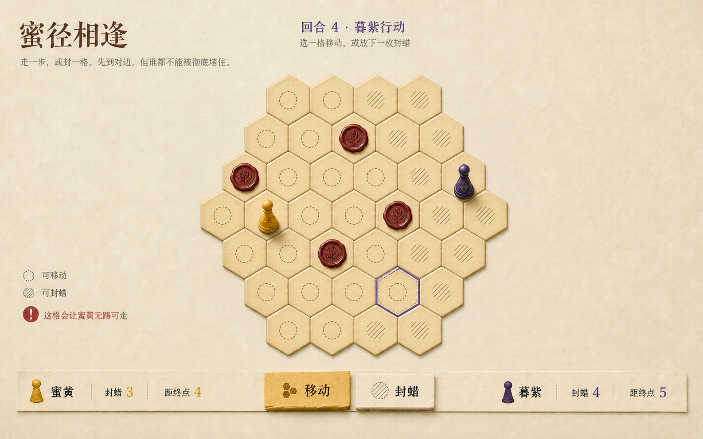
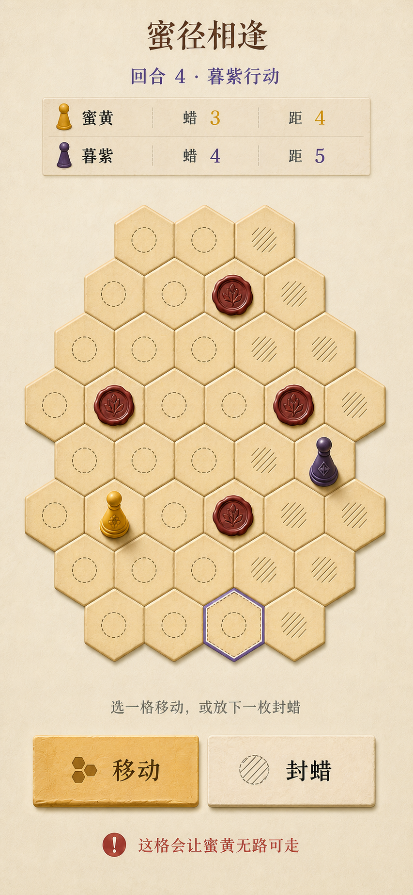
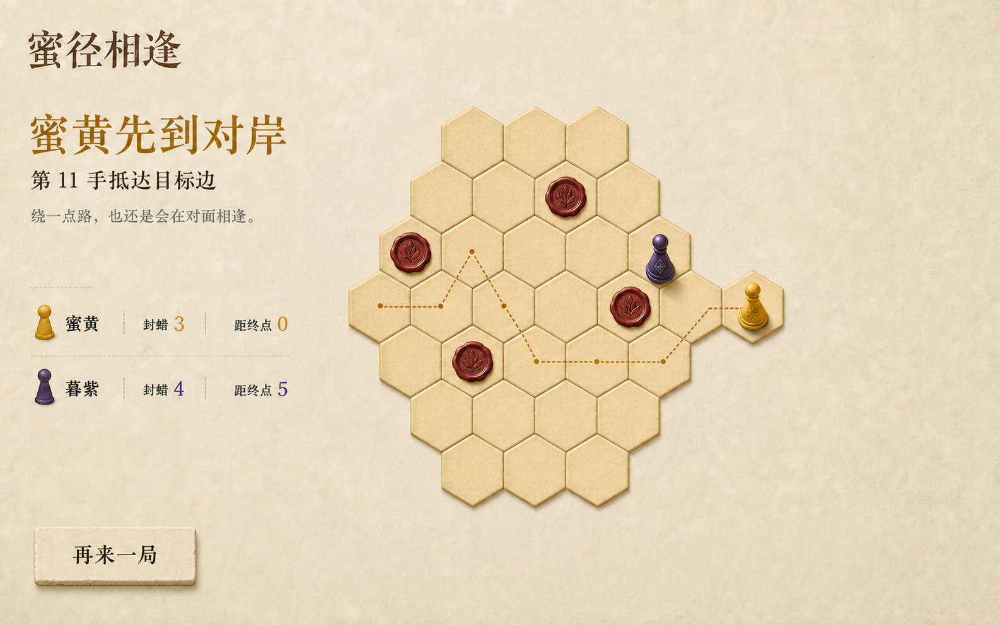

# “蜜径相逢”视觉系统提案

- 日期：2026-07-24
- 工作 ID：`honeycomb-passage`
- 前置规格：[`224-honeycomb-passage-spec.md`](./224-honeycomb-passage-spec.md)
- 实施计划：[`225-honeycomb-passage-plan.md`](./225-honeycomb-passage-plan.md)
- 视觉状态：**等待用户确认；尚未创建生产 HTML/CSS/app**

## 1. 建议方向

建议采用“**一张被反复拿出来玩的纸雕蜂巢棋盘**”：

- 背景是暖象牙手工纸，不是纯白网页，也不是深色赛博游戏；
- 37 个蜂巢格像压印的琥珀纸片，边缘有轻微深浅与纸层阴影；
- 两枚棋子分别为蜜黄与暮紫，但造型刻纹不同，不能只靠颜色区分；
- 永久障碍是酒红封蜡，必须压在格心，不画成格线栅栏；
- 标题用克制的中文宋体，所有规则、数字和按钮用清晰系统无衬线体；
- 全屏只有一块棋盘、一个当前任务和一个主动作，不加导航、设置或装饰面板。

这套方向保留情侣作品的温度，但仍像一款真正可以反复对战的抽象游戏。它不使用
蜂、花、爱心、蜂蜜罐等直白装饰，也不靠霓虹与发光制造“游戏感”。

## 2. 概念图

### 2.1 桌面开场



采纳：

- 左侧标题、规则、三条最小说明和单一 CTA；
- 右侧完整蜂巢预览，双方棋子已经在起点；
- 37 格按 `4-5-6-7-6-5-4` 排列；
- 标题与棋盘形成不对称但平衡的两栏。

生产 1280×800 仍须让标题、规则、CTA 和完整棋盘在首屏可见。若空间不足，优先
缩短上下留白和棋盘格尺寸，不把 CTA 压到折叠线下。

### 2.2 桌面进行态



这是主视觉规格，采纳：

- 左上保留作品身份，当前回合居中靠近棋盘；
- 37 格棋盘是唯一视觉焦点；
- 点圈表示可移动，斜线表示可封蜡；
- 紫色外轮廓表示键盘焦点，不表示规则选中；
- 酒红封蜡与双方棋子是三类清晰不同的对象；
- 底部是一条薄纸轨：双席摘要分居两侧，两种模式在中间；
- 拒绝说明在棋盘旁就地出现，不弹 modal。

概念中的点圈/斜线同时出现是“状态语言总览”。生产只对当前模式突出对应集合：

- `move` 模式：可移动点圈对比度高，合法封蜡斜线不显示；
- `seal` 模式：合法封蜡斜线对比度高，可移动点圈不显示；
- focus ring 始终独立存在；
- 不合法格可聚焦并解释原因，但点击不推进状态。

### 2.3 手机进行态



只采纳纵向顺序与组件样式：

```text
标题
回合 / 当前玩家
双席摘要
37 格棋盘
本回合说明
移动 / 封蜡
拒绝原因
```

**不采纳图中的格数、棋盘高度或首屏表现。** ImageGen 未稳定保持离散格数，且
853×1844 概念不能证明 390×844 CSS 视口通过。生产必须：

- DOM 中精确渲染 37 个 cell button；
- 390×844 下完整棋盘、两种模式和当前状态可见；
- 不出现横向滚动；
- 单格目标优先 44×44px，绝不低于规格的 24×24px；
- 若完整内容无法都进首屏，可让结果/说明自然纵向滚动，但当前棋盘和动作不能被
  固定栏遮挡。

### 2.4 桌面结果态



采纳：

- 左侧结果标题、终局原因、双方最终摘要和单一“再来一局”；
- 蜜黄色细虚线表示从权威 history 重建的真实移动轨迹；
- 不用彩纸、烟火、积分弹窗或胜者徽章；
- 最后一枚棋子到达目标边后仍保留最终棋盘，方便双方复盘。

不采纳概念中的格数与任意路线。生产路线必须只连接该玩家按时间发生的 `move`
事件，不穿过封蜡，不补画最短路，也不使用动画结束事件决定胜负。

## 3. 设计 Token

以下颜色为概念近似值，生产资产完成后可在不改变色相角色的前提下微调：

| Token | 建议值 | 用途 |
| --- | --- | --- |
| `--paper` | `#F3E8CF` | 全页暖象牙纸背景 |
| `--paper-ink` | `#432819` | 标题与主要正文 |
| `--muted-ink` | `#756653` | 规则、次要说明 |
| `--honey-cell` | `#EBCB86` | 蜂巢格基础色 |
| `--honey-edge` | `#B9893D` | 格边与压纹阴影 |
| `--yellow` | `#D49713` | 蜜黄棋子、选中移动模式 |
| `--purple` | `#4D3868` | 暮紫棋子、当前暮紫回合 |
| `--wax` | `#8F342D` | 永久封蜡、拒绝图形基色 |
| `--focus` | `#6551A4` | 统一键盘焦点环 |
| `--danger` | `#A64036` | 不合法封蜡说明 |
| `--hairline` | `rgba(67,40,25,.18)` | HUD 分隔与弱边界 |

禁止加入概念中没有的彩色渐变、荧光描边、玻璃透明层或整页色彩 overlay。
背景锁定为**暖象牙纸色**，不是纯白、灰白或奶油色替换。

### 3.1 字体

```css
--font-title:
  "Songti SC", "STSong", "Noto Serif CJK SC", serif;

--font-ui:
  system-ui, -apple-system, BlinkMacSystemFont,
  "PingFang SC", "Microsoft YaHei", sans-serif;
```

| 角色 | 桌面 | 手机 | 约束 |
| --- | ---: | ---: | --- |
| 标题 | 44–56px | 32–38px | 只此处使用宋体 |
| 结果标题 | 40–48px | 30–36px | 可用蜜黄墨色，不用发光 |
| 回合标题 | 26–32px | 22–26px | 当前玩家名必须文字可见 |
| 正文/规则 | 16–19px | 15–17px | 行高至少 1.55 |
| 控件文字 | 18–22px | 18–20px | 不使用浏览器默认字号 |
| HUD 数字 | 20–28px | 19–24px | 与标签有层级，但不做假指标 |

## 4. 布局合同

### 4.1 桌面开场

```text
main max-width: 1360px
grid: minmax(360px, 0.8fr) minmax(620px, 1.2fr)
gap: 48–72px
```

- 左栏垂直居中，但 CTA 不低于视口底部 96px；
- 右栏棋盘保持 1:1 外接盒；
- 开场没有 HUD、模式按钮、状态错误或 legal marks；
- `START` 后才进入进行态布局。

### 4.2 桌面进行态

- 顶部作品身份占左侧，回合信息与棋盘中心轴对齐；
- 棋盘外接盒上限约 `min(68vh, 680px)`；
- 左侧图例/错误只在有足够宽度时出现，不挤压棋盘；
- 底部 HUD 是单层轨道，不再套卡片；
- 两个模式按钮共享同一组件，selected 只改变纸面压深、边界与 `aria-pressed`。

### 4.3 手机

- `padding-inline: 16px`；
- 双席摘要为两行，不横向压成难读的小字；
- 蜂巢使用 CSS 自定义属性统一缩放，不逐格写像素坐标；
- 模式按钮两列等宽、高度至少 48px；
- 错误说明占固定最小高度，出现/消失不推动棋盘；
- 不使用固定底栏覆盖棋盘；若使用 sticky，只能在真实 390×844 验证无覆盖后保留。

## 5. 棋盘与视觉状态

### 5.1 几何权威

```text
HoneycombPassageLogic.createBoard()
  → 37 个 canonical cell
  → axial 坐标转 CSS/SVG 位置
  → 37 个可聚焦 button
```

概念图、CSS 列表和 DOM 顺序都不能自建第二份 cell 清单。DOM 顺序沿逻辑的
`q`、`r` 稳定顺序；视觉变换不改变 Tab 顺序语义。

### 5.2 状态语言

| 状态 | 视觉 | 非颜色冗余 |
| --- | --- | --- |
| 普通空格 | 琥珀纸片 | 无内部标记 |
| 可移动 | 轻点圈 | `aria-label` 含“可移动” |
| 可封蜡 | 细斜线 | `aria-label` 含“可封蜡” |
| 当前 focus | 2–3px 暮紫外轮廓 + 内白间隔 | `:focus-visible` |
| 蜜黄棋子 | 黄铜/琥珀棋子 | 圆花刻纹、文字名 |
| 暮紫棋子 | 深紫棋子 | 菱形刻纹、文字名 |
| 永久封蜡 | 酒红圆蜡封 | 叶脉压纹、文字“已封” |
| 拒绝 | 酒红说明，格子短暂轻压 | `role=status` 给出原因 |
| 目标边 | 极细边缘压纹 | 可访问名称含“蜜黄/暮紫目标边” |

目标边不画成红/蓝粗边，避免靠近 Hex 的连接目标视觉。

## 6. 组件与图标清单

允许的组件族：

- `TitleBlock`：标题 + 一行规则；
- `TurnHeading`：回合 + 当前玩家 + 一行行动说明；
- `PlayerSummary`：名字、剩余封蜡、最短距离；
- `HexCellButton`：空、legal move、legal seal、focus、pawn、wax；
- `ModeSwitch`：移动 / 封蜡两个真实 button；
- `StatusLine`：公开行动或拒绝原因；
- `PrimaryAction`：开始这一局 / 再来一局；
- `ResultSummary`：终局标题、原因、最终双方摘要。

允许图形：

- 点圈：可移动；
- 斜线：可封蜡；
- 蜜黄棋子、暮紫棋子、酒红封蜡；
- 结果态真实移动虚线。

不允许通用齿轮、问号、奖杯、爱心、蜜蜂、返回箭头、撤销、音量、分享或菜单图标。

## 7. 可见文案锁

首屏和主要状态允许使用：

```text
蜜径相逢
走一步，或封一格。先到对边，但谁都不能被彻底堵住。
每回合：移动一步，或放一枚封蜡
每人：4 枚封蜡
一局：最多 16 个完整回合
开始这一局

回合 {n} · {playerName}行动
选一格移动，或放下一枚封蜡
蜜黄 / 暮紫
封蜡 {n}
距终点 {n}
移动
封蜡
这格会让蜜黄无路可走
这格会让暮紫无路可走

蜜黄先到对岸 / 暮紫先到对岸
第 {ply} 手抵达目标边
{playerName} 暂时无路可走
16 回合结束
距离更近 / 剩余封蜡更多 / 平局
绕一点路，也还是会在对面相逢。
再来一局
```

生产可以按实际 state 替换变量和终局原因，但不得添加导航、说明弹窗、胜率、
历史战绩、设置、排行榜、成就、难度、撤销或分享文案。

## 8. 动效

只允许三类：

1. 移动：棋子在 180–240ms 内沿相邻格轻滑，规则已先提交；
2. 封蜡：120–180ms 轻压落下，不旋转、不弹跳；
3. 结果：真实路线在 300–500ms 内分段显现。

`prefers-reduced-motion: reduce` 下全部即时完成。动画中断、页面失焦或后台切换
不改变 state、activePlayer、ply 或 result。

## 9. 生产资产计划

视觉确认后使用 ImageGen 单独生成：

- 暖象牙纸纹无缝背景；
- 琥珀纸片纹理；
- 透明蜜黄棋子；
- 透明暮紫棋子；
- 透明酒红封蜡。

规则层的 37 格按钮、坐标、legal marks、focus、HUD、模式按钮、状态、文字和路径
保持代码原生。生成资产必须有透明/平铺版本、尺寸记录与 `ATTRIBUTION.md` 更新；
失败时不能用概念截图裁切替代。

## 10. 明确排除的生成误差

以下内容即使出现在概念图中也**不批准**：

1. 桌面初稿大于 37 格；
2. `Z 撤销`、方向键说明、键盘快捷键轨道；
3. 手机稿增减蜂巢格或不能在 390×844 放下核心操作；
4. 结果稿错误格数、任意虚线、穿过封蜡的路线或棋子落在棋盘外；
5. 同时高亮两种模式的全部候选；
6. 用感叹号圆标作为唯一错误含义；
7. 把概念图文字、棋盘或按钮直接切片进生产 UI；
8. 未经规格支持的撤销、跳跃、设置、计时、得分或额外行动。

## 11. 确认门

如果你认可这套方向，请明确回复：

```text
确认蜜径相逢，按这套做
```

确认后我会：

1. 先生成并登记五类独立生产资产；
2. 从本提案提取最终 token 与组件；
3. 创建生产 `index.html / styles.css / app.js / README.md`；
4. 用 Chrome MCP 验证 1440×900、1280×800、390×844、键盘、reduced-motion、
   `file://` 与完整对局；
5. 用 `view_image` 对比本概念与最终浏览器截图；
6. 通过后再接入 catalog 和创意池。

在得到确认前，不创建生产 UI。
