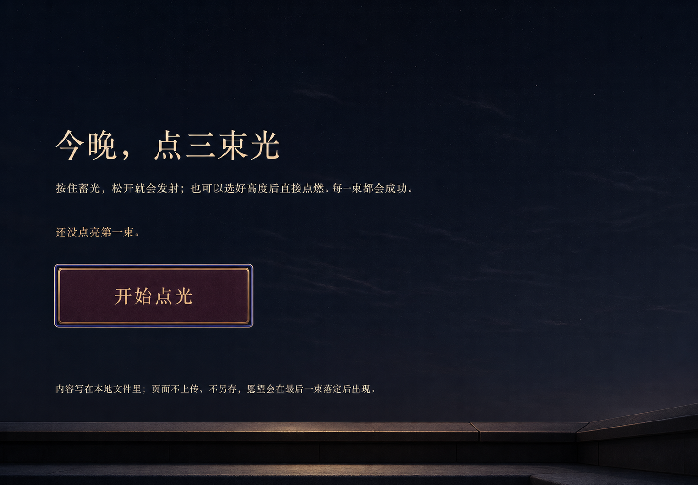
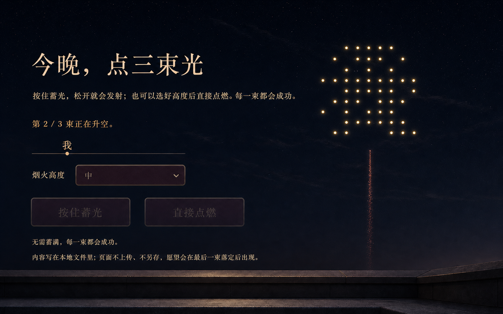
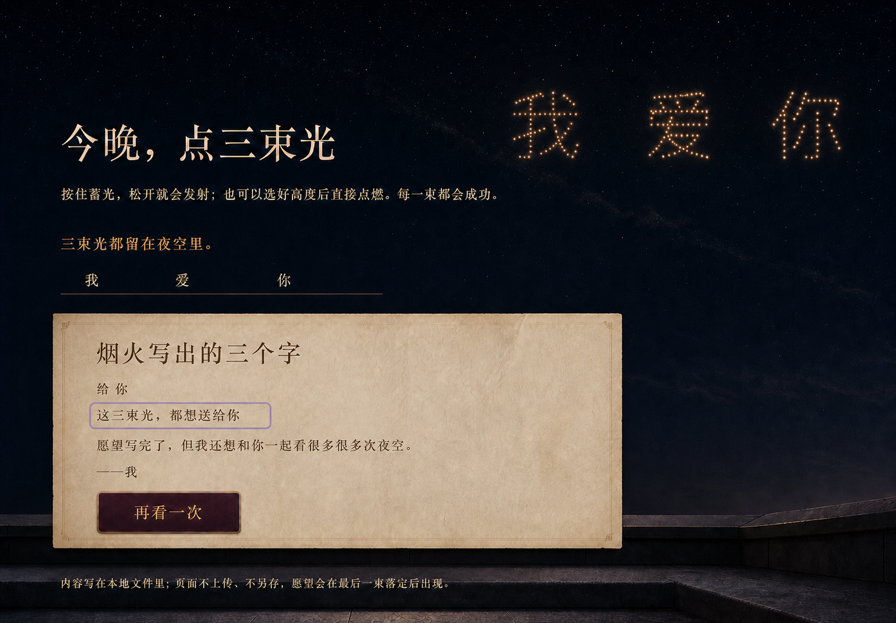
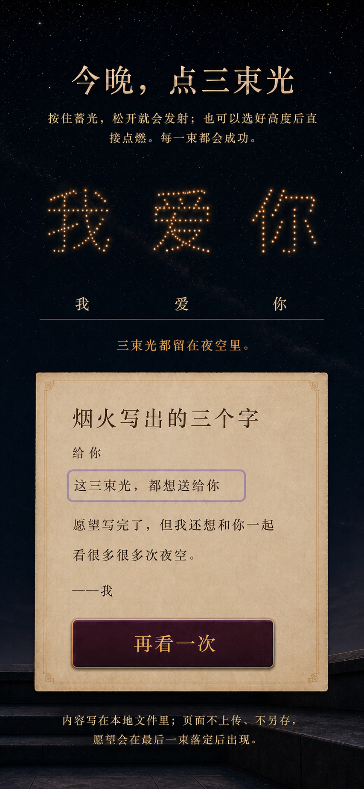
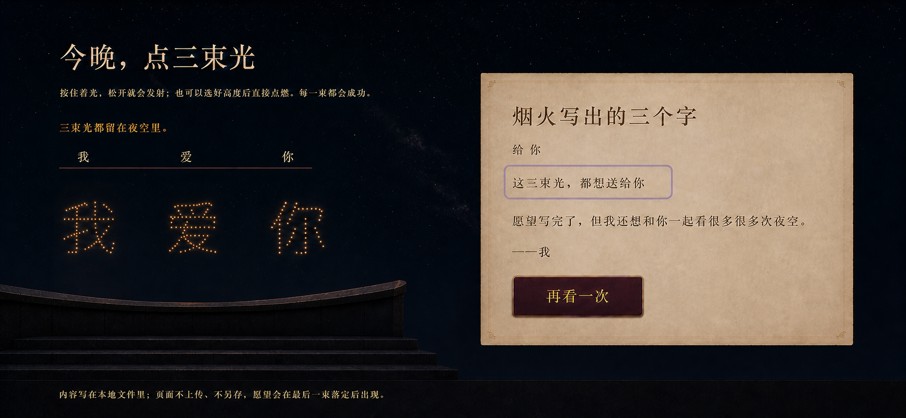
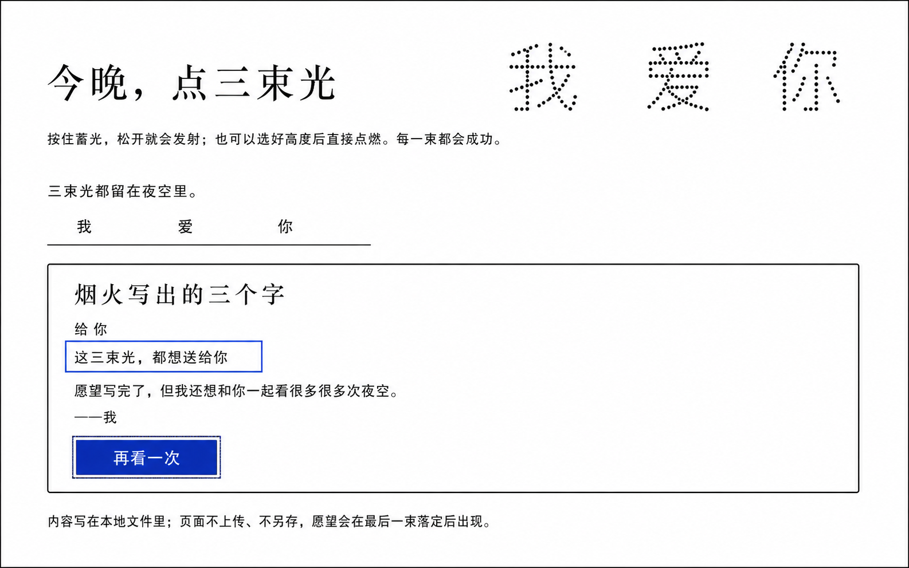
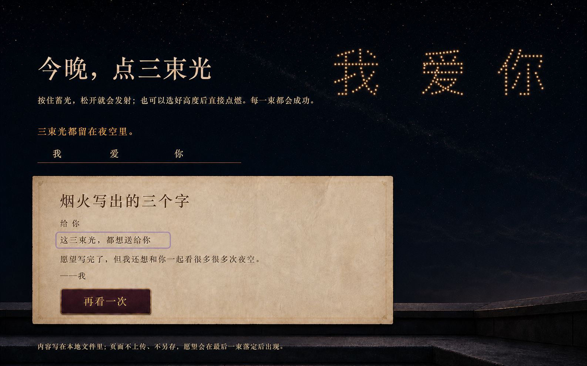

# “把愿望，放到夜空里”视觉概念提案

- 日期：2026-07-24
- 状态：等待用户确认；确认前不创建生产 `index.html`、`app.js` 或 `style.css`
- 调研：[183-wish-fireworks-research.md](./183-wish-fireworks-research.md)
- 规格：[184-wish-fireworks-spec.md](./184-wish-fireworks-spec.md)
- 脑暴：[201-wish-fireworks-brainstorm.md](./201-wish-fireworks-brainstorm.md)
- 视觉简报：[202-wish-fireworks-imagegen-brief.md](./202-wish-fireworks-imagegen-brief.md)
- 来源刷新：[227-wish-fireworks-source-refresh.md](./227-wish-fireworks-source-refresh.md)
- 生成台账：[assets/wish-fireworks/GENERATION.md](./assets/wish-fireworks/GENERATION.md)
- 运行时图片：无；15 张 PNG 仅供设计评审

## 1. 推荐方向

采用“午夜屋顶的一封活字夜空信”：

- 深靛近黑夜空和低矮屋顶压低环境，三字点光成为唯一主舞台；
- 暖象牙与柔金承担烟火和正文，深梅红/氧化铜只承担发射控制；
- 已落定字符沿一条开放留字轨出现，不预画三格答案槽；
- 发射台保留一个原生五档 select 和两个并列入口，不做准星或概率仪表；
- 每一束必定成功，期待来自三次主动操作和逐字公开，不来自失败、得分或爆闪；
- 第三束后才展开暖纸短笺，五个结果节点保持真实阅读流。

### desktop intro

### desktop bursting

### desktop complete

### mobile complete

### landscape complete

### forced-colors / no Canvas

## 2. 十五态覆盖

| ID | 文件 | 评审职责 |
| --- | --- | --- |
| W1 | `w01-desktop-intro.png` | 中性夜空、唯一开始动作、零未来字 |
| W2 | `w02-desktop-ready0.png` | 空前缀、原生 select、两个发射入口 |
| W3 | `w03-desktop-holding.png` | pressed 与单向蓄光，不出现目标字 |
| W4 | `w04-desktop-bursting1.png` | 只公开 `我`，第二束表现中，控制暂不可用 |
| W5 | `w05-desktop-ready2.png` | 只公开 `我 / 爱`，第三束仍需主动触发 |
| W6 | `w06-desktop-complete.png` | 三字、五节点短笺、结果焦点与重播 |
| W7 | `w07-mobile-ready1.png` | 390px 单列控制、只公开第一字 |
| W8 | `w08-mobile-complete.png` | 390px 完整结果长流 |
| W9 | `w09-landscape-complete.png` | 844×390 舞台左、短笺右 |
| W10 | `w10-landscape-ready2.png` | 844×390 舞台左、发射台右 |
| W11 | `w11-narrow-failure.png` | 320px 中性准备失败与唯一重试 |
| W12 | `w12-narrow-no-js.png` | no-JS 最小语义，不伪造玩法 |
| W13 | `w13-reduced-motion-ready1.png` | 第一束即时落定后的稳定状态 |
| W14 | `w14-forced-colors-complete.png` | 系统色、真实边框、CSS 点阵 |
| W15 | `w15-no-canvas-complete.png` | 正常视觉下的 CSS 点阵正式降级 |

## 3. 概念不是生产截图

- W4 的可见点阵只是成字氛围，不证明规格中的 9×9 active rows；
- W14/W15 只说明降级仍可读，不证明浏览器真实 forced-colors 或 Canvas
  阻断行为；
- 中文近似字形、标点空隙和字体形态不作为可复制文本；
- 输出像素不是 CSS 断点，真实 390/320/844/1280/1504 由浏览器验证；
- 夜空、按钮、留字轨、短笺和正文全部重新用 code-native HTML/CSS 创建；
- phase、公开前缀和结果只能来自 reducer/public view，不能来自图像像素。

## 4. 设计系统

### 4.1 颜色

| token | 建议值 | 用途 |
| --- | --- | --- |
| `--night` | `#070c18` | 页面与主夜空 |
| `--night-deep` | `#03060d` | 屋顶深部与舞台远端 |
| `--ivory` | `#f0d3a1` | 标题、正文和柔光 |
| `--gold` | `#e4bc78` | 点阵、轨迹和主要边线 |
| `--plum` | `#351424` | 发射按钮 |
| `--plum-deep` | `#240d17` | pressed 与控制内层 |
| `--copper` | `#a8753e` | 选择框、刻线和分隔 |
| `--coral` | `#b54c36` | 极少量升空轨迹 |
| `--paper` | `#e9d1a9` | 完成短笺 |
| `--ink` | `#2b211b` | 短笺正文 |
| `--focus` | `#b8a4ff` | 至少 3px 实线焦点环 |

glow 只提供氛围；pressed、暂不可用、完成和焦点必须另有文字、真实边框或
原生状态。

### 4.2 字体

- H1、状态、结果标题：`"Songti SC", STSong, "Noto Serif CJK SC", serif`；
- 说明、控件、数字：`-apple-system, BlinkMacSystemFont, "Segoe UI",
  "PingFang SC", sans-serif`；
- H1 desktop 52–68px、mobile 38–48px；
- 状态 desktop 20–26px、mobile 18–22px；
- 正文 16–19px，按钮 20–28px，行高 1.55–1.75；
- 不加载远程字体，也不把生成字形变成图片。

### 4.3 间距与形体

- 最大内容宽 1320px；desktop 安全边距 40–72px，mobile 16–20px；
- spacing scale：4 / 8 / 12 / 16 / 24 / 32 / 48 / 64；
- 夜空 desktop 约占首个内容段 52–68%，mobile 使用完整宽度；
- 点阵单元严格来自离散 9×9 行，不从字体或截图采样；
- 线条 1–2px；focus 3px；圆角仅 0–8px，不建立 pill 家族；
- select 和发射按钮 touch 高至少 56px，其他命中区至少 44×44px。

## 5. 组件 inventory

| 组件 | 冻结方向 |
| --- | --- |
| title block | 单一 H1 + 固定说明，无导航/Logo/badge |
| sky stage | CSS 夜空 + Canvas 装饰；语义由相邻文字承担 |
| revealed rail | 只创建已落定前缀，不预建三槽 |
| status | 唯一动态主状态，逐 phase 冻结字符串 |
| height select | 原生五档 select，不伪装成仪表或 slider |
| hold launch | 原生 button；pressed 用属性、边框和凹下冗余 |
| direct launch | 与 hold 同组件族并始终同层可达 |
| guarantee | 固定说明“无需蓄满，每一束都会成功。” |
| result letter | complete 才创建的五节点开放短笺 |
| primary action | intro/失败/complete 每阶段最多一个 |
| privacy note | 页末固定真实文本，不做安全 badge |
| live region | 单一状态播报，不重复完整可见结果 |

## 6. 阶段布局

### intro / ready / holding

标题、说明、夜空、状态形成单一纵向流。intro 只有开始动作；ready 才创建完整
发射控制；holding 复用同一按钮节点，仅显示有限的 pressed 与蓄光填充。

### bursting / ready2

bursting 保留 select 和两个按钮的 DOM 身份，以 `aria-disabled`、边框和文字表达
暂不可用。留字轨只显示已落定前缀；当前成字可在夜空中出现，但不提前加入公开
标签。ready2 恢复控制且仍不创建第三字占位。

### complete

夜空和三字不消失，随后依次出现状态、五节点短笺和 `再看一次`。结果标题是唯一
程序化焦点目标；发射控制从该 phase 的 public view 中移除，不做隐藏占位。

## 7. 响应式

### 1504×1046 / 1280×800

- 标题、夜空、留字轨、状态、控制/短笺形成开放纵向流；
- complete 可以让短笺占 52–64ch，不覆盖夜空；
- 1280×800 允许结果自然向下滚，不缩小正文或点阵。

### 390×844 / 320×568

- 单列顺序：标题 → 说明 → 夜空 → 已公开前缀 → 状态 → 控制/结果 → 动作
  → 隐私；
- select 与按钮满宽但不 fixed/sticky，允许自然纵滚；
- 320px 失败和 no-JS 仍显示完整说明，零横向溢出；
- 200% text 下不以省略号截断按钮、称呼、留言或署名。

### 844×390

- 夜空约 230–420px 左置，控制或短笺在右；
- DOM 阅读顺序不为布局改写，可用 grid areas 视觉重排；
- 必要时纵滚，零横滚，不锁设备方向。

## 8. 焦点、运动与降级

- intro 聚焦 H1；ready 聚焦状态；complete 聚焦结果标题；
- 普通模式仅允许单束有限的升空、成字、保持和淡出，不自动、不循环；
- reduced-motion 跳过中间动画并用 microtask 落到合法 ready/complete 稳态；
- forced-colors 使用系统 Canvas/CanvasText/ButtonFace/ButtonText/Highlight；
- Canvas null/throw 后 CSS 9×9 grid 是正式 complete 表现，不显示技术错误；
- no-JS 不伪造束数、控制或结果，只保留冻结的五项静态内容；
- 不依赖透明、颜色、glow、闪烁、移动或音效表达业务状态。

## 9. 生产资产决定

当前 15 张完整页面 PNG 全部 docs-only。确认视觉后，生产首选不新增图片依赖：
夜空、屋顶、发射台、纸张和点阵先由 HTML/CSS/Canvas 完成。只有保真测试证明
纹理确有必要时，才另行生成无字、可平铺、可失败的纹理资产，并为每个文件建立
独立 prompt、来源、哈希和降级台账。

不得从完整概念图裁切背景、按钮、短笺或点阵进入运行时。

## 10. 采纳、拒绝与 fidelity ledger

| 项目 | 概念决定 | 生产约束 |
| --- | --- | --- |
| 深靛夜空 + 低矮屋顶 | 采纳 | CSS token 与渐变，不靠整图 |
| 暖金离散点光 | 采纳 | Canvas/CSS 9×9；矩阵来自规格 |
| 开放留字轨 | 采纳 | 只增量创建已完成前缀 |
| 深梅红/氧化铜发射台 | 采纳 | 原生 select + 两个 button |
| 暖纸五节点短笺 | 采纳 | 真实 DOM，complete 才创建 |
| 单一 H1、无导航 | 采纳 | 标题上方不加 eyebrow/badge |
| 横屏左右重排 | 采纳 | 语义顺序不变，允许纵滚 |
| 三个预设字槽 | 拒绝 | future node 必须不存在 |
| glow 单独表示 pressed | 拒绝 | 属性 + 边框 + 凹下 |
| 生成点阵作为矩阵真值 | 拒绝 | 使用冻结 9×9 active rows |
| 生成中文作为正文 | 拒绝 | 冻结字符串逐字写入 DOM |
| complete 保留发射保证 | 拒绝 | 发射控制族整个移除 |
| 轮播/分页点 | 拒绝 | 单一路径，无 carousel |
| 结果外植物/装饰 | 拒绝 | 结果只含冻结五节点 |
| 概念 PNG 运行时依赖 | 拒绝 | docs-only |
| mobile 固定底栏 | 拒绝 | 正常流与纵滚 |
| reduced-motion 模式开关 | 拒绝 | 跟随系统偏好 |
| forced-colors 自定义皮肤 | 拒绝 | 系统色与真实边框 |
| Canvas 失败错误卡 | 拒绝 | CSS 点阵是正式降级 |

后续 QA 至少逐项比较：文案、phase 内容、公开前缀、DOM 顺序、夜空比例、点阵、
配色、字体、间距、select、两个发射入口、pressed/disabled/focus、短笺、
移动/横屏、reduced-motion、forced-colors、Canvas 阻断和 no-JS。

## 11. 来源与借鉴声明

- 15 张概念由 OpenAI 内置 ImageGen 按本作原创文字 brief 生成；
- 没有提供第三方截图、UI、人物、字体、图标、Logo 或品牌资产；
- 后续状态只引用本轮先前生成候选保持材质一致；
- Fireworks.js、canvas-text-particle、canvas-confetti、W3C Pointer Events 与
  WCAG 只提供粒子生命周期、点阵表现、输入取消、降动效和闪光边界；
- 固定 commit、许可证、版权主体和实际借鉴见 183/184/227；
- 不复制这些项目的代码、截图、品牌、Logo、字体、图标或 trade dress；
- 它们不是图像输入或当前运行依赖；
- “本轮生成候选”不等于排他原创、不侵权保证或唯一输出；
- 逐图尺寸、哈希、prompt、淘汰稿和运行时排除见生成台账。

## 12. 确认 Gate

请确认是否接受以下四个决定：

1. 采用“深靛午夜屋顶 + 暖金点阵 + 深梅红发射台 + 暖纸短笺”的整体视觉；
2. 采用开放前缀轨、原生五档 select、两个发射入口和 complete 五节点短笺；
3. mobile 使用单列长流，横屏舞台左置；forced-colors 与无 Canvas 保持完整结果；
4. 15 张概念只用于评审，生产先走 code-native；确需纹理时再独立生成和审计。

只有得到明确确认后，才开始生产 UI、生产资产和 Chrome 验证批次。可直接回复：

> 确认心愿烟火，按这套做
