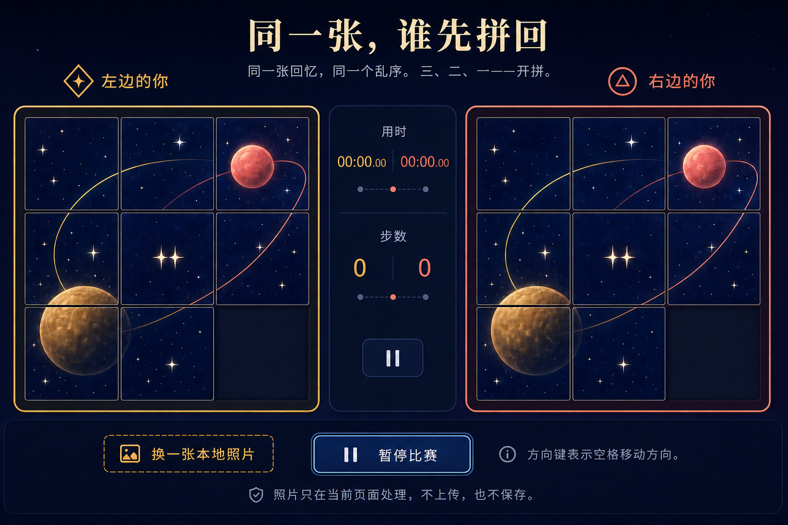
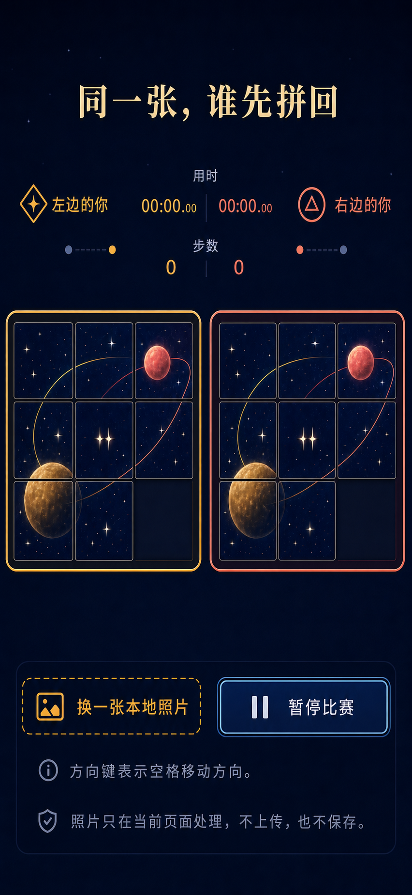

# Photo Slider Race 视觉设计提案

## 1. 文档状态

- 项目 ID：`photo-slider-race`
- 中文名：**同一张，谁先拼回**
- 分类 / 等级：`versus` / A
- 阶段：视觉提案，等待用户确认
- 上游文档：
  - `docs/287-photo-slider-race-research.md`
  - `docs/288-photo-slider-race-brainstorm.md`
  - `docs/289-photo-slider-race-spec.md`
  - `docs/290-photo-slider-race-plan.md`
- 既有 core：
  - `experiences/versus/photo-slider-race/config.js`
  - `experiences/versus/photo-slider-race/logic.js`
  - `experiences/versus/photo-slider-race/logic.test.js`
  - `experiences/versus/photo-slider-race/ATTRIBUTION.md`

本文只冻结视觉方向、布局、组件、状态和后续 fidelity 验收方法。本文**不授权生产 UI 实现**，不修改 `index.html`、`style.css`、`app.js`、Board、catalog 或共享索引。

用户明确确认视觉方向之前，生产 UI 必须停止。

## 2. 概念资产

### 2.1 桌面 active-race 概念



- 路径：`docs/assets/photo-slider-race/desktop-active-race-concept.png`
- 尺寸：1536×1024 px
- 格式：PNG，无 alpha
- SHA-256：`16e28a71764f147d6af8ce6d9618dd38847a1d2bc873445b8c0d57d27b3a9cd3`
- 角色：桌面比赛中状态的布局、色彩、密度与组件关系参考

### 2.2 移动 active-race 概念



- 路径：`docs/assets/photo-slider-race/mobile-active-race-concept.png`
- 尺寸：852×1846 px
- 格式：PNG，无 alpha
- SHA-256：`fcf8d56f5e90b8522ccb405846b647f9a4b1dd445a840a04452bd58dd9290ca1`
- 角色：窄屏比赛中状态的层级、双棋盘并排与操作区参考

### 2.3 资产边界

资产来源：

- 两张概念图由总控通过 OpenAI Image Gen 生成，再按固定文件名复制到本 worktree；
- 本设计任务只用 `view_image` 检查、核验 SHA 并提炼设计契约，没有重新生成、编辑、裁切或覆盖图片；
- 上游没有随任务提供可复现的原始生成 prompt，因此本文不虚构 prompt；
- 图片只作为仓库内设计过程证据，不作为第三方开源游戏借鉴或运行时依赖。

两张图片都是 **Image Gen 视觉概念**，不是生产 UI，也不是运行时游戏素材：

- 不得把整张图作为页面背景冒充交互界面；
- 不得从图中裁出按钮、标题、计时器、徽记或棋盘格作为生产控件；
- 不得 OCR 图中文字后直接写入产品；
- 不得把概念图中的行星拼图位图作为原创默认图；
- 不得把生成图里偶然出现的字形、数字格式、间距或图标细节视为产品文字真值；
- 不得在运行时加载这两张 docs 资产；
- 真实标题、HUD、按钮、规则、计时、状态和错误文案必须是 code-native HTML 文本；
- 真实棋盘必须是原生按钮和 Canvas 生成图片的组合；
- 真实图标使用内联 SVG 或 CSS 几何，不依赖图像中的像素。

概念图只锁定用户批准后的视觉意图。规格、config 和可访问名称始终优先于生成图中的文字细节。

## 3. 设计方向

### 3.1 核心概念：午夜双星拼图台

页面像一张两个人并肩或面对面玩的午夜星图桌：

- 深夜蓝是稳定背景；
- 暖金和珊瑚分别标识左右席位；
- 两块棋盘是唯一主角，尺寸和权重完全对称；
- 星轨从默认图延伸出“同一张回忆”的情感，但不喧宾夺主；
- HUD 像克制的计时裁判，不像电竞直播面板；
- 装饰层保持稀疏，避免玻璃卡片、徽章和数据组件堆叠。

创造力目标约 7/10：有明确的星图身份，又能由静态 HTML、CSS、Canvas 和小型 SVG 忠实实现。

### 3.2 视觉优先级

从高到低：

1. 两块等大的 3×3 棋盘；
2. 双方身份与当前用时 / 步数；
3. 比赛阶段、暂停和结果；
4. 主操作；
5. 方向语义、隐私与图片权利提示；
6. 星点、轨道和微弱光晕等装饰。

装饰不得挤压 320 px 下的 44×44 图块目标。

### 3.3 容器模型

采用“开放舞台 + 单一底部操作轨”，不采用默认卡片网格：

- 页面背景全幅；
- 棋盘本身是两块有边框的主要容器；
- 桌面中央是窄 HUD 轨；
- 窄屏 HUD 变成棋盘上方的开放信息带；
- 操作与提示集中在一个底部 utility dock；
- setup、paused 和 finished 可以增加一个聚焦面板，但不把每条信息再套卡片。

### 3.4 不采用

- 奶油白或暖灰背景；
- 霓虹渐变大面积铺满；
- 毛玻璃模糊承担正文可读性；
- 真实摄影照片作为默认图；
- 拟物相框和相册贴纸；
- 游戏直播式复杂数据条；
- 额外 hero eyebrow、kicker、badge 或无意义 pill；
- 外部字体、图标库和远程素材；
- 概念图像素切片组成的 UI。

## 4. 概念图实际观察

### 4.1 桌面稿

实际检查到的主要结构：

- 标题与副标题居中；
- 左右玩家名称、徽记和棋盘形成强对称；
- 中央竖直 HUD 同时容纳用时、步数和暂停；
- 棋盘边框分别使用暖金和珊瑚；
- 底部横向 utility dock 包含换图、暂停、方向说明和隐私说明；
- 背景接近纯深蓝黑，星点密度很低；
- 棋盘图片比页面装饰更亮、更细节丰富。

可保留：

- 对称关系；
- 深夜蓝 / 暖金 / 珊瑚三色结构；
- 桌面中央 HUD；
- 一块底部 utility dock；
- 细线边框和克制阴影。

不得直接照搬：

- 图中计时显示到百分之一秒，与规格“只显示到 0.1 秒”冲突；
- 图中换图按钮在 active race 中看似可用，规格规定比赛中不可换图；
- 概念图暂停按钮出现两次，生产 UI 只保留一个主暂停入口；
- 图中行星照片质感不是生产默认图资产。

### 4.2 移动稿

实际检查到的主要结构：

- 标题在上方；
- 玩家身份与 HUD 合并成横向信息带；
- 两块棋盘仍并排，没有把一方堆到下方；
- 底部操作区将换图、暂停、方向说明和隐私说明集中；
- 视觉留白明显多于桌面；
- 席位颜色与徽记仍保持对称。

可保留：

- 窄屏双棋盘并排；
- HUD 移到棋盘上方；
- 双方状态在同一水平基线；
- 操作区与比赛区分离。

必须调整：

- 852×1846 是概念画布，不是目标手机 CSS viewport；
- 390×844 和 320×568 不能保留图中大段顶部 / 中部留白；
- active race 的完整棋盘、用时、步数和暂停必须无需滚动可见；
- 320 px 下按钮和图块仍需达到目标尺寸；
- 换图在比赛中显示为 disabled 或移出主操作，不得伪装可用。

## 5. 可见文案锁

### 5.1 真值来源

可见文案按以下优先级取值：

1. `config.js` 的冻结默认文案；
2. `docs/289-photo-slider-race-spec.md` 的文案契约与错误表；
3. 本文列出的按钮和状态词；
4. 概念图只提供层级和位置，不提供文字真值。

生成图中任何不同字形、错字、标点、数字精度或临时标签都不进入实现。

### 5.2 首屏允许文案

允许：

- `同一张，谁先拼回`
- `同一张回忆，同一个乱序。三、二、一——开拼。`
- `照片只在当前页面处理，不上传，也不保存。`
- `请选择你自己拍摄、已获授权或有权使用的照片。`
- `JPEG / PNG / WebP，最大 20 MiB。`
- `开始比赛`
- `换成我们的照片`
- `恢复内置图`
- `方向键表示空格移动方向。`
- `左边的你`
- `右边的你`

禁止在标题上方新增 eyebrow、分类标签、A 级徽章或“情侣游戏”等营销文案。

### 5.3 比赛允许文案

允许：

- `左边的你`
- `右边的你`
- `用时`
- `步数`
- `暂停比赛`
- `只能移动空格旁边的一块`
- `方向键表示空格移动方向。`
- `照片只在当前页面处理，不上传，也不保存。`
- 倒计时 `3`、`2`、`1`、`开始`

用时显示固定为一位小数，例如 `12.3 秒`。概念图中的 `00:00.00` 不锁定。

### 5.4 暂停、恢复和结果允许文案

允许：

- `比赛已暂停`
- `继续比赛`
- `3`、`2`、`1`、`继续`
- `左边的你先拼回来了`
- `右边的你先拼回来了`
- `十分之一秒内，同时拼回来了`
- `未完成`
- `同一局面再来一场`
- `换一张照片`

错误文案严格使用 spec 第 16 节映射，不自行改写隐私承诺或暴露文件名、Blob URL、异常堆栈。

### 5.5 可访问文字

图块 accessible name 采用：

```text
原图第 2 行第 3 列；现在第 1 行第 2 列；可移动
```

这些文字可以仅对辅助技术可见，但必须 code-native。不得从概念图推断图块编号或空格名称。

## 6. Design tokens

以下 token 是从概念图提炼的实现候选值。用户批准本方向后成为首轮实现基线；浏览器截图对比时允许在 fidelity 修复中微调，但颜色温度和层级不可自由改写。

### 6.1 颜色

```css
:root {
  --color-bg: #03091c;
  --color-bg-deep: #010615;
  --color-surface: #07132d;
  --color-surface-strong: #0b1b3a;
  --color-border: #20375f;
  --color-border-soft: #14294d;

  --color-text: #f7edcf;
  --color-text-cool: #d8deef;
  --color-muted: #9ca8c5;
  --color-subtle: #6e7d9e;

  --color-left: #f6b943;
  --color-left-soft: #f8d88c;
  --color-left-dark: #b87716;

  --color-right: #ff7864;
  --color-right-soft: #ffa08f;
  --color-right-dark: #bd493d;

  --color-focus: #79c8ff;
  --color-success: #7ee2bd;
  --color-error: #ff9a8c;
  --color-disabled: #53617d;
}
```

颜色锁：

- 背景是冷调深夜蓝，不是纯黑，也不是暖灰；
- 标题是柔和暖白 / 金白，不是高亮纯白；
- 左右强调色只用于席位、关键数字、棋盘边框和相关操作；
- 通用主操作可用冷蓝焦点 / 轮廓，不应偏袒某一方；
- 错误不能只使用右方珊瑚色，需同时有图标和文本。

### 6.2 字体

零远程字体：

```css
--font-display:
  "Songti SC", "STSong", "SimSun", "Times New Roman", serif;
--font-ui:
  -apple-system, BlinkMacSystemFont, "Segoe UI",
  "PingFang SC", "Hiragino Sans GB", "Microsoft YaHei", sans-serif;
--font-numeric:
  ui-monospace, "SFMono-Regular", "Roboto Mono", Consolas, monospace;
```

字阶：

| Token | 桌面 | 390 | 320 | 字重 / 行高 | 用途 |
| --- | ---: | ---: | ---: | --- | --- |
| `display` | 56 | 36 | 28 | 600 / 1.12 | 标题 |
| `subtitle` | 20 | 16 | 14 | 400 / 1.5 | 副标题 |
| `player` | 24 | 18 | 15 | 650 / 1.25 | 席位 |
| `timer` | 26 | 20 | 17 | 600 / 1.1 | 用时 |
| `metric` | 38 | 28 | 24 | 500 / 1 | 步数 |
| `control` | 17 | 16 | 14 | 600 / 1.2 | 按钮 |
| `body` | 16 | 15 | 14 | 400 / 1.55 | 说明 |
| `caption` | 14 | 13 | 12 | 400 / 1.45 | 限制 / 隐私 |

单位为 CSS px。按钮、文件选择、HUD 标签必须显式使用 token，不能依赖浏览器默认字体。

### 6.3 间距

```css
--space-1: 4px;
--space-2: 8px;
--space-3: 12px;
--space-4: 16px;
--space-5: 24px;
--space-6: 32px;
--space-7: 48px;
--space-8: 64px;
```

规则：

- 桌面页面水平 gutter：24–32 px；
- 390 gutter：12 px；
- 320 gutter：8 px；
- 320 双棋盘 gap：8 px；
- 图块 gap：桌面 4 px，390 为 3 px，320 为 2 px；
- 控件之间至少 8 px；
- 文字与图标间隔 8–12 px。

### 6.4 边框

```css
--border-hairline: 1px;
--border-control: 2px;
--border-board: 2px;
--border-focus: 3px;
```

- 普通容器：`1px solid var(--color-border-soft)`；
- 左棋盘：2 px 暖金；
- 右棋盘：2 px 珊瑚；
- 图块：1 px 冷灰蓝，不用每格彩色发光；
- 完成态：在原边框外增加符号和文本，不只改变颜色；
- 焦点：3 px 冷蓝外环，offset 2 px，不能被 overflow 裁切。

### 6.5 圆角

```css
--radius-tile: 6px;
--radius-control: 12px;
--radius-board: 16px;
--radius-panel: 20px;
--radius-dialog: 24px;
```

不把所有文本做成胶囊。仅真正的圆形 / 几何席位徽记可以使用 50%。

### 6.6 阴影与光晕

```css
--shadow-board:
  0 18px 48px rgba(0, 0, 0, 0.34),
  0 0 24px rgba(31, 58, 111, 0.20);
--shadow-control:
  0 8px 22px rgba(0, 0, 0, 0.28);
--glow-left:
  0 0 18px rgba(246, 185, 67, 0.20);
--glow-right:
  0 0 18px rgba(255, 120, 100, 0.18);
```

光晕不能降低文字 / 边框对比。`backdrop-filter` 不是必要依赖；无模糊时界面仍必须完整。

### 6.7 动效

```css
--motion-tile: 150ms;
--motion-control: 120ms;
--motion-state: 180ms;
--motion-overlay: 220ms;
--ease-standard: cubic-bezier(0.2, 0.8, 0.2, 1);
```

- 图块只在合法移动时做 150 ms 位移；
- 控件 hover / press 只改变边框、亮度和 1 px 位移；
- 倒计时允许轻微缩放；
- 结果允许淡入；
- 不做持续漂浮、星空视差、循环轨道或大面积呼吸光。

`prefers-reduced-motion: reduce` 时：

- 图块立即切换；
- 倒计时不缩放；
- overlay 不滑动；
- 结果直接出现；
- 不改变倒计时长度、100 ms 结算窗口或任何逻辑状态。

## 7. 响应式布局

### 7.1 桌面：1536×1024 / 1440×900

页面：

- 内容最大宽度 1480 px；
- 顶部标题区居中，约占 110–140 px 高度；
- active arena 使用 `minmax(0, 1fr) 232px minmax(0, 1fr)`；
- 左右棋盘边长相同，推荐 520–580 px 上限；
- 中央 HUD 轨固定宽度，不因数字变化推移棋盘；
- utility dock 位于 arena 下方，单层横向布局；
- 页面允许 setup / result 有自然纵向滚动，但 active race 在 900 px 高度内优先完整可见。

中央 HUD 从上到下：

1. `用时`；
2. 左右用时；
3. 细分隔；
4. `步数`；
5. 左右步数；
6. 单一暂停按钮。

左右 HUD 值视觉权重相同，中线只起对照作用。

### 7.2 中等桌面：1024×768

- 标题缩至 40–44 px；
- arena 保持三列，中央 HUD 压至 160–184 px；
- 棋盘使用剩余宽度等分；
- utility dock 允许两行，但暂停必须位于第一行；
- 隐私与方向说明进入第二行；
- 不通过隐藏一方状态节省空间。

如果三列导致图块低于 44 px，可以采用“HUD 上置 + 双棋盘两列”，而不是缩小棋盘或把一方堆到下方。

### 7.3 390×844

active race 顺序：

1. 紧凑标题；
2. 横向 HUD；
3. 双棋盘；
4. 单行主操作；
5. 两条简短说明。

布局建议：

- 页面 gutter 12 px；
- 双棋盘 gap 10 px；
- 单棋盘约 178 px；
- 单格可保持约 55 px；
- 玩家名、用时、步数组成左右对称三列 HUD；
- 标题不超过两行；
- active race 不显示长副标题和权利长句；
- 权利长句保留在 setup；active race 只显示短隐私句；
- `暂停比赛` 始终可见；
- 换图为 disabled 的次要控件，或只在 setup / finished 出现。

### 7.4 320×568

这是硬门槛，不是“尽量适配”：

- 页面 gutter 8 px；
- 双棋盘 gap 8 px；
- 单棋盘外框最大约 148 px；
- 扣除边框和 2 px 格间距后，单格目标仍不小于 44×44 px；
- 标题使用 28 px、单行优先；
- 副标题在 active race 隐藏，但其语义在 setup 可见；
- HUD 高度约 72–84 px；
- 双棋盘完整并排；
- 主暂停按钮高度至少 44 px；
- active race 无横向滚动；
- active race 的棋盘、双方用时、步数和暂停无需滚动可见；
- 方向说明可压成一行；
- 隐私短句可位于下一屏，但不能从页面删除。

如果实际浏览器测量无法同时满足双棋盘并排和 44×44 目标，项目按上游规格标为 Conditional，不能偷改为纵向一人一屏。

### 7.5 200% 缩放

- setup 和 finished 可自然变为单列；
- active race 仍需保留双方棋盘和状态；
- 页面允许纵向滚动；
- 不出现横向滚动；
- 焦点目标和主要操作仍可达；
- 不用固定 viewport 高度裁掉内容。

## 8. 组件 inventory

### 8.1 App shell

- `GameHeader`
  - 标题；
  - 副标题；
  - active race 下使用紧凑 variant。
- `StageBackground`
  - CSS 渐变；
  - 固定少量 CSS / Canvas 星点；
  - `aria-hidden="true"`。
- `UtilityDock`
  - 主操作；
  - 方向说明；
  - 隐私短句；
  - 不重复暂停入口。

### 8.2 图片设置

- `SourcePreview`
  - 共享派生图预览；
  - builtin / local 标识使用文本；
  - 不显示文件名。
- `StartButton`
  - ready / disabled-loading。
- `LocalPhotoControl`
  - 原生 file input；
  - 自定义视觉 label；
  - 不把视觉 label 替代真实 input。
- `RestoreBuiltinButton`
  - 仅本地图片激活后显示或启用。
- `SourceStatus`
  - ready / loading / error；
  - 错误使用 spec 文案。
- `PrivacyAndRights`
  - 隐私、权利、格式上限。

### 8.3 比赛

- `PlayerIdentity`
  - left / right variant；
  - 名称、几何徽记；
  - 不只靠颜色。
- `SharedHud`
  - desktop vertical；
  - compact horizontal；
  - 用时、步数；
  - 固定数字槽宽。
- `PuzzleBoard`
  - left / right variant；
  - 标题 / accessible description；
  - board state。
- `PuzzleTile`
  - movable / immovable / focused / pressed / solved-locked；
  - 原生 `button`；
  - 背景裁切使用 shared active URL。
- `BlankSlot`
  - 非交互；
  - 视觉空格；
  - 不进入 Tab。
- `PauseButton`
  - active 时唯一暂停入口。
- `CountdownOverlay`
  - race / resume variant。
- `MoveFeedback`
  - 非法移动简短提示；
  - 不抖动整个页面。

### 8.4 暂停与结果

- `PausePanel`
  - 暂停原因；
  - 继续比赛；
  - 重新倒计时说明。
- `ResultPanel`
  - left-win / right-win / draw；
  - 双方用时、步数；
  - 未完成方明确显示“未完成”；
  - rematch；
  - change-image。
- `LiveStatus`
  - polite / atomic；
  - 倒计时、暂停、恢复、完成、结果。

## 9. 状态清单

### 9.1 顶层状态

| Core phase | 视觉状态 | 主焦点 | 可用操作 |
| --- | --- | --- | --- |
| `setup` | 默认图 ready | 开始比赛 | 开始、选图 |
| `setup` | 本地图 loading | 当前图仍可见 | 等待；开始 disabled |
| `setup` | 图片 error | 当前图仍可见 + 错误 | 重选、默认图、开始 |
| `countdown` | 3 / 2 / 1 | 倒计时 overlay | 无棋盘输入 |
| `racing` | active race | 两板 + HUD | 移动、暂停 |
| `settling` | 一方完成 | 完成方锁定 | 未完成方仍可移动 |
| `paused` | 暂停 panel | 继续比赛 | 继续 |
| `resume-countdown` | 3 / 2 / 1 | 恢复 overlay | 无棋盘输入 |
| `finished` | 左胜 | 结果 panel | 同局再来、换图 |
| `finished` | 右胜 | 结果 panel | 同局再来、换图 |
| `finished` | 并列 | 结果 panel | 同局再来、换图 |

### 9.2 控件状态

每个交互组件至少定义：

- default；
- hover（有 hover 能力时）；
- focus-visible；
- active / pressed；
- disabled；
- loading（适用时）；
- error（适用时）。

触屏不依赖 hover 解释可操作性。disabled 控件旁需要可见原因，不能只降低透明度。

### 9.3 棋盘状态

- unsolved；
- movable tile；
- immovable tile；
- blank；
- player-completed；
- settlement-opponent-active；
- paused；
- finished-locked。

概念图只展示 active race，其他状态必须在同一设计系统内实现，不能另起一套卡片风格。

## 10. 图标 inventory

图标全部 code-native 内联 SVG，默认：

- `viewBox="0 0 24 24"`；
- `fill="none"`；
- `stroke="currentColor"`；
- `stroke-width="1.8"`；
- `stroke-linecap="round"`；
- `stroke-linejoin="round"`；
- 控件图标 20–24 px；
- 玩家徽记 28–36 px；
- focus / disabled 状态与文字同步。

| 图标 | 用途 | 造型 | 颜色 / 状态 |
| --- | --- | --- | --- |
| 左方徽记 | 左席位 | 菱形外框 + 四角星 | 暖金 |
| 右方徽记 | 右席位 | 圆形外框 + 空心三角 | 珊瑚 |
| 图片 | 选择本地照片 | 方框、山形、圆点 | 当前控件色 |
| 恢复 | 恢复内置图 | 回转箭头 + 小星 | 冷白；可用时暖金边 |
| 暂停 | 暂停比赛 | 双竖条 | 冷白 |
| 继续 | 继续比赛 | 右向三角 | 冷白 |
| 信息 | 方向说明 | 圆形 i | muted |
| 隐私 | 本地处理 | 盾牌 + 对勾 | muted / success |
| 错误 | 图片错误 | 圆形感叹号 | error |
| 完成 | 单方完成 | 四角星 + 对勾 | 对应席位色 |
| 并列 | 100 ms 并列 | 两颗相交小星 | 暖白 |
| 重新开始 | 同局再来 | 环形箭头 | 冷白 |

禁止：

- 直接使用 Unicode `▶`、`Ⅱ`、`↻` 代替需要对齐的 UI 图标；
- 混用 filled 和 outline 风格；
- 引入整套第三方 icon font；
- 把概念图里的像素图标裁出来。

## 11. Canvas 原创默认图

### 11.1 与概念图的关系

概念图中的星空、暖金行星、珊瑚行星、交叉轨道和中心双星只锁定**题材与构图关系**：

- 深蓝星空；
- 左下暖金主体；
- 右上珊瑚主体；
- 至少两条跨格轨道；
- 九格均有辨识细节；
- 中心双星形成完成提示。

生产默认图必须由 `app.js` 的 Canvas 指令从零绘制：

- 不加载概念 PNG；
- 不临摹概念图中的照片纹理；
- 不裁切或描摹生成图；
- 不使用外部素材；
- 同一版本确定性输出；
- 1200×1200；
- 走与用户本地照片相同的 Blob URL 和棋盘裁切路径。

### 11.2 fidelity 解释

默认图不要求像素匹配概念图，要求匹配：

- 冷暖主体位置；
- 轨道跨格关系；
- 整体亮度层级；
- 九格可辨识度；
- 完整图时的情感气质。

这是有意偏差，因为上游规格已冻结“代码原创默认图”，而概念图是设计参考，不是生产资产。

## 12. 交互与可访问性

### 12.1 键盘

- 左方：W/A/S/D；
- 右方：方向键；
- 方向含义始终是空格移动方向；
- `event.repeat` 不连移；
- 焦点在 input / button / select / textarea / contenteditable 时不触发全局比赛快捷键；
- 只有实际处理的比赛按键才阻止默认行为；
- Tab、Enter、Space 保留原生控件语义；
- 两块棋盘仍可通过 Tab 到达图块按钮。

### 12.2 触屏与指针

- 图块由原生 click 激活；
- 不在 pointerdown 立即移动；
- 不实现拖拽；
- 不设置全页 `touch-action: none`；
- 320 px 图块目标不小于 44×44；
- 两人可同时触碰各自棋盘；
- 触控不需要 hover 才能识别可移动块。

### 12.3 焦点

- `:focus-visible` 使用 3 px 冷蓝外环；
- 图块 focus ring 可越过格子边界但不得被 board overflow 裁切；
- 状态切换不重建整个页面导致焦点丢失；
- setup 开始后焦点进入比赛说明或棋盘容器；
- paused 时焦点进入“继续比赛”；
- finished 时焦点进入结果标题或主 rematch；
- 关闭 / 切换 panel 后焦点回到合理触发点。

### 12.4 live region

只播报：

- 倒计时；
- 开始；
- 暂停；
- 恢复；
- 某一方完成；
- 最终胜负 / 并列；
- 图片处理成功或错误。

不逐步播报计时器和每次合法移动，避免声音刷屏。

### 12.5 reduced-motion

减少动态时：

- 无图块滑移动画；
- 无倒计时缩放；
- 无 panel 滑入；
- 无按钮位移；
- 星点静止；
- focus、边框、文本和结果仍完整；
- 逻辑与普通模式完全相同。

## 13. 隐私与图片权利设计

### 13.1 可见承诺

setup 必须同时显示：

- `照片只在当前页面处理，不上传，也不保存。`
- `请选择你自己拍摄、已获授权或有权使用的照片。`
- `JPEG / PNG / WebP，最大 20 MiB。`

active race 可只保留隐私短句；finished 的换图入口旁再次显示权利提示。

### 13.2 不显示

- 原文件名；
- 本地路径；
- EXIF / GPS；
- Blob URL；
- 图片尺寸细节；
- 浏览器内部错误；
- 最近使用照片；
- 历史成绩。

### 13.3 状态反馈

- loading 不清空当前图片；
- error 说明当前图片没有改变；
- 成功只显示“照片已在本页准备好”，不回显文件名；
- 更换、恢复默认和离开页面时清理 URL；
- 两张概念图只保存在 docs，且不包含用户照片。

## 14. Concept-to-code fidelity Gate

### 14.1 Gate 0：用户批准

在用户明确回答“接受该视觉方向”之前：

- 不创建生产 `index.html`；
- 不创建生产 `style.css`；
- 不创建生产 `app.js`；
- 不修改 core 适配视觉；
- 不注册 catalog；
- 不把概念 PNG 移入生产目录。

用户若要求调整，只更新提案或生成新的独立概念版本，不覆盖现有资产。

### 14.2 Gate 1：实现前提取

获批后、编码前冻结：

- 本文 token；
- 可见文案锁；
- icon inventory；
- desktop / 390 / 320 布局；
- 全状态清单；
- 默认图有意偏差；
- 允许的组件家族；
- 未展示的大型组件禁止列表。

### 14.3 Gate 2：分状态实现

实现顺序：

1. setup；
2. desktop active race；
3. mobile active race；
4. countdown / paused / resume；
5. settling；
6. finished win / draw；
7. error / loading；
8. reduced-motion 与 200% zoom。

每个状态先完成 code-native 文本和交互，再做 fidelity 对比。不能用静态截图占位。

### 14.4 Gate 3：截图对比

后续实现必须：

1. 用 Browser / in-app browser 打开真实页面；
2. 在目标视口捕获最新浏览器截图；
3. 对概念图和浏览器截图分别调用 `view_image`；
4. 同一轮直接比较；
5. 建立 fidelity ledger；
6. 修复所有可修复偏差；
7. 再次截图与 `view_image`；
8. 达到设计审查可签收后才交付。

不能用 DOM 检查、build 通过或肉眼看浏览器代替 `view_image` 双图对比。

### 14.5 至少检查十项

1. 标题与允许文案，无新增 eyebrow / badge；
2. 双棋盘尺寸和视觉权重完全对称；
3. desktop 中央 HUD 位置；
4. mobile HUD 上置；
5. 深夜蓝背景温度；
6. 暖金 / 珊瑚颜色与用途；
7. 标题 serif 与 UI sans / numeric monospace；
8. 棋盘边框、圆角、格间距；
9. 图标隐喻、线宽和对齐；
10. utility dock 的单容器关系；
11. active race 换图禁用或移出；
12. 计时一位小数；
13. 320 双棋盘和 44×44；
14. reduced-motion；
15. Canvas 默认图与概念题材关系。

### 14.6 通过标准

必须同时满足：

- 无概念图切片充当 UI；
- above-the-fold 文案 diff 为零，或偏差有用户明确批准；
- 颜色、排版、间距、容器和图标无可修复的显著漂移；
- desktop / mobile active race 与概念结构一致；
- 规格优先偏差已记录；
- 所有核心交互真实可用；
- Browser 验证与 `view_image` 双图审查完成；
- fidelity ledger 中没有未解释的 material mismatch。

## 15. 浏览器验收视口

### 15.1 概念 native 对比

- 1536×1024：桌面概念原生尺寸；
- 852×1846：移动概念原生尺寸，仅用于构图 / 比例对比，不作为目标 CSS 设备。

### 15.2 产品视口

- 1440×900；
- 1024×768；
- 390×844；
- 320×568；
- 390×844 + `prefers-reduced-motion: reduce`；
- 320×568 + 200% zoom 行为检查。

每个视口检查：

- 横向溢出；
- 双棋盘完整性；
- 目标尺寸；
- 文字换行；
- HUD 稳定；
- 操作可见；
- focus ring；
- overlay；
- setup / racing / paused / finished；
- 本地照片和默认图。

受控浏览器若不能打开 `file://`，按上游计划用 localhost 做 fidelity 和交互测试，并保留人工断网双击验收；不能把 localhost 成功冒充 file 证据。

## 16. 已知偏差

### 16.1 必须保留的偏差

| 概念图 | 生产要求 | 原因 |
| --- | --- | --- |
| 计时显示 `00:00.00` | 显示 `12.3 秒` 一位小数 | spec 锁定 |
| active race 可见换图按钮似乎可用 | 比赛中 disabled 或不显示 | 状态机锁定 |
| 桌面出现两个暂停入口 | 只保留一个 | 避免重复主操作 |
| 行星为生成位图质感 | Canvas 原创抽象图 | 零素材与独立创作 |
| 移动稿留白很大 | 390 / 320 active race 压缩 | 同屏与无需滚动门槛 |
| 图中文字细节 | config / spec code-native 文案 | 生成图不作为文字真值 |

### 16.2 待实现验证的偏差

- 系统宋体在不同 OS 上字面宽度不同，需要截图审查；
- 320 px 下标题可能需进一步缩短行高，但不能改文案；
- 1024 px 是否保留中央竖 HUD 取决于 44 px 图块实测；
- Canvas 默认图的行星纹理会比概念图更抽象；
- 系统不支持 `backdrop-filter` 时 surface 更实，不应影响层级；
- 本地用户照片可能改变棋盘亮度，边框和文字必须保持对比。

## 17. 需用户确认的问题

生产 UI 开始前，需要用户明确确认：

1. 是否接受“午夜双星拼图台”的深夜蓝 + 暖金 / 珊瑚方向？
2. 是否接受标题使用系统宋体气质、其余 UI 使用系统无衬线和等宽数字？
3. 是否接受桌面中央竖 HUD、390 / 320 改为棋盘上方横向 HUD？
4. 是否接受概念图中的星空只作为题材参考，生产默认图坚持 Canvas 原创、不会像素复刻？
5. 是否接受 active race 只保留一个暂停入口，并将换图禁用或移出？
6. 是否接受产品计时按规格显示到 0.1 秒，而不是概念图中的百分之一秒？
7. 是否接受为了 320×568 同屏可玩而压缩移动概念图的大段留白？

建议确认语句：

> 接受 295 视觉提案，按其中 token、响应式布局、文案锁和已知偏差进入生产 UI。

如果其中任一项不同意，应先修改本文或新增概念图版本，再请求确认。

## 18. 设计阶段完成条件

- [x] 完整阅读 287–290；
- [x] 完整核对 config、logic、logic tests 和 attribution；
- [x] 用 `view_image` 实际检查桌面概念图；
- [x] 用 `view_image` 实际检查移动概念图；
- [x] 核验两图尺寸和 SHA-256；
- [x] 明确概念图不是生产 UI；
- [x] 明确生成图中文字不是文字真值；
- [x] 锁定 code-native 可见文案边界；
- [x] 提取颜色、字体、间距、边框、圆角、阴影和动效 token；
- [x] 定义桌面、390 和 320 布局；
- [x] 定义组件、状态和图标 inventory；
- [x] 定义 Canvas 原创默认图关系；
- [x] 定义输入、焦点、reduced-motion 和隐私；
- [x] 定义 concept-to-code fidelity Gate；
- [x] 列出浏览器验收视口、已知偏差和用户确认项；
- [ ] 用户明确批准视觉方向；
- [ ] 生产 UI 实现；
- [ ] concept 与浏览器截图 fidelity 验收。

本提交完成前 15 项。最后三项属于批准后的后续任务，本阶段不得提前执行。
