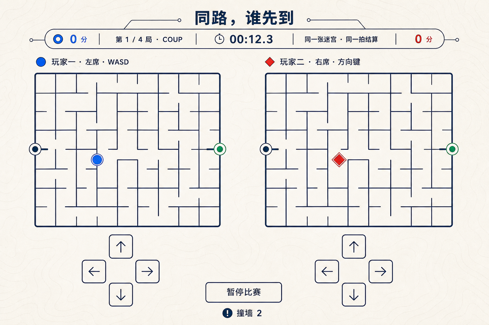
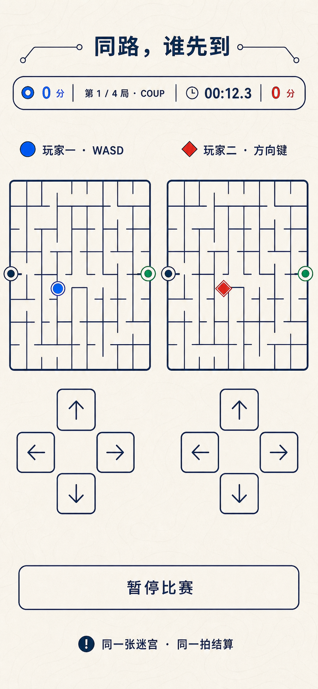

# 「同路，谁先到」视觉设计提案

## 1. 文档状态

- 产品 ID：`dual-maze-race`
- 标题：**同路，谁先到**
- 分类 / 等级：`versus` / A
- 当前产品结论：Conditional Go，未安装
- 当前阶段：P6 视觉提案，等待用户确认
- 基线：`22d7b09a034fbacb667bd5dac9929637447dd5c0`
- 上游文档：
  - `docs/283-dual-maze-race-research.md`
  - `docs/284-dual-maze-race-brainstorm.md`
  - `docs/285-dual-maze-race-spec.md`
  - `docs/286-dual-maze-race-plan.md`
- 已核对 core：
  - `experiences/versus/dual-maze-race/config.js`
  - `experiences/versus/dual-maze-race/logic.js`
  - `experiences/versus/dual-maze-race/logic.test.js`
  - `experiences/versus/dual-maze-race/ATTRIBUTION.md`

本文冻结视觉方向候选、跨视口布局、设计 token、组件状态、可见文案边界与后续
concept-to-code 验收方法。本文不授权生产 UI 实现。

在用户明确确认本提案前：

- 不创建或修改 `index.html`；
- 不创建或修改 `styles.css`；
- 不创建或修改 `app.js`；
- 不为了视觉修改 `config.js`、`logic.js` 或规则常量；
- 不接入 Board、catalog 或共享索引；
- 不把项目标为 installed；
- 不把概念图复制到生产目录。

## 2. 视觉方向结论

推荐方向：**共享地图桌**。

它把双人迷宫呈现为一张现代纸质路线图，而不是电竞控制台：

- 暖纸白背景承载深墨蓝迷宫；
- 玩家一使用钴蓝圆形标记与点纹；
- 玩家二使用朱砂菱形标记与斜纹；
- 起点使用中性深墨标记，终点使用常青绿；
- 顶部是一条单一比赛信息轨；
- 两块棋盘完全等大、同朝向、同墙体；
- 两组方向控制稳定存在；
- 线条精确、阴影克制、装饰只保留淡拓扑纹理。

这个方向适合“给对象准备”的仓库，因为它强调“两个人面对同一道题”，亲密感来自
并肩和换席，而不是爱心贴纸、羞辱性胜负文案或情侣专属营销标签。默认称呼仍保持
匿名和包容，用户可在配置层自行改名。

## 3. 概念资产

### 3.1 桌面 active-race 概念



- 项目路径：`docs/assets/dual-maze-race/desktop-active-race-concept.png`
- 原生尺寸：1536×1024 px
- 格式：PNG，无 alpha
- SHA-256：`169efaa4d60838dbdc36192312468b7c2cafa2d2774ebf969f6804efb5a877a3`
- 用途：桌面 active-race 的布局、信息层级、视觉语言与组件关系参考

### 3.2 移动 active-race 概念



- 项目路径：`docs/assets/dual-maze-race/mobile-active-race-concept.png`
- 原生尺寸：853×1844 px
- 格式：PNG，无 alpha
- SHA-256：`e5a3c0aacf789ce60a48c350108db9ad4c649caa5794e40d565fe340f3307324`
- 用途：390 px 窄屏 active-race 的重排、双盘并列、两组方向控制与纵向节奏参考

### 3.3 生成来源

- 生成方式：Codex 内置 `image_gen` 工具；
- 分类：`ui-mockup`；
- 生成会话目录：
  `/Users/zenith/.codex/generated_images/019f97bc-7f53-75f0-b78a-713c7ee25a39/`；
- 桌面原始输出：
  `call_Zl7rOQQ6yhJS1LwC0BOihf8Q.png`；
- 移动原始输出：
  `call_lHNZFlMujESuw7sRnqyzDlPG.png`；
- 模型版本、随机 seed 和内部生成参数未由 built-in 工具暴露，本文不虚构；
- 两张最终概念原样复制到本项目 docs，未裁切、压缩、重绘或覆盖；
- 已从项目路径使用 `view_image` 以 original detail 实际检查；
- 生成图无外部开源游戏、商标、第三方地图或用户私人素材输入。

### 3.4 概念资产边界

两张 PNG 是设计过程证据，不是生产 UI 或游戏资产：

- 不得把整张图片作为网页背景冒充交互；
- 不得裁出迷宫、按钮、箭头、图标、文字或玩家标记用于生产；
- 不得从图中 OCR 文案后直接采用；
- 不得把生成图中的迷宫墙当作 COUP 或 PAIR 的真实 passage；
- 不得把图中的玩家位置、比分、时间或 bump 当作测试 fixture；
- 运行时不得加载 docs 下的概念 PNG；
- 真实迷宫、玩家标记、起终点和按钮应为 code-native DOM / SVG / CSS；
- 真实文字、计时、比分、席位与状态必须从 core public view 投影；
- 概念图中无法复现的纹理应由 CSS 退化为不影响信息的装饰。

## 4. ImageGen prompt 记录

### 4.1 桌面 prompt

```text
Use case: ui-mockup
Asset type: desktop web game full active-race screen concept, design reference only
Primary request: Create a polished, shippable-looking desktop UI concept for a local
same-device two-player maze race named "同路，谁先到". Show the entire active-race
screen, not a hero section. Two players solve two visually identical 9x9 mazes at the
same time. The mazes must be equal size, same orientation, side by side, fully visible,
each with a clear start on the left-middle edge and goal on the right-middle edge.
Include one player marker in each maze, no solution path.
Scene/backdrop: refined modern tabletop atlas on a warm paper-white background with
extremely subtle topographic contour lines; open composition, not nested card grids
Style/medium: realistic senior product-design UI mockup, practical HTML/CSS/SVG
implementation, editorial transit-map character, clean and airy, 7/10 creativity,
not concept art
Composition/framing: 1536x1024 landscape desktop viewport. Compact centered header with
title. A single match rail below it shows round 1 of 4, map COUP, scores, elapsed time,
and that both players have the same maze. Main area is two large equal 9x9 maze boards
side by side. Left board label and identity above; right board label and identity above.
Under each board, a stable four-direction control cluster with buttons at least visually
52px. One clear shared pause button and one compact status line near the bottom. Keep all
primary content inside the viewport.
Visual direction: deep ink-navy maze walls and text; player one cobalt blue with circular
marker and dot texture; player two warm vermilion with diamond marker and diagonal
texture; goal uses restrained evergreen; start uses neutral ink. Thin precise map lines,
square-to-softly-rounded geometry, subtle paper grain, almost no shadow, no glassmorphism,
no neon, no dark background.
Text (verbatim, minimal): "同路，谁先到"; "第 1 / 4 局 · COUP";
"玩家一 · 左席 · WASD"; "玩家二 · 右席 · 方向键"; "0 分"; "00:12.3";
"撞墙 2"; "暂停比赛"; "同一张迷宫 · 同一拍结算"
Constraints: real interactive text and controls will be code-native later; this image is
only a visual concept. Preserve two equal full mazes and symmetric information density.
No hidden maze, no traps, no obstacles, no solution path, no leaderboard, no account,
no settings sidebar, no navigation bar, no hero eyebrow, no kicker, no badges, no
decorative pills, no extra dashboard cards, no logos, no trademarks, no watermark.
Direction controls should use clean outline arrow icons rather than text glyphs. Must
look feasible as static HTML/CSS/SVG and accessible with strong contrast.
```

### 4.2 移动 prompt

```text
Use case: ui-mockup
Asset type: mobile web game full active-race screen concept, responsive counterpart to
Image 1
Input images: Image 1 is a style and component-system reference only, not an edit target
Primary request: Create the portrait 390x844 responsive active-race screen for the same
local two-player maze game "同路，谁先到". Preserve Image 1's warm paper-white atlas
background, deep ink-navy maze lines, cobalt circular player identity, vermilion diamond
player identity, restrained evergreen goal, precise thin borders, typography mood, and
open composition. Reflow the hierarchy for a real narrow mobile viewport rather than
shrinking the desktop.
Composition/framing: portrait mobile viewport only, no phone device frame. Compact
single-line title at top. Directly below, a compact match rail with round 1 of 4, COUP,
score, and elapsed time. Then a symmetric player identity row. Then two equal complete
9x9 mazes side by side, same orientation and same wall layout, each at least visually
about 166px wide. Below the boards, two compact cross-shaped four-direction control
clusters side by side, each button clearly at least 52px. Then one full-width pause
button and one short status line. Keep all essential race information and both mazes
visible without horizontal scrolling; slight vertical continuation is acceptable only
for the final status line.
Text (verbatim, minimal): "同路，谁先到"; "第 1 / 4 局 · COUP"; "0 分";
"00:12.3"; "玩家一 · WASD"; "玩家二 · 方向键"; "暂停比赛";
"同一张迷宫 · 同一拍结算"
Constraints: real UI text and controls will be code-native later; this image is only a
visual concept. No hidden maze, no traps, no solution path, no leaderboard, no account,
no navigation bar, no settings, no hero eyebrow, no badges, no decorative pills, no
extra cards, no logo, no trademark, no watermark. Do not stack one maze below the other.
Do not make touch targets tiny. Use outline SVG-like arrow icons, not text glyphs.
Practical static HTML/CSS/SVG implementation, strong contrast, clean accessible spacing.
```

## 5. 实际视觉检查

### 5.1 桌面概念成立之处

实际查看原图后，以下方向成立：

- 标题简短，没有营销导航和额外 hero；
- 单一比赛轨同时承载比分、局数、地图和时间；
- 两块迷宫等大、同朝向、墙体视觉上相同；
- 玩家一 / 玩家二分别使用圆形与菱形；
- 起点和终点在两块盘中位置一致；
- 两套十字方向控制稳定显示；
- 暂停是单一共享主动作；
- 纸白背景、深墨线和双色玩家形成清楚层级；
- 没有显示最短路、陷阱、道具或隐藏信息；
- 组件数量克制，具备静态 HTML/CSS/SVG 可实现性。

### 5.2 移动概念成立之处

- 双盘仍保持横向并列；
- 信息轨压缩但未把一方信息隐藏；
- 玩家身份在棋盘上方保持对称；
- 两套方向控制在棋盘下方并排；
- 暂停改为全宽，适合触屏主操作；
- 视觉语言与桌面一致；
- 没有手机设备框；
- 纵向延续只留给底部状态说明。

### 5.3 视觉幻觉与错误推断

生成图中的下列内容**不是产品真值**：

| 生成图现象 | 为什么是幻觉 / 不完整 | 生产真值 |
| --- | --- | --- |
| 迷宫看似 9×9 | 线条无法证明 passage 数、连通性或 fingerprint | 只能从 `publicView.boards[*].maze.passages` 渲染 |
| 两图墙体看似一致 | 像素相似不能证明共享对象 | core 要求两 Board 共享同一 public maze DTO |
| 玩家一固定左席 | 只代表第 1 / 3 局 | 第 2 / 4 局必须交换左右席和控制区 |
| `撞墙 2` 位于中央 | 容易被理解为共享 bump | core 的 `bumps` 按 playerId 独立 |
| `00:12.3` | 只是视觉样例 | 由 `elapsedTicks / 30` 派生，不读取图片 |
| 两人都是 `0 分` | 只代表开场样例 | 分数跟随 playerId，并由四局 result 累加 |
| 玩家纹理不明显 | ImageGen 没有稳定生成点纹 / 斜纹 | 生产必须补形状 + 纹理冗余 |
| 箭头像手绘线 | 像素图标无规范 viewBox / stroke | 使用一致的 code-native inline SVG |
| 移动稿标称 390 | 实际位图为 853×1844 | 390×844 必须由真实 CSS viewport 验证 |
| 控件看似 52px | 图片比例不能证明 CSS 目标尺寸 | 浏览器读取 `getBoundingClientRect()` 验证 |
| 暂停与状态可见 | 图片没有交互状态 | button disabled / focus / pressed / paused 必须实现 |
| 只有 active-race | 没有 intro、检查、结果等状态 | 所有 core phase 都要使用同一设计系统 |

## 6. Code-native 文案边界

### 6.1 真值优先级

生产可见文字按以下顺序确定：

1. `config.js` 的默认称呼和 `composeMatchNote`；
2. core `getPublicView()` 的名字、局数、地图、席位、分数和状态；
3. spec / brainstorm 中已经明确的规则、风险与状态文案；
4. 本提案经用户批准的少量视觉标签；
5. 概念图文字仅用于层级，不得反向覆盖前四项。

玩家名字必须通过 `textContent` 投影。任何生成图文字、HTML 字符串或图片内数字都不能
参与规则和无障碍名称。

### 6.2 Intro 允许文案

- `同路，谁先到`
- `同一条路，换个位置，再比一次。`
- `玩家一`
- `玩家二`
- `开始输入检查`
- `四局，两张图，每张图交换一次左右席。`
- `同一逻辑拍到达，这一局平局。`
- `不联网，不保存，不申请设备权限。`

禁止新增：

- hero eyebrow；
- A 级或 versus 徽章；
- “情侣专属”；
- 排行榜；
- “兼容所有键盘 / 手机”；
- 与胜负绑定的感情评价。

### 6.3 Input-check 允许文案

- `先试试两边的方向键`
- `玩家一：W A S D`
- `玩家二：方向键`
- `一起按一下，看看这块键盘能不能同时听见你们。`
- `已检测`
- `还没检测`
- `此键盘可能漏键。`
- `建议改用两组触控按钮。`
- `我知道风险，仍要继续`
- `开始比赛`

UI 不得把联合检测描述为“键盘完全兼容”。

### 6.4 Countdown / racing 允许文案

- `第 1 / 4 局`
- `COUP` / `PAIR`
- `同一张迷宫 · 同一拍结算`
- 玩家动态名字
- `左席 · WASD`
- `右席 · 方向键`
- 动态分数，例如 `1.5 分`
- 动态用时，例如 `12.3 秒`
- `撞墙 0`
- `暂停比赛`
- 倒数 `3`、`2`、`1`、`开始`

概念图使用的 `玩家一 · 左席` 不是固定文案；席位与 playerId 必须由当前 HEAT 派生。

### 6.5 Paused 允许文案

- `比赛已暂停`
- `手动暂停`
- `页面暂时不可见`
- `窗口失去焦点`
- `页面已离开`
- `页面停顿过久`
- `继续比赛`
- `继续前会重新倒数`

暂停原因由 core `pauseReason` 的白名单映射，不显示浏览器内部异常。

### 6.6 Heat-result 允许文案

- `<名字> 先到`
- `同一拍到达，这局算你们心有灵犀。`
- `本局用时`
- `撞墙`
- `这一局换边，同一张图再来。`
- `下一局`
- `下一局：<名字> 左席，<名字> 右席`

本局用时和 bump 只做复盘，不作为隐藏 tie-break。

### 6.7 Match-result 允许文案

- `<名字> 赢下这场`
- `四局打平`
- `总比分`
- 四局公开摘要；
- `同一条路，换个位置，再比一次。`
- `再来一场`

整场平局时不显示“加赛”或按时间 / bump 暗中判胜。

### 6.8 Live region

只播报：

- 输入检查通过 / 风险；
- 倒数；
- 撞墙的节流摘要；
- 暂停 / 恢复；
- 换席；
- 本局结果；
- 整场结果。

不逐 tick 播报位置、时间或按钮按下，不把 30Hz 状态变化灌入辅助技术。

## 7. Design tokens

以下 token 从两张概念图近似提炼。概念未经用户确认，因此当前仍为 proposal。

### 7.1 颜色

```css
:root {
  --color-page: #f6f1e7;
  --color-page-deep: #eee7d9;
  --color-surface: #fffdf7;
  --color-surface-muted: #f3ede1;

  --color-ink: #102c56;
  --color-ink-strong: #082347;
  --color-ink-muted: #59687c;
  --color-line-soft: #d9d0bf;

  --color-player-one: #1266e8;
  --color-player-one-soft: #dbe9ff;
  --color-player-two: #e63d2f;
  --color-player-two-soft: #fde1dc;

  --color-start: #18365d;
  --color-goal: #13845d;
  --color-warning: #9a5b13;
  --color-error: #a72d27;
  --color-focus: #6e39d8;
}
```

颜色锁：

- 背景明确是暖纸白，不是纯白、奶油黄或灰色 dashboard；
- 所有迷宫墙都用同一个深墨色，不按玩家染色；
- 玩家色只用于身份、位置、分数与对应控制；
- 起点 / 终点与玩家颜色区分；
- 焦点紫独立于两位玩家色；
- 警告不能复用玩家二朱砂色作为唯一提示；
- 高对比状态不依赖背景纹理。

### 7.2 字体

无远程字体：

```css
--font-display:
  "PingFang SC", "Hiragino Sans GB", "Microsoft YaHei",
  -apple-system, BlinkMacSystemFont, "Segoe UI", sans-serif;
--font-ui:
  -apple-system, BlinkMacSystemFont, "Segoe UI",
  "PingFang SC", "Hiragino Sans GB", "Microsoft YaHei", sans-serif;
--font-numeric:
  ui-monospace, "SFMono-Regular", Menlo, Consolas, monospace;
```

| Token | 1536 / 1440 | 390 | 320 | Weight / line-height | 用途 |
| --- | ---: | ---: | ---: | --- | --- |
| `display` | 48 | 30 | 26 | 750 / 1.1 | 标题 |
| `subtitle` | 18 | 15 | 14 | 450 / 1.45 | 副标题 |
| `player` | 20 | 16 | 14 | 700 / 1.25 | 玩家 / 席位 |
| `score` | 24 | 18 | 16 | 750 / 1 | 分数 |
| `timer` | 28 | 20 | 18 | 700 / 1 | 用时 |
| `hud-label` | 15 | 13 | 12 | 650 / 1.25 | 局 / 地图 / bump |
| `control` | 17 | 16 | 15 | 700 / 1.2 | 按钮 |
| `body` | 16 | 14 | 14 | 450 / 1.5 | 说明 |
| `caption` | 13 | 12 | 12 | 500 / 1.4 | 风险 / 辅助状态 |

所有 button、input、HUD、结果和方向控件显式指定字体，不依赖浏览器默认。

### 7.3 间距

```css
--space-1: 4px;
--space-2: 8px;
--space-3: 12px;
--space-4: 16px;
--space-5: 24px;
--space-6: 32px;
--space-7: 48px;
--space-8: 64px;
```

- 桌面页面 gutter：24–40 px；
- 390 页面 gutter：12 px；
- 320 页面 gutter：8 px；
- 桌面双盘 gap：56–72 px；
- 390 双盘 gap：10–12 px；
- 320 双盘 gap：8 px；
- 控制按钮内部 icon 与边缘至少 12 px；
- 主操作之间至少 8 px；
- 标题与 match rail 间距 16–24 px。

### 7.4 边框与线宽

```css
--border-hairline: 1px;
--border-control: 2px;
--border-maze: 2px;
--border-marker: 3px;
--border-focus: 3px;
```

- maze passage 的视觉墙宽不得因席位不同；
- 外框可以比内墙高 0.5–1 px，但不能改变 cell 尺寸；
- 起点、终点和玩家标记至少有 2 px 外轮廓；
- focus-visible 使用 3 px 紫色外环和 2 px offset；
- 迷宫容器不能裁掉焦点；
- forced-colors 下墙使用 `CanvasText`，玩家由形状和纹理区分。

### 7.5 圆角

```css
--radius-maze: 8px;
--radius-control: 12px;
--radius-rail: 20px;
--radius-panel: 20px;
--radius-dialog: 24px;
```

match rail 的长圆角是功能信息轨，不扩展成全页 pill 系统。文字标签、玩家名和状态
不默认套胶囊。

### 7.6 阴影与纹理

```css
--shadow-control: 0 6px 16px rgba(16, 44, 86, 0.10);
--shadow-panel: 0 16px 40px rgba(16, 44, 86, 0.12);
--shadow-marker: 0 3px 8px rgba(16, 44, 86, 0.18);
```

- 棋盘依靠线和留白，不使用厚重悬浮阴影；
- 纸面拓扑纹理透明度不超过 5%；
- forced-colors、打印和图片阻断时纹理可以完全消失；
- 玩家一点纹、玩家二斜纹由 CSS / SVG pattern code-native 绘制；
- 不生成或加载独立背景纹理位图。

### 7.7 动效

```css
--motion-control: 100ms;
--motion-marker: 120ms;
--motion-state: 180ms;
--motion-overlay: 220ms;
--ease-map: cubic-bezier(0.2, 0.75, 0.25, 1);
```

普通模式：

- 合法移动时标记在相邻 cell 间做 120 ms 位移；
- bump 只让标记外环短暂收紧，不摇动棋盘；
- 倒数允许轻微缩放；
- 换席使用 180 ms 交叉淡入；
- 结果 panel 淡入；
- 没有持续地图流动、星光、视差或路径追踪。

动效是投影，不能驱动 phase、tick、队列或赢家。

## 8. 桌面布局

### 8.1 1536×1024 / 1440×900

页面结构：

1. compact header；
2. single match rail；
3. symmetric player headings；
4. two-board race field；
5. two control clusters + shared pause；
6. short status line。

尺寸：

- 内容最大宽度约 1360 px；
- 标题区高约 72–92 px；
- match rail 高 64–72 px；
- 双盘使用等宽双列；
- 单盘推荐 500–580 px；
- 9×9 cell 约 55–64 px；
- 两个方向区各为 3×3 cross，按钮 52–64 px；
- 暂停位于两组控制之间或下一行中央，仅一个入口；
- active-race 在 900 px 高度内优先完整显示。

match rail 从左到右：

- 玩家一总分；
- `第 n / 4 局 · mapLabel`；
- `elapsedTicks / 30`；
- `同一张迷宫 · 同一拍结算`；
- 玩家二总分。

玩家标题按**当前席位**而不是固定 DOM：

```text
<当前左席名字> · 左席 · WASD
<当前右席名字> · 右席 · 方向键
```

### 8.2 1280×800

- 标题降到 38–42 px；
- match rail 允许压缩辅助句；
- 双盘仍等宽；
- 单盘不小于约 430 px；
- 方向按钮仍不小于 52 px；
- shared pause 可下移一行；
- 主动作首屏可达；
- 不通过隐藏一方 HUD 或缩小一方棋盘换空间。

## 9. 390×844 布局

active-race 顺序：

1. 单行或紧凑两行标题；
2. match rail；
3. 双方身份行；
4. 双盘；
5. 双方向控制；
6. 全宽暂停；
7. 简短状态。

尺寸：

- gutter 12 px；
- 双盘 gap 10–12 px；
- 单盘约 166–178 px；
- 9×9 cell 约 18–19 px；
- 迷宫墙 1.5–2 px，仍需清晰；
- 两组十字控制并排；
- 每个方向按钮至少 52×52 CSS px；
- 每组 cross 外接宽约 156 px；
- 两组之间至少 8 px；
- 暂停高至少 52 px；
- 无横向滚动。

第一屏至少看见：

- 当前局、地图和总分；
- 两个当前席位；
- 两块完整迷宫；
- 两组方向按钮；
- 暂停。

底部状态可以位于纵向延续，但不能移除。

## 10. 320×700 布局

320 是独立 Gate，不是把 390 继续缩放：

- gutter 8 px；
- 双盘 gap 8 px；
- 单盘约 136–148 px；
- 两块盘仍并排；
- maze 朝向不变；
- 玩家标题允许缩为名字 + 席位图标，完整控制说明放在可见摘要；
- match rail 拆成两行开放信息带，不使用横向挤压的长 capsule；
- 两组 52 px cross 无法可靠并排时，保持相同 cross 结构，按左席、右席依次纵向排列；
- 允许纵向滚动到控制区；
- 不把控制按钮缩小到 52 px 以下；
- 不把四方向改成 swipe；
- 不把一方棋盘放到另一方下方；
- 不切换成轮流模式；
- 无横向溢出。

首屏必须至少显示：

- 当前局 / 分数；
- 两个当前席位；
- 两块完整迷宫；
- 当前玩家位置和终点。

控制可纵向到达，且到达后两组均保持稳定、可聚焦。

## 11. 组件 inventory

### 11.1 App shell

- `GameHeader`
  - 标题；
  - intro variant；
  - compact race variant。
- `PaperMapBackdrop`
  - 暖纸白；
  - code-native 淡拓扑线；
  - `aria-hidden="true"`。
- `MatchRail`
  - heat；
  - map；
  - scores；
  - elapsed；
  - same-maze status；
  - desktop / mobile / 320-open variant。
- `StatusRegion`
  - polite；
  - atomic；
  - 不逐 tick。

### 11.2 Intro

- `PlayerNameField`
  - 两个有 label 的 input；
  - default / focus / invalid / disabled；
  - 最大 20 code points 由 core 处理。
- `FormatSummary`
  - 四局；
  - 同 seed 换席；
  - 同 tick 平局；
  - 不联网 / 不存储。
- `BeginCheckButton`
  - 唯一主动作。

### 11.3 Input check

- `DirectionCheckPanel`
  - 玩家动态名字；
  - 四方向检查；
  - checked / unchecked；
  - 键盘与触控都可完成。
- `JointKeyCheck`
  - D + ArrowLeft 示例；
  - waiting / detected / timed-out；
  - 不宣称全键盘证明。
- `GhostingWarning`
  - warning icon；
  - 触控建议；
  - 显式风险接受；
  - 不用玩家二颜色单独表示。
- `StartMatchButton`
  - only when core `canStartMatch`。

### 11.4 Race

- `PlayerIdentity`
  - circle-dot / diamond-stripe；
  - current left / right seat；
  - dynamic control label；
  - total score。
- `MazeBoard`
  - shared maze DTO；
  - left / right projection；
  - code-native SVG walls；
  - accessible name；
  - non-focusable cells。
- `PlayerMarker`
  - player one circle + dot；
  - player two diamond + stripe；
  - normal / bump / reached / paused。
- `StartMarker`
  - neutral circle + opening notch。
- `GoalMarker`
  - evergreen ring + center dot；
  - forced-colors label / shape。
- `DirectionPad`
  - four native buttons；
  - cross layout；
  - 320 stacked group；
  - default / hover / focus-visible / active / disabled。
- `PauseButton`
  - single shared action。
- `CountdownOverlay`
  - match / resume variant。
- `BumpMetric`
  - per playerId；
  - visible label；
  - not tie-break。

### 11.5 Pause / results

- `PausePanel`
  - reason；
  - continue；
  - resume countdown note。
- `HeatResultPanel`
  - winner / draw；
  - elapsed；
  - per-player bump；
  - next seat assignment；
  - next heat。
- `MatchResultPanel`
  - total score；
  - four heat rows；
  - winner / draw；
  - safe composed note；
  - restart。

## 12. Core phase 与视觉状态

| Core phase | 主视图 | 焦点目标 | 可用动作 |
| --- | --- | --- | --- |
| `intro` | 名字 + 赛制 | 玩家一名字 | 进入输入检查 |
| `input-check` | 双方方向 + 联合检查 | 当前未完成检查 | 检查、接受风险、开始 |
| `countdown` | 双盘 + 倒数 overlay | 状态摘要 | 无移动 |
| `racing` | active-race | 保留当前控件焦点 | 移动、暂停 |
| `paused` | pause panel | 继续比赛 | 继续 |
| `heat-result` | 本局结果 + 下一席位 | 结果标题 | 下一局 |
| `match-result` | 四局总结果 | 结果标题 | 再来一场 |

必须补充的局部状态：

- input waiting / detected / warning；
- queue available / full（只做视图反馈，不公开队列内容）；
- legal move / bump；
- player reached；
- manual / hidden / blur / pagehide / stalled pause；
- heat left-win / right-win / draw；
- match player-one / player-two / draw；
- reduced-motion；
- forced-colors；
- 200% zoom；
- no-CSS / image-blocked 基础可读。

## 13. 图标与形状 inventory

所有功能图标 code-native inline SVG：

- `viewBox="0 0 24 24"`；
- `fill="none"`；
- `stroke="currentColor"`；
- `stroke-width="1.8"`；
- `stroke-linecap="round"`；
- `stroke-linejoin="round"`；
- 控件 20–24 px；
- 状态 18–20 px；
- 玩家标记按 cell 自适应；
- 不从概念图裁切；
- 不引入 icon font 或远程库。

| 图标 / 形状 | 用途 | 生产造型 |
| --- | --- | --- |
| 圆形 + 中心点 | 玩家一 | 钴蓝；点纹；forced-colors 下实心点 |
| 菱形 + 斜纹 | 玩家二 | 朱砂；斜纹；forced-colors 下双轮廓 |
| 中性环 + 缺口 | 起点 | 深墨；入口朝左 |
| 绿环 + 中心点 | 终点 | 常青绿；附可见“终点”摘要 |
| 四个方向箭头 | 方向按钮 | 统一 stroke，光学居中 |
| 时钟 | elapsed | 圆环 + 双指针 |
| pause | 暂停 | 双竖条 |
| play | 继续 | 右三角 |
| swap | 换席 | 两条相反水平箭头 |
| bump | 撞墙 | 墙线 + 小冲击点 |
| warning | ghosting / stalled | 三角或圆形感叹号 |
| check | 输入通过 | 对勾 |
| tie | 同 tick 平局 | 两标记并列 + 等号 |
| restart | 再来一场 | 环形箭头 |

不使用 Unicode 箭头、emoji 或概念图像素图标替代需要精确对齐的 SVG。

## 14. 迷宫与概念资产的关系

### 14.1 生产迷宫

迷宫必须由 core DTO 生成 SVG / DOM：

- 9×9；
- 只读 passage；
- 起点 `{4,0}`；
- 终点 `{4,8}`；
- 当前 heat 的 COUP / PAIR；
- 两盘共享同一 maze DTO；
- 两盘同朝向；
- 不显示 BFS 路径；
- 不以概念 PNG 作为底图；
- SVG 几何不参与逻辑；
- forced-colors 下墙仍可见。

### 14.2 为什么 code-native 是有意偏差

`frontend-app-builder` 对游戏通常偏好 ImageGen 生产美术，但本项目的核心视觉就是动态、
可验证、必须 forced-colors 可见的迷宫几何。将墙和位置做成位图会：

- 无法证明与 passage 同源；
- 无法安全换 COUP / PAIR；
- 难以同步玩家位置；
- 无法在 forced-colors 中可靠显示；
- 可能泄漏错误路线；
- 破坏零资产、A 级本地合同。

因此以下内容有意使用 code-native SVG / CSS：

- maze walls；
- player markers；
- start / goal；
- direction icons；
- topographic background line；
- focus、bump 和 result states。

两张 ImageGen PNG 只负责视觉方向，不是待拆分的生产 asset sheet。

## 15. 输入与焦点

### 15.1 键盘

- 左席固定 KeyW / KeyA / KeyS / KeyD；
- 右席固定 ArrowUp / ArrowLeft / ArrowDown / ArrowRight；
- playerId 根据当前 HEAT 进入席位；
- 非 repeat `keydown` 每次最多一项；
- 控件内 Enter / Space 保留原生 activation；
- editable target 不触发比赛移动；
- 只在实际处理游戏键时阻止默认；
- UI 不公开 queue 内容或未来动作；
- ghosting 检查必须诚实表述限制。

### 15.2 Pointer / touch

- 八个原生 `button type="button"`；
- 每次 click / keyboard activation 只 queue 一次；
- 不同时用 pointerdown + click 双入队；
- `touch-action` 只在控制区局部声明；
- `pointercancel` 清理视觉 pressed；
- 真实双触点必须在后续实现 Gate 验证；
- 概念图无法证明多点触控。

### 15.3 焦点

- intro 初始焦点不强制抢占，Tab 首先到玩家一名字；
- input-check 将焦点移到检查 heading 或首个未完成方向；
- countdown 不把焦点移入非交互数字；
- racing 移动不抢焦点；
- pause 后焦点移到“继续比赛”；
- heat-result / match-result 把焦点移到结果 heading；
- 下一局后回到公共状态摘要；
- focus-visible 使用独立紫色；
- maze 容器和按钮 overflow 不裁切焦点；
- Tab 顺序与视觉顺序一致；
- 200% zoom 下所有动作仍可到达。

## 16. Reduced motion

`prefers-reduced-motion: reduce`：

- 玩家标记无平移 transition；
- bump 无缩放 / 冲击动画；
- 倒数无缩放；
- 换席无交叉移动；
- 结果 panel 无滑入；
- 纸面纹理静止；
- 状态与文字立即更新；
- tick、队列、倒数长度、积分和赢家不变。

普通与 reduced-motion 必须对同一 action trace 得到相同 public view。

## 17. Forced colors

`@media (forced-colors: active)`：

- 页面使用 `Canvas` / `CanvasText`；
- panel 与 button 使用系统边框色；
- maze wall 使用至少 2 px `CanvasText`；
- 起点用环 + 缺口；
- 终点用环 + 中心点；
- 玩家一保持圆形 + 中心点；
- 玩家二保持菱形 + 双轮廓；
- 当前玩家位置有 2–3 px outline；
- focus 使用系统 `Highlight`；
- warning 使用图标 + 文字；
- 隐藏纸纹和装饰线；
- 不用 `forced-color-adjust: none` 锁死整个页面；
- 必要时仅对小型身份 pattern 做局部、可验证的调整。

forced-colors 验收不能只看 CSS 是否存在，必须真实截图和键盘走查。

## 18. Concept-to-code fidelity ledger

### 18.1 当前 ledger

| 检查点 | 概念证据 | 生产要求 | 当前状态 |
| --- | --- | --- | --- |
| 标题 | 顶部单一标题 | code-native `同路，谁先到`，无 eyebrow | 待实现 |
| match rail | 单一横向信息轨 | 由 public view 派生，不嵌图 | 待实现 |
| 双盘 | 等大、同朝向、同墙视觉 | 同一 maze DTO，两次投影 | 待实现 |
| maze truth | 概念线条近似 9×9 | 生产 passage / fingerprint 为唯一真值 | 合法偏差 |
| 玩家身份 | 蓝圆 / 红菱形 | 再加点纹 / 斜纹与动态席位 | 待实现修正 |
| 玩家席位 | 稿中玩家一固定左 | 第 2 / 4 局交换 | 必须偏离 |
| bump | 稿中中央 `撞墙 2` | 双方各自 bump | 必须偏离 |
| elapsed | `00:12.3` | `elapsedTicks / 30`，显示一位小数 | 待实现 |
| 控制 | 两组十字方向区 | 八原生按钮，最小 52px | 待量测 |
| pause | 单一共享动作 | 原生 button + paused state | 待实现 |
| mobile | 双盘与双 control 并排 | 390 实测；320 controls 可纵向 | 待实现 |
| 其他 phase | 概念未展示 | 全 phase 同一视觉系统 | 待设计落地 |
| forced-colors | 概念无法表达 | 系统色 + 形状 / 纹理 | 待验收 |
| reduced-motion | 静态图无法表达 | 仅去动画，不改规则 | 待验收 |

### 18.2 后续 fidelity QA

实现后每轮必须：

1. 用 Browser / in-app browser 打开真实 UI；
2. 捕获 native concept 尺寸或最接近的浏览器截图；
3. 对 concept 和最新截图分别调用 `view_image`；
4. 比较并更新 ledger；
5. 修复可修复偏差；
6. 重新截图、重新 `view_image`；
7. 直到没有未解释的 material mismatch。

至少比较：

- copy；
- 双盘尺寸 / 对齐；
- match rail；
- 字体；
- 颜色；
- maze 线宽；
- 标记与图标；
- controls；
- spacing；
- 320 / 390 重排；
- focus；
- forced-colors；
- reduced-motion；
- 换席 / 结果状态。

功能测试、DOM 检查和 build 通过不能代替视觉 fidelity QA。

## 19. Concept-to-code Gate

### Gate 0：用户确认

用户必须明确接受：

- 共享地图桌方向；
- 暖纸白 / 深墨 / 钴蓝 / 朱砂 / 常青绿；
- 桌面单一 match rail；
- 390 双盘 + 双控制并排；
- 320 双盘并排、控制区允许纵向；
- code-native maze / marker / icon；
- 概念与 core 冲突时以 core 为真值。

确认前停止生产 UI。

### Gate 1：实现前冻结

- 可见文案锁；
- token；
- 组件与状态 inventory；
- icon inventory；
- desktop / 390 / 320；
- forced-colors；
- reduced-motion；
- fidelity ledger；
- 合法偏差清单。

### Gate 2：分状态实现

建议顺序：

1. intro；
2. input-check；
3. desktop active-race；
4. 390 / 320 active-race；
5. countdown；
6. paused / resume；
7. heat-result / seat swap；
8. match-result；
9. forced-colors；
10. reduced-motion / 200% zoom。

每部分真实可用并截图对比后再进入下一部分。

### Gate 3：视觉签收

通过标准：

- 不加载概念 PNG；
- above-the-fold copy diff 为零或有用户批准；
- 双盘、HUD、控制和玩家身份达到概念层级；
- core-required deviation 全部落实；
- 无浏览器默认按钮字体；
- 无 clipped content / accidental wrapping；
- 无 390 / 320 横向溢出；
- forced-colors / reduced-motion 通过；
- `view_image` 双图审查完成；
- ledger 无未解释 material mismatch；
- 用户认可最终视觉。

## 20. 浏览器验收视口

### 20.1 概念原生对比

- 1536×1024：桌面概念 native；
- 853×1844：移动概念 native，仅用于视觉系统和比例对比。

### 20.2 产品 Gate

- 1440×900；
- 1280×800；
- 390×844；
- 320×700；
- 390×844 + reduced-motion；
- 390×844 + forced-colors；
- 320×700 + 200% zoom 行为；
- 图片阻断；
- CSS 背景纹理禁用。

每个视口检查：

- 横向滚动；
- 双盘尺寸与同朝向；
- 墙线；
- 标记；
- 当前席位；
- HUD；
- 52 px controls；
- focus；
- pause / overlay；
- heat-result / match-result；
- 动态名字的 20 code-point 极限；
- Console；
- Network；
- Storage。

受控浏览器若拒绝 `file://`，localhost 只作为浏览器自动化补充，仍需人工断网双击
完成四局。不得把 localhost 成功描述为 file 自动实玩证据。

## 21. 已知偏差

### 21.1 必须偏离概念

| 概念 | 生产 | 原因 |
| --- | --- | --- |
| 图中迷宫线 | core passages 渲染 | 确定性 / 公平 |
| 玩家一固定左席 | 第 2 / 4 局换席 | 四局赛制 |
| 中央共享 bump | 双方独立 bump | core 数据合同 |
| 视觉 390 | 真实 390×844 CSS | 生成图不是浏览器 |
| 视觉 52px | DOM 尺寸断言 | 图片比例不是证据 |
| 纯色身份 | 形状 + 纹理 | 无障碍 |
| 静态 active-only | 七个 phase | 完整产品 |
| 图片中的文字 | code-native text | 可访问 / 动态 |

### 21.2 可能需要微调

- 390 中两组 156 px cross 加 gap 是否在真实字体下溢出；
- 320 中控制纵向顺序对两人同时触屏的影响；
- 9×9 墙在 136 px 棋盘上的 1.5 / 2 px 选择；
- 暖纸白在不同显示器上的对比；
- 20 code-point 玩家名在窄屏的截断显示；
- match rail 在 320 拆行后的节奏；
- forced-colors 下玩家纹理可辨性；
- 概念纸纹若 CSS 重现过强应继续减弱。

微调不能改变规则、席位、按钮尺寸、双盘并列或 core 数据语义。

## 22. 需用户确认

进入生产 UI 前，需要用户回答：

1. 是否接受“共享地图桌”的暖纸白、深墨蓝路线图方向？
2. 是否接受玩家一为钴蓝圆形 + 点纹、玩家二为朱砂菱形 + 斜纹？
3. 是否接受常青绿终点和中性深墨起点？
4. 是否接受桌面单一 match rail 与双盘 / 双 control 对称布局？
5. 是否接受 390 两组控制并排，而 320 保留双盘并排、将两组 52 px control 纵向排列？
6. 是否接受概念图中的迷宫、席位、bump 和数字都不作为产品真值，生产严格跟随 core？
7. 是否接受 maze、marker、icon 和纸纹使用 code-native SVG / CSS，而不是拆分生成图资产？
8. 是否接受 forced-colors 中自动去掉暖纸和双色外观，优先保留系统高对比与形状？

建议确认语句：

> 接受 297 视觉提案，按共享地图桌、token、响应式策略、code-native 边界与
> fidelity Gate 进入生产 UI。

若不同意任一项，应先更新本提案或新增非覆盖式概念版本，再请求确认。

## 23. 设计阶段完成条件

- [x] 核对分支、worktree 与 baseline；
- [x] 完整读取 frontend-app-builder；
- [x] 完整读取 imagegen 与相关 prompt 参考；
- [x] 完整读取 docs/283–286；
- [x] 完整读取 core、tests 与 ATTRIBUTION；
- [x] 生成桌面 active-race 概念；
- [x] 生成移动 active-race 概念；
- [x] 将最终概念保存到项目 docs；
- [x] 用 `view_image` 原图检查两图；
- [x] 记录尺寸、SHA、prompt 与生成来源；
- [x] 记录视觉幻觉；
- [x] 定义 code-native 文案边界；
- [x] 定义 desktop / 390 / 320；
- [x] 定义组件、状态、图标和 token；
- [x] 定义输入、焦点、reduced-motion 与 forced-colors；
- [x] 建立 fidelity ledger 与浏览器 Gate；
- [x] 列出已知偏差和用户确认项；
- [ ] 用户明确确认视觉方向；
- [ ] 生产 UI；
- [ ] 浏览器 concept-to-code 签收；
- [ ] Conditional Go 转 Go；
- [ ] catalog / Board installed。

本设计阶段完成前 17 项。最后五项必须在后续独立任务中完成，本提交不得提前执行。
