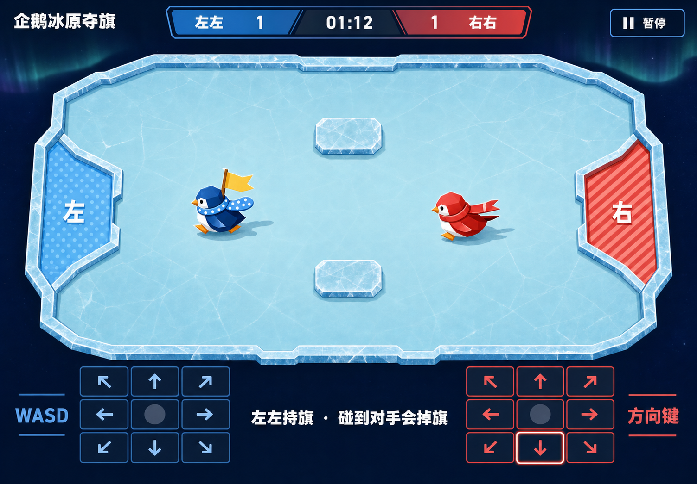
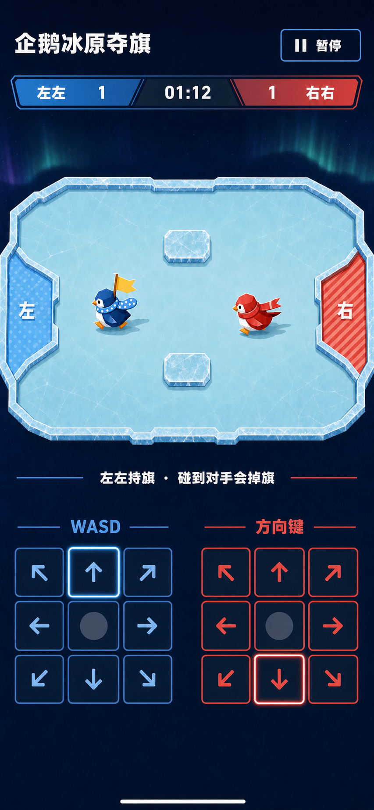

# 企鹅冰原夺旗：视觉设计提案

## 0. 文档状态

- 候选 ID：`penguin-flag-duel`
- 对外标题：企鹅冰原夺旗
- 分类：双人对抗
- 运行等级目标：A
- 当前产品决策：Conditional Go
- 当前阶段：视觉提案，等待用户确认
- 当前安装状态：未安装
- 本阶段提交范围：
  - 本文档；
  - 两张 ImageGen active-match 概念图；
- 本阶段明确不做：
  - 不创建 `index.html`、`styles.css` 或 `app.js`；
  - 不修改现有 `config.js`、`logic.js`、`logic.test.js`；
  - 不修改 catalog、Board、门户、README 或共享计数；
  - 不把候选标记为 installed；
  - 不把生成图当作运行时 UI、状态 Oracle 或生产素材。

本提案是用户确认 Gate。用户确认视觉方向和下文列出的关键选择之前，
生产 UI 必须停止。

## 1. 已冻结的产品真值

视觉必须服务于以下既有合同，不得由概念图反向改写。

### 1.1 核心循环

```text
倒计时
  → 双方从镜像出生点滑向中央旗
  → 一方拾旗
  → 持旗者减速返程 / 对手预测路线拦截
  → 被撞则掉旗
  → 携旗进入己方基地得分
  → 90 tick 重置
  → 先到 3 分，或 90 秒结束时比较比分
```

产品身份必须同时包含：

1. 中立旗；
2. 拾旗；
3. 持旗减速；
4. 有效玩家碰撞会掉旗；
5. 带回自己的基地才得分；
6. 先到 3 分或有效时间结束；
7. 同分可平局。

只剩“企鹅互撞”“碰旗即得分”或“推旗进门”时均不符合规格。

### 1.2 逻辑空间

- 单个内联 SVG；
- `viewBox="0 0 1024 640"`；
- 逻辑宽高比固定为 `1.6:1`；
- 左右基地分别位于场地两侧；
- 玩家出生点为 `(160, 320)` 与 `(864, 320)`；
- 中央旗初始点为 `(512, 320)`；
- 中央上、下各一块矩形冰岛；
- 两块冰岛和两个出生点严格镜像；
- 地图不随机；
- 旗不是第三刚体。

### 1.3 active-match 概念所表达的状态

两张最终概念图都表达同一个意图状态：

- `phase = playing`；
- 比分示例为 `1 : 1`；
- 时间示例为 `01:12`；
- 左席 `左左` 正在持旗；
- 唯一一面旗跟随左席；
- 中央没有第二面旗；
- 左席向左侧点阵基地返程；
- 右席 `右右` 正在从右侧拦截；
- 上、下中央各一块冰岛；
- 双席方向输入都可见；
- 暂停可见。

位置、速度、碰撞、倒计时和实际时间最终只能由
`getViewModel(state)` 驱动。概念图不能证明这组示例坐标是某个可重放 tick。

### 1.4 当前核心证据

本提案阶段重新运行：

```bash
node experiences/versus/penguin-flag-duel/logic.test.js
```

结果：

- 23 项测试通过；
- 0 项失败；
- 固定步、镜像、碰撞、拾旗、掉旗、得分、终局、暂停与重放合同仍成立。

该结果只证明非视觉核心，不证明未来 DOM、输入、响应式或视觉保真。

## 2. 视觉方向

### 2.1 方向名

**极夜冰场转播台**

它不是写实极地，也不是复杂电竞直播框架，而是一张适合情侣面对面坐在同一设备
两侧玩的清晰桌面冰场：

- 极夜蓝形成稳定外围；
- 浅青冰面是唯一大型亮区；
- 一条开放式比分轨道建立比赛节奏；
- 点阵和条纹让两个基地不依赖颜色；
- 两条不同尾形的围巾让企鹅在移动中仍可识别；
- 暖黄色只服务于唯一中立旗；
- 双席方向盘像两端控制台，不包进多层卡片；
- 极光只作很弱的静态背景气氛，不抢比赛信息。

### 2.2 情绪目标

希望玩家感到：

- 轻松而不是硬核模拟；
- 竞技但不攻击；
- 一眼看懂谁持旗、该回哪边；
- 能预感“刹不住”和“快被截到”的戏剧性；
- 输赢结束后仍愿意立即“再抢一局”。

### 2.3 视觉经济

只保留四个强元素：

1. 单块大冰场；
2. 单条比分/时间轨道；
3. 两只原创几何企鹅；
4. 两个镜像方向盘。

禁止为“丰富”而增加：

- 小卡片墙；
- 假数据；
- 速度表；
- 能量条；
- 技能槽；
- 小地图；
- 观众栏；
- 成就徽章；
- 导航菜单；
- 装饰性标签胶囊；
- 多余说明区；
- 路线尾迹。

## 3. 最终概念资产清单

### 3.1 桌面 active-match

- 工作区路径：
  `docs/assets/penguin-flag-duel/desktop-active-match-concept.png`
- ImageGen 原始路径：
  `{generated-image-root}/019f97bc-7f53-75f0-b78a-713c7ee25a39/call_adCrDupdjQwz9IfZ3cX9w2C9.png`
- 生成方式：内置 `image_gen`
- 用例：`ui-mockup`
- 原生尺寸：`1503 × 1046`
- Alpha：无
- SHA-256：
  `1a189283622b7802f9aad7fef114bd523ada70694e3ad5d8950a61f2351156b2`
- 检查方式：对生成源和工作区副本都执行了 `view_image(detail="original")`
- 角色：桌面视觉、密度、材质、组件和 active-match 构图主参考



### 3.2 390 / 移动 active-match

- 工作区路径：
  `docs/assets/penguin-flag-duel/mobile-active-match-concept.png`
- ImageGen 原始路径：
  `{generated-image-root}/019f97bc-7f53-75f0-b78a-713c7ee25a39/call_gQOMKV7w42JeoS69dlOdZEFC.png`
- 生成方式：内置 `image_gen`
- 输入引用：桌面最终稿只作风格与组件参考
- 用例：`ui-mockup`
- 原生尺寸：`853 × 1844`
- Alpha：无
- SHA-256：
  `594d47f2c635d7a0e609ec5e51994a05913a6b41a6c362cbb1dee068d52fe075`
- 检查方式：对生成源和工作区副本都执行了 `view_image(detail="original")`
- 角色：390 px 竖屏的信息顺序、双方向盘并排关系和触控密度参考
- 重要限制：它不是浏览器中的真实 390 CSS px 截图。



### 3.3 未采用的移动候选

两张中间候选没有复制到工作区：

| 原始路径 | 未采用原因 |
| --- | --- |
| `{generated-image-root}/019f97bc-7f53-75f0-b78a-713c7ee25a39/call_1tHtSE0EbsLTEgXEO4pSoYmV.png` | 把固定横向冰场误画成明显纵向冰场 |
| `{generated-image-root}/019f97bc-7f53-75f0-b78a-713c7ee25a39/call_mQy50S2A3rb1FFHEp8r2A6kG.png` | 信息层级正确，但冰场仍过高，且概念中的触控盘占比不够稳定 |

淘汰稿只用于证明迭代过程，不是实现参考，也不进入 Git。

## 4. 最终生成 Prompt

### 4.1 桌面 Prompt

```text
Use case: ui-mockup
Asset type: complete desktop active-match screen for a local two-player HTML game, polished production UI concept
Primary request: Design the full active gameplay screen for a Chinese same-device game titled “企鹅冰原夺旗”. The exact rule is: one neutral flag, pick it up, carry it back to your own base, and a collision with the opponent drops it. This screenshot must show a plausible active state where the LEFT player is carrying the single flag toward the left base while the RIGHT player is sliding to intercept; there must be no second flag at center.
Scene/backdrop: deep polar-night navy page with a single large luminous pale-cyan ice arena, restrained etched ice cracks, faint static aurora bands, no snow particles and no scenic illustration outside the game surface.
Style/medium: realistic shippable web product UI mockup, crisp flat vector-like shapes, tactile but restrained, playful premium local party game, not concept art, not 3D, not a dashboard card grid.
Composition/framing: landscape desktop screenshot around 1504×1046. Top: compact title on the left; one open horizontal HUD rail centered with left score, 01:12 time, right score; pause button on the right. Middle: dominant full 16:10 arena based on a 1024×640 logical field, left and right bases mirrored, exactly two small rectangular ice islands centered above and below the midpoint, and two original geometric penguin players. Bottom: status sentence plus two separate 3×3 eight-direction touch pads, left and right, with generous 44px-plus targets and the neutral center cells non-interactive. Keep the arena and both control pads fully visible.
Characters and identity: left penguin is cobalt/cyan with a ROUND-ended scarf and a dot-pattern base marked “左”; right penguin is coral/red with a SWALLOWTAIL scarf and a stripe-pattern base marked “右”. They must differ by shape and pattern, not color alone. The left carrier has one warm-yellow flag attached behind the body; the right opponent has no flag. No existing character likeness, no brand mascot.
Text (verbatim): “企鹅冰原夺旗”; “左左”; “右右”; “1”; “1”; “01:12”; “暂停”; “左左持旗 · 碰到对手会掉旗”; “WASD”; “方向键”. Use clean bold Chinese sans-serif, large readable type. Render no other copy.
HUD and controls: code-native-looking text and buttons, strong visible focus-ring language on one pause or direction control, eight arrow icons per pad, neutral middle cell, no joystick, no skill buttons, no power meter, no minimap, no fake analytics.
Color palette: #071A2E polar navy, #C9F4F6 ice cyan, #4CC9F0 left accent, #FF6B6B right accent, #FFD166 flag, near-white text. High contrast, no glassmorphism.
Lighting/mood: cheerful competitive polar night, calm readable surface with small highlights only; no glow that obscures boundaries.
Constraints: one single flag total; exact mirrored field; exactly two players; exactly two central ice islands; bases at left and right edges; complete arena visible; no invented navigation, badges, stats, spectator panels, route trails, speedometers, audio controls, logos, trademarks, watermark, external-game visual references, or Box2D imagery. Keep all visible UI practical to implement with HTML/CSS and inline SVG. This is only a design concept; gameplay geometry and text will be code-native in production.
```

参数：

```text
referenced_image_paths: omitted
num_last_images_to_include: omitted
```

### 4.2 移动最终 Prompt

```text
Use case: ui-mockup
Asset type: exact portrait responsive layout study for a 390×844 mobile web game
Input images: Image 1 is the desktop style/component reference only. Preserve its palette, vector-like penguins, bases, flag, score rail, and direction-pad family. Build a fresh portrait screen; do not crop or rotate Image 1.
Primary request: Create a strictly proportioned mobile active-match UI for “企鹅冰原夺旗”. LEFT cobalt penguin carries the one yellow flag toward the left base; RIGHT coral penguin intercepts; no center flag.
Output layout geometry: portrait phone screenshot. Use an orthographic flat front-on UI, no perspective. The ice arena must be a horizontal LANDSCAPE rectangle exactly 1.6:1 — visually about 800 pixels wide and 500 pixels tall in the portrait output, never taller. It sits below a compact 120-pixel title/pause row and a compact 100-pixel score rail. After the arena, use a 70-pixel status row. The remaining lower region contains two 3×3 direction pads side by side, each about 365 pixels wide, with nine equal square cells. Leave a small bottom safe-area margin. The complete arena and all controls fit without cropping.
Arena truth: left and right bases on the side edges; exactly two rectangular ice islands near the middle, one above and one below center; exactly two penguins; one flag attached behind the left penguin only. Do not alter the arena into a square, portrait rink, vertical corridor, or tall stadium.
Identity: left uses cobalt/cyan, ROUND-ended scarf, dot-pattern base marked “左”; right uses coral/red, SWALLOWTAIL scarf, stripe-pattern base marked “右”.
Text (verbatim): “企鹅冰原夺旗”; “左左”; “右右”; “1”; “1”; “01:12”; “暂停”; “左左持旗 · 碰到对手会掉旗”; “WASD”; “方向键”. No other text.
Style/medium: realistic shippable mobile HTML game UI mockup, crisp flat vector-like rendering, restrained polar-night background, thin bright ice border, high-contrast bold Chinese sans-serif, no 3D and no dashboard cards.
Color palette: #071A2E, #C9F4F6, #4CC9F0, #FF6B6B, #FFD166, near-white.
Controls: each pad has exactly eight arrow controls plus neutral center; large touch targets; show one visible focus ring; no joystick or skills.
Constraints: arena aspect is the highest priority; horizontal arena 1.6:1; no scenic illustration, extra sky, invented navigation, badges, stats, minimap, trails, speedometers, power bars, audio controls, logos, trademarks, watermark, Box2D branding, external-game references, or extra copy. All visible elements are concept references and will be recreated code-native.
```

参数：

```text
referenced_image_paths:
  - {generated-image-root}/019f97bc-7f53-75f0-b78a-713c7ee25a39/call_adCrDupdjQwz9IfZ3cX9w2C9.png
num_last_images_to_include: omitted
```

## 5. 原图检查结论

### 5.1 桌面图可采用之处

- 标题、比分轨道、暂停、冰场和控制区形成清楚的一屏顺序；
- 冰场是全屏唯一视觉主角；
- 左右基地的点阵/条纹区别明确；
- 左右企鹅的围巾尾形区别明确；
- 暖黄旗只出现在左席身后；
- 中央没有第二面旗；
- 上、下各一块中央冰岛；
- 双方向盘都包含八方向和一个中性中心；
- 右席一个方向键显示了强焦点轮廓示例；
- 状态文案位于两席控制之间，适合共享阅读；
- 没有额外技能、速度表、小地图或假统计。

### 5.2 移动图可采用之处

- 标题、暂停、比分、冰场、状态、双方向盘的顺序明确；
- 左右方向盘并排，不改变成回合制或单席切换；
- 两席标签紧邻各自方向盘；
- 安全区留白方向清楚；
- 同一色彩、基地纹样、企鹅和旗帜语言与桌面一致；
- 按钮看起来有足够触控面积；
- active-match 的持旗和拦截叙事仍可读。

### 5.3 不能直接采用的生成幻觉

| 项目 | 生成图现象 | 生产真值 |
| --- | --- | --- |
| 移动冰场比例 | 最终移动稿仍比严格 `1.6:1` 略高 | SVG 必须使用 `viewBox="0 0 1024 640"`；容器固定 `aspect-ratio: 1024 / 640` |
| 桌面冰场边界 | 视觉轮廓有多边形切角 | 逻辑边界仍是矩形 `1024×640`；切角只能是装饰内框，不能改变碰撞边界 |
| 冰岛尺寸 | 概念只表达“上下一对” | 生产坐标必须来自 `logic.OBSTACLES`，不得凭图估算 |
| 玩家坐标 | 画面只表达返程/拦截叙事 | 每帧位置必须来自 view model；不能硬编码概念坐标 |
| 玩家轮廓 | 概念使用低多边形/立体阴影 | 生产按批准后的原创内联 SVG 几何重建，不切图、不追随任一已知角色 |
| 旗帜朝向 | 概念固定朝右 | 生产根据玩家运动方向把旗绘在身体后方；逻辑坐标始终等于携带者坐标 |
| 碰撞距离 | 两只企鹅尚未接触 | 不可据图推断下一 tick 会碰撞或掉旗 |
| 时间 | `01:12` 是静态示例 | 生产由 `liveTicksRemaining / 60` 格式化 |
| 比分 | `1 : 1` 是静态示例 | 生产来自 `scores` |
| 焦点 | 生成图同时突出一个方向键；移动稿甚至可能让两席都像有高亮 | 真实 `:focus-visible` 同时只反映浏览器焦点；pointer pressed 用不同状态 |
| 箭头 | 生成图中的箭头是栅格近似 | 生产使用自制 inline SVG，统一 stroke、cap 和 viewBox |
| 按钮尺寸 | 看起来足够大但无法证明 CSS px | 浏览器量测每个方向键至少 `44×44 CSS px` |
| 字体 | 生成图字体无法确定来源 | 生产只用系统字体栈，不下载字体 |
| 极光与裂纹 | 可能包含非确定纹理 | 生产用原创 CSS/SVG 静态几何；forced colors 不依赖这些纹理 |
| 触控并发 | 两个盘同时出现 | 不能证明两个 pointer 同时有效；必须由 Pointer Events 验收 |
| 状态合法性 | 画面“看起来像 playing” | phase、动作合法性和持旗真值只来自 reducer |

规则冲突时，优先级固定为：

```text
spec / reducer / view model
  > 浏览器 DOM 与量测
  > 已批准设计系统
  > ImageGen 像素
```

## 6. 代码原生边界

### 6.1 总原则

两张 PNG 只存放在 `docs/assets/penguin-flag-duel/`，未来生产页面不得引用它们。

原因：

- 运行等级 A 要求本地直开；
- 规格冻结为原创 CSS / 内联 SVG 几何；
- phase、比分、计时、角色位置和旗状态必须实时变化；
- forced colors 需要真实 DOM/SVG 轮廓；
- 320 px 和 200% zoom 需要矢量与可重排文本；
- 截图无法提供语义、焦点、pointer capture 或可访问名称；
- 不能让 ImageGen 产物被误当成规则状态。

### 6.2 文案

以下全部为 code-native：

- 标题；
- 副标题；
- 玩家名；
- 比分；
- 时间；
- 暂停原因；
- 持旗/无主旗/锁定/回中状态；
- 倒计时；
- 得分重置；
- 比赛结果；
- 按钮文字；
- 键盘自检步骤；
- 本地说明；
- accessible name；
- `aria-live` 文案。

禁止：

- 从概念图 OCR 文案；
- 把截图中的文字切片；
- 因概念图字形好看而引入远程字体；
- 在 active-match 增加未批准的标签。

### 6.3 HUD

HUD 全部用语义 HTML：

- `<header>` / 状态容器；
- 两席比分文本；
- 有效时间文本；
- 原生暂停 `<button>`；
- 状态 `aria-live="polite"`；
- phase overlay 中的原生流程按钮。

视觉可借鉴比分轨道的蓝—中性—红结构，但不得：

- 把整条 HUD 做成一张图片；
- 隐藏文本只留色块；
- 在 forced colors 下失去分隔；
- 添加速度条、能量条或技能状态。

### 6.4 冰面

冰面使用单个内联 SVG：

```html
<svg viewBox="0 0 1024 640" preserveAspectRatio="xMidYMid meet">
```

代码原生内容：

- 世界矩形边界；
- 左右基地；
- 点阵/条纹 pattern；
- 两块冰岛；
- 少量静态裂纹；
- 玩家节点；
- 旗节点；
- 锁定环；
- 可选的静态极光背景。

逻辑碰撞边界仍是矩形。若保留概念中的切角冰框，只能：

- 画在实际边界内；
- 不缩小可行走区域；
- 不伪装成碰撞墙；
- 在 forced colors 下允许消失。

### 6.5 旗

旗使用原创 SVG 基础几何：

- 旗杆；
- 单块暖黄旗面；
- 清晰轮廓；
- 无主、携带、锁定三种 class；
- 锁定时的断续圆环和数字文本；
- 回中央只短淡入或直接切换。

状态边界：

- `carrierSeat === null`：绘制在 `flag.x/y`；
- `carrierSeat !== null`：逻辑坐标等于玩家坐标，视觉偏移到运动方向后方；
- `pickupLockTicks > 0`：静态断续环 + 文本；
- `looseRatio`：只可驱动回中提示，不添加未定义的计时条；
- 任意时刻最多一面旗；
- 得分重置后旗回中央。

### 6.6 玩家

两只企鹅均为原创内联 SVG 组合，不引用任何开源或商业角色：

- 椭圆躯干；
- 腹部；
- 头部；
- 喙；
- 脚；
- 眼；
- 围巾；
- 很弱的静态接地影；
- carrier class。

左席：

- cobalt / cyan；
- 圆尾围巾；
- 点阵辅助纹样；
- 文本“左”；

右席：

- coral / red；
- 燕尾围巾；
- 条纹辅助纹样；
- 文本“右”。

不得从概念 PNG 裁出企鹅当 sprite。若未来决定改用 ImageGen sprite，
必须重新走素材生成、透明边缘验证、归属更新和用户确认；本提案没有授权该变化。

### 6.7 触控方向盘

每席使用一个语义方向盘：

```text
↖  ↑  ↗
←  ·  →
↙  ↓  ↘
```

边界：

- 八个方向均为原生 `<button>`；
- 中间格不是按钮；
- 每个方向至少 `44×44 CSS px`；
- 箭头为原创 inline SVG；
- 左右各维护独立 `activePointerId`；
- 两个 touch/pen pointer 可同时产生两个非零 intent；
- `pointerup`、`pointercancel`、`lostpointercapture` 清空；
- `touch-action: none` 只用于方向盘；
- 单鼠标不宣称可完成双人同时输入；
- 视觉 pressed、keyboard focus 和 disabled 必须是不同状态；
- 不引入虚拟摇杆、技能键或长按力度。

### 6.8 图标

允许的图标：

- 八方向箭头；
- 暂停双竖线；
- 继续三角；
- 重开回转箭头；
- 键盘自检的通过/警告；
- 锁旗环。

全部使用原创小型 inline SVG 或 CSS 边框，不使用：

- emoji；
- 文字箭头字形作为正式图标；
- 图标包；
- 第三方 SVG path；
- 图片按钮。

## 7. Box2D 借鉴边界

视觉提案继续遵守当前 `ATTRIBUTION.md`：

- 项目：Box2D
- 版本：`v3.1.0`
- commit：`d5935a7a1853eb0f4aca92b369f37929d02c7e11`
- 许可：MIT
- 版权：Copyright (c) 2022 Erin Catto
- 只借鉴：
  - 固定时间步原则；
  - 阻尼与接触摩擦/碰撞响应的概念区分；
  - 离散模拟 tunneling 风险意识；
- 未复制：
  - 源代码；
  - API；
  - 常量；
  - 数据结构；
  - 求解器；
  - 测试；
  - 示例；
  - 视觉设计；
  - 素材；
  - 品牌、logo 或文案。

本视觉提案没有打开、引用或模仿 Box2D 的视觉界面。Prompt 明确排除了
Box2D branding 和 imagery。企鹅、旗、基地、冰纹、HUD 和触控盘均为独立设计。

## 8. 设计系统

### 8.1 色彩锁定

| Token | 值 | 用途 |
| --- | --- | --- |
| `--night-950` | `#071A2E` | 页面主背景 |
| `--night-900` | `#0B223A` | 控制底色 |
| `--night-800` | `#12304D` | 次级面和边界 |
| `--ice-100` | `#E6FCFD` | 高光 |
| `--ice-200` | `#C9F4F6` | 冰面 |
| `--ice-400` | `#77D9E5` | 冰边与裂纹 |
| `--left-500` | `#4CC9F0` | 左席 |
| `--left-700` | `#1976C9` | 左席深色 |
| `--right-500` | `#FF6B6B` | 右席 |
| `--right-700` | `#D64045` | 右席深色 |
| `--flag-500` | `#FFD166` | 唯一中立旗 |
| `--text-strong` | `#F7FBFF` | 主文字 |
| `--text-muted` | `#B9CBDA` | 次文字 |
| `--focus` | `#FFFFFF` | 普通焦点内线 |
| `--focus-outer` | `#00E5FF` | 普通焦点外线 |

颜色不能承担唯一信息。必须同时使用：

- 左/右文字；
- 围巾尾形；
- 基地纹样；
- 轮廓；
- 状态文本。

### 8.2 字体

不增加字体依赖：

```css
font-family:
  ui-rounded,
  "SF Pro Rounded",
  "PingFang SC",
  "Microsoft YaHei",
  system-ui,
  sans-serif;
```

`ui-rounded` 和 `SF Pro Rounded` 只是可用时的系统候选，不能作为必需字体。

建议层级：

| 样式 | 桌面 | 390 | 320 | 说明 |
| --- | ---: | ---: | ---: | --- |
| 标题 | 28–32 | 20–22 | 18–20 | 单行优先 |
| 比分数字 | 28–34 | 22–26 | 20–24 | tabular nums |
| 时间 | 28–34 | 22–26 | 20–24 | tabular nums |
| 状态 | 18–20 | 15–17 | 14–16 | 两行以内 |
| 玩家标签 | 16–18 | 14–16 | 13–15 | 不省略席位 |
| 控制说明 | 15–17 | 13–15 | 12–14 | 与方向盘邻接 |
| 按钮 | 16–18 | 15–17 | 14–16 | 不依赖浏览器默认 |

### 8.3 间距

建议基础单位为 `4px`：

```text
4 / 8 / 12 / 16 / 24 / 32 / 48
```

优先压缩顺序：

1. 极光背景高度；
2. 装饰边框厚度；
3. 标题区上下留白；
4. 控制说明与方向盘间距；
5. 冰场外空白。

禁止优先压缩：

- 方向按钮；
- 比分；
- 时间；
- 暂停；
- 状态文本；
- 冰场可读面积。

### 8.4 边框与圆角

- 页面不使用大圆角卡片；
- HUD 轨道：`8–12px` 轻切角或圆角；
- 方向键：`8–10px`；
- 流程按钮：`10–12px`；
- 冰场装饰内框：`3–6px`；
- focus：`2px` 内线 + `2px` 外线；
- 所有边框在 forced colors 下都有系统色 fallback。

### 8.5 阴影和发光

只允许：

- 冰框很弱的外亮边；
- 玩家很弱的静态接地影；
- 焦点的短距离外轮廓；
- HUD 的轻微分层。

禁止：

- 大面积霓虹 glow；
- 模糊到遮挡碰撞边界的光；
- 玻璃拟态；
- 多层卡片阴影；
- 依赖阴影表达 pressed 或 disabled。

### 8.6 动效

默认只保留：

- reducer 驱动的玩家位置；
- 旗跟随；
- 状态切换的 `120–180ms` 淡入；
- 得分后一次 `180ms` 静态边框强调；
- 旗回中央最多 `120ms` 淡入；
- 按钮 pressed 的 `80ms` 颜色/位移反馈。

禁止：

- 镜头缩放；
- 全屏晃动；
- 粒子；
- 雪花；
- 连续极光漂移；
- 旋转；
- 弹跳；
- 路径飞行动画；
- 闪烁。

## 9. 桌面布局

目标验收视口：`1504×1046`。

建议页面顺序：

```text
┌────────────────────────────────────────────────────────────┐
│ 标题            左左 1 │ 01:12 │ 1 右右          暂停     │
├────────────────────────────────────────────────────────────┤
│                                                            │
│                 1024:640 完整冰场                          │
│                                                            │
├────────────────────────────────────────────────────────────┤
│ WASD + 左方向盘    状态文本    右方向盘 + 方向键           │
└────────────────────────────────────────────────────────────┘
```

容器：

- 页面内容最大宽度约 `1440px`；
- 左右安全 gutter 至少 `24px`；
- HUD、冰场和控制区共用一条水平中心线；
- 冰场占第一视口主要面积；
- 控制区不包进各自大卡片；
- 状态文本在两席中间；
- 暂停位于固定、可预测的位置；
- 首屏必须完整看到冰场、比分、时间、暂停和两席方向盘。

桌面概念的冰场视觉比 `1.6:1` 更接近规格，但生产仍以 CSS/SVG 量测为准。

## 10. 390×844 竖屏布局

生产布局必须是浏览器真实 CSS 尺寸，不是把 `853×1844` PNG 按比例缩小。

建议顺序：

```text
┌──────────────────────────────┐
│ 企鹅冰原夺旗          暂停   │
│ 左左 1  │ 01:12 │ 1 右右    │
│ ┌──────────────────────────┐ │
│ │   完整 1024:640 冰场     │ │
│ └──────────────────────────┘ │
│ 左左持旗 · 碰到对手会掉旗   │
│ WASD             方向键      │
│ [3×3 左盘]       [3×3 右盘] │
└──────────────────────────────┘
```

冻结约束：

- 冰场容器宽约 `calc(100vw - 24px)`；
- `aspect-ratio: 1024 / 640`；
- `preserveAspectRatio="xMidYMid meet"`；
- 不把场地转为纵向；
- 不裁左右基地；
- 不把两盘改为上下轮流；
- 两盘并排；
- 每个按钮至少 `44×44 CSS px`；
- 可以减小盘内 gap，但不能缩小目标；
- 状态可换两行；
- 页面允许轻微纵向滚动；
- 开局后关键比赛信息和方向盘应尽可能在首屏；
- `padding-bottom` 包含 `env(safe-area-inset-bottom, 0px)`。

移动概念图中的场地仍偏高，生产必须显式修正；这是一条已知意图偏差，不是可自由
选择的设计变化。

## 11. 320×700 窄屏布局

320 px 是功能保底，不追求与桌面同等留白。

冻结约束：

- 页面宽度不得横向溢出；
- 标题仍可见；
- 比分、时间和暂停仍可见；
- 冰场始终完整；
- 左右基地、两块冰岛、两名玩家和旗均可辨；
- 两个方向盘仍同时存在；
- 单键仍至少 `44×44 CSS px`；
- 状态文本允许两行；
- 控制标签允许缩短视觉间距，但 accessible name 保持完整；
- 可纵向滚动到方向盘；
- 不因高度不足切换成回合制；
- 不隐藏一席控制；
- 不把 3×3 方向盘降为四方向；
- 不缩比分到难读；
- 不把暂停移入隐藏菜单。

建议响应式策略：

```text
外边距 8px
盘间距 6–8px
方向键 min 44px
装饰极光隐藏
冰框减薄
标题 18–20px
状态 14–16px
```

## 12. 844×390 横屏

虽然本提案只生成桌面与竖屏概念，生产还必须验证横屏：

- 左控制盘放冰场左侧或左下；
- 右控制盘放冰场右侧或右下；
- 冰场保持完整 `1.6:1`；
- HUD 压缩为单行；
- 不允许浏览器地址栏变化导致场地或按钮被裁；
- 使用安全区左右 padding；
- 若高度不足，规则说明移到首屏之外；
- 比分、时间、暂停、冰场和两席输入仍同时可用。

没有横屏概念图不表示可以自由改变视觉系统。仍复用同一：

- HUD；
- 冰场；
- 基地；
- 企鹅；
- 旗；
- 方向键；
- 色彩；
- 字体；
- 焦点语言。

## 13. 200% zoom

在桌面浏览器 200% 缩放时：

- 页面可纵向滚动；
- 冰场不发生横向裁切；
- 比分、时间和暂停保持文本；
- 流程按钮保持原生按钮；
- 两席控制可到达；
- 状态文本不互相覆盖；
- 不使用 fixed 高度强行塞满；
- 不用 `transform: scale()` 缩小整个应用；
- 不把正文降到小于可读尺寸。

## 14. Phase 视觉合同

核心 phase 只有：

```text
intro
countdown
playing
paused
capture-reset
match-result
```

`input-check` 是 UI 外层状态，不进入 reducer。

### 14.1 `intro`

可见：

- 标题：`企鹅冰原夺旗`；
- 副标题：`抢到旗只是开始，带回家才算得分。`；
- 一句话规则；
- 左席 `WASD`；
- 右席 `方向键`；
- `检测键盘组合`；
- `开始比赛`；
- `只在本机运行，刷新即重置。`；
- 触屏设备的双席方向盘说明。

不得出现：

- 比赛中的假倒计时；
- 假持旗者；
- 假比分进展；
- 未来结果；
- 要求联网或授权；
- 强制完成自检。

### 14.2 `input-check`

四步顺序：

```text
WA + ↑←
WD + ↑→
SA + ↓←
SD + ↓→
```

每步可见：

- 当前步骤；
- 八个目标物理键；
- 已观察到的键；
- 通过/等待；
- 重试；
- 跳过；
- 退出自检。

视觉要求：

- 通过不只用绿色；
- 等待不使用闪烁；
- 失败/跳过后回首屏显示
  `键盘可能漏键，建议双指触控`；
- 自检不遮蔽或修改比赛状态；
- 开局按钮仍可用。

### 14.3 `countdown`

可见：

- 比分、时间、场地、双方和旗；
- 中央 overlay；
- `准备滑行`；
- 数字倒计时；
- `倒计时结束前移动输入不会生效。`。

输入：

- 方向盘可见但逻辑中性；
- 不表现 pressed；
- 可暂停；
- 初始倒计时 150 tick；
- 从暂停恢复时为 90 tick。

### 14.4 `playing`

active-match 概念对应此 phase。

可见：

- 比分；
- 有效时间；
- 暂停；
- 完整冰场；
- 玩家；
- 基地；
- 冰岛；
- 旗及其状态；
- 双方向盘；
- 当前节制状态文本。

状态文案来自：

- `中立旗正在场上`；
- `抢到后带回自己的基地。`；
- `<玩家名>正在持旗`；
- `碰到对手会掉旗。`。

锁旗时补充：

- 静态断续环；
- 剩余锁定数字；
- 不做闪烁。

### 14.5 `paused`

可见 overlay：

- `比赛已暂停`；
- 暂停原因的人类可读说明；
- `继续比赛`；
- 可选返回规则说明，但不能成为必经路径。

行为：

- 场地可保留在背景；
- 不继续漂移、晃动或计时；
- 所有 held/pointer 状态已清；
- 继续后先进入 90 tick 中性倒计时；
- overlay 拿到合理焦点；
- Escape 可继续。

### 14.6 `capture-reset`

可见：

- `<玩家名>带旗回家`；
- `双方正在回到起点。`；
- 更新后的比分；
- 90 tick 重置倒计时；
- 玩家和旗已在出生/中央状态；
- 不播放长距离返航动画；
- 比赛有效时间不减少。

反馈：

- 默认可短边框强调；
- reduced motion 下直接静态强调；
- `aria-live` 只播报一次得分事件。

### 14.7 `match-result`

获胜：

```text
<玩家名>赢下这一局
比分 X 比 Y。
```

平局：

```text
这一局打平
比分 X 比 Y。
```

动作：

- `再抢一局`；
- 焦点进入结果标题或主按钮；
- 双方向盘不再保持 pressed；
- 不羞辱输方；
- 不添加排行榜、分享或联网入口；
- 不把结果只画在冰场内。

## 15. 状态文案白名单

配置已有文案：

```text
企鹅冰原夺旗
抢到旗只是开始，带回家才算得分。
开始比赛
再抢一局
继续比赛
只在本机运行，刷新即重置。
```

逻辑已有文案：

```text
比赛已暂停
继续后会先进行三秒内的中性倒计时。
这一局打平
<玩家名>赢下这一局
比分 X 比 Y。
<玩家名>带旗回家
双方正在回到起点。
准备滑行
倒计时结束前移动输入不会生效。
中立旗正在场上
抢到后带回自己的基地。
<玩家名>正在持旗
碰到对手会掉旗。
```

允许新增的必要 UI 文案：

```text
检测键盘组合
键盘可能漏键，建议双指触控
重试
跳过
返回
第 1/4 步
第 2/4 步
第 3/4 步
第 4/4 步
暂停
左席
右席
WASD
方向键
```

生产实现前需把最终 visible copy 再做一次逐项核对；不得从概念图增加其他文案。

## 16. 键盘、触控与焦点

### 16.1 键盘

- 使用 `KeyboardEvent.code`；
- 左席：WASD；
- 右席：方向键；
- 同轴相反输入相消；
- Escape 暂停/恢复；
- 在表单控件焦点中不接管普通键入；
- 键帽说明是文本，不是图片；
- 自检必须观察真实四键组合；
- 自检失败不阻断开始。

### 16.2 触控

- 左右盘都在 DOM 中；
- 盘内 `touch-action: none`；
- 页面其他区域可滚动；
- 每席只绑定一个 pointer；
- 两席可同时绑定两个 touch/pen pointer；
- pointer capture 后滑出仍保持当前方向；
- 换方向需抬起再按；
- 所有取消链清空；
- 暂停、失焦、隐藏、pagehide、结果都清空；
- 鼠标只作单键检查，不宣称完成双人路径。

### 16.3 焦点

非游戏专属流程必须键盘可达：

- 检测键盘组合；
- 开始；
- 暂停；
- 继续；
- 重试；
- 跳过；
- 再抢一局。

`:focus-visible`：

- 至少 `2px`；
- 与背景有强对比；
- 不能只靠阴影；
- 不能被 `overflow: hidden` 裁掉；
- forced colors 下使用 `Highlight` / `CanvasText`；
- 焦点顺序与视觉顺序一致。

方向按钮也保留可访问焦点，但键盘游戏输入不能通过移动焦点来模拟。

### 16.4 pressed / focus / disabled

三者分开：

| 状态 | 表达 |
| --- | --- |
| pressed | 背景加深、1–2px 内移、`aria-pressed` 或等价实时状态 |
| focus-visible | 双层轮廓，不改变游戏 intent |
| disabled / 中性倒计时 | 降低装饰对比但保持可读，不伪装 pressed |

## 17. Reduced motion

`prefers-reduced-motion: reduce` 下：

- 关闭极光漂移；
- 关闭雪粒；
- 关闭镜头晃动；
- 关闭缩放；
- 关闭弹跳；
- 关闭路径动画；
- 关闭得分位移；
- 关闭连续旗帜飘动；
- 状态淡入归零或极短；
- 玩家位置更新保留，因为它是玩法信息；
- 旗跟随保留；
- 得分使用静态边框和文字；
- 回中央直接切换或极短淡入；
- 物理 tick、速度、碰撞、计时完全不变。

概念图是静态图，不能证明 reduced-motion 实现。必须在浏览器媒体模拟中验证。

## 18. Forced colors

`forced-colors: active` 下：

- 页面背景使用 `Canvas`；
- 主文本使用 `CanvasText`；
- 左右玩家都有不同轮廓/纹样/文字；
- 基地点阵和条纹可简化为不同边框 style；
- 旗使用 `Highlight` 或清楚双线轮廓；
- 冰岛使用 `CanvasText` 边框；
- 方向键使用系统边框；
- focus 使用 `Highlight`；
- pressed 使用 `SelectedItem` / 边框宽度差异；
- 暂停 overlay 有真实边界；
- 不依赖极光、阴影、渐变、背景图或发光；
- `forced-color-adjust: none` 仅在局部且有对比证明时使用。

企鹅不能在 forced colors 下只剩两个同形圆。围巾尾形、“左/右”和基地纹样必须保留。

## 19. 可访问性

- 页面主标题使用唯一 H1；
- HUD 有可读文本；
- 时间使用可理解标签；
- 状态 `aria-live="polite"`，不每 tick 播报位置；
- 游戏 SVG 有简洁 accessible name 或旁置等价文本；
- 装饰裂纹、极光和接地影 `aria-hidden="true"`；
- 方向按钮名称包含席位和方向，例如：
  - `左席 向左上滑行`；
  - `右席 向下滑行`；
- 中心格不是可聚焦按钮；
- 暂停原因不只存在于颜色；
- 结果包含双方比分；
- no-JS 显示静态说明，不显示伪造可玩状态；
- 不加入闪烁内容；
- 不自动播放音频；
- 不使用振动。

## 20. 组件清单

未来生产组件边界建议：

```text
app shell
├── title / local-only note
├── match HUD
│   ├── left score
│   ├── live time
│   ├── right score
│   └── pause button
├── ice arena SVG
│   ├── base pair
│   ├── obstacle pair
│   ├── flag
│   ├── player pair
│   └── state decoration
├── status region
├── left direction pad
├── right direction pad
└── phase overlay
    ├── intro
    ├── input check
    ├── countdown
    ├── paused
    ├── capture reset
    └── match result
```

这只是 DOM 责任边界，不要求引入 React。当前仓库和 A 级直开合同更适合经典脚本、
稳定节点和小型渲染函数。

## 21. 视觉状态矩阵

| 元素 | intro | countdown | playing | paused | capture-reset | match-result |
| --- | --- | --- | --- | --- | --- | --- |
| 标题 | 是 | 紧凑 | 紧凑 | 背景 | 紧凑 | 紧凑 |
| HUD | 初始 0:0 / 01:30 可选 | 是 | 是 | 冻结 | 更新后 | 最终 |
| 冰场 | 静态预览 | 是 | 是 | 冻结 | 重置位 | 最终冻结 |
| 旗 | 中央 | 中央 | 动态 | 冻结 | 中央 | 最终冻结 |
| 玩家 | 出生 | 出生 | 动态 | 冻结 | 出生 | 最终冻结 |
| 双方向盘 | 说明 | 中性 | 可用 | 清空 | 中性 | 清空 |
| 主 overlay | 开始 | 倒计时 | 无 | 暂停 | 得分 | 结果 |
| aria-live | 规则摘要 | 一次阶段变化 | 旗/得分节制播报 | 暂停一次 | 得分一次 | 结果一次 |

`input-check` 以 modal-like 但非原生大模态的局部流程层呈现，结束后回到 intro。

## 22. 保真台账

当前阶段只有“概念 → 提案”证据，尚无生产浏览器截图。

| 比较点 | 概念证据 | 生产要求 | 当前状态 |
| --- | --- | --- | --- |
| 第一视口层级 | 标题/HUD → 冰场 → 状态/控制 | 同顺序，冰场为主角 | 已冻结，待实现 |
| 色彩 | 极夜蓝、浅青、蓝/红、暖黄 | 使用 token，不随意暖化/灰化 | 已冻结，待实现 |
| 容器模型 | 开放 HUD + 单块冰场 + 双控制 | 禁止改成卡片网格 | 已冻结，待实现 |
| 场地真值 | 左右基地、上下冰岛 | SVG `1024×640`、逻辑矩形 | 概念有比例偏差，生产必须修正 |
| 角色身份 | 圆尾/点阵 vs 燕尾/条纹 | SVG 形状、纹样、文字三重区别 | 已冻结，待实现 |
| 唯一旗 | 只在左 carrier 身后 | DOM 任意时刻一面旗 | 已冻结，待实现 |
| HUD 文案 | `1 01:12 1` 示例 | view model 实时格式化 | 仅视觉示例 |
| 状态文案 | 左席持旗提示 | 逻辑已有文案优先 | 概念文案需生产对齐 |
| 方向盘 | 每席八方向 + 中性中心 | 16 个 button，目标 ≥44px | 概念不能证明量测 |
| 焦点 | 亮色双轮廓示例 | `:focus-visible` 与 pressed 分离 | 待浏览器验证 |
| 390 响应式 | 双盘并排 | 真实 390×844，无横溢出 | 概念不能证明 |
| 320 响应式 | 未单独生成 | 完整冰场、双盘保留、可滚动 | 待浏览器验证 |
| reduced motion | 静态概念 | 媒体查询关闭装饰动效 | 待浏览器验证 |
| forced colors | 高对比色稿 | 系统色、纹样、轮廓 | 待浏览器验证 |
| copy diff | Prompt 限定可见 copy | DOM 逐项白名单 | 待实现后 diff |
| 原创边界 | 无品牌、无外部角色 | 所有生产 SVG 独立绘制 | 待代码审查 |

### 22.1 未来实现后的必做对比

每个主要阶段至少保存浏览器截图或结构化证据：

- desktop active-match；
- 390 active-match；
- 320 active-match；
- intro；
- input-check；
- countdown；
- paused；
- capture-reset；
- match-result；
- reduced motion；
- forced colors。

必须同时使用 `view_image` 检查：

1. 已批准概念；
2. 最新浏览器截图。

至少逐项比较：

- copy；
- 层级；
- 场地宽高比；
- 色彩；
- 企鹅身份；
- 旗状态；
- HUD；
- 控制盘尺寸；
- 焦点；
- 响应式；
- 系统降级。

## 23. 浏览器验收计划

视觉获批并实现后，优先使用 Browser / in-app browser。

必须验证：

| 视口 / 模式 | 证据 |
| --- | --- |
| `1504×1046` | intro、playing、paused、result 截图与 DOM 量测 |
| `844×390` | 横屏冰场、双盘、安全区 |
| `390×844` | 无横溢出、冰场 `1.6:1`、双盘并排 |
| `320×700` | 可滚动、无关键裁切、目标 ≥44px |
| 200% zoom | 流程、比分、暂停、控制可达 |
| reduced motion | 装饰运动关闭、玩法位移保留 |
| forced colors | 玩家、旗、基地、焦点可辨 |
| keyboard-only | 开始、自检、暂停、继续、重开 |
| two pointers | 两席同时非零 intent |

数值检查至少包括：

```text
innerWidth === document.documentElement.scrollWidth
arena width / arena height ≈ 1024 / 640
all direction button rects >= 44 × 44 CSS px
pause button fully inside viewport
score and time nodes visible
both direction pads present
```

## 24. 输入与暂停验收

实现后必须证明：

- WASD；
- 方向键；
- 八方向；
- 同轴相消；
- 四组键盘矩阵自检；
- 两 pointer 同时控制；
- pointer capture；
- pointerup；
- pointercancel；
- lostpointercapture；
- hidden；
- blur；
- pagehide；
- 长帧；
- Escape；
- 按钮暂停；
- 恢复 90 tick 中性倒计时；
- 暂停前 held 状态不会恢复；
- 后台时间不消耗 90 秒。

概念图中的高亮方向键不代表上述任何一项通过。

## 25. 已知 bug 对视觉实现的约束

既有记录：

```text
bugs/2026-07-25-penguin-flag-duel-static-clamp-reoverlap.md
```

结论：

- 玩家-玩家约束和玩家-静态约束耦合；
- 每个玩家碰撞位置修正 pass 后都要重新合法化静态位置；
- 概念图中的角色间距不是规则证据；
- 视觉层不得自行“美化”位置来避免重叠；
- 玩家节点必须严格绘制 view model 坐标；
- 若绘制插值可能产生视觉重叠，需保证它不误导旗掉落和得分反馈；
- 任何碰撞反馈都基于 reducer 事件，而不是 DOM 包围盒。

本视觉提案没有发现新的可复现代码 bug，因此没有新增 `bugs/` 文件。

## 26. Learn 采用情况

采用以下既有结论：

### 26.1 生成式 UI 概念不是状态 Oracle

- 概念只证明视觉系统、密度和层级；
- phase、权限、数量、顺序和状态来自 reducer/DOM；
- 原图需记录尺寸、SHA、引用和运行时排除范围；
- 规则冲突时规格优先。

### 26.2 双人网页游戏的首屏高度预算

- 不能只检查横向溢出；
- 要量测首屏关键按钮；
- 先压装饰和空白；
- 不先缩触控目标、状态或正文；
- 390 和 320 都需真实浏览器视口。

### 26.3 固定步柔性/多约束公开状态

- 渲染帧不是规则时间；
- 视觉插值不能反写状态；
- 复杂约束最终以公开状态不变量为准；
- 当前作品不抽通用物理引擎。

本提案没有产生新的、超出现有 learn 的可复用结论，因此不新增 `learn/` 文件。

## 27. 安全、隐私和本地直开

视觉实现不得引入：

- 网络请求；
- CDN；
- 远程字体；
- fetch；
- WebSocket；
- Service Worker；
- 图片包；
- 音频包；
- 运行时权限；
- 摄像头；
- 麦克风；
- 定位；
- 通知；
- 剪贴板；
- 振动；
- localStorage；
- IndexedDB；
- 文件下载；
- 用户追踪。

生产页面：

- `file://` 直接打开；
- 只引用同目录经典脚本和 CSS；
- 刷新即重置；
- 配置文案通过 `textContent`；
- 不用 `innerHTML` 拼配置；
- 不执行配置函数。

## 28. 用户确认项

请用户在进入生产 UI 前确认：

1. 是否接受“极夜冰场转播台”作为唯一视觉方向？
2. 是否接受极夜蓝、浅青冰面、蓝/红双席与暖黄旗的色彩组合？
3. 是否接受左席圆尾围巾 + 点阵基地、右席燕尾围巾 + 条纹基地？
4. 是否接受开放式 HUD + 单块大冰场 + 双方向盘，而不是卡片式布局？
5. 是否接受概念中的低多边形企鹅只作风格参考，生产以原创内联 SVG 重建？
6. 是否同意生产冰场严格保持 `1024:640`，即使这会明显修正移动概念图的偏高场地？
7. 是否接受移动端两个方向盘始终并排，320 px 可纵向滚动但不切换单席/回合制？
8. 是否接受所有概念 PNG 只留在 docs，运行时完全不引用？
9. 是否接受无音频、无粒子、无雪花的第一版？
10. 是否接受 reduced-motion 下只保留必要玩法位移？

任一项需要调整时，先更新本提案和对应概念，再进入生产实现。

## 29. 用户确认后的实现 Gate

只有收到明确确认后，才允许进入：

```text
index.html
styles.css
app.js
README.md
assets/favicon.svg
```

实现顺序建议：

1. 从批准稿提取最终 token 和 copy 白名单；
2. 建立语义 DOM 和 phase overlay；
3. 完成 `1024×640` 原创 SVG 冰场；
4. 完成原创企鹅、旗、基地和冰岛；
5. 接入 view model；
6. 接入键盘和双 pointer；
7. 接入暂停与输入清理；
8. 完成 1504、844×390、390、320、200%；
9. 完成 reduced-motion 和 forced-colors；
10. 用 Browser 验证；
11. 对概念和浏览器截图同时 `view_image`；
12. 更新保真台账；
13. 测试全部通过后再讨论安装。

## 30. 本阶段完成定义

- [x] 完整读取 research、brainstorm、spec、plan；
- [x] 完整读取 config、logic、logic tests、ATTRIBUTION；
- [x] 读取实际 bug 和相关 learn；
- [x] 核心 23 项测试通过；
- [x] 生成桌面 active-match 概念；
- [x] 生成 390 / 移动 active-match 概念；
- [x] 两张最终图已复制到项目；
- [x] 两张最终图已用原图模式检查；
- [x] 记录生成源、精确 Prompt、尺寸、SHA；
- [x] 记录生成幻觉和淘汰原因；
- [x] 记录文案、HUD、冰面、旗、玩家、触控的代码原生边界；
- [x] 记录桌面、390、320、横屏和 200%；
- [x] 记录全部 phase；
- [x] 记录 reduced-motion、forced-colors、焦点和输入；
- [x] 记录 Box2D 仅概念借鉴、无代码/视觉复制；
- [x] 建立保真台账；
- [x] 明确未安装；
- [x] 明确等待用户确认；
- [ ] 用户确认视觉方向；
- [ ] 生产 UI；
- [ ] 浏览器实现截图与 fidelity 对比；
- [ ] catalog / Board 集成。
