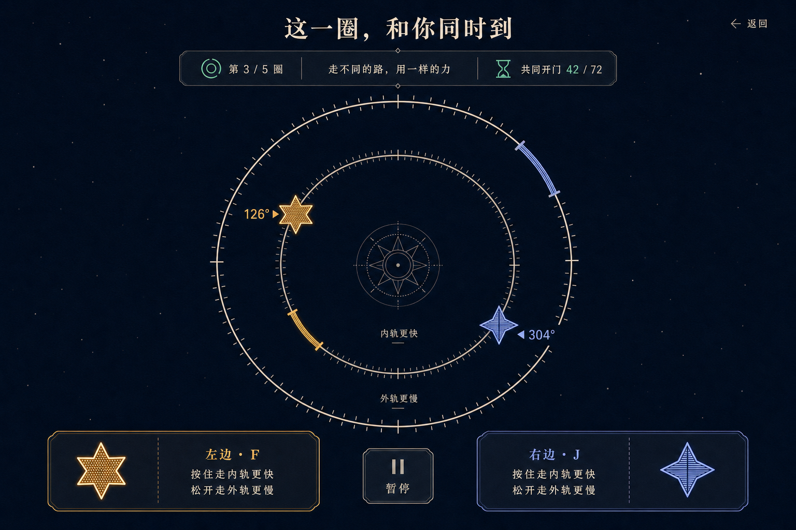
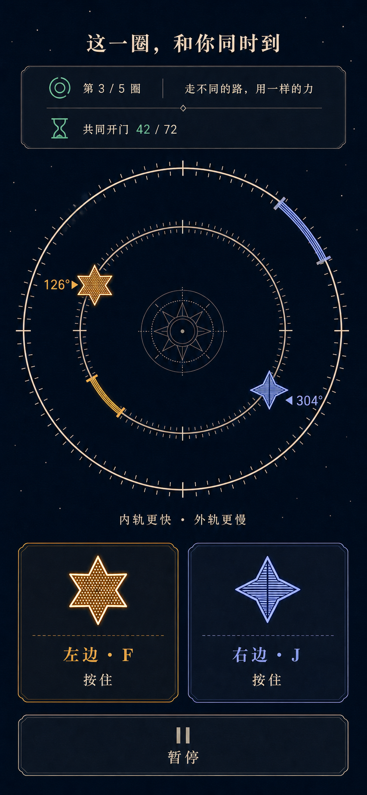

# `twin-orbit` 视觉方案提案

> 状态：等待用户确认
> 阶段：仅视觉方案，不含生产 HTML / CSS / JavaScript
> 内部项目 ID：`twin-orbit`
> 对外唯一标题：**这一圈，和你同时到**

## 0. 本阶段结论

本提案为双人同设备合作游戏冻结一套可实现、可验证、无外部运行依赖的视觉语言：

- 视觉方向：**午夜双环刻度盘**；
- 交互核心：两位玩家在同一个离散双环上规划路径，在同一逻辑 tick 穿过各自门位；
- 信息层级：共同目标优先，左右席位等权，个人状态清楚但不制造输赢关系；
- 生产边界：标题、规则、720 步几何、玩家位置、目标门、共同窗口、控件、焦点和全部状态均由原生 HTML / CSS / SVG / JavaScript 重建；
- 概念图用途：只用于确认构图、气质、色彩和信息层级，不作为规则真值或生产素材；
- 外部复制边界：没有使用第三方图片、商业素材、开源项目截图、品牌视觉或外部 UI 作为输入。

本阶段**没有**：

- 编写或修改游戏生产代码；
- 修改目录页或项目入口；
- 将项目标记为已安装；
- 复制任何外部开源项目的代码或视觉资产；
- 将概念 PNG 接入生产页面。

只有在用户明确确认本提案后，才进入生产 UI 实现。

---

## 1. 方案一句话

两颗形状、纹理和颜色都不同但视觉权重完全相同的抽象星标，共享一枚精密的双环刻度盘；玩家通过左右两个等权“按住”控制区，在内轨快速、外轨慢速之间规划，争取在同一个离散时刻抵达各自门位。

这不是太空射击、节奏打击或竞速排行榜，而是一张由两个人共同解开的动态刻度盘。

---

## 2. 概念资产

### 2.1 桌面 playing 状态



| 字段 | 记录 |
|---|---|
| 仓库路径 | `docs/assets/twin-orbit-desktop-playing-concept.png` |
| 原始尺寸 | 1536 × 1024 px |
| 色彩模式 | RGB |
| SHA256 | `7f3da887cffc664ab5c332510e0b460dac4cf65a341460dd786e225752507df9` |
| 生成来源 | Codex 内置 `image_gen`，`ui-mockup` 用例 |
| 外部输入 | 无 |
| 用途 | 桌面构图、视觉语言与信息层级提案 |

### 2.2 移动端 playing 状态



| 字段 | 记录 |
|---|---|
| 仓库路径 | `docs/assets/twin-orbit-mobile-playing-concept.png` |
| 原始尺寸 | 853 × 1844 px |
| 色彩模式 | RGB |
| SHA256 | `72954afaedebba84a83426eb7ea942214c47d06c58dd71989cdf8b7bce924fcf` |
| 生成来源 | Codex 内置 `image_gen`，`ui-mockup` 用例 |
| 输入 | 仅使用本次内部生成的桌面概念图作为风格与组件系统参考 |
| 外部输入 | 无 |
| 用途 | 窄屏重排、双人等权控制区与纵向密度提案 |

### 2.3 生成会话记录

- 生成目录：`/Users/zenith/.codex/generated_images/019f97bc-3964-7f50-a328-01764b681a97/`
- 桌面原始文件：`call_EtSerCl6YXDKoiXbw7UnUWlt.png`
- 移动端原始文件：`call_Smb3qKk4TupkIfEV3kErfFBy.png`
- 工具未暴露可记录的模型名、种子或内部采样参数，因此本提案不虚构这些字段。

---

## 3. 精确生成提示词

### 3.1 桌面概念提示词

```text
Use case: ui-mockup
Asset type: desktop web game full playing-state screen concept, design reference only
Primary request: Create a polished, shippable-looking desktop UI concept for a local same-device two-player cooperative orbit timing game. The public Chinese title is exactly “这一圈，和你同时到”. Show the entire playing screen, not a hero section. Two players each control one abstract star moving clockwise around the same center on either an inner faster ring or outer slower ring. Each player has a different target gate at a different angle and required ring. Both stars must cross their own gate on the same logical tick. The screen must communicate cumulative phase planning, not a reflex rhythm game.
Scene/backdrop: deep ink-indigo night-paper surface with very subtle code-recreatable grain and sparse pinprick stars; no outer-space photography
Style/medium: realistic senior product-design UI mockup, practical static HTML/CSS/SVG implementation, clean editorial celestial instrument, airy, restrained, 7/10 creativity, not cinematic concept art
Composition/framing: 1536x1024 landscape viewport, full browser content without browser chrome. Quiet top header with one public title and a small return link. A compact centered shared status rail below shows current gate, gate title, and one common opening timeline. Main focal area is one large shared circular stage: two clearly separated concentric rings, fine discrete tick notches around the full circumference, two equally prominent abstract player-star markers, two target gate arcs at distinct angles and distinct radii, clockwise direction cues, exact integer angle labels near each player, and clear inner-fast / outer-slow labels. The common opening timeline must be visually obvious but must not look like the buttons themselves are the timing window. Bottom area has two equal-width native-looking press-and-hold control zones side by side, left and right, plus one small neutral pause action. Keep all primary content visible in the viewport.
Visual direction: deep indigo #090b1d background, moonstone text #f5f0df, left identity warm amber #f2b84b using a six-point rosette with dot texture, right identity cool periwinkle #8ea7ff using a four-point kite-star with stripe texture, shared opening state restrained mint #69d5bd. Hairline ivory orbit ticks, matte surfaces, almost no glow, no glassmorphism, no neon arcade look. Both seats have exactly equal size, weight, contrast, and control area.
Text (verbatim, minimal): “这一圈，和你同时到”; “第 3 / 5 圈”; “走不同的路，用一样的力”; “共同开门 42 / 72”; “左边 · F”; “右边 · J”; “按住走内轨更快”; “松开走外轨更慢”; “暂停”.
Constraints: real title, labels, controls, star positions, 720-step geometry, target gates, progress, focus, and state will be code-native later; this image is only a visual proposal. No English product name. No rockets, spacecraft, planets, meteors, shooting, survival HUD, leaderboard, score, combo, lives, winner, account, settings, navigation dashboard, hero eyebrow, kicker, badges, decorative pills, card grid, external logos, trademarks, watermark, romantic heart clichés, or gendered styling. Do not show a solution path or future gates. Do not make one player larger or more central. Use clear outline SVG-like icons rather than text glyph icons. Strong accessible contrast and implementation-feasible geometry.
```

### 3.2 移动端概念提示词

```text
Use case: ui-mockup
Asset type: mobile web game full playing-state screen concept, responsive counterpart to Image 1
Input images: Image 1 is the internally generated desktop concept and is a style/component-system reference only, not an edit target and not a source of rule truth
Primary request: Create the portrait 390x844 responsive playing screen for the same local two-player cooperative orbit timing game with the exact public Chinese title “这一圈，和你同时到”. Preserve Image 1’s deep ink-indigo night-paper world, moonstone typography, amber six-point rosette left identity, periwinkle four-point kite-star right identity, mint shared opening state, fine ivory orbit ticks, matte surfaces, and restrained editorial celestial-instrument character. Reflow for a real narrow phone viewport rather than shrinking desktop. Both players remain simultaneous and equally prominent.
Composition/framing: portrait mobile viewport only, no phone device frame. Compact title at top, then a two-line open shared status rail showing current gate, gate title, and common opening progress. Main focal area is one large shared circular stage containing two clearly separated concentric rings, discrete tick notches, both abstract stars, both target gate arcs at their correct distinct radii, clockwise cues, and compact integer angle labels. Below the circle, show inner-fast and outer-slow as one concise legend. Bottom area has two equal-width press-and-hold native-looking control zones side by side, each at least visually 56px high, with left and right identity, F/J key hint, pressed meaning, and shape/texture redundancy. One small neutral full-width pause action sits beneath them. Keep title, shared status, the complete double ring, both controls, and pause visible without horizontal scrolling; use the 844px height efficiently with no large empty bands.
Text (verbatim, minimal): “这一圈，和你同时到”; “第 3 / 5 圈”; “走不同的路，用一样的力”; “共同开门 42 / 72”; “内轨更快 · 外轨更慢”; “左边 · F”; “右边 · J”; “按住”; “暂停”.
Constraints: real text, controls, 720-step geometry, target positions, progress, state, focus, and responsive sizing will be code-native later; this is only a visual proposal. No English product name. No rockets, spacecraft, planets, meteors, shooting, survival HUD, leaderboard, score, combo, lives, winner, account, settings, hero eyebrow, badges, decorative pills, card grid, logos, trademarks, watermark, hearts, or gendered styling. Do not stack one player control below the other. Do not make touch targets tiny. Do not hide either target gate or either star. No solution path or future gates. Practical static HTML/CSS/SVG implementation, strong accessible contrast, no excessive glow or glassmorphism.
```

---

## 4. 视觉系统冻结

### 4.1 方向名：午夜双环刻度盘

关键词：

- 精密而不冰冷；
- 合作而不黏腻；
- 夜色而不科幻；
- 离散而不机械；
- 克制而不空洞。

页面像一枚两个人共同校准的夜间仪器。星只是身份标记，不是飞船；圆环是可读的离散状态空间，不是宇宙场景；门位是几何目标，不是敌人或障碍。

### 4.2 色彩 token

| Token | 值 | 用途 |
|---|---:|---|
| `--ink-950` | `#090B1D` | 页面主背景 |
| `--ink-900` | `#0D1329` | 状态轨、控制区底面 |
| `--ink-800` | `#151D36` | 分区与按压态底面 |
| `--moon-100` | `#F5F0DF` | 主文本、轨道主线 |
| `--moon-300` | `#C9C3B5` | 次要文本、未激活刻度 |
| `--left-400` | `#F2B84B` | 左席位颜色 |
| `--right-400` | `#8EA7FF` | 右席位颜色 |
| `--shared-400` | `#69D5BD` | 共同窗口、共同成功 |
| `--danger-400` | `#E58A87` | 重试提示，仅用于共同状态 |
| `--focus` | `#FFFFFF` | 高对比焦点外环 |

规则：

- 左右身份色不得交换、混合成梯度或用“粉/蓝”性别化解释；
- 共同状态只能使用共享薄荷色或中性色，不能偏向任何一方；
- 颜色不是唯一编码：左侧同时使用六角花星 + 点纹，右侧使用四角风筝星 + 横纹；
- 发光只允许 1 层低强度外晕，用于从背景中分离玩家标记；禁止霓虹光柱和高饱和辉光。

### 4.3 字体与数字

- 展示标题：本机可用的中文宋体优先，回退到系统衬线字体；
- 正文和控件：系统无衬线字体；
- 角度、tick 和关卡数字：等宽数字特性 `font-variant-numeric: tabular-nums`；
- 不加载网络字体；
- 标题只出现一次，不添加英文副标题、眉题或品牌口号。

建议字号：

| 内容 | 桌面 | 390px | 320px |
|---|---:|---:|---:|
| 标题 | 32–38px | 23–27px | 20–23px |
| 共享状态主行 | 18px | 15px | 14px |
| 角度读数 | 18px | 14px | 13px |
| 控制区身份 | 18px | 16px | 15px |
| 正文/辅助 | 14–16px | 13–14px | 13px |

### 4.4 线、面与形状

- 页面背景为纯 CSS 多层径向渐变与极少量固定星点；不使用图片纹理；
- 面板为不透明或近乎不透明的深靛面，不使用玻璃拟态；
- 轨道主线 1–1.5px，门位 4–6px，玩家轮廓 2px；
- 面板圆角 14–18px；按钮圆角 12–16px；
- 阴影只用于层级分离，不模拟漂浮卡片；
- 图标使用内联 SVG，必须带文本名称或 `aria-hidden` 后由相邻文字命名。

---

## 5. 720 离散环的可视化规则

### 5.1 规则真值

生产状态空间保持 `0…719` 共 720 个整数步：

- 1 步 = 0.5°；
- 外轨松开 = 每 tick 前进 2 步；
- 内轨按住 = 每 tick 前进 3 步；
- 更新频率 = 30Hz；
- 玩家角度与目标门位全部来自既有配置和状态，不从概念图抄数值。

DOM / SVG 不绘制 720 个独立可交互节点。推荐：

- 72 个细刻度，每格代表 10 步 / 5°；
- 12 个主刻度，每格代表 60 步 / 30°；
- 由 `angleStep * 0.5deg` 计算玩家、门位和方向；
- 屏幕文本始终显示精确整数步或按既有文案显示精确角度，不让装饰刻度替代数值；
- SVG 几何只承担视觉表达，逻辑命中仍由核心计算。

### 5.2 双环

- 内轨与外轨的半径差在所有尺寸下保持足够容纳标记与门位；
- 内轨标记“更快”，外轨标记“更慢”；
- 当前玩家在哪条轨道，由半径位置 + 控制区按压态 + 屏幕阅读器状态共同表达；
- 不用近/远、领先/落后来命名轨道；
- 顺时针方向在圆环两处以内联箭头标出，避免装饰性箭头泛滥。

### 5.3 玩家标记

左席位：

- 暖琥珀；
- 六角花星；
- 内部点阵；
- 文本名称始终为“左边”。

右席位：

- 冷长春花蓝；
- 四角风筝星；
- 内部横纹；
- 文本名称始终为“右边”。

两者：

- 相同包围盒尺寸；
- 相同轮廓粗细；
- 相同外晕强度；
- 相同角度标签距离；
- 不因先后或成败放大任何一方。

### 5.4 门位

- 门位是贴合目标轨道半径的短弧，不跨越另一条轨道；
- 左门沿用左色，并增加双端短横线；
- 右门沿用右色，并增加斜纹或虚实交替；
- 当前门位可见，未来门位不可见；
- 开门窗口不直接闪烁门位，以免被误解为反应时机；
- 命中反馈是共同状态，两个门位同步切换到共享薄荷色。

### 5.5 共同窗口

“共同开门 42 / 72”位于圆环之外的共享状态轨：

- 使用一条线性进度线和精确数字；
- 与左右控制区保持明显空间距离；
- 不让控制区变色来代表剩余窗口；
- 不使用节拍器、音游判定线或倒计时爆闪；
- 窗口关闭后的重试属于共同结果，不显示谁早到或谁晚到。

---

## 6. 页面结构

生产页面按以下语义顺序组织：

1. 跳转到主要内容的链接；
2. 页面标题与返回项目列表；
3. 共同状态轨；
4. 双环主舞台；
5. 轨道速度图例；
6. 左右等权控制区；
7. 暂停 / 继续；
8. 当前阶段说明和操作；
9. 礼貌级 live region。

视觉顺序与 DOM 顺序一致，不通过大幅 `order` 重排造成键盘和视觉阅读顺序分裂。

### 6.1 页头

- 只显示“这一圈，和你同时到”；
- 返回入口低调但始终可见；
- 不显示内部 ID；
- 不显示分类 badge、版本、分数或玩家头像。

### 6.2 共享状态轨

最多包含：

- `第 n / 5 圈`；
- 当前关卡标题；
- `共同开门 current / openTick` 或既有状态文案；
- 五个等宽进度刻度。

五个进度刻度只表达“已完成 / 当前 / 未到达”，不显示未来题目的角度和解法。

### 6.3 双环主舞台

- 是页面唯一视觉主角；
- 两位玩家共享同一个中心；
- 舞台不能拆成左右两张个人卡；
- 中心装饰只保留简单罗盘花，不抢占规则信息；
- 精确角度标签紧邻各自玩家，但通过避让逻辑防止重叠。

### 6.4 控制区

- 使用真实 `<button>`；
- 两个按住区并排且等宽；
- 桌面支持 F / J，触屏支持 pointer hold；
- 按下态通过底色、边框、标记位移三重变化表达；
- `pointercancel`、`pointerup`、失焦、页面隐藏和暂停必须释放；
- 触控区最小 48 × 48 CSS px，目标为 56px 高以上；
- 不把键帽做成装饰 pill；F / J 是辅助提示，不是唯一名称。

### 6.5 暂停

- 是独立的中性按钮；
- 不属于左或右席位；
- Escape、页面失焦、隐藏、`pagehide`、长帧触发的保护性暂停，统一回到当前关卡介绍；
- 暂停后不保留按住状态；
- 完成态不因失焦倒退。

---

## 7. 五关呈现

五关保持同一套布局、颜色和控件，只更换配置驱动的关卡标题、开门时刻、初始位置、目标门位和目标轨道。

| 关 | 标题 | 开门 tick | 视觉重点 |
|---:|---|---:|---|
| 1 | 第一次会合 | 60 | 解释两条轨道的速度差 |
| 2 | 交换领先 | 60 | 强调“当前角度不等于最终结果” |
| 3 | 同样次数 | 72 | 强调两位使用相同的按压力度总量 |
| 4 | 左边走远路 | 84 | 长路线仍由共同目标统领 |
| 5 | 右边走远路 | 84 | 与上一关镜像但不改变席位权重 |

冻结原则：

- 不为每一关换主题色、背景或玩家形状；
- 不显示“难度”“星级”“最佳成绩”；
- 不提前显示下一关目标；
- 完成一关只推进共同进度；
- 重试不指出责任方。

---

## 8. 全状态视觉契约

### 8.1 `intro`

显示：

- 唯一标题；
- 一句合作目标；
- 双环静态示意；
- F / J 与触控按住说明；
- “开始第一圈”主操作。

不显示：

- 第 1 关的完整目标角度；
- 自动播放；
- 闪动教学；
- 模拟排行榜。

### 8.2 `gate-intro`

显示：

- `第 n / 5 圈`；
- 当前关卡标题与配置允许的说明；
- 两位起点、各自目标门位、内外轨含义；
- “两边准备好”或既有开始操作。

此状态是主动开始点，也是暂停和保护性中断后的安全落点。

### 8.3 `playing`

显示：

- 实时共同 tick；
- 两位精确角度、轨道和目标；
- 当前唯一一组门位；
- 两个按压状态；
- 暂停。

隐藏：

- 解法；
- 未来门位；
- 个人成败判断；
- 分数和连击。

### 8.4 `gate-success`

- 两位标记与门位同时切换到共享薄荷色；
- 共享状态轨显示共同成功；
- 可有一次 180–240ms 的轻微线宽扩散；
- 不显示“左边成功 / 右边成功”；
- 提供“下一圈”。

### 8.5 `gate-retry`

- 双环保持当前最终快照，方便理解；
- 状态轨以共同重试色显示；
- 文案只描述“这次没有同时到”；
- 提供“再试一次”，回到该关介绍；
- 不显示相差 tick、早/晚归因或失败方。

### 8.6 `complete`

- 五个共同进度刻度全部完成；
- 两位标记保持等权；
- 显示共同完成文案；
- 提供“再走一遍”和“返回项目列表”；
- 不生成冠军、MVP、胜率或排行榜。

---

## 9. 响应式布局

### 9.1 桌面：1280px 及以上

- 内容最大宽度约 1180px；
- 顶部标题与返回入口同一行；
- 共享状态轨最大宽 760px；
- 双环直径 500–600px；
- 左右控制区组成同一行，单区最小宽 280px；
- 整个 playing 主操作尽量在常见 768–900px 高度内可见；
- 不靠缩小字体换取首屏。

### 9.2 中等宽度：768–1279px

- 双环直径使用 `min(58vw, 520px)`；
- 状态轨保持在舞台上方；
- 左右控制区仍并排；
- 辅助说明可换行，但两席位不得上下错位；
- 页面允许自然纵向滚动。

### 9.3 移动端：390 × 844

目标结构：

- 水平 gutter 12px；
- 紧凑页头；
- 两行共享状态轨；
- 双环直径约 350px；
- 一行速度图例；
- 两个等宽控制区并排，每个至少 56px 高；
- 暂停按钮独立占一行；
- 不出现横向滚动。

概念图证明的是重排方向，不证明 844px 首屏尺寸；生产实现必须用浏览器实测把标题、状态轨、完整双环、两个控制区和暂停纳入 844px 高度。

### 9.4 最窄支持：320px

- 水平 gutter 8px；
- 双环直径 `min(288px, calc(100vw - 32px))`；
- 共享状态轨拆成最多三行；
- 两个控制区仍并排，间距 6px；
- 单区有效点击宽约 147px、高至少 56px；
- 标记图形缩小但不低于 24px；
- 角度标签允许向圆心或圆外避让；
- 页面可以纵向滚动；
- 不隐藏任何玩家、门位、控制区或暂停；
- 不产生横向滚动。

### 9.5 200% 文字缩放

- 不使用固定像素高度裁切内容；
- 共享状态轨与控制区允许增高；
- 标题和关卡标题正常换行；
- 双环保持可读下限，不随文字无限缩小；
- 左右控制区仍并排；辅助语可以各自换成两行；
- 页面自然纵向滚动；
- `overflow: hidden` 只用于纯装饰，不用于文本容器。

### 9.6 400% 页面缩放

按约 320 CSS px 的窄屏布局处理：

- 单列信息流；
- 双环不超出视口；
- 左右按住区保持并排且可点击；
- 返回、暂停、开始、重试和下一圈均可键盘访问；
- 不依赖 hover 才出现信息；
- 所有文本和状态都能通过滚动到达。

---

## 10. 无障碍与输入

### 10.1 键盘

- F 控制左边，J 控制右边；
- 不拦截输入框中的按键；
- `keydown` 首次触发按下，忽略重复事件；
- `keyup` 释放；
- Escape 暂停并按核心安全语义回到关卡介绍；
- Tab 顺序与页面语义顺序一致；
- 焦点环至少 2px，并与玩家身份色之外再提供白色外环。

### 10.2 触控与鼠标

- 使用 Pointer Events 统一处理；
- 指针按下后设置 capture；
- `pointerup`、`pointercancel`、`lostpointercapture` 全部释放；
- 触摸不触发页面双击缩放式误操作；
- 控制区不能用纯 `div` 模拟；
- 多点触控允许两位同时按住，不让一个 pointer 覆盖另一个玩家状态。

### 10.3 屏幕阅读器

- 舞台提供简洁可读的状态摘要，不逐 tick 播报；
- 玩家状态以文本表达“左边，内轨，角度 n，目标 n”；
- 共同成功、重试、暂停和关卡切换写入 `aria-live="polite"`；
- 高频 tick 更新区域使用 `aria-live="off"`；
- 图形纹理不需要逐一命名；
- 开始、暂停、继续、重试、下一圈均使用明确按钮名称。

### 10.4 `prefers-reduced-motion`

开启后：

- 玩家位置每 tick 直接更新，不做角度补间；
- 取消轨迹拖尾；
- 取消门位呼吸、标记脉冲和成功扩散；
- 状态切换不使用大面积淡入；
- 逻辑 tick、速度、窗口和命中规则完全不变。

### 10.5 `forced-colors`

在强制颜色模式：

- 页面、文本和按钮使用系统色 `Canvas`、`CanvasText`、`ButtonFace`、`ButtonText`、`Highlight`；
- 不依赖背景图片或渐变；
- 左边保留六角花星 + 点纹；
- 右边保留四角风筝星 + 横纹；
- 左门保留双端横线；
- 右门保留虚实交替；
- 当前按住状态增加 3px 实线内框；
- 共同成功增加文本与粗外框；
- 设置 `forced-color-adjust` 时只限确有必要的小型 SVG，且必须验证对比度。

### 10.6 无 JavaScript与资产失败

- 无 JavaScript 时显示明确说明和返回入口，不呈现可误操作的假控制；
- 生产页面不依赖概念 PNG；
- 内联 SVG 失败时仍保留玩家文字、角度、轨道和目标文本；
- CSS 装饰失败不影响按钮、状态或规则可读性。

---

## 11. 运动与反馈

默认运动：

- 30Hz 是逻辑更新频率，不强制 CSS 以 30fps 跳动；
- 可在相邻逻辑角度间做最长约 90ms 的线性视觉补间；
- 补间只改善观感，不改变命中时刻；
- 玩家切换轨道使用 100–140ms 的径向移动；
- 按压反馈小于 80ms；
- 关卡成功只做一次克制的共同反馈。

禁止：

- 相机晃动；
- 粒子爆炸；
- 无限呼吸动画；
- 长尾轨迹导致位置误读；
- 用动画快慢替代精确状态；
- 在共同窗口结束时闪屏或制造倒计时焦虑。

---

## 12. 代码原生重建清单

以下内容必须由生产代码生成，不能从概念 PNG 裁切：

| 元素 | 重建方式 |
|---|---|
| 页面标题与全部文案 | 语义 HTML |
| 状态轨、五关进度 | HTML + CSS |
| 双环与刻度 | 内联 SVG 或 CSS/SVG 组合 |
| 720 步到角度映射 | JavaScript 状态 + SVG transform |
| 玩家星标 | 内联 SVG，左右形状/纹理固定 |
| 门位短弧 | 根据目标半径和角度计算的 SVG path |
| 共同窗口进度 | 原生 progress 语义或 ARIA 完整的 CSS 轨 |
| 左右控制区 | 原生 button |
| 键盘与 Pointer Events | JavaScript |
| 焦点、按下、暂停、成功、重试 | CSS 状态类 + 语义状态 |
| 背景纹理与星点 | CSS 渐变/伪元素 |
| 暂停图标、方向箭头 | 内联 SVG |

生产目录不需要新增位图或外部字体依赖。两张概念 PNG 只留在 `docs/assets/`，不进入项目运行路径。

---

## 13. 概念图幻觉与修正表

| 概念图表现 | 风险 | 生产修正 |
|---|---|---|
| 环上显示几十个刻度 | 不能证明 720 个离散步 | 用 72 个视觉细刻度 + 精确数值，逻辑仍为 720 步 |
| 示例角度 `126°`、`304°` | 未必对应任何冻结关卡 | 从当前状态计算，绝不硬编码概念数值 |
| 示例门位弧长和位置 | 不是命中窗口或关卡配置证据 | 从每关目标半径与目标角度生成 |
| 一位在内轨、一位在外轨 | 只是某一时刻快照 | 每位轨道随自身按压状态实时变化 |
| “共同开门 42 / 72” | 仅为构图示例 | 使用实际 tick 与当前关卡 openTick |
| 生成中文与图标 | 字形、字距、图标细节可能失真 | 使用原生文本与自绘内联 SVG |
| 桌面图中的微光、纹理 | 位图效果不可直接访问或复现 | 用克制 CSS 阴影与形状纹理重建 |
| 移动图是 853 × 1844 | 不等于 390 × 844 CSS viewport | 在真实 390 × 844 浏览器中重排和验收 |
| 移动图纵向较长 | 不能证明首屏可见性 | 压缩装饰间距，实测完整舞台和控制区 |
| 控制区看起来很大 | 不能证明 CSS 点击尺寸 | 实测最小 48px、目标 56px |
| 颜色区分明显 | 不能证明色觉或强制颜色可读 | 叠加形状、纹理、线型和文本 |
| 图中未展示全部阶段 | 无法证明状态完备 | 按第 8 节实现六种阶段 |
| 图中仅展示第 3 关 | 无法证明五关一致性 | 配置驱动五关，布局不随关卡漂移 |

概念图中任何像素都不能覆盖核心规则、配置、测试或无障碍语义。

---

## 14. 文案边界

生产实现优先复用已冻结配置与核心文案。视觉层允许的短标签仅用于解释输入和当前状态，例如：

- `这一圈，和你同时到`
- `第 n / 5 圈`
- 当前关卡标题
- `共同开门`
- `左边 · F`
- `右边 · J`
- `按住走内轨更快`
- `松开走外轨更慢`
- `内轨更快 · 外轨更慢`
- `暂停`
- `继续`
- `再试一次`
- `下一圈`
- `再走一遍`
- `返回项目列表`

最终措辞以既有配置和实现前文案核对为准。本提案不增加英文产品名、营销副标题、输赢词、浪漫称谓或性别化角色。

---

## 15. 借鉴与生成声明

### 15.1 开源借鉴

核心研究阶段记录过对内部高层机制参考 `orbit-star-race` 的观察：只借鉴“离散半径可选择角速度”这一抽象机制。

本视觉提案：

- 没有查看或输入该项目的截图；
- 没有复制其布局、配色、图标、动画或素材；
- 没有复制其代码；
- 没有把其名称用于公开 UI；
- 不把高层机制参考描述成视觉来源。

直接外部开源视觉参考数量：**0**。

### 15.2 生成式内容

- 两张概念图均由 Codex 内置 `image_gen` 生成；
- 桌面图没有参考图片；
- 移动图只参考本次内部生成的桌面图，以维持同一组件系统；
- 未输入第三方、商业、开源或私人图片；
- 概念图不会进入生产运行路径；
- 生产视觉将由代码原生重建，避免位图文字、错误几何和生成幻觉成为产品事实。

### 15.3 零外部复制边界

允许：

- 通用 UI 原则；
- 几何圆环、刻度、抽象星形等公共视觉语汇；
- CSS / SVG 原生重建；
- 内部生成概念之间的风格延续。

不允许：

- 临摹第三方完整页面；
- 裁切或描摹第三方图标；
- 下载网络字体、图片或音效后本地打包；
- 复制开源仓库实现片段而不记录；
- 将 AI 概念图直接当作规则图层。

若后续实现阶段新增任何开源参考或直接借用，必须在项目归属声明和对应文档中补充：

- 项目名与 URL；
- 许可证；
- 借鉴范围；
- 实际修改；
- 未借用范围。

---

## 16. 实现前冻结检查表

只有用户确认后，生产实现才可开始。届时应逐项满足：

- [ ] 对外只显示“这一圈，和你同时到”
- [ ] 双环、720 步映射、玩家和门位全部代码原生
- [ ] 左右席位尺寸、对比、控件面积完全等权
- [ ] 六角点纹与四角横纹在无色条件下仍可区分
- [ ] 当前关卡之外不泄露未来门位或解法
- [ ] 共同窗口与按住按钮在视觉上明确分离
- [ ] intro / gate-intro / playing / gate-success / gate-retry / complete 全覆盖
- [ ] F / J、Pointer Events、多点触控和取消释放全覆盖
- [ ] Escape、blur、hidden、pagehide、长帧按核心语义暂停
- [ ] 320px 无横向滚动
- [ ] 390 × 844 playing 关键操作可见
- [ ] 200% 文字缩放内容不裁切
- [ ] 400% 页面缩放全部内容可达
- [ ] reduced motion 不改变规则
- [ ] forced colors 不依赖颜色区分
- [ ] 无 JavaScript和 SVG 装饰失败有清楚降级
- [ ] 概念 PNG 不进入生产运行路径
- [ ] 如新增开源借鉴，补齐声明和许可证核对

---

## 17. 请求用户确认的内容

请用户确认以下四点：

1. 是否采用“午夜双环刻度盘”的整体气质；
2. 是否认可左边“暖琥珀六角点纹”、右边“冷蓝四角横纹”的等权身份系统；
3. 是否认可共同窗口位于圆环之外、与按住控制区明确分离；
4. 是否认可窄屏仍让左右控制区并排，不把任何一方放到下一行。

建议确认语句：

> 确认 `twin-orbit` 视觉提案，可以按 310 文档进入生产 UI 实现。

在收到这类明确确认之前，本项目保持“核心已验证、视觉待确认、未安装”的状态。
