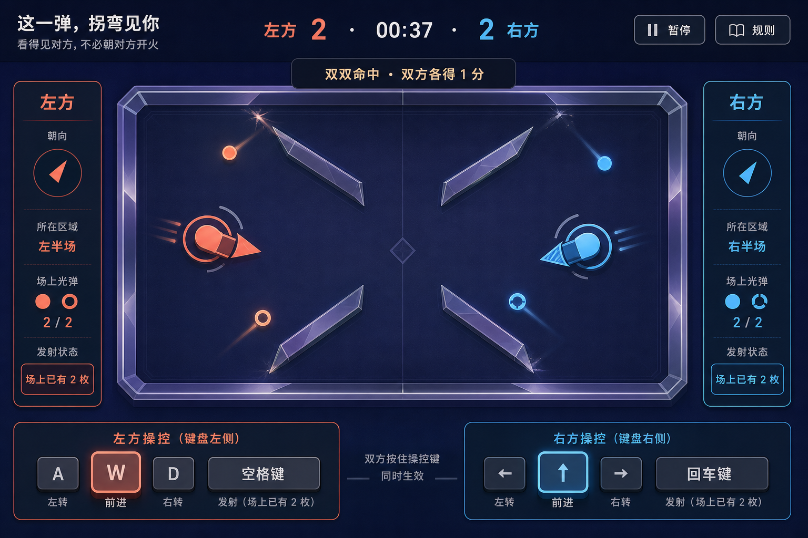
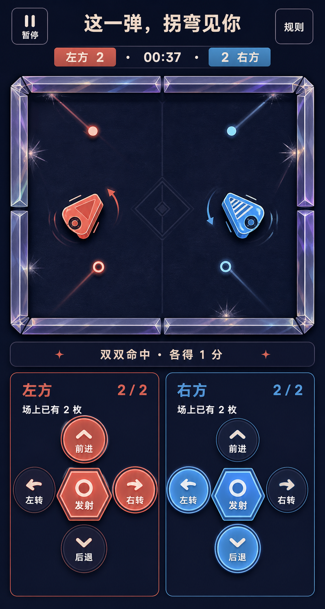

# 「这一弹，拐弯见你」视觉设计提案

## 1. 文档状态

- 内部项目 ID：`ricochet-tank-duel`
- 公开名称：**这一弹，拐弯见你**
- 分类 / 等级：`versus` / A
- 阶段：视觉提案，等待用户确认
- 设计日期：2026-07-25
- 基线：`main@5c3b645`
- 上游真值：
  - [`299-ricochet-tank-duel-research.md`](./299-ricochet-tank-duel-research.md)
  - [`300-ricochet-tank-duel-brainstorm.md`](./300-ricochet-tank-duel-brainstorm.md)
  - [`301-ricochet-tank-duel-spec.md`](./301-ricochet-tank-duel-spec.md)
  - [`302-ricochet-tank-duel-plan.md`](./302-ricochet-tank-duel-plan.md)
  - `experiences/versus/ricochet-tank-duel/js/constants.js`
  - `experiences/versus/ricochet-tank-duel/js/fixed.js`
  - `experiences/versus/ricochet-tank-duel/js/geometry.js`
  - `experiences/versus/ricochet-tank-duel/js/simulation.js`
  - 对应测试与 `ATTRIBUTION.md`

本文只冻结视觉方向、布局、组件、状态投影、响应式与后续 fidelity
验收合同。本文**不授权生产 UI 实现**，不修改生产 HTML、CSS、JavaScript、
catalog、Board、README 或共享索引，也不把项目标记为 installed。

用户明确确认本提案之前，生产 UI 必须停止。

## 2. 技能如何影响本提案

本轮完整读取并遵循：

- `frontend-app-builder`：要求先设计完整游戏表面，而不是只画标题或 hero；先把
  桌面、移动、状态、控件、响应式与无障碍边界冻结，再等待用户确认；真实 HUD、
  控件、比分和玩法状态必须 code-native。
- `imagegen`：两张图分别使用内置 ImageGen 独立生成；没有输入图片；生成结果先在
  原生尺寸下用 `view_image` 检查，再复制到项目；登记最终 prompt、生成源、尺寸、
  SHA-256 与概念幻觉。

两项技能都不能覆盖玩法规格。若概念图与 reducer、常量、测试或冻结文案冲突，
后者始终优先。

## 3. 概念资产

### 3.1 桌面 playing 概念



- 项目路径：`docs/assets/ricochet-tank-duel-desktop-concept.png`
- ImageGen 生成源：
  `{generated-image-root}/019f97bb-eca4-7e70-980f-59a91cfc27b4/call_RJJ2nBkabjvIeG6kyy2qQXHD.png`
- 尺寸：1536×1024 px
- 格式：PNG，无透明通道要求
- SHA-256：`4f86b702a5ffcdbed74dc62b6e1c209c5d155e9810a91d2ec7d5d1caf8015e48`
- 用途：桌面第一视口的层级、双席平衡、色彩、密度、赛场与状态轨关系参考

### 3.2 移动 playing 概念



- 项目路径：`docs/assets/ricochet-tank-duel-mobile-concept.png`
- ImageGen 生成源：
  `{generated-image-root}/019f97bb-eca4-7e70-980f-59a91cfc27b4/call_pS3524zm1N9As1tY7pNZhfAC.png`
- 尺寸：916×1717 px
- 格式：PNG，无透明通道要求
- SHA-256：`5a9aac9a1f4281e7a9a08f227f838a076f9e352db93f02c2b273c5b2ed4f58bf`
- 用途：320 px 窄屏意图、双方五键控制、触控目标与纵向重排参考

### 3.3 检查结果

两张项目内副本的 SHA-256 与对应生成源完全一致，均已用 `view_image` 按原生尺寸
检查。它们适合作为视觉讨论稿，但还不是被用户接受的生产规格。

## 4. 核心视觉方向：夜色折光桌游

页面是一张两个人面对面操作的发光桌游，而不是军事射击游戏：

- 背景是冷调深靛哑光桌面；
- 左方使用珊瑚橙，右方使用湖蓝；
- 折光车由圆角胶囊、轮廓环、方向楔和席位文字构成；
- 墙面是低饱和、半透明的棱镜板；
- 光点高对比，但只保留克制的短方向刻线；
- 反射用接触刻痕表达，不画完整预测路线；
- 命中使用静态裂光、轮廓和文字，不使用爆炸、火焰或震屏；
- 页面采用“开放赛场 + 两条状态轨 + 双席控制带”，不做默认卡片网格。

创造力目标约 7/10：有明确的折光桌游身份，同时可由静态 HTML、CSS、Canvas
和小型内联 SVG 忠实重建。

## 5. 五项核心机制的视觉可读性

### 5.1 实时移动

- 折光车的车身方向楔必须与逻辑 `heading` 一致；
- 普通模式可用两至三条短位移刻线表示当前移动；
- 不使用长拖影或模糊来掩盖逻辑位置；
- reduced-motion 下移除位移刻线，保留车体位置、朝向和静态轮廓。

### 5.2 双方同刻输入

- 左右控制区尺寸、对比度、目标面积和 DOM 优先级相等；
- 两侧按钮可在同一帧同时显示 `pressed`；
- 键盘与多指触控映射到同一输入位，不在视觉上暗示轮流操作；
- 页面中央不放偏向任一方的主发射按钮。

### 5.3 多枚在途光点

- 最多显示四枚光点，每方最多两枚；
- 左方使用实心圆点与短实线刻线；
- 右方使用空心 / 带缺口圆点与短条纹刻线；
- 所属不只靠珊瑚 / 湖蓝颜色；
- 状态轨同时显示 `0 / 2`、`1 / 2` 或 `2 / 2`；
- “场上已有 2 枚”是禁用原因，不是装饰徽章。

### 5.4 最多三次反射

- 墙面接触位置可保留小型静态裂光刻痕；
- 刻痕来自 renderer 的固定长度环形缓冲，不反向参与物理；
- 不画全程预测线；
- 第四次反射接触销毁只进入调试事件，普通 UI 不显示技术原因；
- 概念图中的刻痕数量与路径不是物理证据。

### 5.5 同刻原子命中

- `round-result` 明确区分“左方命中”“右方命中”“双双命中”；
- 双双命中时同一事件带同时更新双方分数，不能先后动画；
- 文案使用“双方各得 1 分”，不以颜色闪烁作为唯一反馈；
- 结果由 `simulation.js` 的 `hitSet` 和比分派生，renderer 不推断胜负；
- 概念图的 “双双命中 · 双方各得 1 分” 只示范低频反馈位置。

## 6. 桌面布局合同

建议适配 1280×720 及以上的首屏结构：

1. 安静的顶栏：
   - 左侧公开标题和一句玩法说明；
   - 中央比分与 `mm:ss`；
   - 右侧只有“暂停”“规则”；
2. 主区：
   - 中央 16:10 Canvas 是唯一主角；
   - 左右各一条等宽状态轨；
   - 状态轨写朝向、九宫位置、在途数、冷却与来弹；
3. 赛场下方：
   - 左右控制说明保持对称；
   - 键盘提示与触屏按钮属于同一组件的不同输入提示；
4. 低频事件：
   - 放在赛场边缘的单一状态带；
   - 不覆盖车辆、弹体、通道或中央窗口。

容器纪律：

- 赛场只保留一个主边框；
- 状态轨可有细线边界，不再嵌套卡片；
- 控制区是开放带，不把每个按键套进额外面板；
- 不增加排行榜、模式选择、装备栏、成就或假数据。

## 7. 移动与 320 px 合同

移动稿表达的是布局意图，不是按 916 px 像素缩放生产页面。

### 7.1 320 px 首屏优先级

从上到下：

1. 单行标题工具栏；
2. 双方比分、剩余时间、暂停；
3. 16:10 赛场；
4. 一行低频事件；
5. 左右等宽控制区。

规则入口可以留在工具栏；详细状态投影允许在控制区后继续自然文档流，但比分、
时间、赛场、暂停和双方核心控制不得被规则说明挤出第一游戏视口。

### 7.2 双席控制

每席恰好五个可见文字按钮：

- 前进；
- 后退；
- 左转；
- 右转；
- 发射。

两席均使用十字形布局，按钮最小目标为 44×44 CSS px，按钮间至少 8 px。左右区
视觉权重、面积和距屏幕边缘的安全间隔必须相等。允许一方键盘、另一方触控，也
允许两侧多指同时按下。

### 7.3 横竖屏

- 不强制锁定方向；
- 窄竖屏采用本节结构；
- 横屏可把状态轨收为赛场两侧，把控制区放在赛场下方；
- 画布只按 CSS 缩放，逻辑世界始终 960×600；
- 页面不能出现横向整体滚动。

## 8. 响应式与无障碍

### 8.1 200% 文本

- 所有 HUD 和控件文字使用显式 `rem` / token，不锁死高度；
- 状态轨字段允许一列重排和换行；
- 分数、计时、暂停与控制按钮不能被截断；
- 画布可以缩小，但不得覆盖文本；
- 最小按钮尺寸随文字增长，不以 `overflow: hidden` 裁字。

### 8.2 400% 缩放

以 1280 CSS px 宽页面缩放到等效 320 px 验收：

- 标题工具栏、HUD、事件带和状态投影单列重排；
- 两个控制组仍可访问，优先保持等宽并排；若浏览器字体指标无法满足 44 px 目标，
  可上下堆叠，但不得删除、折叠或只保留一席；
- Canvas 属于二维游戏内容，可保持固定纵横比缩小；页面其他区域不得双向滚动；
- 暂停、规则、恢复与重开保持键盘可达。

### 8.3 forced-colors

生产实现必须用真实浏览器模式验证，不从本概念图推断：

- 背景、边框、按钮、焦点与文字使用系统颜色；
- 左方保留“左”文字、实心方向楔、实心光点；
- 右方保留“右”文字、条纹方向楔、空心 / 缺口光点；
- 墙体使用边框和图案，不能只依赖半透明颜色；
- disabled 按钮保留原因文字；
- 命中用静态边框 + 文案，不只变色。

### 8.4 reduced-motion

只减少装饰，不改变逻辑：

- 移除尾迹、闪白、震屏、脉冲、滑动转场和插值；
- 保留车辆与光点的必要位置变化；
- 保留方向楔、静态接触刻痕、命中轮廓和文字；
- 普通 / reduce 模式必须得到完全相同的逻辑哈希。

### 8.5 暂停、失焦与长帧

- `hidden`、`blur`、长帧或不变量异常对双方同时生效；
- 暂停层是中性、居中的同一层，不偏向任何席位；
- 暂停时清空持续输入并冻结光点、冷却和比赛时间；
- 恢复入口只有一个，恢复后完整显示 3、2、1；
- 暂停原因用文字呈现；
- 覆盖层不得遮住恢复按钮焦点或让底层控制仍可操作。

### 8.6 焦点与语义

- 所有按钮有至少 3 px 的高对比焦点环；
- Tab 不被拦截；
- 页面按钮聚焦时 Enter 不映射为右方发射；
- Canvas 外持续提供双方文本状态投影；
- `role="status"` 只播报倒计时、暂停、恢复、命中、比分和终局；
- 高频位置与朝向只做可见文本更新，不逐 tick 播报。

## 9. 设计令牌候选

用户确认后，以下 token 成为生产实现的首轮基线；概念到浏览器 fidelity 修复可以
微调数值，但不能自由改变色温和双席权重。

### 9.1 颜色

```css
:root {
  --duel-bg: #101426;
  --duel-bg-raised: #171c33;
  --duel-stage: #0b1022;
  --duel-surface: #1d2440;
  --duel-border: #59617d;
  --duel-prism: #8d91b4;

  --duel-text: #f7f2e8;
  --duel-muted: #b5bdd1;
  --duel-left: #ff765f;
  --duel-left-strong: #ff9a84;
  --duel-right: #55c7e8;
  --duel-right-strong: #8de4f5;
  --duel-focus: #ffe28a;
  --duel-error: #ffcf70;
  --duel-disabled: #7b8298;
}
```

颜色锁：

- 背景是冷调深靛，不是纯黑、奶油白或暖灰；
- 珊瑚与湖蓝必须具有相当的亮度和面积；
- 通用控制使用中性边框，不借某一席颜色；
- 大面积霓虹、模糊 bloom 和彩虹渐变禁止；
- 颜色永远不是唯一状态编码。

### 9.2 字体

零远程字体：

```css
--font-display:
  "PingFang SC", "Hiragino Sans GB", "Microsoft YaHei",
  system-ui, sans-serif;
--font-ui:
  -apple-system, BlinkMacSystemFont, "Segoe UI",
  "PingFang SC", "Hiragino Sans GB", "Microsoft YaHei", sans-serif;
--font-numeric:
  ui-monospace, "SFMono-Regular", Consolas, monospace;
```

| token | 桌面 | 390 px | 320 px | 用途 |
| --- | ---: | ---: | ---: | --- |
| `title` | 30 | 24 | 20 | 公开标题 |
| `score` | 36 | 27 | 23 | 双方比分 |
| `timer` | 28 | 23 | 20 | 剩余时间 |
| `player` | 22 | 18 | 17 | 席位 |
| `control` | 16 | 15 | 14 | 控件 |
| `body` | 15 | 14 | 14 | 状态与说明 |
| `caption` | 13 | 13 | 12 | 键位 / 限制 |

单位为 CSS px；控件必须显式应用字体 token，不依赖浏览器默认按钮字体。

### 9.3 间距、边框与形状

```css
--space-1: 4px;
--space-2: 8px;
--space-3: 12px;
--space-4: 16px;
--space-5: 24px;
--space-6: 32px;

--radius-control: 10px;
--radius-panel: 14px;
--border-hairline: 1px;
--border-control: 2px;
--border-focus: 3px;
```

- 赛场外框不超过 2 px；
- 棱镜墙的视觉外沿不得改变碰撞 AABB；
- 光点视觉直径可适度放大，但碰撞半径仍以常量为准；
- 按钮的 pressed 通过位移、边框与文字共同表达；
- 左方实心、右方条纹 / 空心图案必须在小尺寸下仍可辨认。

## 10. code-native 组件清单

后续生产实现应至少拆成以下职责，名称只是建议：

| 组件 | 真值来源 | 视觉职责 |
| --- | --- | --- |
| `GameHeader` | phase、scores、active ticks | 标题、比分、计时、暂停、规则 |
| `DuelCanvas` | constants + simulation state | 地图、车、光点、刻痕、静态命中反馈 |
| `PlayerStatus` × 2 | accessibility projection | 朝向、位置、在途数、冷却、来弹 |
| `ControlPad` × 2 | input source sets | 每席五键、pressed、disabled、焦点 |
| `EventStatus` | semantic events | 倒计时、暂停、命中、双命中、结果 |
| `RulesDialog` | 冻结规则文案 | 原生对话区域与焦点往返 |
| `PauseLayer` | pause reason | 中性覆盖、恢复、完整倒计时 |
| `MatchResult` | derived result | 最终比分、胜者 / 平局、再来一局 |

所有真实标题、分数、计时、按钮、状态和结果必须是 HTML 文本。Canvas 只负责赛场
图形；若 Canvas 被阻断，页面仍应显示规则、比分、阶段和操作限制。

## 11. 阶段视觉合同

### 11.1 `instructions`

- 只显示三条冻结规则；
- 显示双方键位与触屏等价入口；
- 单一“开始”按钮；
- 不提前显示活动光点、比赛比分或胜者。

### 11.2 `countdown`

- 赛场保留当前合法状态并冻结；
- 中央只显示 3、2、1、开始 / 继续；
- 控件 disabled 且解释“倒计时中”；
- 不用缩放脉冲作为唯一倒计时。

### 11.3 `playing`

- 本提案两张图主要描述此阶段；
- 双方可同时 pressed；
- 比分、时间、光点与冷却实时可见；
- 低频事件带不得伪装为当前 tick 的物理预测。

### 11.4 `round-result`

- 赛场无光点；
- 同时更新双方比分；
- 显示左方命中、右方命中或双双命中；
- 不提前显示终局，除非 reducer 已给出 pending result。

### 11.5 `paused`

- 赛场冻结且状态仍可读；
- 一层中性覆盖；
- 显示暂停原因、恢复与规则；
- 不允许底层操作穿透。

### 11.6 `match-result`

- 结果必须从最终比分派生；
- 展示最终比分、左方胜 / 右方胜 / 平局；
- 提供“再来一局”和“查看规则”；
- 不自动重开。

## 12. 可见文案锁

### 12.1 首屏允许

- `这一弹，拐弯见你`
- `看得见对方，不必朝对方开火`
- `左方`
- `右方`
- `暂停`
- `规则`
- `剩余时间`
- `开始`

不得把内部 ID 当品牌，不增加 A 级、versus、情侣游戏、电竞模式等 eyebrow、
badge 或营销标签。

### 12.2 状态与控制允许

- `前进`
- `后退`
- `左转`
- `右转`
- `发射`
- `可发射`
- `冷却中`
- `场上已有 2 枚`
- `车头贴墙，无法发射`
- `暂无来弹`
- `近`
- `中`
- `远`

### 12.3 低频事件允许

- `三`
- `二`
- `一`
- `开始`
- `比赛已暂停`
- `继续`
- `左方命中`
- `右方命中`
- `双双命中 · 双方各得 1 分`
- `左方胜`
- `右方胜`
- `平局`
- `状态异常，请重新开始`

概念图的任何不同字形、空格、标点、数字格式或临时标签都不是文字真值。

## 13. 概念幻觉台账

### 13.1 桌面稿

| 概念表现 | 冲突 / 不确定性 | 生产边界 |
| --- | --- | --- |
| 左方控制显示 A、W、D 和空格 | 缺少 S，发射键应为 F | 严格使用 W/S/A/D/F |
| 右方只显示左、上、右和回车 | 缺少向下键 | 严格使用四方向键 + Enter |
| 四块内部墙呈斜向菱形 | 与冻结 AABB 坐标不符 | 完全从 `constants.js` 绘制 |
| 车体像楔形飞行器 | 只可借鉴抽象、非军事气质 | 重建圆角胶囊 + 方向楔 |
| 反射火花与路径近似关联 | 不是 CCD 或反射数证据 | 只由真实接触事件创建刻痕 |
| 同屏显示 playing 动势和双命中带 | 可能被误读成同一 phase | 事件带标记为上一低频事件 |
| 暂停 / 规则带生成图标 | 图标几何未冻结 | 使用 code-native 文本与内联 SVG |

### 13.2 移动稿

| 概念表现 | 冲突 / 不确定性 | 生产边界 |
| --- | --- | --- |
| 916×1717 画布 | 不是 320 CSS px 浏览器截图 | 按 320 / 390 / 横屏真实验证 |
| 赛场主要只有外边界 | 缺失冻结四块内部墙 | 从常量绘制完整镜像地图 |
| 赛场接近正方形 | 逻辑画布必须是 16:10 | CSS 保持 960:600 |
| 车体更接近圆角三角 | 与规格的胶囊骨架不完全一致 | 只保留方向楔与实心 / 条纹编码 |
| 光点尾迹较长 | reduced-motion 不允许装饰尾迹 | normal 克制短刻线，reduce 全移除 |
| 控制区在高画布上很大 | 真实短屏可能超出首屏 | 以 320×568 和 390×844 做浏览器 Gate |
| 左右发射按钮样式不同但都像符号 | 符号不能替代 accessible name | 两者都保留可见“发射”文字 |

### 13.3 两图共同不可信的内容

- 车辆、墙、光点的像素位置；
- 反射次数和接触时刻；
- 弹体尾迹的历史路径；
- 当前 phase 与事件持续时间；
- 字体字形、字重与中文标点；
- 焦点、hover、pressed、disabled 的真实 DOM 状态；
- forced-colors、200% 文本与 400% 缩放效果；
- 指针 capture、并发输入、暂停和恢复语义。

这些必须分别由 constants、simulation、测试和真实浏览器证明。

## 14. code-native 重建边界

概念图只锁定：

- 冷调深靛的世界；
- 珊瑚 / 湖蓝双席；
- 棱镜墙与抽象折光车的材质性格；
- 桌面状态轨与移动双控制区的层级；
- 开放赛场、克制边框和静态裂光反馈；
- 两席绝对对称的视觉权重。

概念图绝不进入运行时：

- 不把整图设为页面或 Canvas 背景；
- 不裁切标题、按钮、车、光点、墙、计时器或图标；
- 不 OCR 文字进入生产代码；
- 不从像素反推地图、路径、碰撞、朝向、比分或倒计时；
- 不复制生成图的错误键位；
- 不把短尾迹作为物理轨迹；
- 不让 renderer 计算命中或胜负；
- 不让视觉大小改写碰撞半径。

生产图形边界：

- 墙、活动区、出生点：`constants.js`；
- 位置、朝向、弹体、计分、phase：`simulation.js`；
- 车辆、光点、刻痕、方向楔：Canvas 2D 原语；
- 页面、HUD、按钮、规则、状态：HTML / CSS；
- 图标：简洁内联 SVG 或 CSS 几何；
- 系统降级：媒体查询和真实 DOM，不使用生成图片替代。

## 15. 来源、借鉴与零复制声明

### 15.1 ImageGen 来源

- 两次调用均使用 Codex 内置 OpenAI ImageGen；
- use case 均为 `ui-mockup`；
- 没有输入图片、截图、开源项目界面或第三方素材；
- 没有使用 CLI fallback、透明背景处理、裁切、拼贴或图像编辑；
- 项目内 PNG 是生成结果的逐字节副本。

### 15.2 开源边界

本视觉提案没有参考或复制任何开源坦克游戏、商业游戏、物理引擎、地图、品牌、
图标、字体或素材。项目现有 `ATTRIBUTION.md` 中的论文与浏览器标准仅用于固定步长、
连续碰撞、确定性和暂停原理，不提供视觉风格或生产资产。

零复制边界：

- 未复制第三方代码；
- 未复制第三方地图和数值；
- 未复制第三方 UI 布局；
- 未复制第三方图片、图标、字体或品牌；
- 未把其他仓库截图作为 ImageGen 输入；
- 未把生成概念图作为运行时素材。

若后续实际参考任何开源项目，必须先登记固定 URL、commit / tag、许可证、版权人、
借鉴内容、未复制范围和必要源码声明，再允许进入生产实现。

## 16. 后续生产 Gate

只有用户明确确认视觉方向后，才能开始生产 UI。确认后仍需：

1. 从本提案提取设计系统与 allowed-copy 清单；
2. 先实现桌面 playing 的 code-native 第一视口；
3. 用 Browser / IAB 验证桌面、390 px、320 px 与横屏；
4. 验证键盘双方同刻输入与两侧多指；
5. 验证 `pointercancel`、lost capture、blur、hidden 和长帧暂停；
6. 验证 instructions、countdown、playing、round-result、paused、
   match-result 六态；
7. 验证 reduced-motion、forced-colors、200% 文本与 400% 缩放；
8. 同一次 QA 中用 `view_image` 对照获批概念和最新浏览器截图；
9. 建立至少五项 fidelity ledger；
10. 生产实现与文档分别提交，且不得提前修改 catalog 或 installed 状态。

## 17. 最终 ImageGen prompt

### 17.1 桌面稿

```text
Use case: ui-mockup
Asset type: complete desktop browser game screen visual design proposal, 3:2 landscape
Primary request: Design a polished, implementation-ready desktop UI concept for the local same-device two-player ricochet game publicly named exactly “这一弹，拐弯见你”. This is a luminous tabletop game, not a military tank game. Show the complete primary playing screen, not a hero image.
Purpose and audience: two equal-status people share one keyboard or touch screen and must instantly read simultaneous movement, ricochet paths, multiple live projectiles, score, time, pause and fair same-tick settlement.
Scene/backdrop: deep indigo matte tabletop; a centered 16:10 playfield with a strict left-right mirrored map, four translucent low-saturation prism walls, outer reflecting boundary, generous quiet margins.
Subject: two original abstract “折光车” made from rounded capsules, outline rings and direction wedges; left seat coral orange with a solid wedge and explicit “左方”; right seat lake blue with a striped wedge and explicit “右方”. Show both vehicles visibly moving/turning at the same time. Show exactly four live light-dot projectiles, two per player, with ownership encoded by both color and distinct solid-versus-ring/notched shapes. Use short restrained motion ticks only. Show up to three small reflection scars on walls behind selected projectiles so repeated ricochet is legible without drawing a full predictive trajectory. Include a low-frequency fair-settlement message “双双命中 · 双方各得 1 分” as previous-round/event feedback, not as an active physics rule overlay.
Structure: quiet top header with exact title “这一弹，拐弯见你” and one short line “看得见对方，不必朝对方开火”; centered score and timer “左方 2  ·  00:37  ·  2 右方”; compact pause and rules controls; playfield as dominant element; symmetric left/right visible status rails showing heading, zone, live projectile count and fire readiness; balanced bottom keyboard/touch control guidance for both seats. Controls must have text labels, not icon-only. No marketing sections.
Interaction cues: both left and right held controls visibly pressed in the same frame; clear focus ring example; fire disabled state can say “场上已有 2 枚”; pause/blur recovery is represented by a calm, equal neutral control in the header, not an alarming modal.
Style/medium: realistic senior product designer UI mockup; code-native game interface aesthetic; crisp vector-like geometry with subtle tactile translucent prism materials; clean, airy, distinctive, restrained 7/10 creativity; no excessive glow or bloom.
Color palette: background #101426 and #171C33; coral #FF765F; lake blue #55C7E8; prism gray-violet; warm white text; strong contrast. Color is never the only team indicator.
Typography: readable Chinese sans-serif, strong numeric score, deliberate control text, no tiny labels.
Implementation constraints: all true UI text, score, timer, controls, HUD, projectiles, vehicles, walls and game state must be reproducible code-native with HTML/CSS/Canvas; this bitmap is concept evidence only. Practical flat layout, reusable components, no nested card grid, no external logos or brands.
Accessibility/responsive cues: touch targets at least 44px, visible keyboard focus, reduced-motion compatible by relying on static outlines and wall scars, forced-colors compatible through shapes/labels, room for 200% text enlargement without overlap.
Text (verbatim where shown): “这一弹，拐弯见你”, “看得见对方，不必朝对方开火”, “左方”, “右方”, “暂停”, “规则”, “双双命中 · 双方各得 1 分”, “场上已有 2 枚”.
Avoid: internal ID ricochet-tank-duel anywhere; real tanks, guns, military camouflage, flags, explosions, fire, particle blasts, commercial-game imitation, pixel-art tank assets, fake charts, badges, pills, hero eyebrow, default card grid, predictive aim line, clutter, unreadable invented text, watermark.
```

### 17.2 移动稿

```text
Use case: ui-mockup
Asset type: complete 320px-wide mobile portrait browser game screen visual design proposal, 2:3 portrait
Primary request: Design a polished, implementation-ready mobile portrait UI concept for the same local two-player ricochet game publicly named exactly “这一弹，拐弯见你”. Show the complete primary playing surface and both players’ simultaneous multi-touch controls in one scroll-free first game view at 320 CSS px intent; not a marketing hero and not a desktop screenshot squeezed into a phone.
Purpose and audience: two equal-status people share one phone or small tablet in landscape or portrait fallback; both must be able to hold movement/turn and tap fire at the same time, read score/time, identify up to four projectiles and pause safely.
Scene/backdrop: deep indigo matte tabletop; compact centered 16:10 mirrored playfield near the top; four translucent prism walls; symmetric left/right activity zones.
Subject: two original abstract “折光车”, not military tanks. Left is coral with solid direction wedge plus “左方”; right is lake blue with striped direction wedge plus “右方”. Show both moving/turning simultaneously. Show exactly four live light-dot projectiles, two per side, identified by color plus solid-versus-ring/notched shapes. Show restrained static reflection scars at wall contacts, no full predictive trajectory. A compact low-frequency event line says “双双命中 · 各得 1 分”.
Structure: top title “这一弹，拐弯见你”; one compact score/timer row “左方 2  ·  00:37  ·  2 右方”; pause and rules as text buttons; playfield; below it two equal-width control zones side by side with mirrored visual weight. Each side must visibly include exactly five labeled controls: “前进”, “后退”, “左转”, “右转”, “发射”. Minimum target intent 44×44 CSS px with generous gaps. Put compact status text above each control group: heading, live projectiles “2 / 2”, and “场上已有 2 枚”. Keep both seats equally prominent and both active pressed states visible in the same frame.
Responsive/accessibility intent: work as a 320px reflow reference; text can grow to 200% without overlapping the playfield; controls use shapes and labels, not color alone; visible focus ring; no tiny gray text; no horizontal page overflow; the game canvas itself may preserve 16:10 aspect. At 400% zoom the eventual code-native document should stack status text while preserving access to both control groups. forced-colors must remain intelligible through outlines, labels, solid/striped team markers. reduced-motion removes trails but keeps positions, scars and static hit outline.
Style/medium: realistic senior product designer mobile game UI mockup, crisp vector-like code-native geometry, subtle tactile prism material, airy but compact, restrained 7/10 creativity, deliberate Chinese typography, no excessive glow.
Color palette: #101426 and #171C33; coral #FF765F; lake blue #55C7E8; prism gray-violet; warm white text; high contrast.
Implementation constraints: every title, HUD label, score, timer, status, vehicle, projectile, wall and control is intended for later HTML/CSS/Canvas reconstruction; the bitmap is a concept only. Reusable layout, no nested card grid, no external logo or brand.
Text (verbatim where shown): “这一弹，拐弯见你”, “左方”, “右方”, “暂停”, “规则”, “双双命中 · 各得 1 分”, “前进”, “后退”, “左转”, “右转”, “发射”, “场上已有 2 枚”.
Avoid: internal ID ricochet-tank-duel anywhere; real tanks, cannon imagery, guns, camouflage, flags, explosions, fire, commercial game imitation, external assets, hero eyebrow, badges, pills, predictive aim line, clipped controls, one player larger than the other, unreadable invented text, watermark.
```
