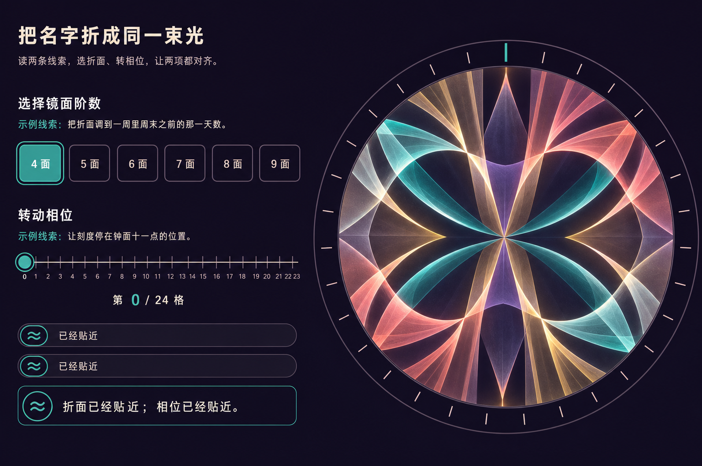
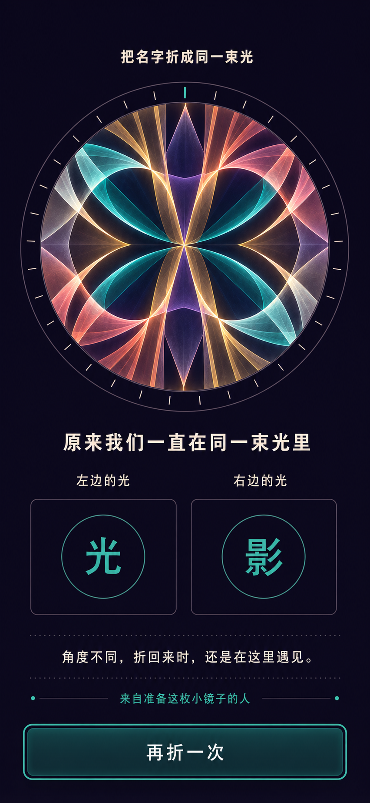

# “把名字折成同一束光”视觉设计提案

## 0. 文档状态

- 稳定工作 ID：`kaleidoscope-names`
- 主分类：单人惊喜
- 启动等级目标：A，真实 `file://` 直开
- 当前阶段：视觉提案，等待用户确认
- 当前安装状态：未安装
- 生产状态：已有纯逻辑、配置、测试与归因；没有生产 HTML/CSS/app
- 本阶段新增：
  - `docs/314-kaleidoscope-names-design-proposal.md`
  - `docs/assets/kaleidoscope-names-desktop-tuning-concept.png`
  - `docs/assets/kaleidoscope-names-mobile-complete-concept.png`
- 最终验收编号：保留 `315`，本阶段不得占用

本阶段明确不做：

- 不写或修改生产 `index.html`、`styles.css`、`app.js`；
- 不修改当前 `config.js`、`logic.js`、`logic.test.js`、`ATTRIBUTION.md`；
- 不修改 catalog、Board、README、门户、共享索引或精确计数；
- 不标记 installed；
- 不把概念 PNG 当作运行时 UI、Canvas 纹样或状态 Oracle；
- 不在用户确认前开始交互或视觉生产。

## 1. 先澄清“名字输入、双席、多轮”的边界

当前冻结规格不是“双人在页面里各填一个名字”的产品。

真实合同是：

1. 准备者在本地 `config.js` 中填写两条线索、两个目标值、两枚 marks 与结尾；
2. 体验者在页面中反复选择 `folds 4–9`、调整 `phase 0–23`；
3. 两项 exact 后进入 `aligned`；
4. 体验者仍需主动按“照见我们”；
5. 只有 `complete` 才创建两枚 mark 和结尾 DOM。

这是一个异步准备、单人体验的惊喜：准备者先离线完成配置，交给体验者后不参与
页面操作，也不需要同时在线。两枚 marks 表达两个人的关系，不代表两个实时玩家。

因此本提案对三个词作如下冻结。

### 1.1 名字输入

- 内容入口是准备阶段的 `config.js`；
- 运行页面不增加姓名输入框；
- 默认 marks 为 `光 / 影`；
- marks 允许相同；
- 每枚 mark 按当前逻辑限制为 1–2 个 Unicode code point；
- 源文件是本机明文，不宣称加密。

如果用户希望体验者在页面里现场输入名字，必须退回 research/spec，而不能由
设计稿偷偷增加表单。

### 1.2 双席对等

当前产品没有两个 player seat，也没有双人权限状态。

“对等”只用于 complete 中的两枚 mark：

- 左边的光与右边的光同尺寸；
- 同字级；
- 同对比；
- 同容器；
- 同间距；
- 同视觉权重；
- 即使 marks 完全相同，也靠位置标签区分；
- 不把任何一枚称为主角、作者或获胜者。

### 1.3 反复调校

体验者可以单人任意次数、任意顺序重复调整两个离散轴：

```text
SET_FOLDS ↔ SET_PHASE ↔ SET_FOLDS ↔ …
```

它不是：

- 关卡列表；
- 回合历史；
- 准备者与体验者同时在线；
- 双席轮流操作；
- 多幅作品图库；
- AI 批量生成；
- 进度条；
- 计时赛。

每次有效调整都从同一权威 selection 生成新的 pattern model。页面不保存历史
缩略图，也不显示“第几轮”。

## 2. 产品真值

### 2.1 唯一规则

```text
selectedFolds === targetFolds
&& selectedPhase === targetPhase
```

答案空间：

```text
folds ∈ [4, 9]
phaseStep ∈ [0, 23]
6 × 24 = 144
```

只有一组 exact。没有：

- 容差成功；
- 随机答案；
- 自动吸附；
- 方向提示；
- 分数；
- 用时；
- 尝试次数；
- 失败结局。

### 2.2 四 phase

```text
intro → tuning → aligned → complete
```

| Phase | 当前可见 | 必须不存在 |
| --- | --- | --- |
| intro | 公共标题、说明、开始按钮、无私人内容的图案 | 两条 hint、selection、target、marks、final |
| tuning | 两条 hint、六按钮、range、状态、pattern | target、marks、final、reveal、restart |
| aligned | solved selection、完整 pattern、照见我们 | marks、final、tuning 控件、restart |
| complete | final title、两个 marks、留言、署名、再折一次 | tuning 控件、reveal、进度/历史 |

任何“未来内容”都必须不存在，而不是：

- `display:none`；
- 透明；
- 模糊；
- 锁住；
- 预留空槽；
- 问号；
- CSS `content`；
- Canvas 轮廓；
- hidden template；
- `data-*`；
- ARIA 文本。

### 2.3 核心测试证据

本提案阶段重新运行：

```bash
node --check experiences/surprises/kaleidoscope-names/config.js
node --check experiences/surprises/kaleidoscope-names/logic.js
node --test experiences/surprises/kaleidoscope-names/logic.test.js
```

结果：

- 24 项测试通过；
- 0 项失败；
- 144 个 target 各自只有一组 aligned selection；
- intro/tuning/aligned 无私人 sentinel；
- complete 后公开；
- restart 后私人 public view 消失。

这只证明逻辑，不证明未来 DOM、Canvas、焦点、触控或响应式。

## 3. 视觉方向

### 3.1 方向名

**折光校准台**

页面像一枚放在暗色桌面上的小型光学仪器：

- 深墨紫是安静背景；
- 单枚大型圆形投影是视觉核心；
- teal、coral、amber、lavender 是四束折光；
- 控件像编辑精良的仪器刻度，但仍是原生按钮与 range；
- 状态靠文字和轮廓完整度，而不靠热/冷颜色；
- complete 让两个 marks 坐在同一束光的两个等权留白里；
- 没有品牌化万花筒玩具、镜头写实、摄影或第三方纹样。

### 3.2 体验目标

希望体验者感到：

- 自己正在校准，而不是等待动画；
- 两条线索确实影响两个不同轴；
- 每次选择都会得到新的稳定构图；
- “已经贴近”不会泄露方向；
- 对齐后先安静，再主动揭晓；
- 两枚 mark 同等重要；
- 完成后仍可以“再折一次”重走过程。

### 3.3 视觉非目标

不能做成：

- 静态海报；
- AI 图像生成器；
- prompt 输入页；
- 上传照片工具；
- 图库；
- 调色器；
- 仪表盘；
- 卡片网格；
- 单旋钮；
- 百分比进度；
- 粒子显字；
- 自动旋转屏保；
- 隐藏答案的验证码。

## 4. 概念资产登记

### 4.1 Desktop tuning

- 工作区路径：
  `docs/assets/kaleidoscope-names-desktop-tuning-concept.png`
- ImageGen 原始路径：
  `/Users/zenith/.codex/generated_images/019f97bc-7f53-75f0-b78a-713c7ee25a39/call_LDylgdYE93RplyaCgvI1Bj70.png`
- 生成方式：内置 `image_gen`
- 用例：`ui-mockup`
- 状态职责：`tuning`
- 原生尺寸：`1537 × 1023`
- Alpha：无
- SHA-256：
  `0aec37999626bb1b53f53ecfccf41023694c5184076daf32da9d2eba1b76b55b`
- 检查：
  - 生成源已 `view_image(detail="original")`；
  - 工作区副本已 `view_image(detail="original")`。



### 4.2 Mobile complete

- 工作区路径：
  `docs/assets/kaleidoscope-names-mobile-complete-concept.png`
- ImageGen 原始路径：
  `/Users/zenith/.codex/generated_images/019f97bc-7f53-75f0-b78a-713c7ee25a39/call_YYFYE6s3zsPGH9PYNJfdbpjF.png`
- 生成方式：内置 `image_gen`
- 输入引用：desktop tuning 仅作风格/组件参考
- 用例：`ui-mockup`
- 状态职责：`complete`
- 原生尺寸：`852 × 1846`
- Alpha：无
- SHA-256：
  `a82e54eafaa269cc20bfa4cd676989f63ddc452bf915d41b8d38e98ca425ab17`
- 检查：
  - 生成源已 `view_image(detail="original")`；
  - 工作区副本已 `view_image(detail="original")`。
- 限制：不是浏览器真实 `390×844 CSS px` 截图。



### 4.3 淘汰稿

本轮两张首轮生成均通过状态与视觉检查，没有产生淘汰 PNG。

| 状态 | 候选数 | 采用 | 淘汰 |
| --- | ---: | ---: | ---: |
| desktop tuning | 1 | 1 | 0 |
| mobile complete | 1 | 1 | 0 |

“无淘汰稿”不是省略记录。若后续根据用户意见迭代：

- 新版本使用 `-v2` 文件名；
- 旧图不覆盖；
- 记录源路径、尺寸、SHA、变化和淘汰原因；
- 只有用户明确接受的版本进入生产保真基线。

## 5. 精确生成 Prompt

### 5.1 Desktop tuning Prompt

```text
Use case: ui-mockup
Asset type: complete desktop tuning-state screen for a local-first interactive HTML surprise, polished production UI concept
Primary request: Design the full desktop TUNING phase for a Chinese interactive experience titled “把名字折成同一束光”. This is a deterministic hands-on kaleidoscope calibration, not a static poster and not an AI generator. The visitor repeatedly chooses one mirror-fold count from 4–9 and moves one native 0–23 phase range according to two written hints. This screenshot is before alignment and before reveal.
State and privacy truth: phase is exactly “tuning”. Show the public title, both public hints, the six fold buttons, the native-looking discrete phase range, current values, two non-directional status messages, one combined live status, and one large live kaleidoscope projection. ABSOLUTELY DO NOT show, hint at, reserve slots for, silhouette, blur, lock, mask, or otherwise imply the two private marks, final title, final message, or signature. No name input fields exist in this phase. No reveal or restart button.
Scene/backdrop: deep ink-plum matte background with a quiet table-of-light feeling, no scenic room and no photography.
Style/medium: realistic shippable web product UI mockup, crisp code-native vector/CSS/Canvas aesthetic, refined editorial instrument panel, airy asymmetry, not concept art, not glassmorphism, not a dashboard card grid.
Composition/framing: landscape desktop screenshot around 1504×1000. Small title and instruction at top. Main area uses an open two-column composition: left 40% is the calibration controls and status; right 60% is one large circular kaleidoscope projection. The controls are not nested cards. First control group: label and hint, then exactly six equal buttons “4 面” through “9 面”, with “4 面” visibly selected. Second group: label and hint, one horizontal discrete range from 0 to 23 with a prominent thumb at 0, and output “第 0 / 24 格”. Below, two compact status rows and the combined summary. Keep every control readable and practical.
Kaleidoscope visual: one circular projection built from exactly four mirrored wedge families because 4 is selected, using original abstract arcs, ribbons, and triangular light planes. It is visibly still being calibrated: elegant but not perfectly closed. Outer ring includes 24 restrained tick marks. No letters, names, faces, photos, logos, text, symbols, hearts, or hidden glyphs inside the projection.
Text (verbatim): “把名字折成同一束光”; “读两条线索，选折面、转相位，让两项都对齐。”; “选择镜面阶数”; “示例线索：把折面调到一周里周末之前的那一天数。”; “4 面”; “5 面”; “6 面”; “7 面”; “8 面”; “9 面”; “已经贴近”; “转动相位”; “示例线索：让刻度停在钟面十一点的位置。”; “第 0 / 24 格”; “已经贴近”; “折面已经贴近；相位已经贴近。”. Render no other copy.
Status language: “near” uses a double-line lozenge plus text, not color alone. The selected fold uses a strong outline and filled center; focus-visible is a separate bright double ring on one control. No directional hints, percentages, scores, timer, attempts, progress bar, success confetti, or answer reveal.
Color palette: #171326 ink plum, #F5F0E8 warm near-white, #53D6C5 teal light, #FF7B72 coral light, #F2C96D amber, #9B8CFF lavender, muted #756E86 borders. Rich but restrained, high contrast, no pure neon glow.
Typography: clear Chinese system sans-serif for UI; an elegant slightly rounded display weight for the title; no downloaded font look.
Constraints: practical HTML/CSS/Canvas implementation; real button and range visual language; target sizes at least 48px; no navigation, menu, settings, upload, prompt box, AI icon, generate button, chat, share, export, account, badges, analytics, fake metrics, image gallery, third-party motifs, trademarks, watermark, or extra text. This is a concept reference only; all UI, copy, pattern, controls, and status will be rebuilt code-native.
```

参数：

```text
referenced_image_paths: omitted
num_last_images_to_include: omitted
```

### 5.2 Mobile complete Prompt

```text
Use case: ui-mockup
Asset type: complete 390×844 portrait mobile COMPLETE-state screen for the same local-first interactive HTML surprise
Input images: Image 1 is a STYLE AND COMPONENT reference only. Preserve its ink-plum palette, refined system typography, teal/coral/amber/lavender prismatic line language, circular pattern treatment, restrained borders, and code-native feel. Recompose a fresh mobile complete state; do not crop the desktop layout.
Primary request: Design the full mobile COMPLETE phase for “把名字折成同一束光”. The visitor has already calibrated both axes and actively pressed reveal. This is the only phase where the two configured marks and final message exist in the UI. It is a deterministic local surprise, not a static poster and not an AI generator.
State truth: phase is exactly “complete”. Show the public title, one completed static kaleidoscope pattern, the final title, exactly two equal-priority semantic mark positions, final message, signature, and one restart button. Remove all tuning controls, hints, fold buttons, phase range, near/exact status rows, reveal button, step indicator, progress, and prior-phase UI.
Composition/framing: true narrow phone viewport around 390×844 with safe-area padding and no horizontal overflow. Compact public title at top. One circular completed kaleidoscope projection in the upper-middle, sized to leave enough space for text and controls. Directly below: final title. Then two equal-width mark wells side by side, same size and visual weight; left label and mark, right label and mark. Then final message and signature. One full-width primary button at the bottom. The complete interaction surface must fit naturally in a vertical document, not look like a poster image.
Kaleidoscope visual: same original abstract ribbons, arcs, and triangular light planes as Image 1, now visibly closed and calm. No continuous spinning, particle explosion, face, photo, brand motif, heart icon, or hidden extra glyph.
Text (verbatim): “把名字折成同一束光”; “原来我们一直在同一束光里”; “左边的光”; “光”; “右边的光”; “影”; “角度不同，折回来时，还是在这里遇见。”; “来自准备这枚小镜子的人”; “再折一次”. Render no other copy.
Two-mark equality: “光” and “影” use identical type size, container dimensions, spacing, contrast, and emphasis. Their left/right labels remain visible so equal marks would still be distinguishable. Do not make one primary and one secondary.
Style/medium: realistic shippable mobile web product UI mockup, crisp code-native vector/CSS/Canvas aesthetic, intimate editorial instrument, airy and calm, not concept art, not glassmorphism, no card stack.
Color palette: #171326 ink plum, #F5F0E8 warm near-white, #53D6C5 teal, #FF7B72 coral, #F2C96D amber, #9B8CFF lavender, #756E86 borders. High contrast, restrained glow.
Accessibility cues: restart button at least 48px high, visible focus ring example, position labels independent of color, strong text contrast.
Constraints: practical HTML/CSS/Canvas implementation; no name input fields in complete; no future placeholders or locks; no navigation, menu, settings, upload, prompt box, AI icon, generate button, chat, share, export, account, badges, analytics, fake metrics, gallery, third-party motifs, trademarks, watermark, or extra text. This is a concept reference only; all copy, pattern, marks, layout, and controls will be rebuilt code-native.
```

参数：

```text
referenced_image_paths: omitted
num_last_images_to_include: 1
```

移动稿把前一张 desktop tuning 作为风格/组件引用，不继承其 phase 或可见内容。

## 6. 原图检查

### 6.1 Desktop tuning 可采用

- 标题与说明克制；
- 控制和图案形成开放式两栏，而不是卡片网格；
- 六个折面按钮完整；
- `4 面` 选中；
- 0–23 range 和 `第 0 / 24 格` 同时出现；
- 两条默认 hint 可读；
- 两项 near 和总状态可读；
- 控件显然可操作，体验没有退化为海报；
- 大型圆形投影回应选项；
- 没有 mark、final、姓名输入、揭晓按钮或预留槽；
- 没有 AI、上传、生成、导出或历史。

### 6.2 Mobile complete 可采用

- public title、pattern、final title、marks、留言、署名和 restart 顺序清楚；
- 两枚 mark 完全同权；
- 左/右标签独立于字符；
- tuning 控件、hint、状态与 reveal 已移除；
- restart 是明确交互，不是静态海报；
- 图案保持同一视觉系统；
- 没有 AI、分享、导出、图库或进度。

## 7. 生成幻觉台账

| 项目 | 概念现象 | 生产真值 |
| --- | --- | --- |
| Pattern wedge | 图片看起来包含多于 4/5 个视觉瓣 | 生产只消费 `createPatternModel()` 的 exact `wedges.length` |
| 24 刻度 | 概念近似 24 个刻度 | 生产循环 exact 24，不能像素估算 |
| Tuning 图形闭合 | 概念非常对称，视觉上像“完成” | aligned 只由 exact 整数判断；near 图也可以美观但需开放断点 |
| Pattern path | 图片有半透明发光丝带 | 生产按下文 normalized Canvas path 重建，不裁图 |
| Range | 图片看起来像自绘 slider | 生产必须是真实 `input[type=range] min=0 max=23 step=1` |
| Fold buttons | 图片无法证明 DOM/button | 生产是六个原生 button，`aria-pressed` |
| 目标尺寸 | 图片看起来大于 48px | 浏览器逐项量测至少 `48×48 CSS px` |
| Focus/selected | 概念把 `4 面` 的 selected 与焦点混在一起 | 生产 `aria-pressed`、hover、active、focus-visible 分离 |
| Status rows | 两行只显示相同 icon/文案，轴标签不明显 | 生产分别写“折面 / 相位”与 status text |
| Near icon | 双曲线是视觉近似 | 生产使用确定 SVG/CSS 轮廓并配文字 |
| Text glyph | 生成图字体不是可追踪文件 | 生产仅系统字体栈 |
| Mobile viewport | 原图为 `852×1846` | 生产需真实 `390×844` 和 `320×568` 验证 |
| Mobile height | 大图案可能挤压小高度 | 390/320/横屏按 CSS clamp 缩图，不能缩文字/按钮 |
| Complete mark wells | 概念像两个卡片 | 生产只保留两个同权语义位置，不发展成卡片墙 |
| Equal marks | 图中 `光 / 影` 不同 | 必须另测相同 marks，例如 `光 / 光` |
| Two marks | 概念容易被误读为双人实时界面 | 这是异步惊喜：准备者预先写入配置，体验者单人操作；marks 仅在主动 reveal 后出现 |
| Privacy | 图中 tuning 看不到私人内容 | 不能证明 DOM/ARIA/Canvas/CSS 中不存在，需 sentinel 测试 |
| State | 图看起来像 tuning/complete | 真值只能来自 public view exact DTO |
| Motion | 静态图没有自转 | 不能证明实现无 infinite loop，需 CSS/浏览器检查 |
| Forced colors | 色稿对比良好 | 不能替代真实 forced-colors |
| Canvas failure | 概念显示 pattern | 不能证明 null context 时仍可完成 |

优先级：

```text
spec / reducer / public view
  > DOM presence + absence + browser measurements
  > user-approved design system
  > ImageGen pixels
```

## 8. Code-native 重建边界

### 8.1 PNG 只留 docs

生产页面不得引用两张概念 PNG。

所有运行时内容都必须 code-native：

- 标题和说明；
- hint；
- 六个折面按钮；
- 原生 range；
- 当前值；
- far/near/exact；
- combined summary；
- Canvas pattern；
- CSS fallback；
- final title；
- 两枚 marks；
- final message；
- signature；
- primary action；
- focus；
- forced colors。

### 8.2 不采用 ImageGen 运行时资产

`frontend-app-builder` 通常建议游戏使用生成式可见资产，但本项目的冻结合同要求：

- Canvas 图案完全原创；
- 零外部素材；
- pattern 随离散 selection 重建；
- Canvas failure 有等价 CSS 路径；
- forced colors 不依赖图片；
- 隐私节点由 phase 创建/卸载。

因此本项目把“运行时不使用 ImageGen asset”列为有意偏离。ImageGen 只负责 design
concept，不进入 `experiences/surprises/kaleidoscope-names/`。

### 8.3 文案

全部通过 `textContent`：

- 不用 `innerHTML`；
- 不写入 Canvas；
- 不写入 CSS content；
- 不写入 data/id/class/style/URL；
- 不从概念图 OCR；
- 不下载字体；
- 不把 marks 画进图案。

### 8.4 控件

折面：

```html
<button type="button" aria-pressed="true|false">4 面</button>
```

相位：

```html
<input type="range" min="0" max="23" step="1">
<output>第 0 / 24 格</output>
```

禁止：

- Canvas hit testing；
- 圆形自绘 dial 替代 range；
- 拖动速度参与规则；
- 滚轮劫持；
- Pointer 手势成为唯一输入；
- 键盘快捷键替代语义控件。

### 8.5 Pattern

Pattern 由 Canvas 2D 重建：

- Canvas `aria-hidden="true"`；
- 相邻 figcaption 提供简短说明；
- 当前 selection/status 来自 DOM；
- DPR 只影响清晰度；
- resize 只重绘；
- Canvas 不判断 aligned；
- 不调用 `measureText()` 绘 marks；
- 不读像素；
- 不使用图片；
- 不使用外部 SVG path；
- 不使用 shader/WebGL。

### 8.6 Complete marks

marks 必须是真实文本节点：

```text
左边的光
<mark text>

右边的光
<mark text>
```

它们：

- complete 才创建；
- 同权；
- 允许相同；
- 最长 2 code point；
- 不用 Canvas；
- 不用伪元素；
- restart 后卸载。

## 9. Canvas base motif

### 9.1 坐标

每个 wedge 在局部单位圆内绘制。设：

```text
center = (0, 0)
radius = R
local x = [0, 1] * R
local y = [-0.5, 0.5] * R
```

外层按 model：

```text
rotate(rotationUnits / 2520 * 2π)
if mirrored: scale(1, -1)
```

### 9.2 三个原创 motif

Motif A，主 ribbon：

```text
M 0.06R, 0
C 0.20R, -0.02R
  0.48R, -0.18R
  0.82R, -0.40R
```

- line width：`0.026R`
- line cap：round
- 默认色：teal
- alpha：`0.78`

Motif B，回折 ribbon：

```text
M 0.08R, 0
C 0.26R, 0.08R
  0.54R, 0.24R
  0.80R, 0.12R
```

- line width：`0.022R`
- line cap：round
- 默认色：coral
- alpha：`0.66`

Motif C，prism plane：

```text
M 0.10R, -0.03R
L 0.56R, -0.25R
L 0.72R,  0.02R
Z
```

- fill：amber/lavender 交替；
- alpha：`0.16`；
- stroke：同色 `0.008R`。

### 9.3 Rings

- outer ring radius：`0.94R`
- inner ring radius：`0.86R`
- outer stroke：`0.008R`
- 24 ticks：
  - long every 6；
  - short others；
  - exact 24 iterations；
- center aperture：`0.035R`；
- 不在 aperture 预留 marks；
- 不画字母、名字、心形或可识别品牌图案。

### 9.4 Phase differences

Intro：

- 使用固定公开 seed motif；
- 不使用 config target；
- 低对比静态；
- 不持续自转。

Tuning：

- 使用当前 public pattern；
- 每次有效 selection 最多一次 `<=240ms` 插值；
- far/near/exact 不改变几何真值；
- near 可增加外圈第二条线；
- exact 可闭合外圈，但状态文本仍是主证据。

Aligned：

- 使用 exact pattern；
- 静止；
- 不出现 marks；
- reveal 是唯一主动作。

Complete：

- 保留 exact pattern；
- marks 是 pattern 外的 DOM；
- 可一次 opacity 淡入；
- reduced motion 下直接出现。

## 10. Design tokens

### 10.1 Color

| Token | 值 | 用途 |
| --- | --- | --- |
| `--ink-950` | `#171326` | 页面背景 |
| `--ink-900` | `#211A35` | 控件底 |
| `--ink-800` | `#312846` | pressed/层级 |
| `--paper-100` | `#F5F0E8` | 主文字 |
| `--paper-300` | `#D8D0C7` | 次文字 |
| `--line-muted` | `#756E86` | 默认边框 |
| `--teal-400` | `#53D6C5` | 第一束折光/主动作 |
| `--coral-400` | `#FF7B72` | 第二束折光 |
| `--amber-400` | `#F2C96D` | 第三束折光 |
| `--lavender-400` | `#9B8CFF` | 第四束折光 |
| `--focus-inner` | `#F5F0E8` | 焦点内线 |
| `--focus-outer` | `#53D6C5` | 焦点外线 |

状态不能只靠上述色彩。

### 10.2 Type

```css
font-family:
  "PingFang SC",
  "Microsoft YaHei",
  system-ui,
  sans-serif;
```

只使用本机字体。

| Style | Desktop | 390 | 320 / 400% |
| --- | ---: | ---: | ---: |
| public title | 36–44 | 24–28 | 22–26 |
| final title | 34–42 | 26–32 | 24–28 |
| control title | 24–28 | 20–24 | 18–22 |
| hint/body | 16–18 | 15–17 | 16–18 |
| mark | 64–84 | 52–68 | 44–56 |
| status | 16–18 | 15–17 | 16–18 |
| button | 16–18 | 16–18 | 16–18 |

在 400% zoom 下不通过整体 scale 缩字。

### 10.3 Spacing

```text
4 / 8 / 12 / 16 / 24 / 32 / 48 / 64
```

优先压缩：

1. pattern 最大尺寸；
2. 页面外留白；
3. 组间装饰间距；
4. 分隔线长度。

禁止先压缩：

- 48px 目标；
- hint；
- status；
- primary action；
- mark 标签；
- final message。

### 10.4 Borders and radius

- 控件：`8px`；
- 主动作：`10px`；
- mark well：`12px`；
- pattern：圆形；
- 不使用多层玻璃容器；
- 不把每段文案装卡；
- focus：`2px` 内线 + `2px` 外线；
- forced colors 下全部映射为系统色。

### 10.5 Motion

允许：

- selection 改变后一次 `<=240ms` pattern 插值；
- button pressed `80ms`；
- complete 一次 `<=180ms` opacity；
- focus 不动画。

禁止：

- infinite animation；
- 持续自转；
- 视差；
- 缩放穿越；
- 粒子；
- 闪烁；
- 全屏明暗反转；
- 红色高频脉冲；
- 历史补播。

## 11. 状态视觉

### 11.1 `far`

- 文案：`还没贴近`
- 图形：开放的虚线括号；
- border style：dashed；
- 不给方向；
- 不使用红色错误语义。

### 11.2 `near`

- 文案：`已经贴近`
- 图形：双线 lozenge / 双弧；
- border：double-like；
- 不给增减方向；
- 不显示距离数字。

### 11.3 `exact`

- 文案：`已对齐`
- 图形：闭合 diamond + 中央短横；
- border：solid；
- 不用闪烁或粒子；
- 只有两项同时 exact 才进入 aligned。

### 11.4 Selected / pressed / focus

| 状态 | 视觉 |
| --- | --- |
| selected | 填充底 + `aria-pressed=true` + 内部短线 |
| pointer/key active | 1–2px 内移、背景加深 |
| focus-visible | 双层 outline，不改变 selected |
| disabled | 仅 aligned subtree 不再渲染 tuning 控件；不保留一排 disabled 控件 |

## 12. Desktop composition

目标：

- `1504×1000`
- `1280×720`

Tuning：

```text
┌──────────────────────────────────────────────────────────┐
│ public title + instructions                              │
├────────────────────────┬─────────────────────────────────┤
│ fold label + hint      │                                 │
│ [4][5][6][7][8][9]     │     circular pattern            │
│ phase label + hint     │                                 │
│ native range + output  │                                 │
│ fold/phase status      │                                 │
│ combined summary       │                                 │
└────────────────────────┴─────────────────────────────────┘
```

冻结：

- 40/60 两栏；
- pattern 是唯一大型视觉；
- 控件在文档流；
- 不嵌套卡片；
- 图案不遮挡焦点；
- 720px 高度可纵向滚动；
- 主操作区不被图案挤走；
- DOM 顺序始终 controls → status → figure，即便视觉上 figure 在右。

## 13. 390×844

Tuning 真实生产布局：

```text
public title
instructions
fold label + hint
six buttons, 3 × 2
phase label + hint
range + output
two statuses + summary
pattern
```

Complete 采用概念顺序：

```text
public title
pattern
final title
left/right marks
final message
signature
restart
```

约束：

- `innerWidth === scrollWidth === 390`；
- 页面允许纵向滚动；
- 每个 button 至少 48px；
- range thumb 可触控；
- mark wells 两列；
- 如果同权两列导致文字溢出，允许两行 label，不改成主/次；
- pattern 使用 `clamp(220px, 76vw, 320px)`；
- safe area 有 `env(..., 0px)` fallback；
- primary action 完整可见；
- 不固定整屏高度。

概念原图不是 390 CSS px 量测证据。

## 14. 320×568

Tuning：

- 六按钮改 2×3 或 3×2，按实际宽度选择；
- 单按钮至少 48px；
- range 使用满宽；
- output 单独一行；
- pattern 放在 controls/status 后；
- pattern 最小约 190px；
- hint 不裁切；
- 页面纵向滚动；
- 不横向滚动；
- 不隐藏任何轴；
- 不合并为单旋钮。

Complete：

- 两个 mark wells 优先保持两列；
- 每列最小可读宽度；
- mark 最大 2 code point；
- 极端 400% 时才改为垂直两行，但两项视觉仍同权；
- restart 至少 48px；
- final message 可正常换行。

## 15. Tablet and desktop variants

### 15.1 `768×1024`

- Tuning 可单列或上控件/下 pattern；
- 六按钮保持一行或 3×2；
- Complete mark wells 两列；
- pattern 不超过可用宽度 72%。

### 15.2 `1280×720`

- 使用两栏；
- pattern 最大高度不超过 `min(78vh, 620px)`；
- 控件区可滚动但首要字段不被裁；
- 不用 fixed page height。

### 15.3 `1504×1000`

- 接近 desktop concept；
- 内容最大宽度 1440；
- 左右 gutter 32；
- pattern 约 680–780px；
- 控件目标 56px 左右；
- 不是把 PNG 当背景。

## 16. 低高度横屏

目标至少验证：

- `844×390`
- `720×400`

策略：

- Tuning 仍两栏；
- 左侧控件纵向滚动；
- pattern 尺寸由高度限制；
- title/说明压缩间距；
- 不把 pattern 固定到全屏；
- range 与按钮可达；
- complete 可用两栏：pattern 左、final 内容右；
- marks 仍同权；
- 不隐藏 restart；
- safe-area 左右 padding。

## 17. 200% text

- hint 完整；
- status 不覆盖；
- output 完整；
- 六按钮可换行；
- primary action 不裁；
- pattern 可缩小；
- 文档流增长；
- 不固定 card height；
- 不把字体缩回；
- 不用 tooltip 替代可见文本。

## 18. 400% zoom

- 文字和控件单列；
- pattern 缩到 `180–220px`；
- tuning 控件在 pattern 前；
- mark wells允许垂直两行，但同样式；
- 页面可纵向滚动；
- 无横向滚动；
- focus ring 不被裁；
- range 仍可键盘操作；
- status 仍在 DOM；
- 不依赖视觉图案完成。

## 19. Keyboard and touch

### 19.1 Keyboard

- Tab 按 DOM 顺序；
- Enter/Space 选择折面；
- Arrow keys 操作 range；
- selected fold 使用 `aria-pressed`；
- SET 后焦点留在触发控件；
- START 后聚焦 tuning H1；
- aligned 后聚焦 `照见我们`；
- complete 后聚焦 final H1；
- restart 后聚焦 public H1；
- resize/media/Canvas retry 不移动焦点。

### 19.2 Touch

- 原生按钮；
- 原生 range；
- 每个目标至少 48×48；
- 不要求 pointer capture；
- Canvas 不截获手势；
- 页面可正常滚动；
- 不监听双指旋转；
- 不读取压力；
- 不读取设备方向；
- 不用长按；
- 不自动阻止页面 zoom。

### 19.3 Focus

`:focus-visible`：

- 至少 2px；
- 与邻近背景至少 3:1；
- 双层；
- `outline-offset: 3px`；
- 不只用 glow；
- forced colors 使用 `Highlight`；
- 不能被 overflow 裁。

## 20. Reduced motion

`prefers-reduced-motion: reduce`：

- pattern 立即切换；
- transform/position/size transition 为 0ms；
- complete 立即创建；
- 不持续旋转；
- 不补播；
- 不依赖 transitionend；
- focus 时序不等待动画；
- hidden/pageshow 只投影当前状态；
- 规则、revision 和 privacy 不变。

默认模式同样没有无限动画。

## 21. Forced colors

`forced-colors: active`：

- 背景：Canvas；
- 文本：CanvasText；
- 控件：ButtonFace/ButtonText；
- selected：SelectedItem/SelectedItemText；
- focus：Highlight；
- mark wells：真实 border；
- far：dashed；
- near：double；
- exact：solid + 图形；
- pattern 可退化为系统色线条；
- Canvas 不可辨时，figcaption 和状态仍完整；
- 不依赖半透明、渐变或 glow；
- `forced-color-adjust:none` 只在可证明对比的局部使用。

## 22. Canvas failure

当 `getContext("2d")`：

- 返回 null；
- 抛错；
- resize 时失败；

页面显示 code-native CSS fallback：

```text
一枚圆形 border
内外双环
24 个刻度可简化为 4 个主刻度
两条交叉折线
figcaption: “当前折面与相位的静态折光示意”
```

关键：

- controls 仍可用；
- status 仍更新；
- exact 仍进入 aligned；
- reveal 仍进入 complete；
- marks/final 仍是 DOM；
- Canvas failure 不改变 reducer action；
- fallback 不包含 target 或私人内容；
- 不能显示伪造错误页挡住玩法。

## 23. No JavaScript

静态 HTML 只允许：

- 公共标题；
- 公共说明；
- 启用 JavaScript 提示。

不得出现：

- hint；
- marks；
- final；
- 假六按钮；
- 假 range；
- 假 pattern 状态；
- 假开始按钮；
- hidden template。

No-JS 不是完整可玩路径，但必须：

- 不泄露；
- 不伪装；
- 可读；
- 无远程资源。

## 24. No Canvas 与 No CSS

No Canvas：

- CSS fallback；
- 玩法完整。

No CSS：

- 语义顺序仍是说明 → 折面 → 相位 → 状态 → pattern → 主动作；
- 原生按钮/range 可操作；
- phase subtree 正确卸载；
- private sentinel 仍不存在；
- complete marks 带位置标签；
- 不依赖视觉列顺序。

## 25. Privacy oracle

每个 phase 建立 presence/absence：

### 25.1 Intro

Presence：

- title；
- instructions；
- start。

Absence：

- foldHint；
- phaseHint；
- selection；
- pattern target；
- marks；
- final title/message/signature；
- reveal；
- restart。

### 25.2 Tuning

Presence：

- title；
- fold/phase controls；
- hints；
- current values；
- statuses；
- summary；
- pattern。

Absence：

- target 字段；
- marks；
- final；
- reveal；
- restart；
- future slots。

### 25.3 Aligned

Presence：

- title；
- summary；
- solved selection；
- pattern；
- reveal。

Absence：

- tuning controls；
- marks；
- final；
- restart；
- hidden mark wells。

### 25.4 Complete

Presence：

- publicTitle；
- finalTitle；
- exact two marks；
- finalMessage；
- signature；
- pattern；
- restart。

Absence：

- tuning controls；
- hints；
- statuses；
- reveal；
- history；
- progress。

Sentinel 扫描覆盖：

- DOM text；
- attributes；
- ARIA；
- CSS content；
- Canvas fallback；
- live region；
- public view JSON；
- app globals/debug。

## 26. Public copy whitelist

Intro：

```text
把名字折成同一束光
读两条线索，选折面、转相位，让两项都对齐。
开始折光
```

Tuning：

```text
把名字折成同一束光
选择镜面阶数
示例线索：把折面调到一周里周末之前的那一天数。
4 面
5 面
6 面
7 面
8 面
9 面
转动相位
示例线索：让刻度停在钟面十一点的位置。
第 n / 24 格
还没贴近
已经贴近
已对齐
折面{statusText}；相位{statusText}。
```

Aligned：

```text
把名字折成同一束光
这束光已经对齐。
第 n / 24 格
照见我们
```

Complete：

```text
把名字折成同一束光
原来我们一直在同一束光里
左边的光
光
右边的光
影
角度不同，折回来时，还是在这里遇见。
来自准备这枚小镜子的人
再折一次
```

自定义 config 替换对应纯文本，但不增加 UI 字段。

## 27. Bug 约束

### 27.1 Function freeze cycle

已有：

```text
bugs/kaleidoscope-names-function-freeze-cycle.md
```

设计影响：

- 视觉层不扩展或包装 logic API；
- 不向公开 DTO 塞函数；
- app renderer 使用纯数据；
- 不因动画 helper 重写 deepFreeze。

### 27.2 Phase display offset

已有：

```text
bugs/kaleidoscope-names-phase-display-offset.md
```

设计冻结：

- `phaseStep=0` 显示 `第 0 / 24 格`；
- `targetPhase=22` 显示 `第 22 / 24 格`；
- 不擅自 +1；
- range label、output、read screen、Canvas tick 高亮使用同一业务值；
- “十一点”换算由准备者文档解释，不改变 UI value。

本提案阶段没有发现新的可复现生产 bug，因此不新增 bugs 文件。

## 28. Learn 约束

### 28.1 Grapheme fallback

当前逻辑按 code point，不按完整 grapheme：

- `光` 合法；
- `AB` 合法；
- NFC `e + acute` 可合并为一个 code point；
- 某些 emoji ZWJ 会超过 2 code point 而整份回退；
- 设计不能宣称“任意两个可见字符”；
- mark well 要验证 1–2 code point，而不是只测汉字；
- 不在视觉层偷偷引入另一套长度算法。

### 28.2 Prefix-private visual concepts

- tuning 不放两个空槽；
- aligned 不放锁住的 mark wells；
- complete 不保留 tuning 控件；
- 视觉 reference 不承担 privacy；
- production 同时测 presence 与 absence；
- Canvas/CSS/ARIA 分开扫描。

本提案没有产生超出现有 learn 的新结论，因此不新增 learn 文件。

## 29. 外部借鉴与零复制

当前 `ATTRIBUTION.md` 冻结：

- 二维校准玩法独立设计；
- 2520 整数圈模型独立设计；
- 状态机、默认内容、未来 Canvas 图案、DOM、CSS、测试独立设计；
- 未参考、复制、修改、链接或打包第三方：
  - 万花筒项目；
  - 源码；
  - 纹样；
  - 图片；
  - 字体；
  - 图标；
  - 文案；
  - 视觉作品。

只用一手标准校准平台边界：

- WHATWG Canvas；
- WHATWG Range；
- W3C Pointer Events；
- WCAG/WAI；
- Media Queries reduced-motion。

这些不是：

- 运行依赖；
- 视觉来源；
- 素材许可；
- 可复制 demo；
- 开源项目借鉴。

ImageGen Prompt 由本提案根据冻结机制独立编写，没有引用品牌、艺术家、开源 demo
或外部图片。生产 motif 使用本文数值重建，不从概念像素 tracing。

## 30. 安全、本地与隐私

禁止：

- fetch；
- XHR；
- WebSocket；
- EventSource；
- sendBeacon；
- storage；
- cookie；
- IndexedDB；
- Worker；
- Service Worker；
- mediaDevices；
- geolocation；
- sensors；
- notifications；
- clipboard；
- share；
- query/hash 私人内容；
- 远程字体；
- CDN；
- 图片/音频/视频；
- 第三方库。

配置：

- 本机明文；
- 纯文本和整数；
- 无函数；
- 无 URL；
- 无 HTML/CSS/SVG path；
- 页面只用 public view。

## 31. 保真台账

当前没有生产浏览器截图。

| 比较点 | 概念证据 | 生产要求 | 状态 |
| --- | --- | --- | --- |
| 产品类型 | 控件 + pattern | 保持交互校准，不是海报/AI | 已冻结 |
| Desktop layout | 40/60 开放两栏 | DOM controls first，视觉两栏 | 待实现 |
| Mobile complete | pattern → final → marks → copy → restart | 真实 390/320 | 待实现 |
| Palette | ink/teal/coral/amber/lavender | 锁定 token | 待实现 |
| Typography | editorial system-like | 只用系统字体 | 待实现 |
| Six folds | 概念 exact 6 | DOM exact 6 buttons | 待实现 |
| Phase range | 0–23 可见 | native range exact | 待实现 |
| Phase display | 第 0 / 24 格 | 不 +1 | 待实现 |
| Status | near 文案 + 双线 | far/near/exact 图形+文字 | 待实现 |
| Pattern | 大圆 + rings/ticks | exact model + normalized motif | 待实现 |
| Privacy | tuning 没有 private | DOM/ARIA/Canvas sentinel absence | 待实现 |
| Aligned | 未单独生成 | 无 controls/private，只有 reveal | 待实现 |
| Mark parity | two equal wells | equal/equal marks 测试 | 待实现 |
| Motion | 静态截图 | 单次 <=240ms，无 infinite | 待实现 |
| 48px | 视觉近似 | 浏览器量测 | 待验证 |
| 390 | portrait reference | CSS 390×844 | 待验证 |
| 320 | 未生成 | 无横溢出 | 待验证 |
| Landscape | 未生成 | 844×390 可用 | 待验证 |
| 200% | 未生成 | text 不裁 | 待验证 |
| 400% | 未生成 | 单列可滚动 | 待验证 |
| Reduced motion | 静态概念 | media query | 待验证 |
| Forced colors | 色稿 | 系统色/真实边框 | 待验证 |
| Canvas failure | 未展示 | CSS fallback 完成全流程 | 待验证 |
| No JS | 未展示 | public-only noscript | 待验证 |
| Copy | Prompt 白名单 | DOM exact copy diff | 待验证 |
| External source | 无第三方 motif | source/code review | 待验证 |

## 32. 浏览器验收计划

视觉获批并实现后，优先 Browser / in-app browser。

### 32.1 Viewports

```text
320 × 568
390 × 844
768 × 1024
1280 × 720
1504 × 1000
844 × 390
```

### 32.2 Zoom and modes

```text
200% text
400% zoom
prefers-reduced-motion
forced-colors
Canvas getContext null
no CSS
no JavaScript
hidden / visible
BFCache
```

### 32.3 Workflow

```text
intro
→ start
→ tuning
→ phase-first 调整
→ folds exact
→ aligned
→ privacy absence
→ reveal
→ complete
→ restart
→ intro privacy absence
→ folds-first 再完成
```

### 32.4 Measurements

```text
innerWidth === document.documentElement.scrollWidth
all interactive rects >= 48 × 48 CSS px
range min=0 max=23 step=1
exact 6 fold buttons
exact 2 marks in complete
0 marks before complete
focus target matches phase transition
no infinite animation
no unexpected network request
no unexplained console error
```

### 32.5 Fidelity

必须同时 `view_image`：

1. 用户接受的概念；
2. 最新浏览器截图。

至少比较：

- copy；
- layout；
- typography；
- palette；
- pattern；
- controls；
- status；
- privacy；
- marks；
- responsive；
- motion；
- system modes。

## 33. 用户确认项

进入生产 UI 前请用户明确确认：

1. 是否接受“折光校准台”作为唯一视觉方向？
2. 是否接受深墨紫 + teal/coral/amber/lavender 的色彩系统？
3. 是否接受 desktop tuning 的 40/60 开放两栏？
4. 是否接受运行页面不增加姓名输入框，私人内容仍只从 `config.js` 提供？
5. 是否接受 tuning/aligned 完全不出现 marks 槽位或暗示？
6. 是否接受 complete 两枚 mark 使用同权左右光位？
7. 是否接受本文原创 Canvas motif 数值作为未来实现基线？
8. 是否接受无持续自转、无粒子、无音频、无图片素材？
9. 是否接受 320/400% 时 pattern 先缩小、控件和文字优先？
10. 是否接受概念 PNG 只保留在 docs，运行时完全 code-native？
11. 是否接受 Canvas failure 用简化 CSS 环但保持完整玩法？
12. 是否接受最终验收继续使用保留编号 `315`？

任一项改变：

- 先改设计提案；
- 需要改变规则/phase/controls/privacy 时退回 spec；
- 用户重新确认；
- 再开始生产。

## 34. 用户确认后的 Gate

收到明确视觉确认后，才允许：

```text
experiences/surprises/kaleidoscope-names/index.html
experiences/surprises/kaleidoscope-names/app.js
experiences/surprises/kaleidoscope-names/styles.css
```

顺序：

1. 冻结 copy whitelist；
2. 实现 phase subtree；
3. 实现原生 controls；
4. 实现 public-view-only projection；
5. 实现 Canvas motif；
6. 实现 CSS fallback；
7. 实现 focus/live status；
8. 实现 responsive/zoom；
9. 实现 reduced-motion/forced-colors；
10. 浏览器跑完整流程；
11. 概念/浏览器截图原图对比；
12. 修正 fidelity；
13. 项目 README；
14. 由总控集成共享文件；
15. 使用 `315` 写最终验收。

## 35. 本阶段完成定义

- [x] 核对分支、worktree、基线；
- [x] 完整读取 259–262；
- [x] 完整读取 config、logic、logic tests、ATTRIBUTION；
- [x] 完整读取两个实际 bug；
- [x] 读取 grapheme 与 privacy learn；
- [x] 两个技能和必要 prompt 指南已读取；
- [x] 24 项专项测试通过；
- [x] desktop tuning 概念已生成；
- [x] mobile complete 概念已生成；
- [x] 两图生成源与工作区副本均原图检查；
- [x] 记录精确 prompt/source/尺寸/SHA；
- [x] 记录淘汰稿情况；
- [x] 记录生成幻觉；
- [x] 冻结 code-native 重建；
- [x] 冻结双 mark 对等；
- [x] 冻结阶段隐私；
- [x] 冻结 320/390/横屏/200%/400%；
- [x] 冻结键盘/触控；
- [x] 冻结 reduced-motion/forced-colors；
- [x] 冻结 Canvas failure/no CSS/no JS；
- [x] 记录零复制声明；
- [x] 建立 fidelity ledger；
- [x] 最终验收编号 315 保留；
- [x] 明确未安装；
- [ ] 用户确认设计；
- [ ] 生产 HTML/CSS/JS；
- [ ] 浏览器 fidelity；
- [ ] catalog/Board/共享集成；
- [ ] 315 最终验收。
