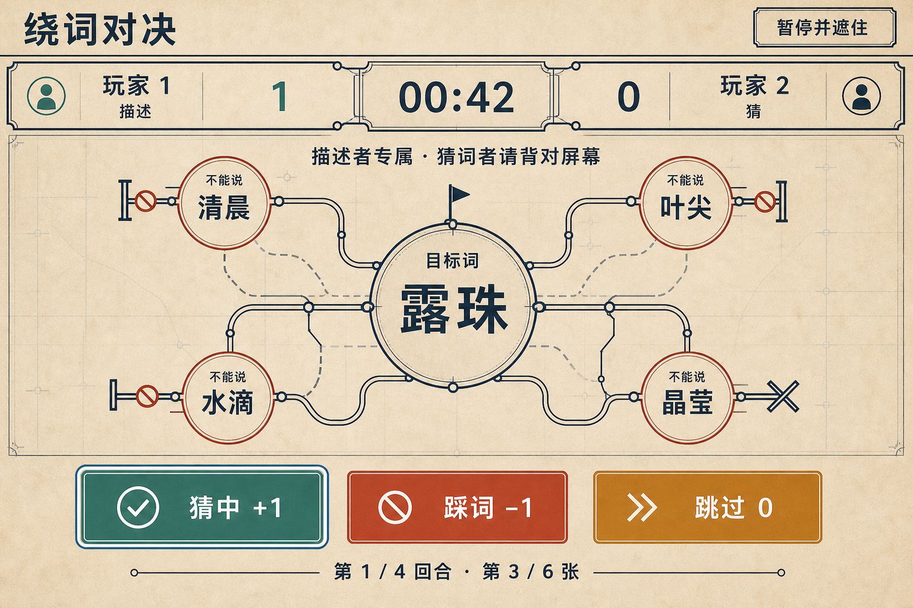
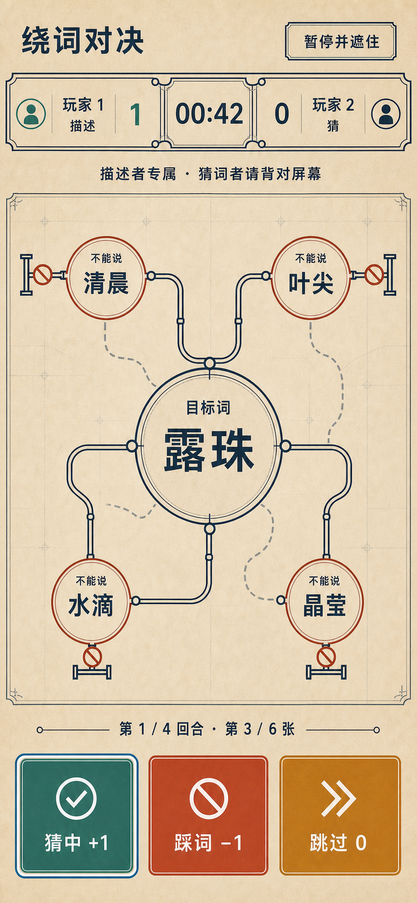

# “绕词对决”视觉设计提案

## 0. 文档状态

- 内部生产 ID：`word-detour-duel`
- 对外标题：**绕词对决**
- 分类：双人对抗（信任型友谊赛）
- 运行等级目标：A（真实 `file://` 直开）
- 当前阶段：视觉提案，等待用户确认
- 当前安装状态：未安装
- 前置规则：[`265-taboo-description-duel-spec.md`](./265-taboo-description-duel-spec.md)
- 题库审计：[`275-word-detour-duel-content-audit.md`](./275-word-detour-duel-content-audit.md)
- 最终验收编号：**317，继续保留，不在本阶段占用**

本阶段只新增：

- 本提案；
- 一张桌面秘密描述态 ImageGen 概念图；
- 一张 390px 方向的移动秘密描述态 ImageGen 概念图。

本阶段明确不做：

- 不创建 `index.html`、`styles.css`、`app.js` 或其他生产 UI；
- 不修改现有 `config.js`、`logic.js`、`logic.test.js` 或 `ATTRIBUTION.md`；
- 不修改 catalog、Board、门户、README、共享索引或安装数量；
- 不把项目标记为 installed；
- 不把概念 PNG 放入生产运行路径；
- 不把生成图当作 phase、秘密、计时、比分、焦点或响应式 Oracle。

用户明确确认本提案之前，生产 UI 必须继续停止。

---

## 1. 视觉必须服从的产品真值

### 1.1 核心身份

这不是通用 quiz、选项问答或文字输入过滤器。它必须同时保留：

1. 当前描述者私下看到一个目标词；
2. 同一张题上恰好四个禁用提示；
3. 猜词者背对屏幕，只听口头描述；
4. 描述者记录 `猜中 +1 / 踩词 -1 / 跳过 0`；
5. 每回合最多六张；
6. 双方轮流担任描述者，共四回合；
7. 回合结束后先经过中性交接，再由两人共同复核；
8. 终局比较双方作为描述者的净分；
9. 平分就是平局，不追加隐藏决胜条件；
10. 页面不录音、不转写、不联网，也不冒充自动裁判。

如果视觉退化成“显示问题、选择答案”，就失去本项目身份。

### 1.2 固定回合

```text
第 1 回合：玩家 1 描述，玩家 2 猜
第 2 回合：玩家 2 描述，玩家 1 猜
第 3 回合：玩家 1 描述，玩家 2 猜
第 4 回合：玩家 2 描述，玩家 1 猜
```

- 每回合最多六张；
- 两席各描述两次；
- 两席机会、主题与难度分布对称；
- 30 / 60 / 90 秒和不计时模式使用同一界面家族；
- 当前 secret view 只包含当前一张，不能预画下一张。

### 1.3 固定阶段

```text
intro
→ setup
→ handoff
→ card-ready
→ describing
↔ interrupted
→ turn-ended
→ turn-review
→ handoff / match-result
```

视觉不得合并掉两道关键隐私边界：

- `handoff`：猜词者先背对屏幕，描述者再打开题卡；
- `turn-ended`：秘密先卸载，设备放回中间，两人才进入复核。

### 1.4 秘密边界

- `card-ready / describing` 才能存在当前 `target` 和四个 `forbidden`；
- `handoff / interrupted / turn-ended` 中秘密节点数量必须为零；
- `turn-review` 只能公开刚结束回合中实际出现过的卡；
- `match-result` 只显示统计，不能重新列出题目；
- 未来卡、完整 schedule、难度与未出现卡不得用灰槽、问号、轮廓或分页点暗示；
- CSS 模糊、翻面、透明或 `display:none` 不是秘密卸载证明。

### 1.5 当前概念所表达的状态

两张最终图都只表达同一意图状态：

```text
phase = describing
turn = 1 / 4
card = 3 / 6
describer = 玩家 1
guesser = 玩家 2
current target = 露珠
current forbidden = 清晨 / 叶尖 / 水滴 / 晶莹
remaining display = 00:42
public score example = 玩家 1: 1, 玩家 2: 0
```

这是用于检查信息层级的静态示例，不证明这组词、分数与剩余时间在冻结 schedule
中能同时出现。生产真值只能来自 `getView(state)`。

---

## 2. 三方向比较

### 2.1 方向 A：路线改道指挥台

视觉语言：

- 暖矿物纸背景；
- 深蓝路线墨线；
- 目标词是中央“目的地”；
- 四个禁用提示是四个被封闭的路口；
- 结果按钮像三种明确调度动作；
- 两席共享一条等权比赛轨。

优点：

- 直接把“绕词”转成独有视觉语义；
- 不依赖真实图片或媒体资产；
- 线路、路口、焦点与状态都适合内联 SVG / CSS；
- 与商业卡牌、蜂鸣器和包装有明显距离；
- forced colors 下仍可用线路、封路符号、文字与边框表达。

风险：

- 路线只能是规则隐喻，不能被理解成可操作迷宫；
- 生成图中的线路不能代表解法或禁词之间的语义关系；
- 不能增加地图缩放、导航或路线选择控件。

**结论：采用。**

### 2.2 方向 B：电台绕词

视觉语言：

- 深色夜间广播台；
- 静态调谐旋钮与水平刻度；
- 禁用提示作为四个静态频道停点。

优点：

- 口头描述的氛围强；
- 暗色界面有明确戏剧感；
- 三动作层级清晰。

淘汰原因：

- 即使明确禁止麦克风与波形，旋钮、调谐和广播台仍容易暗示页面会监听声音；
- 深色金属面板的“设备感”会把信任型口头玩法推向自动裁判误解；
- forced colors 与 320px 下，旋钮装饰没有真实语义却占用空间。

**结论：不采用，不复制到仓库。**

### 2.3 方向 C：纸条接力

视觉语言：

- 撕边纸、复写标记和手写式大字；
- 四个禁用提示像四张被划掉的纸条；
- 两席使用等权纸面记分轨。

优点：

- 亲切、本地、低技术压力；
- 很适合零图片依赖的 CSS 纸张质感；
- 移动端易于线性重排。

淘汰原因：

- 大张目标纸加四张小纸容易回到“卡片堆”；
- 撕边、标签和独立小纸会靠近实体卡牌/包装表达；
- 视觉身份弱于“路线改道”，更容易退化为普通 flashcard。

**结论：不采用，不复制到仓库。**

---

## 3. 最终概念资产

### 3.1 桌面 `describing`



| 字段 | 记录 |
| --- | --- |
| 仓库路径 | `docs/assets/word-detour-duel-desktop-describing-concept.png` |
| ImageGen 原始路径 | `/Users/zenith/.codex/generated_images/019f97bc-3964-7f50-a328-01764b681a97/call_nnDnpl24YOFS88mqBxXezMlc.png` |
| 生成方式 | Codex 内置 `image_gen` |
| 用例 | `ui-mockup` |
| 输入图片 | 无 |
| 原生尺寸 | 1536 × 1024 px |
| 色彩模式 | RGB，无 Alpha |
| SHA-256 | `e00735cdc8430e10222d659f60668b9b72330330d4649d65388b99e6965b6926` |
| 检查 | 生成源与工作区副本均用 `view_image(detail="original")` 检查 |

### 3.2 移动 `describing`



| 字段 | 记录 |
| --- | --- |
| 仓库路径 | `docs/assets/word-detour-duel-mobile-describing-concept.png` |
| ImageGen 原始路径 | `/Users/zenith/.codex/generated_images/019f97bc-3964-7f50-a328-01764b681a97/call_5mgnqv2hrwThTLJoQ8Xs8ARW.png` |
| 生成方式 | Codex 内置 `image_gen` |
| 用例 | `ui-mockup` |
| 输入图片 | 仅本次内部生成的最终桌面概念，作为风格/组件参考 |
| 原生尺寸 | 853 × 1844 px |
| 色彩模式 | RGB，无 Alpha |
| SHA-256 | `885b4114a09cefa483f794557966cef0307475da4345f5ea14d2dc9d7568d3b8` |
| 检查 | 生成源与工作区副本均用 `view_image(detail="original")` 检查 |

重要限制：853 × 1844 像素 PNG 不是 390 × 844 CSS px 浏览器截图，只能证明
纵向重排方向。

### 3.3 淘汰稿台账

淘汰稿只保留在 Codex 生成目录，不进入 Git，不是实现参考。

| 方向 | 原始路径 | 尺寸 | SHA-256 | 淘汰理由 |
| --- | --- | ---: | --- | --- |
| 电台绕词 | `/Users/zenith/.codex/generated_images/019f97bc-3964-7f50-a328-01764b681a97/call_csNF4tZMEQV700nj8rGrfisf.png` | 1536 × 1024 | `3e0a773019b772ca7dfa849b87dace639bed1033c5413780349e902617818310` | 旋钮与广播设备仍暗示录音/自动监听 |
| 纸条接力 | `/Users/zenith/.codex/generated_images/019f97bc-3964-7f50-a328-01764b681a97/call_3oxgIgWrvCMUmuFenqe0b0RI.png` | 1536 × 1024 | `0d867629e2976bb90e76a8633ee4c70a4e9a7977a7511331c32dcd2ab739d9d1` | 目标纸与四小纸过度接近卡牌/包装表达 |

两张淘汰稿也做了 `view_image(detail="original")` 检查。

### 3.4 生成会话

- 生成目录：`/Users/zenith/.codex/generated_images/019f97bc-3964-7f50-a328-01764b681a97/`
- 工具没有暴露可记录的模型名、seed 或内部采样参数；
- 本文不虚构未暴露字段；
- 没有使用外部图片、开源截图、商业产品图、私人图片或品牌素材。

---

## 4. 精确生成 Prompts

### 4.1 最终桌面 Prompt

```text
Use case: ui-mockup
Asset type: complete desktop web game secret-description screen concept, design reference only
Primary request: Create a polished full-screen desktop UI concept for a local same-device two-player Chinese trust-based word-description duel titled exactly “绕词对决”. This is the private describer-only phase: Player 1 privately sees one target word and four forbidden prompts while Player 2 is explicitly told to face away from the screen. Player 1 speaks clues aloud and records one of three outcomes: guessed correctly +1, said a forbidden prompt -1, or skip 0. It must feel like rerouting language around four blocked intersections, not a generic quiz, flashcard app, commercial board-game replica, or red buzzer game.
Visual direction: “路线改道指挥台” — an elegant editorial transit blueprint on warm mineral paper. Use an open route-map composition rather than a stack of cards: the target word is a large central destination medallion, four forbidden prompts sit at four blocked route termini with clear barred-road symbols, and thin route lines bend around them. Quiet physical-print character, sharp code-recreatable geometry, no photorealism, no packaging mockup, no card slot.
Composition/framing: 1536×1024 landscape browser content with no browser chrome. Quiet top row: title on left, one neutral “暂停并遮住” action on right. Beneath it, one full-width open match rail with two equal-width player seats and an exact center timer; show both scores equally, current describer and guesser roles equally clearly. Main area is one dominant open secret-stage, not nested dashboard cards. At its center show target “露珠”; around it exactly four forbidden prompts “清晨”, “叶尖”, “水滴”, “晶莹”, each with a different blocked route ending but equal visual weight. Add clear private-state copy above the secret stage. Bottom area has exactly three large native-looking text buttons in one equal row: success, foul, skip; below or beside them, a small progress line. Keep all content visible within the viewport.
Text (verbatim, no extra copy): “绕词对决”; “玩家 1”; “玩家 2”; “描述”; “猜”; “1”; “0”; “00:42”; “第 1 / 4 回合 · 第 3 / 6 张”; “描述者专属 · 猜词者请背对屏幕”; “目标词”; “露珠”; “不能说”; “清晨”; “叶尖”; “水滴”; “晶莹”; “猜中 +1”; “踩词 −1”; “跳过 0”; “暂停并遮住”.
Color palette: warm mineral paper #F3EAD7, deep route ink #17283F, muted teal #2D7D72 for success, brick vermilion #B84D3D for foul, ochre #B9842D for skip, graphite #4A4A46, white only for focus contrast. No bright primary red, no black-and-white imitation of commercial cards, no gradients.
Typography: strong readable Chinese system-sans character, editorial map labels, tabular numeric timer, no external fonts. Title restrained, target is largest, all four forbidden prompts clearly legible, control labels deliberate rather than browser-default.
Interaction language: show one unmistakable double focus outline on a single button, real button affordances, minimum visually 48px targets, no global single-letter shortcuts, no microphone or audio UI. The secret stage must look removable as one whole DOM subtree. Scores are public; future words, card IDs, themes, difficulty, deck schedule and previous review details are absent.
Constraints: exactly two equal player seats, exactly one current target and exactly four forbidden prompts, exactly three result buttons, one timer and one pause-and-cover action. No answer options, question prompt, quiz radio buttons, text input, keyboard letters, speech waveform, microphone, recording dot, AI judge, auto transcription, buzzer, hourglass, sand timer, card tray, branded board-game packaging, commercial logo, trademark, watermark, hearts, gendered styling, leaderboard, achievements, badges, decorative pills, card grid, hero eyebrow, fake nav, future cards, solution examples, or hidden content silhouettes. No use of any external screenshot or known game visual. All real text, secret data, scores, timer, focus, blocked-route glyphs, controls, and state will be recreated code-native later; this PNG is concept evidence only.
```

参数：

```text
referenced_image_paths: omitted
num_last_images_to_include: omitted
```

### 4.2 最终移动 Prompt

```text
Use case: ui-mockup
Asset type: complete portrait mobile responsive counterpart for a local two-player Chinese word-description game, design reference only
Input images: Image 1 is the internally generated final desktop “路线改道指挥台” concept and is a style/component-system reference only. Preserve its warm mineral-paper palette, deep route ink, blocked-intersection glyphs, equal player rail, typography character, and three outcome-control family. Create a fresh mobile composition; do not crop Image 1 and do not treat its pixels as rule truth.
Primary request: Design the full 390×844 CSS-viewport private describer screen for “绕词对决”. Player 1 privately sees current target “露珠” and exactly four forbidden prompts “清晨”, “叶尖”, “水滴”, “晶莹”; Player 2 is the guesser and must face away. Player 1 speaks clues aloud and records “猜中 +1”, “踩词 −1”, or “跳过 0”. Keep the complete secret stage, both equal seats, timer, progress, all three controls, and pause-and-cover reachable without horizontal scrolling.
Composition/framing: portrait phone screenshot only, no device frame. Compact first row has title left and a clear “暂停并遮住” action right. Directly below, one compact shared match rail: two equal player columns with roles and scores, centered 00:42 timer. Then a short private-state warning. Main focal area is one open route blueprint: target “露珠” in a central destination medallion; exactly four forbidden prompts at four equal blocked route termini arranged as a legible 2×2 pattern, with route lines bending around them. The secret area must read as one removable subtree, not four unrelated cards. Beneath it place “第 1 / 4 回合 · 第 3 / 6 张”. Bottom has exactly three large native-looking outcome buttons in one equal row at 390px, each visibly at least 56px high, with one clear double focus outline. Use the 844px height efficiently, no large empty bands.
Text (verbatim, no extra copy): “绕词对决”; “玩家 1”; “玩家 2”; “描述”; “猜”; “1”; “0”; “00:42”; “第 1 / 4 回合 · 第 3 / 6 张”; “描述者专属 · 猜词者请背对屏幕”; “目标词”; “露珠”; “不能说”; “清晨”; “叶尖”; “水滴”; “晶莹”; “猜中 +1”; “踩词 −1”; “跳过 0”; “暂停并遮住”.
Color palette: warm mineral paper #F3EAD7, deep route ink #17283F, muted teal #2D7D72 success, brick vermilion #B84D3D foul, ochre #B9842D skip, graphite #4A4A46. No gradients.
Responsive truth: this is the 390px concept. At 320px production will stack the four forbidden prompts and the three action buttons into one column; do not imply that this screenshot itself proves the 320px state. Use real button affordances, deliberate Chinese system-sans control type, tabular timer, high contrast.
Privacy and rule constraints: exactly two equal seats, one current target, four forbidden prompts, three result controls. No future card, prior review details, card IDs, theme, difficulty, deck schedule, answer options, radio quiz, text input, global keyboard shortcuts, microphone, waveform, recording dot, transcription, AI judge, buzzer, hourglass, card tray, commercial board-game visual, logo, trademark, watermark, hearts, gendered styling, leaderboard, achievement, badge, decorative pill, dashboard grid, hero marketing, fake navigation, solution example, or hidden future silhouette. Actual text, secrets, timer, score, focus, route geometry, controls, DOM removal, and state will be code-native later; this PNG is concept evidence only.
```

参数：

```text
referenced_image_paths:
  - /Users/zenith/.codex/generated_images/019f97bc-3964-7f50-a328-01764b681a97/call_nnDnpl24YOFS88mqBxXezMlc.png
num_last_images_to_include: omitted
```

### 4.3 淘汰稿“电台绕词”Prompt

```text
Use case: ui-mockup
Asset type: alternative complete desktop visual-direction study for a local two-player word-description game, discardable concept candidate
Primary request: Explore a distinct “电台绕词” visual direction for the Chinese same-device game titled exactly “绕词对决”. Show the private describer-only phase: Player 1 sees target “露珠” and exactly four forbidden prompts “清晨”, “叶尖”, “水滴”, “晶莹”; Player 2 is the guesser and must face away. Player 1 records guessed correctly +1, said forbidden prompt -1, or skip 0. This is a trust-based oral game that never records audio and never auto-judges speech.
Visual direction: refined late-night public-radio control desk made only from typography, static dials, horizontal rails and paper labels; deep plum-black background, warm cream text, muted jade success, rust foul, amber skip. No photoreal studio, no microphone, no waveform, no recording indicator, no speakers, no VU meter that implies audio capture. Make it practical to rebuild in HTML/CSS/SVG.
Composition/framing: 1536×1024 landscape complete screen. Title and pause-and-cover at top. Equal Player 1 and Player 2 seats with scores and roles on one shared rail, 00:42 centered. Dominant central private panel has “描述者专属 · 猜词者请背对屏幕”, large target “露珠”, and exactly four equal forbidden prompts arranged as four static tuning stops. Bottom has exactly three equal large text buttons “猜中 +1”, “踩词 −1”, “跳过 0” plus “第 1 / 4 回合 · 第 3 / 6 张”. Show one clear focus outline.
Text (verbatim, no extra copy): “绕词对决”; “玩家 1”; “玩家 2”; “描述”; “猜”; “1”; “0”; “00:42”; “第 1 / 4 回合 · 第 3 / 6 张”; “描述者专属 · 猜词者请背对屏幕”; “目标词”; “露珠”; “不能说”; “清晨”; “叶尖”; “水滴”; “晶莹”; “猜中 +1”; “踩词 −1”; “跳过 0”; “暂停并遮住”.
Constraints: exactly two equal seats, one current target, four forbidden prompts, three outcome buttons. No future cards, previous review, question-answer choices, text input, keyboard shortcuts, microphone, waveform, recording dot, speech recognition, AI judge, buzzer, branded card game, card slot, commercial palette, logo, trademark, watermark, dashboard grid, badges, decorative pills, leaderboard, achievements, hearts, gendered styling, hero marketing, navigation, or hidden answer silhouettes. All real UI will be code-native; this is only a visual direction study.
```

### 4.4 淘汰稿“纸条接力”Prompt

```text
Use case: ui-mockup
Asset type: alternative complete desktop visual-direction study for a local two-player word-description game, discardable concept candidate
Primary request: Explore a distinct “纸条接力” visual direction for the Chinese same-device trust-based game titled exactly “绕词对决”. Show the private describer-only phase where Player 1 privately sees target “露珠” and exactly four forbidden prompts “清晨”, “叶尖”, “水滴”, “晶莹”; Player 2 is the guesser facing away. Player 1 records guessed correctly +1, said forbidden prompt -1, or skip 0.
Visual direction: a contemporary editorial tabletop made from long torn-paper strips, carbon-copy registration marks, pencil lines and two equal seat ledgers. It should feel handmade and friendly but highly disciplined, flat and practical for HTML/CSS, not a commercial board-game package, not scrapbook romance, and not a generic flashcard quiz.
Composition/framing: 1536×1024 landscape complete screen. Quiet title and “暂停并遮住” at top. One shared scoreboard rail with exactly two equal player seats, roles, scores and centered 00:42 timer. Main private stage is one large open sheet that can be removed as a whole: clear private-state sentence, large target “露珠”, then exactly four forbidden prompts as four crossed-out paper route strips with equal weight. Bottom has exactly three equal large native-looking buttons “猜中 +1”, “踩词 −1”, “跳过 0”, one visible focus outline, and “第 1 / 4 回合 · 第 3 / 6 张”.
Text (verbatim, no extra copy): “绕词对决”; “玩家 1”; “玩家 2”; “描述”; “猜”; “1”; “0”; “00:42”; “第 1 / 4 回合 · 第 3 / 6 张”; “描述者专属 · 猜词者请背对屏幕”; “目标词”; “露珠”; “不能说”; “清晨”; “叶尖”; “水滴”; “晶莹”; “猜中 +1”; “踩词 −1”; “跳过 0”; “暂停并遮住”.
Color palette: pale recycled paper #EEE7D8, graphite #242A30, deep navy #253B56, muted moss #4F765D, terracotta #A65042, mustard #B8862D. Subtle physical texture but no photographic props or external imagery.
Constraints: exactly two equal seats, one current target, four forbidden prompts, three outcome buttons. No future cards, answer choices, text input, keyboard letters, microphone, waveform, recording, AI judge, buzzer, hourglass, card tray, product packaging, commercial card layout, logo, trademark, watermark, hearts, gendered styling, leaderboard, badges, decorative pills, dashboard grid, hero marketing, navigation, solution examples, or hidden future silhouettes. All actual UI text, secrets, timer, focus, controls and state will be code-native later; this is only an original visual direction study.
```

---

## 5. 原图检查与生成幻觉

### 5.1 可采用的视觉证据

桌面与移动最终稿共同证明：

- 暖矿物纸、深蓝线路和砖红封路符号能形成独立视觉身份；
- 两席在同一条公开比赛轨中等权；
- 当前角色、比分和计时可压缩为一条稳定的共享信息层；
- 中央目标、四个禁用提示和三动作有清楚主次；
- 路线隐喻比普通卡片更符合“绕词”；
- “暂停并遮住”可以保持为独立中性动作；
- 三个结果按钮通过文字、分值、颜色和图标多重区分；
- 秘密区域可以设计成一次整体创建/卸载的视觉单元；
- 390px 下仍可并排两席和三动作；
- 没有麦克风、波形、录音点、未来卡或商业品牌。

### 5.2 生成幻觉台账

| 项目 | 概念图现象 | 生产真值 / 修正 |
| --- | --- | --- |
| 示例词卡 | 固定显示“露珠”及四提示 | 只能来自当前 `phaseData`，不能硬编码 |
| 示例分数 | 固定为 `1 : 0` | 来自 confirmed turn 纯派生 scoreboard |
| 示例时间 | 固定 `00:42` | 来自 `ceil(remainingMs / 1000)`；不计时显示明确文本 |
| 路线图 | 线路像可选择路径 | 只是装饰隐喻，不可点击、不能代表解法 |
| 四个封路端点 | 每个图形略有差异 | 生产符号家族要统一，差异不携带规则 |
| 旗形中心标记 | 桌面目标上方出现小旗 | 不是关卡、完成或导航事实；生产可删去或改为中性定位点 |
| 玩家头像 | 概念使用人形圆标 | 生产使用中性 seat mark / 数字，不引入身份或性别 |
| 角色标签 | “描述 / 猜”很短 | accessible name 使用完整“当前描述者 / 当前猜词者” |
| 焦点 | 猜中按钮显示双线 | 真实焦点由 `:focus-visible` 决定，不固定在猜中 |
| 按钮颜色 | 绿/红/黄很明显 | 仍需文字、分值与图标；forced colors 不能依赖颜色 |
| 移动按钮 | 三个按钮并排且很高 | 只代表 390px；320px 按规格改为单列 |
| 移动尺寸 | PNG 为 853 × 1844 | 必须在真实 390 × 844 CSS viewport 验收 |
| 纸张纹理 | 有生成式随机颗粒 | 生产用极轻 CSS 渐变/噪点或纯色，不使用概念 PNG |
| 字体 | 生成图无法确定字体来源 | 生产只用本地系统字体栈 |
| 秘密卸载 | 截图看起来是整体面板 | 不能证明 DOM 已移除；必须用阶段 DOM 测试 |
| 双席公平 | 两席视觉面积相近 | 必须用 CSS 量测和 DOM 顺序验证等权 |
| 控件尺寸 | 看起来大于 48px | 必须在浏览器量测 CSS px |
| 计时状态 | 仅展示 timed describing | 30/60/90/null、暂停、到时都由核心驱动 |
| 横屏 | 概念未展示 | 必须按第 9.4 节实现与浏览器验收 |
| 200%/400% | 概念未展示 | 必须按第 9.6/9.7 节真实验证 |

优先级固定：

```text
spec / reducer / getView
  > 隐私与 DOM 存在性测试
  > 浏览器量测和可访问树
  > 用户批准的视觉系统
  > ImageGen 像素
```

---

## 6. 视觉系统冻结

### 6.1 方向名

**路线改道指挥台**

气质：

- 友好但不幼稚；
- 有对抗节奏但不攻击；
- 像共同阅读的一张路线蓝图；
- 纸面温度抵消倒计时压力；
- 路线和封路符号直接说明“绕开”；
- 不使用情侣爱心、性别化配色或输家羞辱。

### 6.2 颜色 token

| Token | 值 | 用途 |
| --- | ---: | --- |
| `--paper-100` | `#F3EAD7` | 页面主背景 |
| `--paper-200` | `#E8D9BE` | 次级开放面 |
| `--route-900` | `#17283F` | 主文字、线路、边框 |
| `--route-700` | `#30465E` | 次要线路与说明 |
| `--graphite-700` | `#4A4A46` | 弱化说明 |
| `--success-700` | `#2D7D72` | 猜中 |
| `--foul-700` | `#B84D3D` | 踩词、封路 |
| `--skip-700` | `#B9842D` | 跳过 |
| `--focus-outer` | `#FFFFFF` | 外焦点环 |
| `--focus-inner` | `#116D8A` | 内焦点环 |

颜色规则：

- 两席不使用一蓝一粉的性别化区分；
- 两席身份主要靠座位编号、位置与角色文字；
- 三 outcome 必须同时有文字、分值和图标；
- 不用状态色给禁用提示逐项分级；
- 共同中断和交接使用中性 route ink。

### 6.3 字体

- 标题：系统中文黑体，700–800；
- 主体：系统无衬线；
- 目标词：系统中文黑体，700；
- 数字：`font-variant-numeric: tabular-nums`；
- 不下载网络字体；
- 不使用生成图中不可确认来源的字形。

建议字号：

| 内容 | 桌面 | 390px | 320px |
| --- | ---: | ---: | ---: |
| 页面标题 | 34–42px | 24–28px | 22–24px |
| 目标词 | 60–76px | 42–52px | 38–46px |
| 禁用提示 | 26–34px | 21–25px | 20–23px |
| timer | 46–58px | 28–34px | 25–30px |
| outcome 按钮 | 22–28px | 15–18px | 17–20px |
| 公共说明 | 15–18px | 14–16px | 14–16px |

### 6.4 线、面与图形

- 背景使用纯色或极轻的 CSS 多层渐变；
- 不使用下载纸张纹理；
- 路线为 2–3px 双线或主线 + 细内线；
- 封路符号为圆环斜杠 + 路端；
- 圆形目标只是视觉容器，不是按钮；
- 面板最多使用一个秘密主舞台和一条共享比赛轨；
- 不把每个信息块都装进卡片；
- 不使用玻璃拟态、霓虹、3D 翻卡、卡槽或蜂鸣器。

---

## 7. 组件与代码原生边界

### 7.1 永久骨架

未来生产仍遵守既有语义骨架：

- 返回入口；
- 页面标题；
- 主阶段标题；
- 动态 stage；
- 公共 `role=status`；
- `noscript`。

### 7.2 共享比赛轨

包含：

- 玩家 1 seat；
- 当前角色；
- 玩家 1 已确认净分；
- 权威 timer 或“不计时”；
- 玩家 2 已确认净分；
- 当前角色；
- 玩家 2 seat。

要求：

- 两席同宽；
- DOM 顺序固定为玩家 1 → timer → 玩家 2；
- 当前描述者可用下划线/路线端点强化，但不放大整个席位；
- 公共比分不能包含当前未确认 secret outcome；
- timer 不持续进入 live region。

### 7.3 秘密路线舞台

只在 `card-ready / describing` 创建：

- 私密状态标题；
- `目标词` label；
- 当前 target；
- `不能说` label；
- 恰好四项 `<ul><li>`；
- 纯装饰的路线 SVG；
- 当前 cardNumber / cardTotal；
- describing 才创建三 outcome 按钮。

离开允许阶段：

- 整棵 secret subtree 从 DOM 移除；
- 不留下 `aria-label`、title、data-*、CSS custom property、comment 或 Canvas；
- 先卸载秘密，再移动焦点；
- 路线 SVG 不能预先包含未来词文本。

### 7.4 三个 outcome

| Outcome | 文案 | 分值 | 图标 |
| --- | --- | ---: | --- |
| correct | 猜中 | +1 | 圆内勾 |
| foul | 踩词 | -1 | 封路斜杠 |
| skip | 跳过 | 0 | 双向前箭头 |

要求：

- 都是真实 `<button>`；
- 同层级、同面积；
- 不注册 C/F/S 等单字符全局快捷键；
- Enter / Space 使用浏览器原生按钮行为；
- reducer 返回新 state 后才重绘；
- 到时优先边界不能由 CSS 按压动画改变。

### 7.5 图标清单

| 图标 | 形态 | 语义 |
| --- | --- | --- |
| 封路 | 圆环 + 斜杠 + 路端 | 禁用提示 / 踩词 |
| 猜中 | 圆环 + 勾 | 当前结果是 correct |
| 跳过 | 两个等粗箭头 | 当前结果是 skip |
| 暂停遮住 | 矩形遮片或闭合路线 | 中断并卸载秘密 |
| seat | 数字圆标或简单中性轮廓 | 玩家 1 / 玩家 2 |
| 当前角色 | 路线端点 + 下划线 | 描述者 / 猜词者 |

所有图标使用内联 SVG：

- 统一 `viewBox`；
- 2px 左右描边；
- `round` cap/join；
- `currentColor`；
- 装饰图标 `aria-hidden=true`；
- 按钮完整名称来自真实文字，不靠图标命名。

### 7.6 概念 PNG 的生产排除

两张 PNG 只存于 `docs/assets/`，生产页面不得引用。

必须 code-native：

- 标题与全部文案；
- 当前 target / forbidden；
- 玩家名、角色、比分、回合和卡序；
- timer；
- 路线和封路符号；
- outcome 按钮；
- focus、hover、pressed、disabled；
- 中断遮屏；
- review 表；
- match result；
- forced-colors 与 no-JS 降级。

---

## 8. 全阶段视觉契约

### 8.1 `intro`

显示：

- “绕词对决”；
- `publicInstructions`；
- `trustNotice`；
- 简短计分说明；
- “设置新对局”。

不显示：

- 任一目标或禁用提示；
- 牌组内容；
- 比分；
- 假麦克风状态；
- 商业来源名称。

视觉：

- 一条开放路线从两席通向中央；
- 四个中性封路符号可作为玩法说明，但不带任何词；
- 不是问题卡预览。

### 8.2 `setup`

显示：

- 三个中性牌组名：纸飞机 / 晚风 / 星灯；
- 30 / 60 / 90 秒 / 不计时；
- 玩家 1、玩家 2；
- 信任与隐私说明；
- “开始对局”。

要求：

- 原生 fieldset / radio / select；
- 不把牌组名画成难度等级；
- 不显示 card ID、主题、target 或 forbidden；
- 两席称呼编辑若未来允许，仍是公开本地明文。

### 8.3 `handoff`

显示：

- 当前回合；
- 当前描述者和猜词者；
- “猜词者请背对屏幕”；
- “只有我在看，打开题卡”。

不显示：

- target；
- forbidden；
- 卡序；
- 未来卡槽；
- 题卡轮廓或字数。

焦点位于阶段标题或唯一主动作。

### 8.4 `card-ready`

显示：

- 当前一张 target；
- 恰好四个 forbidden；
- 当前 cardNumber / 6；
- “开始本回合”；
- timed 模式的尚未运行状态。

不显示：

- 三个 outcome 按钮；
- 后续卡；
- 主题/难度；
- live region 中的秘密。

### 8.5 `describing`

显示：

- 当前一张 target；
- 恰好四个 forbidden；
- 三个 outcome；
- timer 或“不计时”；
- “暂停并遮住”；
- 两席公开比分；
- 当前回合和卡序。

它是两张最终概念图负责的主状态。

### 8.6 `interrupted`

显示：

- 中性纸面遮屏；
- 中断原因的公开说明；
- “题卡已遮住，恢复不会自动继续计时”；
- “描述者准备恢复”。

不显示：

- target / forbidden / cardId；
- outcome；
- 当前题的路线轮廓；
- 通过背景模糊可辨的秘密。

背景应 `inert` 并退出可访问树；焦点进入遮屏。

### 8.7 `turn-ended`

显示：

- “本回合已结束，请把设备放回中间”；
- “两人都能看，开始复核”；
- 当前公开比分。

不显示：

- 任一已用卡或未来卡；
- 本回合详情；
- 谁踩词的归因文案。

### 8.8 `turn-review`

显示：

- 本回合实际出现的卡，按原顺序；
- 每张 target；
- 四个 forbidden；
- 当前 outcome 与 points；
- 当前回合计数和净分；
- “只在两人一致时更正”；
- “确认本回合结果”。

布局：

- 桌面使用开放表格/分组列表，不做六张卡片墙；
- 390px 使用逐条 definition list；
- 320px 单列；
- 每项 outcome 用原生 select 或 radio；
- 未出现卡完全不存在。

### 8.9 `match-result`

显示：

- “玩家 n 获胜”或“本局平分”；
- 双方最终净分；
- 四个回合摘要；
- correct / foul / skip 统计；
- “再来一局”与返回入口。

不显示：

- 完整题库；
- 每张秘密内容；
- 胜率、连胜、排行榜；
- 输家惩罚或关系评价。

---

## 9. 响应式冻结

### 9.1 桌面 `1440 × 900`

- 最大内容宽约 1320px；
- 标题与暂停同一行；
- 比赛轨单行；
- 秘密路线舞台占页面主要高度；
- 四 forbidden 以 2×2 或四角布局；
- 三 outcome 单行等宽；
- 关键内容在常见 900px 高度内可见；
- 页面仍允许自然滚动，不固定整屏高度裁切。

### 9.2 平板 `768 × 1024`

- 比赛轨保持三列；
- secret stage 居中；
- 四 forbidden 2×2；
- 三 outcome 可保持单行；
- review 从宽表格改为两列或逐条列表；
- 公共 scoreboard 永远不包含秘密。

### 9.3 移动 `390 × 844`

- gutter 12px；
- 标题与暂停同一行；
- 比赛轨为玩家 1 / timer / 玩家 2 三列；
- 私密提示独立一行；
- target 居中；
- forbidden 2×2；
- 三 outcome 单行等宽，每项至少 56px 高；
- progress 紧邻操作区；
- 不横向滚动。

概念图只证明结构方向；生产必须在真实 390 × 844 浏览器量测。

### 9.4 最窄 `320 × 568`

按规格冻结为线性重排：

- gutter 8px；
- 标题可换行，暂停不覆盖标题；
- 比赛轨可分成两行：上行两席、下行 timer；
- secret stage 不使用固定高度；
- target 保持独立主行；
- 四 forbidden 改为单列真实列表；
- 三 outcome 改为单列；
- 每个按钮至少 48px 高，目标 56px；
- 进度可换行；
- 不横向滚动；
- 不隐藏 pause、任何 forbidden 或任何 outcome。

因此移动概念中并排三按钮不能直接缩放到 320px。

### 9.5 横屏

覆盖常见 `844 × 390` 和低高度窗口：

- 页头压缩为一行；
- 左侧是 target + forbidden；
- 右侧是比赛轨、timer、progress 和三 outcome；
- 两席仍在同一共享轨中；
- 页面允许纵向滚动；
- 不把横屏解释成“玩家一左半屏、玩家二右半屏同时看秘密”；
- handoff / interrupted 遮屏必须覆盖整个可视区域；
- 不锁 orientation。

### 9.6 200% 文字缩放

- 不设置文本容器固定高度；
- 比赛轨允许内部换行；
- target 与 forbidden 不截断、不省略号隐藏；
- outcome 文案和分值可换成两行；
- review 表切换为 definition list；
- 页面纵向滚动；
- 控件仍保持可达；
- 秘密卸载语义不受布局变化影响。

### 9.7 400% 页面缩放

按约 320 CSS px 的窄屏信息流处理：

- 一列；
- 不出现二维卡片墙；
- 不依赖 hover；
- 标题、返回、暂停、三个 outcome 和主动作都可键盘到达；
- 所有文本可滚动到达；
- 无横向滚动；
- timer 不遮挡玩家角色或秘密词；
- 页面不禁用浏览器缩放。

---

## 10. 输入、焦点与遮挡

### 10.1 键盘

- 不注册任何单字符全局快捷键；
- Tab 顺序与视觉顺序一致；
- Enter / Space 激活真实按钮；
- setup 使用原生 radio/select；
- review 使用原生 select 或 radio；
- disabled 使用真实 disabled，并有附近原因；
- 不拦截输入法；
- Escape 若未来作为中断路径，必须先卸载秘密并写入明确合同，不能擅自添加。

### 10.2 触控与鼠标

- outcome 只需 click，不依赖长按、拖动、双击或多点触控；
- 目标尺寸至少 48 × 48 CSS px，这是项目体验 Gate，不冒充 WCAG AA 原文；
- 按钮之间保留至少 8px 可辨间距；
- pointer 和键盘派发同一 reducer action；
- 按下动画不抢先改比分；
- 防止快速双击重复记录同一张，由 revision/phase 决定合法性。

### 10.3 焦点

- phase 切换时先清除旧 secret subtree；
- 再把焦点移到新阶段标题或唯一主动作；
- `card-ready` 的 target 可获得程序性焦点，但 `aria-live=off`；
- `describing` 默认焦点可放在“猜中”，但不是固定视觉真值；
- `interrupted` 和 `turn-ended` 焦点必须在中性标题；
- `turn-review` 焦点进入复核标题；
- `match-result` 焦点进入结果标题；
- `:focus-visible` 使用 2px 深色内环 + 2px 白色外环 + offset；
- 不用 `outline:none` 移除原生焦点而不给替代。

### 10.4 热座隐私

在 `blur / hidden / pagehide / 手动暂停`：

1. 同步权威时间；
2. 若未到时，进入 `interrupted`；
3. 卸载 secret subtree；
4. 取消 timer driver；
5. 背景设为 inert；
6. 焦点进入中性遮屏；
7. visible/focus 不自动恢复；
8. 描述者明确确认后回到 `card-ready`；
9. 再按“开始本回合”建立新 deadline。

遮屏不得透明、磨砂或露出题卡轮廓。

---

## 11. 动效

默认动效只允许：

- `<= 180ms` 的 opacity；
- 边框色变化；
- outcome 按压的 1–2px 非空间性反馈；
- 状态轨的短距离静态连线重绘。

禁止：

- 3D 翻卡；
- 倒计时持续脉冲；
- 全屏震动；
- 蜂鸣动画；
- 粒子庆祝；
- 自动滚动；
- 路线沿线持续跑光；
- 通过动画结束决定秘密卸载、计分或 phase。

### 11.1 `prefers-reduced-motion`

开启后：

- 所有非必要 transition / animation 为 0ms；
- 状态立即更新；
- 不出现沿路线移动的光点；
- 结果仍有文字、分值和静态图标；
- 规则推进、timer、计分与 secret DOM 完全不变。

---

## 12. 强制颜色和非颜色冗余

### 12.1 `forced-colors`

使用系统色：

- 背景：`Canvas`；
- 文本/线路：`CanvasText`；
- 按钮：`ButtonFace / ButtonText`；
- 焦点：`Highlight`；
- 选中：`SelectedItem / SelectedItemText`（可用时）。

非颜色冗余：

- correct：勾 + `猜中 +1`；
- foul：封路斜杠 + `踩词 -1`；
- skip：双箭头 + `跳过 0`；
- 当前描述者：文字 + 下划线/双线端点；
- 当前猜词者：文字 + 空心端点；
- forbidden：每项都有“不能说”组标题和封路符号。

路线纹理和纸面颗粒在 forced colors 可全部消失，不影响理解。

### 12.2 高对比

- 正文、目标、禁词和按钮文字分别检查；
- 不把淡灰路线当作唯一分组；
- 页面在去色后仍能看出三种动作；
- 计时到 10/5/0 秒只增加文字说明，不靠红色或闪烁。

---

## 13. 屏幕阅读器与状态播报

- `global-status` 只播报公开 phase、计分改变、中断和完成；
- target / forbidden 永远不进入 live region；
- timer 只在 30、10、5、0 秒或阶段变化时克制播报；
- 当前秘密卡使用真实 heading + list；
- README 继续提醒：读屏扬声器可能向猜词者读出秘密，建议耳机或关闭朗读；
- 视觉短标签“描述 / 猜”的 accessible name 分别为完整角色；
- review 使用语义 list/table，不把六项画进 Canvas；
- route SVG 对读屏隐藏，不能重复朗读禁词；
- match result 只朗读双方净分与结果，不朗读所有历史词。

---

## 14. 无 JavaScript、资源失败与本地隐私

### 14.1 无 JavaScript

只显示：

- 标题；
- “这个体验需要启用 JavaScript 才能在本地运行”；
- 返回入口；
- 不录音、不联网的简短说明。

不显示：

- 假题卡；
- 假 outcome 按钮；
- 静态答案；
- 可误操作的 setup。

### 14.2 资源失败

- 生产不依赖两张概念 PNG；
- 不依赖网络字体、图片、音频或图标包；
- 内联 SVG 失败时，真实文字与原生按钮仍完整；
- CSS 纹理失败时，页面退化为纯纸色 + 深色文本；
- 任何视觉失败都不能重建或猜测秘密。

### 14.3 本地隐私

运行时继续保持：

- 不请求麦克风；
- 不调用语音识别或录音；
- 不联网；
- 不写 Storage、Cookie、URL query/hash；
- 不把秘密写入 console、错误、剪贴板、属性或 live region；
- 刷新即丢失当前局；
- JavaScript 中的本地词库不是密码学保密，开发者工具仍可查看；
- 页面不宣传自动防作弊。

---

## 15. 可见文案锁

生产实现优先使用现有 `config.js` 与 `getView()` 文案。

允许的主文案家族：

- `绕词对决`
- `绕开四个禁用提示，让对方猜到目标词。每人描述两回合。`
- 现有 `trustNotice`
- `玩家 1 / 玩家 2`
- `描述者 / 猜词者`
- `设置新对局`
- `开始对局`
- `猜词者请背对屏幕`
- `只有我在看，打开题卡`
- `目标词`
- `不能说`
- `开始本回合`
- `猜中 +1`
- `踩词 -1`
- `跳过 0`
- `暂停并遮住`
- `题卡已遮住，恢复不会自动继续计时`
- `描述者准备恢复`
- `本回合已结束，请把设备放回中间`
- `两人都能看，开始复核`
- `只在两人一致时更正`
- `确认本回合结果`
- `本局平分`
- `玩家 n 获胜`
- `再来一局`

概念图中的“描述者专属”只作为视觉方向语句；实现前必须决定是否复用现有
`statusText`，不能在获批后擅自扩充首屏文案。

禁止：

- 商业产品名称或其翻译；
- “自动检测”“AI 裁判”“正在监听”；
- “你害我们输了”之类归因；
- “情侣默契值”“输家惩罚”；
- 英文品牌副标题；
- hero eyebrow、badge、成就和营销口号。

---

## 16. 商标、开源与零复制边界

### 16.1 现有借鉴边界

项目现有 `ATTRIBUTION.md` 已记录：

- 只查看 Hasbro 官方产品页与官方规则 PDF以确认商业品牌和表达边界；
- 只研究“目标词 + 一组禁用提示 + 口头描述 + 猜词”这一抽象机制；
- 没有复制商业品牌、规则文字、示例、题卡、卡面布局、蜂鸣器、视觉、音效、
  包装、源码或素材；
- 名称、四回合结构、schedule、复核、状态机、代码、文案和 72 张卡为独立创作；
- 没有引入第三方开源代码、题库、字体、图片、图标、音频、视频或运行依赖。

本视觉阶段不扩大该借鉴范围。

### 16.2 ImageGen 输入边界

- 最终桌面图没有参考图片；
- 最终移动图只引用本次内部生成的桌面图；
- 淘汰稿没有参考图片；
- 未输入商业产品图、网页截图、开源 UI、品牌 logo 或私人图片；
- 未要求模仿任何艺术家、工作室或现有游戏；
- 没有网络字体、现成图标或 stock 资产。

### 16.3 零外部复制

允许：

- 通用路线、路口、封路符号等公共几何语汇；
- 原创 CSS / SVG；
- 现有核心文案和项目自有题库；
- 内部生成概念之间的风格延续。

不允许：

- 临摹商业卡面、卡槽、蜂鸣器或包装；
- 使用商业名称作标题、metadata 或卖点；
- 从概念图裁 UI；
- 从第三方词库复制/翻译卡；
- OCR 生成图后改写成生产文案；
- 引入未审计的开源实现。

若后续阶段新增任何开源参考，必须先补：

- 项目名和固定 commit/tag；
- LICENSE 和版权主体；
- 实际借鉴点；
- 复制/修改范围；
- 未复制范围；
- 资源许可证。

完成前不得合入。

---

## 17. 用户确认 Gate

请用户确认：

1. 是否采用“路线改道指挥台”而不是电台或纸条方向；
2. 是否认可暖矿物纸 + 深蓝路线 + 砖红封路的色彩；
3. 是否认可目标居中、四个禁用提示作为四个被封闭路口；
4. 是否认可桌面/390px 的三 outcome 等权并排；
5. 是否认可 320px 按规格把 forbidden 和 outcome 都改为单列；
6. 是否认可 review 使用开放列表/表格，不做六张卡片墙；
7. 是否认可终局保持克制，只显示胜者或平局及四回合摘要。

建议确认语句：

> 确认 `word-detour-duel` 采用 316 文档的“路线改道指挥台”，可以进入生产 UI 实现。

收到明确确认后，实施阶段必须以本文与核心规格共同作为约束；规则冲突时核心规格
优先。最终完成后才使用预留的 317 号文档记录验收。

---

## 18. 实现前检查表

- [ ] 用户已明确确认视觉方向
- [ ] 生产标题只有“绕词对决”
- [ ] 概念 PNG 不进入生产路径
- [ ] 当前 secret subtree 按 phase 创建和卸载
- [ ] handoff/interrupted/turn-ended 秘密节点为零
- [ ] review 只包含实际出现卡
- [ ] result 不含词卡内容
- [ ] 两席 DOM、面积和信息权重对等
- [ ] timer 与比分来自 `getView()`
- [ ] 四 forbidden 恰好四项
- [ ] 三 outcome 都是真实 button
- [ ] 不注册单字符全局快捷键
- [ ] blur/hidden/pagehide/手动暂停先卸载秘密
- [ ] 320 × 568 无横向滚动
- [ ] 390 × 844 真实浏览器验证
- [ ] 844 × 390 横屏验证
- [ ] 200% 文字缩放不裁切
- [ ] 400% 页面缩放全部内容可达
- [ ] reduced-motion 不改变规则
- [ ] forced-colors 不依赖颜色
- [ ] no-JS 不显示假游戏
- [ ] 无麦克风、录音、网络或 Storage
- [ ] 商标和开源边界与现有 ATTRIBUTION 一致
- [ ] 最终验收继续写入预留的 317 号文档
