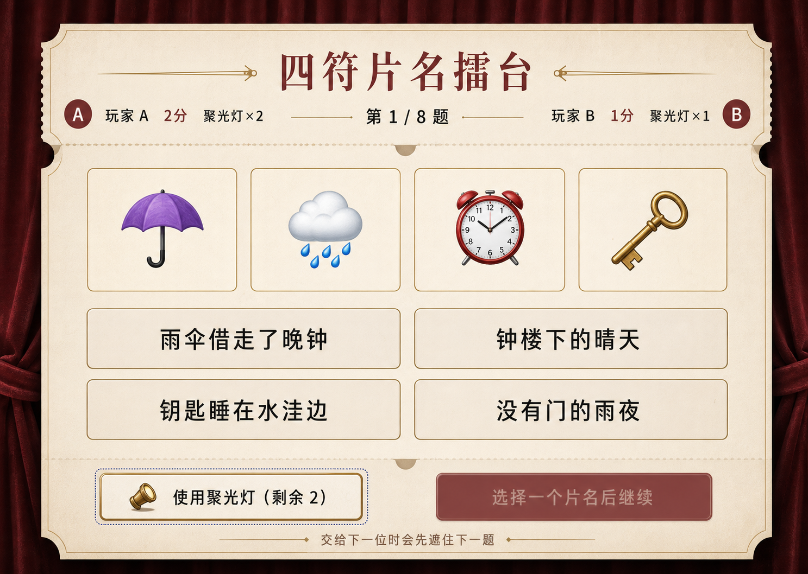
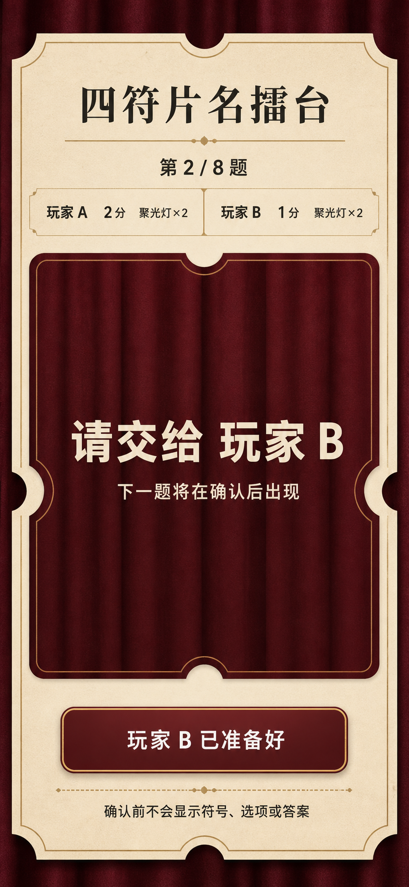

# `four-symbol-film-duel` 视觉方案提案

> 状态：等待用户确认
> 阶段：仅视觉方案，不含生产 HTML / CSS / JavaScript
> 内部项目 ID：`four-symbol-film-duel`
> 对外唯一标题：**四符片名擂台**
> 后续验收编号：`319`（保留，本阶段不创建）

## 0. 本阶段结论

本提案为本地同设备双人热座猜片名游戏冻结一套可实现、可验证且不泄露答案的
视觉方向：

- 视觉方向：**独立影院票根台**；
- 核心任务：每题用四枚 Unicode 符号表达一个原创虚构片名，从四个原创选项中
  猜测；
- 热座隐私：交接阶段使用完全不透明的“闭幕票根”，下一位确认前不把下一题
  符号、选项、答案或解释放入 DOM；
- 对抗结构：8 题严格 A / B 交替，每人 4 题、2 枚聚光灯、相同计分上限；
- 状态边界：猜测、确认、揭晓、计分、轮换和终局各有独立视觉契约；
- 生产边界：标题、符号、文本等价、选项、得分、焦点、幕布、反馈和全部交互
  都必须由原生 HTML / CSS / Unicode / JavaScript 重建；
- 概念图用途：只用于确认构图、气质、色彩和信息层级，不是运行界面、规则真值、
  字形兼容性证明或可裁切的生产素材。

本阶段**没有**：

- 编写或修改生产 HTML、CSS、JavaScript；
- 修改目录页、Board、README 或任何共享索引；
- 将项目标记为 installed；
- 修改既有核心、题库、测试、bugs、learn 或 `ATTRIBUTION.md`；
- 复制第三方游戏代码、电影表达、海报、剧照、Logo、字体或厂商 Emoji 图像；
- 把概念 PNG 接入运行页面。

只有用户明确确认本提案后，才进入生产 UI 实现与编号 `319` 的浏览器验收。

---

## 1. 方案一句话

把一局双人猜片名做成一张正在放映的独立影院票根：酒红幕布负责题前遮挡，
暖纸票面承载四符与四选项，黄铜聚光灯只排除一个错误项；两位玩家共享同一套
舞台、同一组尺寸和同一计分语言，轮到谁只改变当前席位，不改变视觉权重。

这不是 emoji 海报、真实电影竞猜、流媒体首页或综艺答题台。四枚符号是可访问的
题面文本，不是装饰插画；片名全是项目原创虚构文本，不借真实作品知名度完成
猜测。

---

## 2. 概念资产

### 2.1 桌面端 `question` 状态



| 字段 | 记录 |
|---|---|
| 仓库路径 | `docs/assets/four-symbol-film-duel-desktop-question-concept.png` |
| 原始尺寸 | 1487 × 1058 px |
| 色彩模式 | RGB，8-bit/channel |
| SHA-256 | `18bb482b4ed26019a3c5664d98b5b9a0b5c54cbf690620b3e9cdedddc401d1aa` |
| 生成来源 | Codex 内置 `image_gen`，`ui-mockup` 用例 |
| 外部输入 | 无 |
| 用途 | 桌面猜测态的构图、票根语言、A/B 等权信息轨和操作层级提案 |

概念图处于**未选择**状态：四个选项等权，没有正确标记、答案、解释或未来题目。
图中的 A / B 分数仅是构图样例，不是固定开局值；生产实现必须读核心状态。

### 2.2 移动端 `handoff` 状态



| 字段 | 记录 |
|---|---|
| 仓库路径 | `docs/assets/four-symbol-film-duel-mobile-handoff-concept.png` |
| 原始尺寸 | 853 × 1844 px |
| 色彩模式 | RGB，8-bit/channel |
| SHA-256 | `a711be4186b00fd4f4ddfa03dc413c4a3eada51ac84c452c15dd35c07db8d1f6` |
| 生成来源 | Codex 内置 `image_gen`，`ui-mockup` 用例 |
| 外部输入 | 无；与桌面稿通过同一份书面视觉系统保持一致 |
| 用途 | 390px / 320px 热座交接、完全遮挡和移动端纵向重排提案 |

移动稿没有符号、选项、答案、解释、上一题复盘或下一题预览。幕布是不透明的
状态面，不是把题面模糊后盖一层半透明背景。

### 2.3 生成会话与源文件

- 生成目录：
  `/Users/zenith/.codex/generated_images/019f97bb-eca4-7e70-980f-59a91cfc27b4/`
- 桌面原始文件：`call_Ztj5tb1MQNCfNsk5rhzk0zYq.png`
- 移动原始文件：`call_abWLKiFzMW0It0JIkBLcR2UC.png`
- 两张图都由内置工具从纯文本提示词新生成；
- 工具没有暴露可记录的模型名、种子或内部采样参数，本提案不虚构这些字段。

### 2.4 选稿、淘汰稿与生成幻觉

本轮只生成两张目标状态图，两张首稿都进入提案，**淘汰稿数量为 0**。没有把
额外生成变体留在仓库，也没有以“存在但未记录”的方式暗示另有参考。

逐张原尺寸检查后的已知生成偏差：

| 资产 | 观察 | 处理边界 |
|---|---|---|
| 桌面稿 | `🌧️` 被画成带云和多枚雨滴的插画式字形；四枚符号整体带有具体厂商风格的彩色造型 | 不裁切、不描摹、不导出这些图形；生产只渲染配置中的原始 Unicode 字符和项目原创中文标签 |
| 桌面稿 | “聚光灯”按钮出现了生成式扩音器 / 灯筒图形 | 仅保留“黄铜聚光灯”这个语义；生产若需图标，使用项目自制、简单且可访问的 code-native SVG，不能截取概念图 |
| 两张稿 | 票纸纤维、幕布褶皱、阴影和字体细节是生成器近似，不是可直接量取的实现规格 | 生产使用受控 CSS 色面、边框、少量渐变与本机字体；不追求像素级复制生成纹理 |
| 两张稿 | 图中文字虽然本轮可读，仍是位图文字 | 所有真实标题、分数、按钮、说明和选项必须重新写成语义化 DOM 文本 |

这些偏差不改变构图提案，但明确否定了“把截图当页面”或“从截图裁素材”的路径。

---

## 3. 精确 ImageGen 提示词

### 3.1 桌面概念提示词

```text
Use case: ui-mockup
Asset type: desktop browser game UI concept, visual proposal only
Primary request: create a complete, high-fidelity desktop product UI concept for a local two-player hot-seat game named exactly “四符片名擂台”. The current screen is the QUESTION phase, round 1 of 8, current player 玩家 A. Players express and guess an original fictional film title from exactly four Unicode symbols and four textual options.
Audience/purpose: a couple sharing one local laptop, alternating equal turns; playful, intimate, fair, and immediately understandable.
Scene/backdrop: full 1440×1024-ish desktop browser viewport. Deep wine-red velvet-curtain background with a single warm ivory ticket-sheet play surface; subtle paper grain, ink print, thin brass spotlight lines. Independent repertory cinema / ticket-stub mood, refined and calm, not a movie poster.
Structure: quiet top header with the exact title “四符片名擂台”; an equal A/B score rail with “玩家 A  2分  聚光灯×2” and “玩家 B  1分  聚光灯×1”; centered progress “第 1 / 8 题”. Main play area shows exactly four large symbol cells: ☂️, 🌧️, ⏰, 🔑, with generous spacing. Below, four large code-native-looking option buttons in a clean 2×2 layout, with these exact labels and no selected/correct styling: “雨伞借走了晚钟”, “钟楼下的晴天”, “钥匙睡在水洼边”, “没有门的雨夜”. Bottom action rail has a secondary brass-outline button “使用聚光灯（剩余 2）” and a primary wine-red button “选择一个片名后继续” shown disabled. Include one quiet sentence near the footer: “交给下一位时会先遮住下一题”.
Interaction model: no option is selected; all four options are equal; visible keyboard focus style may appear on the spotlight button only; minimum 44px touch targets. Score treatment must be perfectly symmetric between A and B.
Style/medium: realistic senior product designer UI mockup, code-implementable, crisp typography, restrained editorial elegance, 7/10 creativity, low-to-medium density, flat surfaces with very subtle shadows.
Typography: Chinese editorial serif for the game title, highly legible sans-serif for controls and scores; large readable control type, no tiny labels.
Color palette: wine red #5B1728, warm paper #F4E8D2, ink #201A18, brass #B58A45, muted rose #8A5964. No gradients except extremely subtle natural curtain depth.
Container model: one purposeful ticket-sheet frame, open layout inside; no nested card grid, no floating dashboard widgets.
Responsive intent: composition should translate cleanly to 390px and 320px; avoid edge-dependent decorations.
Constraints: this is QUESTION state and MUST NOT reveal or imply the correct answer. No green/red correctness colors, no checkmarks, no answer highlight, no rationale, no selected option, no future question, no real film title, no real movie character, no actor, no studio logo, no copyrighted poster, no vendor branding, no QR code, no watermark. Keep all true UI text/controls visually code-native and practical to rebuild. Use only the supplied exact Chinese copy; do not invent badges, pills, metrics, slogans, navigation, subtitles, fake controls, or decorative labels.
Avoid: emoji-poster collage, giant decorative emoji art, neon cinema, streaming-service UI, game-show spectacle, casino look, bento cards, glassmorphism, excessive glow, 3D icons, unreadable microcopy, answer leakage, trademarks, extra text.
```

### 3.2 移动概念提示词

```text
Use case: ui-mockup
Asset type: mobile browser game UI concept, visual proposal only
Primary request: create a complete, high-fidelity portrait mobile UI concept for the same local two-player hot-seat game named exactly “四符片名擂台”. The screen is the HANDOFF privacy phase before round 2 of 8. The phone is being passed from 玩家 A to 玩家 B, and the next question must remain fully hidden until 玩家 B explicitly confirms readiness.
Audience/purpose: a couple sharing one local phone and taking equal alternating turns; protect the next player's question during physical handoff.
Scene/backdrop: full 390×844-ish mobile browser viewport. Deep wine-red velvet-curtain background with one warm ivory ticket-sheet surface, subtle paper grain, ink print, thin brass lines. Same refined independent repertory cinema / ticket-stub design language as the desktop concept, not a movie poster.
Structure: quiet header with exact title “四符片名擂台”; centered progress “第 2 / 8 题”. Equal compact score rail: “玩家 A  2分  聚光灯×2” and “玩家 B  1分  聚光灯×2”, visually symmetric and equally weighted. Main privacy area is a clearly opaque closed wine-red curtain or folded ticket cover with no translucent preview behind it. Large exact headline “请交给 玩家 B”. Supporting exact text “下一题将在确认后出现”. One large primary button near the lower portion: “玩家 B 已准备好”. Below it, one quiet safety line: “确认前不会显示符号、选项或答案”.
Privacy requirements: the central cover must visually communicate that the next card is fully blocked; no peek-through, silhouettes, blurred clues, reflected symbols, edge previews, or answer hints.
Style/medium: realistic senior product designer mobile UI mockup, code-implementable, crisp typography, restrained editorial elegance, 7/10 creativity, low density, generous spacing, subtle flat shadows.
Typography: Chinese editorial serif for the game title, highly legible sans-serif for all controls and score text; minimum comfortable mobile sizes; one-column hierarchy.
Color palette: wine red #5B1728, warm paper #F4E8D2, ink #201A18, brass #B58A45, muted rose #8A5964. No gradients except extremely subtle natural curtain depth.
Container model: one purposeful ticket-sheet frame, open vertical layout; no nested cards, no dashboard widgets.
Responsive intent: safe at 390px and able to reflow to 320px; large 44px-plus touch target; no horizontal overflow; works in short landscape through vertical scrolling.
Constraints: HANDOFF state only. Show absolutely no Unicode clue symbols, no emoji, no film-title options, no correct answer, no rationale, no previous-card review, no future-card preview. No real film title, no real movie character, no actor, no studio logo, no copyrighted poster, no vendor branding, no QR code, no watermark. Keep all true UI text and controls visually code-native and practical to rebuild. Use only the supplied exact Chinese copy; do not invent badges, pills, metrics, slogans, navigation, subtitles, fake controls, or decorative labels.
Avoid: emoji-poster collage, neon cinema, streaming-service UI, game-show spectacle, casino look, bento cards, glassmorphism, excessive glow, 3D icons, unreadable microcopy, answer leakage, translucent privacy cover, trademarks, extra text.
```

---

## 4. 视觉系统冻结

### 4.1 方向名：独立影院票根台

关键词：

- 亲密但不甜腻；
- 对抗但不嘈杂；
- 电影感但不借真实电影；
- 纸面但不复古做旧过度；
- 聚光但不霓虹；
- 清楚但不仪表盘化。

页面只有一个主要容器：一张被酒红幕布包围的暖纸票根。票根缺口、细黄铜线和
轻微纸纹承担影院气质；题面、选项和计分仍是干净、开放、可读的产品界面。

### 4.2 色彩 token

| Token | 建议值 | 用途 |
|---|---:|---|
| `--curtain-950` | `#2A0710` | 页面最深背景 |
| `--curtain-800` | `#5B1728` | 主操作、交接幕布、当前席位 |
| `--curtain-600` | `#8A5964` | 次级状态、悬停边界 |
| `--paper-100` | `#F4E8D2` | 票根主面 |
| `--paper-200` | `#E8D5B4` | 分隔、禁用面 |
| `--ink-950` | `#201A18` | 主文本 |
| `--ink-600` | `#665B54` | 次要说明 |
| `--brass-500` | `#B58A45` | 聚光灯、票线、焦点辅助 |
| `--correct-700` | `#276047` | 仅 `result` 正确结果 |
| `--wrong-700` | `#842F3D` | 仅 `result` 错误结果 |
| `--focus` | `#1557B0` | 键盘焦点外环 |

规则：

- A / B 不各占一种性别暗示色；两席位都使用同一纸面和文字系统；
- 当前席位只能通过位置、明确文字、边框粗细和 `aria-current` 等冗余提示表达；
- 正确 / 错误色只在 `result` 结算后出现，`question` 和 `confirm` 禁用；
- 聚光灯的黄铜色不等于正确色；
- 颜色不是唯一编码，所有计分、剩余次数和结果都有文字。

### 4.3 字体与排版

- 标题：优先本机中文宋体，回退到系统衬线字体；
- 正文、按钮、分数：系统无衬线字体；
- 分数、轮次：使用等宽数字特性 `font-variant-numeric: tabular-nums`；
- 不加载网络字体，不打包第三方字体；
- 标题只出现一次，不加英文副标题、眉题、分类 badge 或品牌口号；
- 片名按钮不使用戏剧化海报字体，避免把虚构选项误读成电影海报。

建议字号：

| 内容 | 桌面 | 390px | 320px |
|---|---:|---:|---:|
| 页面标题 | 40–52px | 28–34px | 24–30px |
| 四符 | 54–72px | 42–56px | 36–48px |
| 选项 | 20–24px | 17–20px | 16–18px |
| 分数 / 轮次 | 16–18px | 14–16px | 13–15px |
| 辅助说明 | 14–16px | 13–15px | 13–14px |

### 4.4 线、面与纹理

- 幕布使用低对比 CSS 线性 / 径向渐变模拟深浅，不加载生成图；
- 票纸使用纯色加极轻 CSS 噪点或完全无纹理的降级面；
- 票根缺口可用伪元素或 `clip-path`，但不得剪裁文字和焦点；
- 选项是同一组件的状态变体，不是四张风格不同的海报；
- 阴影只分离票面和背景，不做漂浮卡片堆；
- 圆角克制：票面 18–24px，按钮 8–12px；
- 聚光灯图标若存在，必须为项目原创简洁 SVG；纯文字按钮同样成立。

---

## 5. 双席位对等与比赛结构

### 5.1 结构真值

生产 UI 必须忠于既有核心：

- 一局固定 8 题；
- A 在奇数题、B 在偶数题，严格交替；
- 每位各答 4 题；
- 每位开局 2 枚聚光灯；
- 每题最多使用 1 枚，使用后不可撤销；
- 聚光灯只删除配置预定的一个错误项；
- 直接答对得 2 分；
- 使用聚光灯后答对得 1 分；
- 答错得 0 分；
- 每位理论最高 8 分；
- 第 8 题结算后才进入终局。

概念图中的示例分数不能覆盖这些规则。生产页面的轮次、当前玩家、分数、剩余
聚光灯、可选项、排除项和最终胜负只能来自 `getPublicView(state)`。

### 5.2 等权规则

- A / B 得分轨各占 50% 可用宽度；
- 字号、底面、边框、对比度和信息量一致；
- 当前玩家可以加粗或加边框，但不放大头像、不占据更多面积；
- 不使用情侣中的性别、称谓、头像或粉蓝配色推断身份；
- 自定义名字只替换“玩家 A / 玩家 B”文本，不改变席位结构；
- 胜者终局可以先读，但双方完整分数与 8 题复盘仍等权；
- 平局不是异常状态，不触发加赛或随机裁决。

---

## 6. 四符与文字等价

### 6.1 code-native 字形

每个 token 使用配置中的 `glyph` 原样作为 Unicode 文本，建议结构：

```html
<li class="symbol-token">
  <span class="symbol-token__glyph" aria-hidden="true">☂️</span>
  <span class="symbol-token__label sr-only">雨伞</span>
</li>
```

要求：

- 不把概念图里的伞、雨、钟、钥匙裁成 PNG；
- 不下载或内嵌 Apple、Google、Microsoft、Samsung 等厂商 Emoji 图像；
- 不加载第三方 Emoji 字体；
- 不把 glyph 转成 SVG path；
- 不使用方向、颜色、厂商细节作为唯一线索；
- 字形只是视觉层，项目原创 `labelZh` 才是稳定等价文本。

### 6.2 跨平台回退

建议系统字体栈：

```css
font-family:
  "Apple Color Emoji",
  "Segoe UI Emoji",
  "Noto Color Emoji",
  system-ui,
  sans-serif;
```

这只是回退顺序，不证明每个平台已覆盖全部 48 个 token。若系统显示空框，中文
标签仍必须可达；不得通过下载第三方图片“修复”。

内容审计标记的中风险 token：

- `🪿` 鹅；
- `🫖` 茶壶；
- `🪞` 镜子；
- `🪜` 梯子；
- `☄️` 彗星；
- `🛰️` 卫星。

正式验收必须在真实平台观察这些字形，不能用概念图或静态校验替代。

### 6.3 双方锁定的可见文字模式

`setup` 提供“显示符号文字说明”选项：

- 默认关闭时，标签在可访问树中但视觉隐藏；
- 开启时，四枚符号下方显示对应 `labelZh`；
- 选项在开局前锁定并对双方同时生效；
- 不能由当前玩家临时切换；
- 标签只能写稳定物体语义，不写答案、剧情关系、动作解释或排除提示；
- 设置状态在本局所有 `question`、`confirm`、`result` 和 `summary` 中一致。

---

## 7. 全状态视觉与隐私契约

| 阶段 | 必须显示 | 必须隐藏 | 主操作 |
|---|---|---|---|
| `setup` | 标题、规则、两位名字、4 个题包、双方锁定的文字等价模式 | 卡片顺序、答案、解释、分数预测 | 开始本局 |
| `handoff` | 下一位玩家、当前轮次、双方分数、双方剩余聚光灯、完全不透明遮挡 | 下一题 token、选项、答案、解释、未来题目、上一题详细复盘 | “玩家 X 已准备好” |
| `question` | 当前玩家、4 个 token、4 个选项、聚光灯、选择状态、当前分数 | 正确项、解释、未来题目 | 选择后继续 |
| `confirm` | 已选片名、本题最高可得分、聚光灯是否已用、返回修改 | 正确片名、解释、正确 / 错误色 | 确认提交 |
| `result` | 正确片名、玩家选择、得分、解释、总分、聚光灯使用结果 | 下一题 token、选项、答案、解释 | 交给下一位 / 查看终局 |
| `summary` | 胜者或平局、双方总分、双方聚光灯使用、8 题完整已结算复盘 | 未结算内容、隐藏排期、额外题 | 再玩一局 / 返回 |

### 7.1 `setup`

- 4 个题包使用同一列表组件，显示配置中的标题与副标题；
- 两个名字输入框等宽、等高、相同校验；
- 文字等价模式解释“对双方同时生效”；
- 规则明确写出 `2 / 1 / 0` 计分和 8 题轮换；
- 不预览具体卡片，避免开局前泄题。

### 7.2 `handoff`

这是热座隐私边界，不是装饰过场：

- `getPublicView` 在该阶段的 `currentCard` 为 `null`；
- 生产 DOM 不创建下一题 token、选项或解释节点；
- 不用 `visibility:hidden`、模糊、透明度、位移或幕布覆盖已渲染题面；
- DevTools、屏幕阅读器、复制文本和页面查找都不应在交接时得到下一题；
- “准备好”后才派发 `ACK_HANDOFF`，再渲染 `question`；
- 刷新或意外重绘不能先闪出题面；
- 幕布开启动画只是可选视觉反馈，不能承担安全语义。

### 7.3 `question`

- 四符是唯一主视觉，按配置顺序从左到右；
- 四个选项初始等权；
- 选择后只显示“已选”，不显示对错；
- 被聚光灯排除的错误项保持可读但明确不可选，并写“已由聚光灯排除”；
- 若被排除项曾被选中，核心会清除选择，UI 要同步回到未选择；
- 聚光灯按钮写明当前玩家剩余数量与使用后最多得 1 分；
- 没有选择时“继续”禁用并给出文本原因；
- 不显示实时猜中概率、倒计时、排名、连击或提示购买。

### 7.4 `confirm`

确认层建议使用票根内的原生对话区，而不是浏览器 `confirm()`：

- 焦点进入确认区；
- 标题明确“提交这个片名吗？”；
- 显示已选片名；
- 显示“本题答对可得 2 分”或“已用聚光灯，答对可得 1 分”；
- “返回修改”和“确认提交”都可键盘操作；
- 关闭 / 返回不结算；
- 提交只触发一次；
- 仍不渲染答案和解释。

### 7.5 `result`

- 先以文字写“答对 / 答错”，再使用颜色和图标；
- 正确片名与玩家选择分别命名；
- 得分显示 `+2`、`+1` 或 `+0`，同时更新总分；
- 显示项目原创解释；
- 正确与错误选项的样式只在此阶段出现；
- “下一题”先进入 `handoff`，不能直接显示下一张卡；
- 第 8 题只提供进入终局，不再制造虚假交接。

### 7.6 `summary`

- 首行写明确结果：“玩家 A 获胜”“玩家 B 获胜”或“平局”；
- 两位总分与聚光灯使用量并列等权；
- 8 题复盘按轮次列出：玩家、四符及等价文本、选择、正确片名、得分、解释；
- 不把复盘做成真实电影海报墙；
- 不生成“最佳演员”“票房”“观众评分”等假电影指标；
- “再玩一局”回到干净 `setup`，核心 revision 保持单调递增。

---

## 8. 页面结构与组件

### 8.1 语义顺序

1. 跳到主要内容；
2. 唯一页面标题；
3. 轮次与 A/B 等权计分轨；
4. 当前状态标题与说明；
5. 状态主内容；
6. 聚光灯和主要操作；
7. 礼貌级状态播报；
8. 返回项目列表。

DOM 顺序与视觉顺序一致，不用 CSS `order` 让键盘顺序和视觉顺序分裂。

### 8.2 组件清单

| 组件 | 责任 | 变体 |
|---|---|---|
| `TicketShell` | 页面唯一票根容器 | 常规、forced-colors |
| `MatchRail` | 轮次、A/B 分数与聚光灯 | 当前 A、当前 B、终局 |
| `HandoffCurtain` | 真正无题面数据的交接遮挡 | A、B |
| `SymbolRow` | 4 个 Unicode token 与文本等价 | 隐藏标签、可见标签 |
| `OptionList` | 4 个片名选项 | 默认、焦点、选择、排除、正确、错误 |
| `SpotlightAction` | 使用一次确定性排除 | 可用、已用、无剩余 |
| `ConfirmPanel` | 提交前确认 | 2 分上限、1 分上限 |
| `ResultTicket` | 揭晓、解释与得分 | 正确、错误 |
| `SummaryLedger` | 8 题复盘 | A 胜、B 胜、平局 |
| `NoScriptNotice` | JS 关闭时的安全说明 | 单一 |

不得新增头像、电影海报、类别 chip、倒计时、音效开关、排行榜、账号、分享、联网
匹配或题库商店。

---

## 9. 响应式布局

### 9.1 桌面：1280px 及以上

- 页面最大宽度约 1180px；
- 票根水平 gutter 48–64px；
- A / B 计分轨同一行，各占 50%；
- 4 个 token 同一行；
- 4 个选项为 2 × 2；
- 聚光灯和继续按钮组成一条操作轨；
- 常见 768–900px 高度可看到核心题面和主要操作，不靠缩小字体塞入。

### 9.2 中等宽度：768–1279px

- 票根 gutter 24–40px；
- 4 个 token 仍同一行；
- 选项保持 2 × 2，允许片名两行；
- 操作轨可换成上下两行；
- 页面允许自然纵向滚动。

### 9.3 移动端：390 × 844

- 水平 gutter 12–16px；
- 标题、轮次、等权计分轨、状态内容依次纵向排列；
- 计分轨仍左右并列，不把当前玩家独占一整屏；
- 4 个 token 可为 4 列；若可见标签拥挤则整体切为 2 × 2，但顺序不变；
- 4 个选项单列；
- 主操作全宽，触控高度至少 48px；
- `handoff` 的遮挡区占据主要视觉面积；
- 页面不横向滚动。

概念图证明的是视觉重排方向，不证明 844px 真实浏览器首屏已通过；该项留给
编号 `319` 的浏览器验收。

### 9.4 最窄支持：320px

- gutter 8–12px；
- 标题允许两行但不裁切；
- A / B 轨可以各自内部换行，仍保持同高同宽；
- 可见文字模式下 token 区优先 2 × 2；
- 选项和按钮占满可用宽度；
- 片名正常换行，不省略关键字、不横向滚动；
- 页面可纵向滚动；
- 交接页仍不能出现任何下一题预览。

### 9.5 短横屏

- 使用自然滚动，不固定整屏高度；
- 页头压缩但标题仍可读；
- 计分轨保持可见；
- 题面、选项和操作按 DOM 顺序向下；
- 不把操作固定在底部遮住选项；
- `handoff` 幕布可降低最小高度，但必须保持不透明和完整文案。

### 9.6 200% 文字缩放

- 不使用固定高度裁切标题、分数、选项或说明；
- 票根和按钮随内容增高；
- token 标签可换行；
- 2 × 2 选项在空间不足时切单列；
- 页面自然滚动；
- 不隐藏聚光灯剩余量、得分上限或状态名称。

### 9.7 400% 页面缩放

按约 320 CSS px 的单列布局处理：

- 所有内容都能通过纵向滚动到达；
- 不要求二维滚动；
- token 使用 2 × 2；
- 选项单列；
- 主操作不悬浮遮挡；
- 焦点移动时目标不会被 sticky 区域盖住；
- 交接隐私契约不因窄屏改变。

---

## 10. 键盘、触控与辅助技术

### 10.1 键盘

- 所有输入、题包、模式、选项、聚光灯、确认、下一题和重开操作都使用原生控件；
- Tab / Shift+Tab 顺序跟 DOM 和视觉顺序一致；
- Enter / Space 激活当前控件；
- 不把数字键快捷键作为完成游戏的前提；
- 不拦截名字输入框中的按键；
- 焦点环至少 2px，并与酒红、暖纸和 forced-colors 均有清楚对比；
- 进入确认区后焦点到标题或首个安全操作，退出时回到发起按钮；
- 状态切换后焦点到新状态标题，不落到已卸载节点。

### 10.2 触控与鼠标

- 所有目标至少 44 × 44 CSS px，主要按钮目标为 48px 以上；
- 选项整行可点，不只点单选圆点；
- 不依赖 hover 显示分数、规则、聚光灯代价或排除原因；
- 防止双击产生重复提交；
- `pointercancel` 不应触发答案结算；
- 滚动与点击区域有足够间距。

### 10.3 屏幕阅读器

- 每题状态标题包含“第 n / 8 题，轮到玩家 X”；
- 四符视觉字形 `aria-hidden="true"`，每枚都有项目原创中文等价文本；
- 选项使用 radio group 或同等单选语义；
- 被排除项使用 `disabled` 与可读原因，而不只是删除；
- 分数更新、聚光灯使用和结算进入 `aria-live="polite"`；
- 不在选择移动时连续播报答案相关信息；
- `handoff` 的可访问树同样不包含下一题；
- `summary` 使用语义列表或表格组织 8 题复盘。

### 10.4 `prefers-reduced-motion`

开启后：

- 幕布直接在状态边界切换，不播放开合；
- 取消聚光灯扫光、票根弹跳、分数滚动和结果粒子；
- 焦点、选择、排除、正确和错误仍保持静态可见；
- 计分、轮换和答案揭晓时机完全不变。

### 10.5 `forced-colors`

- 使用系统色 `Canvas`、`CanvasText`、`ButtonFace`、`ButtonText`、`Highlight`；
- 票根与幕布用边框和标题区分，不依赖酒红 / 暖纸；
- 当前席位、选择、排除、正确和错误都有文本与边框样式；
- 关闭背景纹理和非必要阴影；
- 为 Unicode 字符保留中文等价文本；
- 原生 disabled 状态仍保持可辨认。

---

## 11. 无 JavaScript 降级

这个游戏的状态机、隐私分段、计分和结算依赖 JavaScript，因此无 JS 时不伪装成
可玩的静态题库。安全降级只显示：

- 对外标题“四符片名擂台”；
- “此本地游戏需要启用 JavaScript 才能开始”；
- 8 题轮换与 `2 / 1 / 0` 计分规则；
- 热座说明：“交接确认前不会显示下一题”；
- 符号文字等价模式说明；
- 返回项目列表的普通链接。

无 JS 页面不得：

- 把 32 张卡、128 个选项或答案直接写进可见 HTML；
- 以折叠区、模板节点、`data-*` 或注释形式泄露下一题；
- 显示不可用的伪按钮；
- 从 CDN 加载降级脚本；
- 自动联网。

建议使用 `<noscript>` 加一份简洁的常规文档区，并让脚本增强后的游戏根节点默认
不携带任何题面。这样即使脚本加载失败，也不会闪现答案或形成误导。

---

## 12. 影视表达、商标、Unicode 与开源边界

### 12.1 影视表达零复制

- 32 个答案、96 个干扰项、解释、题包名和 token 中文标签均沿用项目原创内容；
- 不加入真实影片、系列、角色、演员、导演、台词、剧情梗概或经典场景；
- 不生成或引用海报、剧照、片场照、配乐、音效、预告片和视频；
- 不把四符重绘成可唯一识别某部真实作品的角色或专属道具；
- “独立影院票根”只是通用场所 / 纸品视觉语言，不复制具体影院品牌或票样。

### 12.2 商标零混淆

- 页面只使用对外标题“四符片名擂台”；
- 不出现流媒体、工作室、影院、游戏节目或 Emoji 厂商品牌；
- 不模仿具体品牌 Logo、界面骨架、开场动画或票务标识；
- 概念图内没有外部 Logo；后续也不能把生成纹理解释成品牌资产；
- 发布前仍应按现有内容审计规则复核新增标题，当前精确检索结果不等于永久无冲突。

### 12.3 Unicode 边界

- 仓库只保存少量 Unicode 字符序列；
- 彩色显示由本机系统字体完成；
- 不复制 Unicode / CLDR 数据文件、注释、图表或厂商字形；
- 项目原创中文标签不是 CLDR 注释翻译；
- 概念图中的彩色符号只说明版面位置，不能再分发为游戏资产。

### 12.4 开源借鉴声明

本视觉提案**没有参考任何开源项目的代码、截图、UI、题库或资产**，也没有把
外部仓库作为 ImageGen 输入，因此本次没有新增第三方许可证或 notice。

既有 `experiences/versus/four-symbol-film-duel/ATTRIBUTION.md` 已明确：

- 四符解码、配平、状态机、计分、32 张虚构卡、中文标签与测试均为仓库独立设计；
- 没有参考、复制、修改、链接或打包第三方猜电影游戏；
- Unicode 一手资料只用于标准与权利边界校准，不是运行依赖、题库或可复制素材。

本提案沿用该边界，不扩张也不改写既有声明。若将来实际参考开源实现，进入实现
前必须补充：

1. 固定 commit 或 tag URL；
2. LICENSE、版权人和资产独立许可证；
3. 实际借鉴内容；
4. 明确未复制范围；
5. 需要随作品保留的许可证正文、版权和 notice。

许可证不清或影视表达来源不清时不得复制。

---

## 13. code-native 重建清单

用户确认后，生产实现必须重新构建：

- 票根外框、缺口、幕布、分隔线和低对比纹理；
- 唯一标题、轮次、A/B 分数、聚光灯余额；
- 4 枚配置驱动的 Unicode glyph；
- 每枚 glyph 的项目原创中文等价文本；
- 4 个配置驱动的原创片名选项；
- 选择、排除、焦点、禁用、正确和错误状态；
- setup、handoff、question、confirm、result、summary 六阶段；
- 2 / 1 / 0 计分、8 题轮换、终局复盘；
- 键盘、触控、320 / 390 / 横屏 / 200% / 400%；
- reduced-motion、forced-colors 和无 JS 安全降级。

不得从两张概念 PNG 中裁切：

- 票纸；
- 幕布；
- 字体；
- 四个符号；
- 聚光灯图标；
- 按钮；
- 边框和纹理。

概念图不进入生产 `experiences/` 目录，也不作为 CSS 背景加载。

---

## 14. 后续实现与验收门

### 14.1 用户确认前

- 只讨论并修订本提案；
- 不实现页面；
- 不修改 catalog、Board、README 或共享索引；
- 不标 installed；
- 不开始编号 `319` 验收。

### 14.2 用户确认后

实现顺序建议：

1. 从本提案提取 code-native token 与组件；
2. 先实现六阶段语义与真正的 handoff 数据遮挡；
3. 接入既有核心，不复制规则到 UI；
4. 实现桌面与 390 / 320 重排；
5. 完成键盘、触控、文本等价、reduced-motion、forced-colors 和无 JS；
6. 用浏览器逐状态核对；
7. 执行编号 `319` 的完整验收；
8. 只有全部通过后，才讨论目录接入与 installed。

### 14.3 编号 `319` 必验

- setup → handoff → question → confirm → result → 轮换 → summary 完整路径；
- handoff DOM、可访问树、页面查找与瞬时渲染均不泄露下一题；
- question / confirm 不泄露答案与解释；
- result 正确揭晓和 `2 / 1 / 0` 计分；
- 8 题严格 A/B 交替、每人 4 题、各 2 枚聚光灯；
- summary 胜 / 负 / 平与 8 题复盘；
- 48 token 数据校验及中风险 glyph 的真实跨平台观察；
- 默认符号模式与双方锁定的可见文字模式；
- 键盘全流程与触控全流程；
- 320px、390px、短横屏、200% 文字缩放、400% 页面缩放；
- `prefers-reduced-motion`；
- `forced-colors`；
- JavaScript 关闭和脚本加载失败；
- 本地 `file://` 或仓库既有启动方式下的直接可用性；
- 无网络请求、无外部运行依赖、无第三方 Emoji 图片；
- 概念图与浏览器实现的同尺寸对照及偏差账本；
- 开源 / 影视 / 商标 / Unicode 边界复核。

---

## 15. 当前批准项

请用户确认或要求调整以下内容：

1. 是否接受“独立影院票根台”的酒红、暖纸、墨黑、黄铜方向；
2. 是否接受桌面以 `question` 为主视觉、移动以 `handoff` 为隐私主视觉；
3. 是否接受 A / B 使用同一色彩系统，以文字、位置和边框表达当前席位；
4. 是否接受聚光灯只作为黄铜色次要操作，不做戏剧化扫光；
5. 是否接受所有生成图元素只作参考，生产全部 code-native 重建；
6. 是否进入后续生产实现与编号 `319` 验收。

在得到明确确认前，本项目继续保持“视觉提案、未安装”状态。
