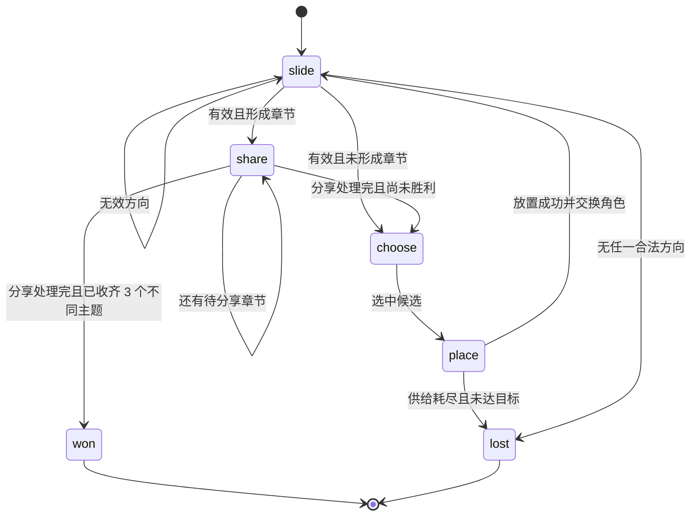

# Memory Merge Board specification

- 日期：2026-07-25
- 候选 ID：`memory-merge-board`
- 对外名称：把小事，合成我们的故事
- 分类：`co-op`
- 等级：A
- 启动：直接打开 `experiences/co-op/memory-merge-board/index.html`
- 运行环境：现代桌面与移动浏览器，必须支持 `file://`
- 前置文档：
  - `docs/322-memory-merge-board-research.md`
  - `docs/323-memory-merge-board-brainstorm.md`
- 决策：**Conditional Go**

## 1. 产品摘要

这是一个同设备、面对面、回合制的双人合作小游戏。

两个人共同整理一页 4×3 的回忆线索：

- 当前“整理者”选择整页滑动方向；
- 当前“补页者”从两张公开线索中选一张，并决定它进入来向边缘的哪个空位；
- 每个有效完整回合后交换职责；
- 相同主题、相同阶段的线索合成下一阶段；
- 完成的“章节”离开棋盘进入共同相册；
- 三个不同主题的章节完成本关；
- 章节完成时出现可留白、不记录答案的口头分享题。

产品不使用数字分值、随机出生、最高分、个人胜负、联网或私人数据存储。

## 2. 用户与使用场景

### 2.1 主要用户

两位在同一台手机、平板或电脑前的伴侣。产品不假设：

- 性别；
- 婚姻状态；
- 关系年限；
- 是否同居；
- 是否有共同照片；
- 是否愿意回答每一道分享题。

### 2.2 主要场景

1. 一方把本地仓库拷到设备上。
2. 双击入口 HTML。
3. 两人坐在同一屏幕前。
4. 无需安装、登录、授权或联网。
5. 共同完成一关，并在章节节点聊一两句。

### 2.3 非目标

这不是：

- 单人无尽合成；
- 2048 复刻或皮肤；
- 关系测评；
- 私人日记；
- 对话记录器；
- 照片管理器；
- 在线双人房间；
- 竞速或排名游戏。

## 3. 成功标准

### 3.1 功能成功

- 从首页到完成一关，全程可在 `file://` 下运行。
- 每个有效回合包含整理与补页两个玩家动作。
- 无效滑动不生成内容、不消耗候选、不交换角色。
- 同一新生成线索在一次滑动中不再次合并。
- 三个不同主题章节完成后进入成功状态。
- 所有关卡均由搜索程序证明至少存在一条成功路径。

### 3.2 体验成功

- 新用户只读分步提示即可完成第一个回合。
- 首关通常 4–6 分钟，后两关通常 6–10 分钟。
- 双方都能清楚说出自己本回合的职责。
- “这题先留白”不会造成惩罚或负面文案。
- 试玩者不会把产品主要描述为“轮流玩的 2048”。

### 3.3 技术成功

- 运行时无第三方依赖。
- 无网络请求。
- 无浏览器存储写入。
- 无权限请求。
- 320 CSS px 宽度下无水平页面滚动。
- 400% 缩放下核心流程仍可操作。
- 键盘、单击与滑动三种路径保持同一状态结果。
- `prefers-reduced-motion` 下无需动画也能理解变化。

## 4. 信息架构

单页应用包含五个顶层视图：

1. `welcome`：产品说明、隐私承诺、开始按钮。
2. `levelSelect`：三个固定关卡与已知难度说明；不保存完成状态。
3. `play`：共同相册、角色、棋盘、候选、控制与帮助。
4. `result`：成功或暂时排不下的结果。
5. `about`：玩法、隐私、键盘说明与借鉴入口。

不使用路由库或 URL hash。视图切换只改变 DOM 显示与内存状态。

## 5. 术语

| 术语 | 定义 |
|---|---|
| 座位 | `left` 或 `right`，只表示屏幕两侧的人 |
| 整理者 | 当前选择整盘滑动方向的座位 |
| 补页者 | 当前选择候选和落点的另一座位 |
| 线索 | 棋盘中的一个主题/阶段单元 |
| 主题 | `place`、`taste`、`sound`、`care` |
| 阶段 | `fragment`、`moment`、`story`、`chapter` |
| 章节 | 最高阶段；形成后离开棋盘进入相册 |
| 候选 | 当前公开、可被补页者选择的最多两张碎片 |
| 供给队列 | 关卡固定且有序的后续候选主题 |
| 来向边缘 | 与滑动方向相反的棋盘边缘 |
| 有效滑动 | 结果棋盘与输入棋盘不同的滑动 |
| 完整回合 | 有效滑动、必要分享、选择候选、放置、换位 |

## 6. 内容模型

## 6.1 主题

```text
place  地点
taste  味道
sound  声音
care   照顾
```

每个主题必须同时具有：

- 简短中文名称；
- 原创 SVG 符号；
- 独立轮廓或纹理；
- 视觉色；
- 章节分享提示；
- 辅助技术可读标签。

颜色不得成为唯一标识。

## 6.2 阶段

```text
0 fragment  碎片
1 moment    片段
2 story     故事
3 chapter   章节
```

内部可以使用 `0..3` 索引方便计算，但用户界面不得显示对应数字或幂次。

线索可表示为：

```js
{
  theme: "place",
  tier: 0
}
```

不需要随机 ID。动画差分若需要稳定身份，应由独立呈现层在一次动作范围内生成临时 token；token 不进入规则状态、求解器或序列化键。

## 6.3 分享提示

首版每个主题固定一条原创提示：

| 主题 | 提示 |
|---|---|
| 地点 | 你们会把哪一次一起出发收进这里？ |
| 味道 | 哪一种味道会让你立刻想到对方？ |
| 声音 | 有没有一段声音，一听就像你们的某一天？ |
| 照顾 | 哪一次小小的照顾，让你觉得被放在心上？ |

按钮固定为：

- `说好了，继续`
- `这题先留白`

系统不记录点击了哪一个，只消费当前分享状态。

## 7. 关卡模型

## 7.1 关卡定义

每关是静态 JavaScript 数据：

```js
{
  id: "first-page",
  title: "第一页",
  description: "先学会把两张碎片整理成片段",
  initialBoard: [/* 固定 12 格 */],
  initialCandidates: ["place", "taste"],
  supply: [/* 固定主题序列 */],
  targetDistinctChapters: 3,
  initialOrganizer: "left",
  hintPath: [/* 由求解器验证的黄金路径 */]
}
```

静态数据与页面脚本一起通过普通 `<script src>` 加载，不使用 `fetch()`。

## 7.2 首版关卡

首版正好三关：

1. `first-page`：教学关；初始空位多，候选分叉少。
2. `crossed-notes`：正式关；要求双方为两个主题预留通道。
3. `album-night`：正式关；候选和落点都有多次实质分叉。

具体棋盘与队列必须在实现阶段由求解器反向验证后定稿。未经求解器确认的数据不得提交为可玩关卡。

## 7.3 关卡发布约束

每关必须满足：

- 初始棋盘长度正好 12；
- 每格为空或合法 `theme/tier`；
- 初始棋盘不含 `chapter`；
- 初始候选正好两张，且均为合法主题；
- 供给队列至少允许黄金路径完成目标；
- 目标固定为三个不同主题；
- 至少存在一条成功路径；
- 黄金路径中的每个滑动都有效；
- 黄金路径中每次补页都有合法来向边缘空位；
- 成功前至少有三次双方角色交换；
- 正式关至少两次出现两个有意义的候选选择；
- 正式关至少两次出现两个或以上合法落点。

“有意义”定义为两个选择产生不同规范状态键，而非仅动画或临时 token 不同。

## 8. 规则状态

## 8.1 顶层状态

```js
{
  screen: "welcome" | "levelSelect" | "play" | "result" | "about",
  levelId: null | string,
  board: Array<null | Tile>,       // 长度 12
  organizer: "left" | "right",
  phase: "slide" | "share" | "choose" | "place" | "won" | "lost",
  candidates: Array<Theme>,        // 0..2
  supplyIndex: number,
  pendingTile: null | Tile,
  incomingDirection: null | Direction,
  shareQueue: Array<Theme>,
  archivedThemes: Array<Theme>,
  turn: number,
  lossReason: null | "blocked" | "supply-exhausted",
  announcement: string
}
```

`announcement` 是呈现状态，可从事件推导，不进入求解器的规范键。

## 8.2 不变量

任意已提交状态必须满足：

1. `board.length === 12`。
2. 棋盘线索主题与阶段合法。
3. 棋盘中不保留 `chapter`。
4. `organizer` 始终合法，补页者由其反值得出。
5. `phase === "slide"` 时 `pendingTile === null`。
6. `phase === "place"` 时 `pendingTile` 必须为碎片。
7. `phase !== "place"` 时 `incomingDirection` 只能在等待补页链中存在。
8. `archivedThemes` 可以含重复主题，但胜利按去重后数量计算。
9. `supplyIndex` 不超出供给队列长度。
10. `won` 与 `lost` 状态不接受棋盘动作。
11. 所有用户动作通过 reducer 返回新状态，不原地修改输入。

## 8.3 规范状态键

求解器与重复状态消除使用：

```text
board cells
+ organizer
+ phase
+ candidates in displayed order
+ supplyIndex
+ pending tile
+ incoming direction
+ share queue
+ sorted distinct archived themes
```

不包含：

- DOM；
- 动画 token；
- 文案；
- announcement；
- 焦点；
- 手势起点；
- 回合显示格式。

分享按钮两种选择具有完全相同的规则后继状态，所以求解器只需要一个 `continueShare` 动作。

## 9. 整盘滑动算法合同

## 9.1 方向

```text
up
right
down
left
```

界面方向、键盘方向和逻辑方向使用同一枚举。

## 9.2 单线变换

`mergeLine(line)` 接收按移动远端到近端排列的一行非空线索，并返回：

- 变换后的线索序列；
- 合并事件；
- 新形成的章节主题；
- 是否发生改变。

规则：

1. 只比较相邻项。
2. 主题和阶段都相同时合并。
3. 合并结果阶段加一。
4. 合并后扫描位置跳过两个输入项。
5. 本轮合并结果不参与下一次比较。
6. 不同主题或不同阶段绝不合并。
7. 章节加入归档事件，不放回输出线。

### 例子

用 `P0` 表示地点碎片，`P1` 表示地点片段，`T0` 表示味道碎片：

| 输入（远端 → 近端） | 输出 | 说明 |
|---|---|---|
| `P0 P0` | `P1` | 一次合并 |
| `P0 P0 P0` | `P1 P0` | 新结果不二次合并 |
| `P0 P0 P0 P0` | `P1 P1` | 两对独立合并 |
| `P0 P0 P1` | `P1 P1` | 第一对生成的 P1 不再与原 P1 合并 |
| `P1 P1 P1` | `P2 P1` | 同理 |
| `P0 T0 P0` | `P0 T0 P0` | 不跨主题越过合并 |
| `P2 P2` | 空 | 形成地点章节并出板 |

## 9.3 棋盘变换

`slideBoard(board, direction)`：

1. 根据方向生成 3 行或 4 列的索引序列。
2. 每条线按移动远端到近端提取非空项。
3. 调用 `mergeLine`。
4. 把输出线压到远端，其余格置空。
5. 汇总合并与章节事件。
6. 用结构比较判断棋盘是否改变。

若只有章节出板而位置最终类似，仍属于有效改变。

算法必须独立编写。不得复制参考仓库的遍历函数、命名、对象模型或源代码结构。

## 9.4 无效滑动

当结果棋盘与输入棋盘相同且没有章节事件：

- 保持全部规则状态不变；
- `phase` 仍为 `slide`；
- 不改变候选或供给；
- 不交换角色；
- 不增加回合；
- live region 宣布“这个方向没有可整理的线索，换一个方向试试”；
- 可以播放非位移动效，但 reduced-motion 下不播放。

## 10. 回合状态机



## 10.1 `slide` phase

接受：

- 方向按钮；
- 合法方向键；
- 合法棋盘滑动。

拒绝或忽略：

- 候选点击；
- 落点点击；
- 分享按钮；
- 动画锁期间的重复输入；
- `KeyboardEvent.repeat === true`；
- 来自输入控件的方向键。

有效滑动后：

1. 原子提交新棋盘与章节归档；
2. 记录 `incomingDirection`；
3. 若有章节，进入 `share`；
4. 否则进入 `choose`。

## 10.2 `share` phase

显示 `shareQueue[0]` 对应提示。

两个按钮都派发同一个规则动作：

```text
continueShare
```

动作：

1. 移除当前分享主题；
2. 若仍有分享，继续 `share`；
3. 若分享结束且不同主题数达到 3，进入 `won`；
4. 否则进入 `choose`。

不得：

- 保存选择按钮类型；
- 对留白显示负面提示；
- 在分享层背后响应棋盘输入；
- 自动启动麦克风。

## 10.3 `choose` phase

显示一或两张候选。

选择候选后：

1. 从候选数组移除所选主题；
2. 若供给未耗尽，用 `supply[supplyIndex]` 补到候选尾部并递增索引；
3. 将所选主题包装为 `tier: 0` 的 `pendingTile`；
4. 进入 `place`。

候选顺序稳定，不因 DOM 重排改变。

若进入 `choose` 时没有候选：

- 进入 `lost`；
- `lossReason = "supply-exhausted"`。

## 10.4 `place` phase

合法落点是 `incomingDirection` 的反向边缘中的空格：

| 滑动方向 | 来向边缘 |
|---|---|
| `left` | 最右列 |
| `right` | 最左列 |
| `up` | 最下行 |
| `down` | 最上行 |

选择合法落点后：

1. 把 `pendingTile` 放入该空格；
2. 清空 `pendingTile` 与 `incomingDirection`；
3. `organizer` 在 `left/right` 间交换；
4. `turn += 1`；
5. 若棋盘不存在任一合法滑动，进入 `lost/blocked`；
6. 否则进入 `slide`。

选择非空格或非来向边缘：

- 不改变状态；
- 宣布“请从亮起的边缘空位补页”。

每个有效滑动后，按压缩性质应至少存在一个合法边缘空位；若没有，属于实现或关卡错误，生产界面可以显示可恢复错误，但测试必须使构建失败。

## 10.5 `won` phase

- 棋盘与候选不可再操作。
- 显示三个已归档主题。
- 不显示分数、步数评价或个人贡献。
- 提供：
  - `再整理这一页`
  - `换一页`
  - `回到开始`

## 10.6 `lost` phase

文案：

> 这一页暂时排不下了。你们可以从开头再整理一次。

提供：

- `从本关开头再来`
- `看看第一步提示`
- `换一页`

提示只显示关卡黄金路径的第一步，不修改当前局面，不自动执行。

## 11. 胜负合同

### 胜利

`unique(archivedThemes).length >= 3`。

同一主题重复形成章节：

- 仍从棋盘移除；
- 仍可出现同主题分享；
- 不增加不同主题进度；
- 明确宣布“这是一次重访，相册还需要新的主题”。

黄金路径不得依赖重复章节。

### 失败

满足任一：

1. 完成补页后，没有任何方向会改变棋盘。
2. 需要进入候选选择时，候选与供给均为空。

无超时、生命值或个人失败者。

## 12. 输入合同

## 12.1 方向按钮

- 四个原生 `<button>`。
- 可见文本或可访问名称包含方向。
- 触控目标至少 44×44 CSS px。
- `phase !== "slide"` 时禁用。
- 禁用原因在当前阶段说明中可理解。

## 12.2 键盘

- 使用 `event.key` 的 `ArrowUp/Right/Down/Left`。
- 只有 `screen === "play"` 且 `phase === "slide"` 时响应。
- 当事件目标是 `input`、`textarea`、`select`、可编辑区域或按钮时，不进行全局劫持。
- 忽略 `event.repeat`。
- 只有实际处理动作时才 `preventDefault()`。
- Enter/Space 由原生按钮语义处理。

## 12.3 指针滑动

只绑定棋盘手势区：

1. `pointerdown` 记录单一 `pointerId`、起点与时间。
2. 第二个指针出现时取消本次手势。
3. `pointerup` 计算位移。
4. 主轴绝对位移小于 28 CSS px 时不触发。
5. 水平位移绝对值大于垂直时取左右，否则取上下。
6. `pointercancel`、`visibilitychange`、窗口失焦均清空临时手势。
7. 一次手势最多派发一个方向动作。

28px 是首版阈值，必须在触屏浏览器人工验收；如调整，只改常量和测试，不改变规则。

CSS 不在 `body` 上设置 `touch-action: none`。棋盘区只声明实现所需的局部触摸策略，并保留按钮路径与浏览器缩放。

## 13. 焦点合同

### 13.1 顶层

- 视图切换后，焦点移到新视图的 `<h1>` 或主标题容器，容器使用临时 `tabindex="-1"`。
- 不在普通状态公告时抢焦点。

### 13.2 回合

- 进入 `slide`：焦点落在方向控制组的第一个可用按钮。
- 进入 `choose`：焦点落在第一张候选按钮。
- 进入 `place`：焦点落在第一个合法边缘空位按钮。
- 进入 `share`：焦点落在分享标题，随后 Tab 到两个按钮。
- 进入 `won/lost`：焦点落在结果标题。

### 13.3 视觉

- 所有可交互元素使用清晰 `:focus-visible`。
- 焦点环不得被 `overflow: hidden` 截断。
- 禁用控件不能成为唯一的状态解释来源。

## 14. 状态公告

页面设置一个 `role="status" aria-live="polite" aria-atomic="true"` 区域。

应宣布：

- 当前整理者；
- 有效滑动后的合并数量；
- 形成的章节；
- 当前补页者与候选选择要求；
- 当前合法落点边缘；
- 完整回合后的角色交换；
- 无效方向；
- 重复章节；
- 胜利或失败。

公告示例：

> 左边的人向左整理，合成 2 组线索。现在请右边的人选择下一张线索。

不能连续用多个 live region 竞争播报。装饰动画不产生额外公告。

## 15. 响应式布局

### 15.1 320–599px

- 单列；
- 相册、角色、棋盘、候选、控制纵向排列；
- 棋盘宽度不超过视口减去 24px；
- 4 列保证每个格子仍有可辨文本；
- 方向按钮使用 3×3 十字排列；
- 候选卡纵向或两列排列，触控目标不小于 44px；
- 页面允许纵向滚动，不允许整体横向滚动。

### 15.2 600–959px

- 棋盘与侧栏可形成两列；
- 相册横跨顶部；
- 控制与候选在同一侧栏；
- 阅读顺序仍按 DOM 的相册 → 角色 → 棋盘 → 当前动作。

### 15.3 960px 以上

- 主体最大宽度受控，避免棋盘无限放大；
- 棋盘与操作区视觉平衡；
- 不复刻参考项目居中的 500px 数字盘布局。

### 15.4 缩放与重排

- 400% 缩放时保持完整按钮路径；
- 文字不得被固定高度容器裁剪；
- 不使用只在 hover 出现的关键信息；
- 方向、候选、落点均可在无 hover 环境理解。

## 16. 动效合同

动效只用于解释状态：

- 线索移动；
- 两张线索缝合成一张；
- 章节从棋盘移入相册；
- 两枚角色书签交换强调。

要求：

- 规则状态在动效开始前一次性提交；
- 动画期间锁定规则输入；
- `animationend` 只解除呈现锁，不再次修改规则；
- 设置超时兜底，避免事件丢失导致永久锁；
- 页面隐藏时立即结束装饰动画并呈现最终状态；
- `prefers-reduced-motion: reduce` 下取消位移动画，使用短暂边框/文本变化；
- 不使用闪烁、抖屏或大幅视差。

## 17. 视觉合同

视觉概念是“共同剪贴簿”，不是数字盘：

- 背景是低对比纸面层次；
- 棋盘是 4×3 的开放书架/纸槽；
- 线索使用原创小符号、文字和缝线纹理；
- 相册章节使用横向书签；
- 双方角色使用左右书签；
- 不显示任何数字价值。

禁止：

- 上游奶油与棕色主色组合；
- 上游方块颜色级差；
- Score/Best 卡片外形；
- 大号粗体数字；
- 固定 500px 方形棋盘；
- 上游字体、图标、截图或品牌元素。

## 18. 隐私与安全合同

### 18.1 数据

第一版不收集：

- 姓名；
- 日期；
- 地址；
- 照片；
- 音频；
- 视频；
- 自由文本；
- 联系方式；
- 设备标识；
- 行为分析。

### 18.2 存储

禁止使用：

- `localStorage`；
- `sessionStorage`；
- IndexedDB；
- Cookie；
- Cache API；
- 文件写入；
- URL 查询参数保存状态。

### 18.3 网络

禁止：

- `fetch`；
- `XMLHttpRequest`；
- WebSocket；
- EventSource；
- `sendBeacon`；
- 第三方脚本；
- CDN；
- 远程字体、图片、音频或 CSS。

浏览器测试需记录请求；除初始 `file://` 资源读取外，外部网络请求计数必须为 0。

### 18.4 权限

不得调用：

- 麦克风；
- 相机；
- 定位；
- 通知；
- 剪贴板；
- 全屏；
- 持久存储请求。

## 19. 依赖合同

### 19.1 运行时

零第三方运行时依赖。允许：

- HTML；
- CSS；
- 原生 JavaScript；
- 系统字体；
- 项目自有内联 SVG；
- 仓库内相对路径资源。

### 19.2 开发与测试

复用仓库已有的：

- Node 测试运行器；
- repository validator；
- 浏览器自动化环境。

不得为本项目新增独立前端框架、打包器或运行服务器。若测试需要导入规则模块，使用仓库现有 Node 兼容策略，同时保证浏览器入口通过普通 script 工作。

## 20. 开源借鉴与许可证合同

### 20.1 固定来源

- 仓库：<https://github.com/gabrielecirulli/2048>
- 固定 commit：<https://github.com/gabrielecirulli/2048/tree/478b6ec346e3787f589e4af751378d06ded4cbbc>
- 固定许可证：<https://github.com/gabrielecirulli/2048/blob/478b6ec346e3787f589e4af751378d06ded4cbbc/LICENSE.txt>
- 许可证：MIT License
- 版权人：Copyright (c) 2014 Gabriele Cirulli
- 固定许可证 SHA-256：`57e12c39a6ad9d98b2e451065bfdfbd15fc9e0c2ed3bf4dc1d09acab41ff02fc`

### 20.2 实际借鉴

- 整盘沿正交方向移动；
- 满足相同条件的相邻元素合并；
- 新合并结果在同一次移动中不二次合并；
- 无效移动不推进；
- 无合法移动时结束。

### 20.3 未复制边界

- 不复制源码、测试、函数结构或命名；
- 不复制名称、数字、目标值、随机生成或计分；
- 不复制 4×4 视觉布局、CSS、配色、字体或资产；
- 不复制本地最高分与继续挑战结构；
- 不复制 README 文案或截图；
- 所有规则代码、DOM、视觉、内容和测试从本 spec 独立实现。

### 20.4 交付文件

项目目录必须包含：

- `README.md`：简要说明固定参考与本地启动。
- `ATTRIBUTION.md`：完整固定 commit、许可证、版权人、实际借鉴、未复制边界。

若最终复制了任何 MIT 源码片段，必须另行保留相应许可证文本与版权声明，并精确标记文件；本 spec 明确要求不复制，因此正常实现不应触发该分支。

## 21. 错误处理

### 21.1 可恢复用户状态

- 无效滑动：保持状态并提示。
- 非法落点：保持状态并提示合法边缘。
- 取消手势：不派发动作。
- 页面隐藏：结束呈现动画，规则状态不变。

### 21.2 不可达内部错误

以下情况进入明确错误面板并允许重开本关：

- 棋盘长度不为 12；
- 非法主题或阶段；
- 有效滑动后无合法补页边缘；
- phase 与 pending state 不一致；
- 关卡定义无候选却要求补页；
- reducer 返回违反不变量的状态。

错误面板不显示堆栈或本地路径给普通用户。开发环境测试应抛出并失败。

## 22. 测试合同

## 22.1 规则单元测试

至少覆盖：

- 四方向索引映射；
- 空线与单项；
- 两项合并；
- 三项不连锁；
- 四项形成两对；
- 不同主题不合并；
- 不同阶段不合并；
- 阶段 2 合并形成章节并出板；
- 多条线同时合并；
- 一次形成多个章节的稳定顺序；
- 无效方向结构不变；
- 输入 board 不被修改；
- 四次旋转/方向对称性质。

## 22.2 reducer 测试

至少覆盖：

- 欢迎页到选关；
- 初始化关卡；
- slide 有效/无效；
- slide 到 share/choose；
- 多个 share 依次消费；
- 两个分享按钮规则结果相同；
- 候选选择与补充；
- 合法/非法落点；
- 完整回合角色交换；
- 候选耗尽失败；
- 棋盘阻塞失败；
- 三个不同主题胜利；
- 重复主题不增加进度；
- won/lost 拒绝游戏输入；
- 重开恢复原始确定状态。

## 22.3 求解器测试

对三关分别：

- 验证状态空间搜索能到达胜利；
- 验证输出黄金路径可由 reducer 重放；
- 验证路径不含无效动作；
- 验证每次补页落点合法；
- 验证最终至少三个不同主题；
- 验证相同输入总是得到相同路径；
- 记录探索状态数与最短或已选路径长度，防止配置意外爆炸。

若状态空间过大，允许使用有界 BFS、A* 或记忆化 DFS，但不得用随机模拟代替可解性证明。

## 22.4 DOM 测试

至少覆盖：

- 五个顶层视图；
- 分步教学只显示当前动作；
- phase 对应控件启用状态；
- 主题的文字/符号双重标识；
- live region 文案；
- 分享留白不记录；
- 结果页按钮；
- about 中的隐私与借鉴链接；
- 无 Score、Best、2048 或数字价值文案。

## 22.5 静态合同测试

扫描项目目录：

- 所有资源相对路径存在；
- 不含 `http://` 或非归因用途的 `https://` 运行时引用；
- 不含远程字体/CDN；
- 不调用网络、存储与权限 API；
- README 与 ATTRIBUTION 含固定 commit；
- ATTRIBUTION 含 MIT、版权人、借鉴和未复制字段；
- catalog 入口在根代理合并阶段再更新，本分支实现阶段不得抢写共享 catalog。

## 23. 浏览器 Gate

生产提交前必须在 Chromium 中直接打开：

```text
file://{repo-root}/experiences/co-op/memory-merge-board/index.html
```

独立 worktree 验证时使用该 worktree 的绝对 `file://` 路径。

### 23.1 桌面

在约 1440×900：

- 打开页面无控制台错误；
- 完成首关黄金路径；
- 无效方向不推进；
- 键盘可完成整关；
- 分享两个按钮后继状态相同；
- 成功页没有个人评分；
- 请求面板没有外部网络请求。

### 23.2 移动窄屏

在 320×800 与常见手机尺寸：

- 无水平页面滚动；
- 四方向按钮、候选与落点可点击；
- 滑动和按钮产生相同结果；
- 浏览器缩放未被全局禁用；
- 分享面板不遮住操作且可滚动；
- 文本不截断。

### 23.3 无障碍

- 仅键盘完成首关；
- Tab 顺序符合当前 phase；
- 焦点切换可见；
- live region 不重复刷屏；
- reduced-motion 下无位移动画；
- 高对比/主题不依赖颜色；
- 400% 缩放仍能操作；
- 页面标题、主标题、按钮名称清晰。

### 23.4 状态与生命周期

- 快速重复按方向键只提交一次合法动作；
- 动画期间点击不造成重复回合；
- 指针取消不移动棋盘；
- 切换标签页再回来，棋盘状态不变且没有永久输入锁；
- 刷新回到欢迎页，不恢复旧局面。

任何 Console error、外部网络请求、不可完成的固定关卡或键盘死路都阻止发布。

## 24. 与近邻项目的验收差异

### 对 `photo-slider-race`

必须能观察到：

- 只有一个共享棋盘；
- 不恢复图片；
- 一次输入移动整盘线索；
- 没有计时与个人胜负；
- 两个角色每回合交换。

### 对 `seven-day-garden`

必须能观察到：

- 主要决策是空间滑动和边缘落点；
- 候选没有卡牌技能或资源结算；
- 不按七日阶段推进；
- 胜利来自章节合成而非资源阈值。

### 对 `closer-cards`

必须能观察到：

- 对话提示只在章节完成时出现；
- 不回答也能无惩罚继续；
- 大部分时间是共同空间规划；
- 页面不记录回答或完成率。

### 对上游 2048

必须能观察到：

- 4×3 而非 4×4；
- 非数字主题/阶段；
- 固定公开候选由伙伴选择；
- 伙伴选择边缘落点；
- 章节出板；
- 三个不同主题共同完成；
- 无分数、最高分、随机生成和继续挑战；
- 完全不同的剪贴簿视觉。

## 25. 发布 Gate

### Go

全部满足才可将项目标为 installed：

- 三关求解器通过；
- 首关黄金路径的键盘、按钮与滑动浏览器测试通过；
- `file://`、零网络、零存储、零权限检查通过；
- 320px、400% 缩放、reduced-motion 通过；
- README 与 ATTRIBUTION 完整；
- 无复制来源代码、布局或资产；
- 与四个近邻项目的差异人工验收通过；
- 仓库 `npm test` 与 `npm run verify` 通过。

### Conditional Go

当前阶段保持 Conditional Go，因为尚未：

- 实现求解器；
- 定稿三关；
- 做双人试玩；
- 做浏览器 Gate。

### No-Go

出现任一即停止：

- 固定关卡无法证明可解；
- 补页者大多数回合没有实质选择；
- 实现使用随机出生或数字分值；
- 需要网络、服务或存储；
- 不能提供按钮等价滑动；
- 视觉或代码明显复刻 2048；
- 试玩者只感知为轮流玩 2048；
- 分享留白受到惩罚。

## 26. 开放项

允许在实现阶段通过测试确定、但不得改变核心合同：

1. 三关具体初始棋盘与供给队列。
2. 每关黄金路径长度。
3. 28px 手势阈值是否需在触屏上微调。
4. 原创色值与 SVG 细节。
5. 章节同时形成多个时的具体动画间隔。

不开放：

- 棋盘规格；
- 四主题四阶段；
- 双角色完整回合；
- 章节出板；
- 三个不同主题胜利；
- 固定公开供给；
- 零网络、零存储、零权限；
- 无分数与无随机；
- 固定开源归因和未复制边界。

## 27. 最终规范结论

本 spec 允许进入实现计划，但仍是 **Conditional Go**。

实现工作的第一关键路径不是搭 UI，而是：

1. 独立写出纯规则 reducer；
2. 写求解器；
3. 用求解器定稿三关；
4. 证明两位玩家都有实质决策；
5. 再接入本地单页 UI 与浏览器 Gate。

若求解器或试玩推翻双角色价值，应收缩或 No-Go，而不是用更多视觉包装掩盖机制问题。
