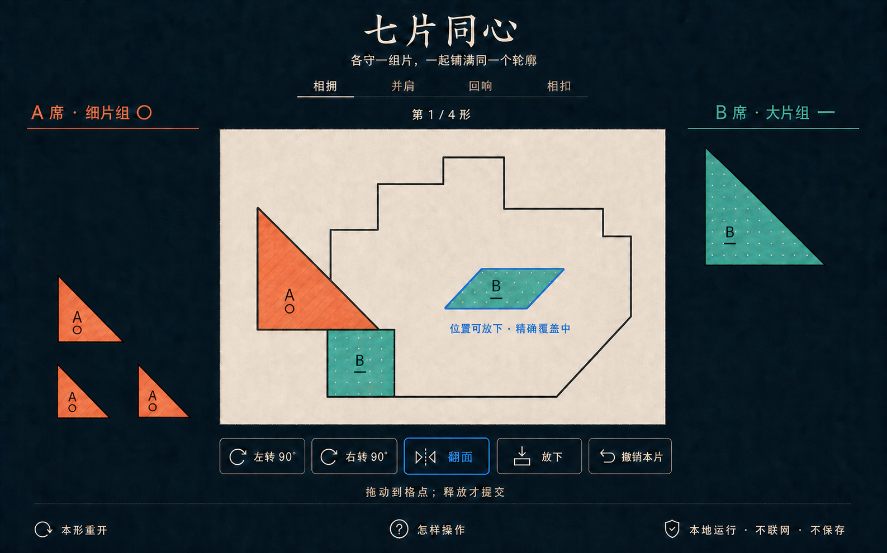
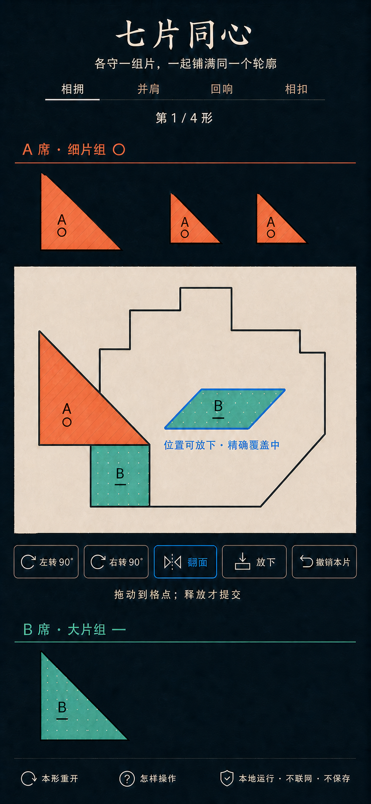

# `seven-piece-duet` / 七片同心视觉方案提案

> 状态：**等待用户确认**
>
> 阶段：仅视觉方案；不含生产 HTML、CSS、SVG 或 JavaScript
>
> 上游依据：[`326 research`](./326-tangram-heart-duet-research.md)、
> [`327 brainstorm`](./327-tangram-heart-duet-brainstorm.md)、
> [`328 spec`](./328-tangram-heart-duet-spec.md)、
> [`329 plan`](./329-tangram-heart-duet-plan.md)
>
> 后续生产前提：用户明确确认本提案；未确认前不得实现或安装

## 0. 本阶段结论

推荐采用 **“深墨纸面拼形台”**：

- 深墨蓝开放背景承载一张暖纸色共享目标板；
- A 席使用珊瑚斜线、`A` 与圆点 `○`，B 席使用青绿点纹、`B`
  与短横 `—`；
- 桌面是“A 托盘 / 共享板 / B 托盘”三列，移动端是“A 托盘 /
  共享板 / 控制 / B 托盘”单列；
- 同一时刻只有一块公开轮廓，双方都围绕它工作；
- 七片保持可见边缝和席位标记，不把完成态伪装成照片或无缝插画；
- 只呈现四局、片组交换、拖动、90° 旋转、平行四边形翻面、放下、
  取消和精确覆盖反馈；
- 不出现计时、分数、排行榜、回合、提示、自动解答或个人胜负。

概念图用于确认构图、气质、信息层级、响应式顺序和组件语言。它们不是：

- 生产页面；
- 可裁切的运行素材；
- 原创目标的坐标来源；
- 整数格元、合法落点或剩余格元数的规则证据；
- 可访问性、`file://` 或双 Pointer 的验收证据。

所有真实文字、按钮、图标、纹理、拼片、轮廓、焦点和反馈必须在用户确认后以
原生 HTML / CSS / SVG / JavaScript 重建，并以生产核心为唯一真值。

本阶段没有修改：

- `experiences/co-op/seven-piece-duet/**`；
- `experiences/catalog.json`；
- `docs/orchestration-board.md`；
- `shared/`、根依赖或其他项目；
- 既有 README、ATTRIBUTION、核心逻辑、测试、目标或生成器。

项目仍是 **Conditional Go**，没有 installed。

---

## 1. 概念资产

### 1.1 桌面主拼形



| 字段 | 记录 |
|---|---|
| 仓库路径 | `docs/assets/seven-piece-duet/desktop-playing-concept.png` |
| 原始尺寸 | 1587 × 991 px |
| 格式 / 色彩 | PNG / RGB |
| SHA-256 | `840715947b0da5ae0ab6797fe424a51e1851525a59dc04d55443c5a808a0c1a8` |
| 生成来源 | Codex 内置 `image_gen`，`ui-mockup` |
| 外部输入 | 无；只使用本文书面需求和同一生成链的前序草稿 |
| 原尺寸复核 | 已使用 `view_image(detail="original")` 复核 |
| 用途 | ≥900px 主拼形状态的构图、层级、A/B 等权和控制语言 |

桌面稿中视觉片数恰好为七：

- A 托盘：中三角、小三角、小三角；
- 共享板：A 大三角、B 正方形、B 平行四边形预览；
- B 托盘：B 大三角。

这只是“七片如何被看见”的视觉合同。片的真实面积、pose、格元和目标边界必须
来自未来合入的生产 `geometry` / `targets` / `logic`，不能从 PNG 反推。

### 1.2 390px 移动主拼形



| 字段 | 记录 |
|---|---|
| 仓库路径 | `docs/assets/seven-piece-duet/mobile-playing-390-concept.png` |
| 原始尺寸 | 853 × 1844 px |
| 目标 CSS 视口 | 390 × 844；原图长宽比与该视口一致 |
| 格式 / 色彩 | PNG / RGB |
| SHA-256 | `97e021d5ca58d1f3d6e8a774b75a9d36a7e336794d0ec4375ab67be2f970adbf` |
| 生成来源 | Codex 内置 `image_gen`，`ui-mockup` |
| 参考输入 | 本轮桌面概念，仅用于视觉系统和响应式结构；不是生产素材 |
| 原尺寸复核 | 已使用 `view_image(detail="original")` 复核 |
| 用途 | 390×844 单列主拼形、中央板持续可见和触控层级提案 |

移动稿同样视觉计数为七，并保留 A、共享板、控制、B 的完整顺序。它不是把桌面
图裁窄；生产实现需要在 320px 继续允许正常纵向滚动，并让控制不遮住共享板。

### 1.3 生成记录

- 生成目录：
  `/Users/zenith/.codex/generated_images/019f97bb-eca4-7e70-980f-59a91cfc27b4/`
- 桌面最终源文件：
  `call_WzCJLdCeqOclpgdOm0htLs4m.png`
- 移动最终源文件：
  `call_RjjQY1bwuREaFUFJxNLIP9Eb.png`
- 内置工具没有暴露可记录的模型名、seed 或采样参数；本文不虚构这些字段。
- 没有把上游仓库截图、传统题面、网络轮廓、坐标表或第三方视觉作为输入。
- 前序草稿只用于修正生成器多画拼片和虚构数值反馈的问题，未进入仓库。

---

## 2. 核心视觉与规则合同

### 2.1 同一公开轮廓

- 屏幕中只能有一块当前目标板；
- A/B 看到同一轮廓、同一片缝、同一合法性反馈；
- 不使用双盘、左右镜像题、个人进度或隐藏答案；
- 概念里的阶梯状抽象轮廓只是容器气质，不是“相拥”的生产几何；
- 生产必须渲染核心冻结的四个原创目标：**相拥、并肩、回响、相扣**；
- 不使用传统七巧板正方形、人物、船、动物、房屋、心形或网络常见题面。

### 2.2 七个整数几何片

生产真值仍是规格冻结的七片：

| 片 | 数量 | 归属组 |
|---|---:|---|
| 大直角等腰三角形 | 2 | `fine` 1、`bold` 1 |
| 中直角等腰三角形 | 1 | `fine` |
| 小直角等腰三角形 | 2 | `fine` |
| 正方形 | 1 | `bold` |
| 平行四边形 | 1 | `bold` |

视觉投影必须使用整数格元计算后的 SVG 顶点。不得以 PNG 边缘、CSS 像素、
自由角度或浮点碰撞作为规则输入。

### 2.3 席位独占与四局换组

- A/B 席位面积、标题层级和控制能力等权；
- `fine` 四片组与 `bold` 三片组面积各半；
- 四局按 `AB → BA → AB → BA` 交换片组；
- A/B 仅表示本机控制席位，不声称自然人身份认证；
- 对方片即使被点击，reducer 也必须拒绝；颜色和 DOM 父节点不是权限来源；
- 完成属于双方，不列个人放片数、速度、错误数或“最后一片英雄”。

### 2.4 操作与反馈

- 直接拖动只更新离散格点预览；
- `pointerup` 或“放下”才提交；
- 旋转只有“左转 90° / 右转 90°”；
- 只有平行四边形显示可用“翻面”；
- “撤销本片”只撤销当前 draft，不建立全局历史；
- 合法、越界、重叠、错误席位和完成都必须有文字与几何符号；
- 精确覆盖由七片格元并集与目标格元集合严格相等决定；
- 概念图的“精确覆盖中”只是状态语言；真实剩余格元若显示，必须由核心计算。

---

## 3. 视觉系统

### 3.1 方向名：深墨纸面拼形台

关键词：

- 成人编辑设计，不是儿童玩具；
- 亲密、安静、共同专注，不甜腻；
- 几何明确，但没有工程坐标纸；
- 一块共享纸面，不是 dashboard；
- 少量丝网印刷质感，不做真实木块或塑料 3D；
- 纹理用于归属，不是换肤系统。

### 3.2 色彩 token

| Token | 建议值 | 用途 |
|---|---:|---|
| `--ink-950` | `#101820` | 页面背景 |
| `--paper-100` | `#F5F0E6` | 共享目标板 |
| `--charcoal-900` | `#172126` | 主文字、片边界、轮廓 |
| `--sand-300` | `#D8CCB8` | 次级线、按钮边界 |
| `--coral-500` | `#E56B5D` | A 席主色 |
| `--coral-700` | `#A64238` | A 席高对比边界 |
| `--teal-500` | `#3BA99C` | B 席主色 |
| `--teal-700` | `#1C716A` | B 席高对比边界 |
| `--focus-600` | `#246BCE` | 键盘焦点和合法预览辅助 |
| `--danger-700` | `#9B332E` | 越界 / 冲突；必须附文字和符号 |

颜色锁：

- 背景是深墨蓝，不改成纯黑、紫色霓虹或暖咖啡桌；
- 纸面是克制暖白，不做仿古羊皮、木纹或照片；
- A/B 主色不能成为唯一归属信息；
- “合法”蓝不等于 B 席青绿；
- 错误色不能替代“越界 / 重叠 / 错误席位”文字。

### 3.3 字体

- 标题：本机中文宋体 / 系统衬线回退；
- 正文、席位、控制、反馈：系统无衬线；
- 数字使用 `font-variant-numeric: tabular-nums`；
- 不加载网络字体，不打包第三方字体；
- 标题只出现一次，无英文副标题、眉题、badge 或 slogan；
- 按钮必须显式设置字号、字重和行高，不能依赖浏览器默认值。

建议字号：

| 内容 | 桌面 | 390px | 320px |
|---|---:|---:|---:|
| 标题 | 44–56px | 30–36px | 27–32px |
| 一句话规则 | 18–22px | 16–18px | 15–17px |
| 席位标题 | 22–28px | 20–24px | 18–22px |
| 控制按钮 | 16–18px | 15–17px | 15–16px |
| 状态反馈 | 15–18px | 15–17px | 14–16px |
| 辅助说明 | 13–15px | 13–15px | 13–14px |

### 3.4 线、面、纹理和动效

- 共享板是唯一大面；两席是开放 rail，不套卡片；
- 片边界 2–3px，完成后仍保留细缝；
- A 使用 45° 稀疏斜线；B 使用规则点阵；
- A 圆点、B 短横必须在高对比和 forced colors 下仍可见；
- 阴影只分离纸面与背景，不制造悬浮卡片堆；
- 合法吸附 120–180ms；非法边界提示不超过 180ms；
- 完成只允许一次片缝收束，不使用粒子、彩纸或漂浮爱心；
- `prefers-reduced-motion: reduce` 时所有位移立即投影，规则不变。

---

## 4. 可见 copy 白名单

### 4.1 主拼形首屏允许

| 区域 | 唯一允许文本 |
|---|---|
| 标题 | `七片同心` |
| 一句话 | `各守一组片，一起铺满同一个轮廓` |
| 目标名 | `相拥`、`并肩`、`回响`、`相扣` |
| 轮次 | `第 {n} / 4 形` |
| A 席 | `A 席 · 细片组 ○` 或换组后的 `A 席 · 大片组 ○` |
| B 席 | `B 席 · 大片组 —` 或换组后的 `B 席 · 细片组 —` |
| 合法预览 | `位置可放下 · 精确覆盖中` |
| 拖动说明 | `拖动到格点；释放才提交` |
| 控制 | `左转 90°`、`右转 90°`、`翻面`、`放下`、`撤销本片` |
| 工具 | `本形重开`、`怎样操作` |
| 隐私 | `本地运行 · 不联网 · 不保存` |

`细片组 / 大片组` 必须读当前 round schedule，不能写死。若生产决定显示剩余格元，
只能用核心计算的 `还差 {n} 个格元`，不得沿用任何位图示例数字。

### 4.2 状态反馈允许

- `这片属于 A 席，请从 A 席控制区操作。`
- `这片属于 B 席，请从 B 席控制区操作。`
- `位置可放下。`
- `超出目标轮廓，请换个位置。`
- `与 {pieceName} 重叠，请一起调整。`
- `已放下。`
- `已取消本片。`
- `七片刚好合上了。`
- `这一形，是两边一起补全的。`
- `下一形交换片组。`
- `四个轮廓都完成了。`
- `再拼一次`

禁止新增：

- “轮到 A / B”；
- 分数、秒数、步数、错误数、排名；
- “你拖错了”“谁更厉害”“证明更爱”；
- 提示、答案、自动完成；
- 身份认证或“绝对不可代操”承诺；
- 营销口号、每日挑战、保存成功、云同步。

---

## 5. 图标合同

| 语义 | 未来 code-native 图标 | 约束 |
|---|---|---|
| 左转 / 右转 | 四分之一圆弧 + 箭头 | 自制 SVG；不使用 Unicode 回旋箭头作唯一语义 |
| 翻面 | 对称竖轴 + 两侧楔形 | 只在平行四边形可用；disabled 仍保留文字 |
| 放下 | 向下箭头 + 基线 | 不使用下载图标 |
| 撤销本片 | 回到起点的弧线 | 语义是取消 draft，不是全局 undo |
| 本形重开 | 单圆环箭头 | 必须有清楚文字；避免与撤销混淆 |
| 怎样操作 | 圆形问号 | 打开语义帮助，不是提示答案 |
| 本地隐私 | 盾形轮廓 | 只辅助“不联网 / 不保存”文字 |
| A / B 归属 | `○` / `—` + 纹理 | 不是头像、性别或关系角色 |

统一规则：

- `viewBox` 清楚，线宽约 1.75–2px，`round` cap/join；
- 使用 `currentColor`，不靠位图或第三方图标包；
- 光学尺寸桌面 20–24px、移动 20–22px；
- 图标不是唯一标签；
- 不裁切、描摹或自动矢量化概念 PNG 中的生成图标。

---

## 6. 组件与状态合同

### 6.1 组件族

1. `GameHeader`
   - 标题、一句话、本地隐私；
   - 不含导航、账号、统计或品牌图标。
2. `TargetProgress`
   - 四个原创名字和 `第 n / 4 形`；
   - 是文本 rail，不是四张卡片或可提前跳关 tab。
3. `SeatRail`
   - 席位、当前组、归属符号和托盘片；
   - A/B 使用同一结构和尺寸。
4. `SharedBoard`
   - 一个目标 SVG、已提交片和至多两个 draft；
   - 标准解不进入 DOM。
5. `PieceControl`
   - 原生按钮或具有等价语义的 SVG 按钮；
   - 文本名称包含片名、席位、托盘/已放和姿态。
6. `DraftControls`
   - 左转、右转、翻面、放下、撤销本片；
   - 翻面只对平行四边形启用。
7. `Notice`
   - polite live；只在 notice serial 改变时播报。
8. `RoundResult`
   - 共同完成、下一形、换组说明；
   - 无个人榜单。
9. `Help`
   - Pointer、键盘、席位和隐私说明；
   - 不给解答或轮廓 ghost。

### 6.2 视觉状态

| 状态 | 必须呈现 | 非颜色提示 |
|---|---|---|
| 托盘 | 所属席、片名、可操作 | `A ○` / `B —`、纹理、边框 |
| 已选择 | 焦点与当前 draft | 双层边界、`已选择` 可访问文本 |
| 合法预览 | 候选 pose | 实线轮廓、勾形或“位置可放下” |
| 越界 | 超出目标 | 外溢箭头、虚线和“超出目标轮廓” |
| 重叠 | 与既有片冲突 | 交叉线和冲突片名 |
| 已放 | committed pose | 实线片缝和“已放”状态名 |
| 完成 | 七片并集等于目标 | 标题、片缝收束和共同完成文字 |

概念图只冻结 `playing + valid preview`。其他状态必须沿用同一 token 和组件族，
实现后再以浏览器截图进入 fidelity ledger。

---

## 7. Pointer、鼠标与键盘

### 7.1 Pointer

- 每席最多一个活跃 Pointer 会话；
- 同一时刻可有 A、B 各一枚 Pointer；
- `pointerdown` 建立会话并选择，不提交；
- `pointermove` 只投影整数格点 draft；
- `pointerup` 才尝试提交；
- `pointercancel`、`lostpointercapture`、`blur`、`hidden`、重开和换局只取消；
- 第三根手指不能夺取已有会话；
- 迟到 generation / revision 事件必须 no-op；
- 鼠标走同一路径，右键、中键和 hover 不是必需操作；
- 活跃拼片命中区在常见移动视口至少 48×48 CSS px；
- 只在活跃板面使用必要 `touch-action`，页面仍可滚动和缩放。

### 7.2 键盘

- 页面加载焦点先到“开始”，不自动送入棋盘；
- Tab 可进入 A/B 托盘、已放片和各自控制；
- Enter/Space 选择或放下；
- draft 时方向键每次移动一个整数格点；
- 左转、右转、翻面、放下、撤销本片都有原生按钮；
- Escape 只在 draft 存在时取消；
- 非平行四边形的翻面按钮 disabled；
- 对方片被激活时状态不变，并播报权限说明；
- 焦点在输入、帮助或非棋盘区时不劫持方向键；
- 不用 WASD 或全局单字符作为唯一入口；
- 提交后焦点跟随同一片；换形后焦点到完成标题，再由用户继续。

### 7.3 焦点

- `:focus-visible` 使用 3px `--focus-600` 外环和 2px 背景间隔；
- A/B 颜色不能吞掉焦点；
- SVG 重绘不能替换当前聚焦节点；
- forced colors 下使用 `Highlight` / `HighlightText` 或等价系统色；
- 焦点顺序与视觉顺序一致，移动重排后仍是 A → board → controls → B。

---

## 8. 响应式合同

| 宽度 | 布局 |
|---|---|
| `≥900px` | A rail / 共享板 / B rail 三列；中央板最大 |
| `600–899px` | 共享板在上；A/B 两席等宽双列在下；控制紧邻板 |
| `<600px` | A rail → 共享板 → 控制 → B rail 单列 |

### 8.1 390×844

- 对照移动概念完整呈现；
- 标题、四目标、A rail、完整共享板、控制、B rail 均可达；
- 中央板宽度不超过视口，SVG 使用固定逻辑 `viewBox`；
- 控制按钮保持 ≥48px 高；
- 五个控制优先一行；若真实中文字体造成拥挤，允许 3+2 两行，不缩成图标；
- 页面允许正常纵向滚动，不设置 `user-scalable=no`。

### 8.2 320×568

- 标题可缩短垂直留白，但不删除；
- 四目标仍是文本 rail，可减小间距，不变成横向滚动卡片；
- 共享板完整，不裁掉目标；
- A/B 不收进 accordion、drawer 或 tab；
- 控制采用 3+2 换行；
- 页面可滚动，玩法区无横向溢出。

### 8.3 844×390

- 使用紧凑三列；
- 标题与目标 rail 合并为窄顶栏；
- 两席都保持可见；
- 控制在板下或板边，不遮目标；
- 不以横屏为理由隐藏 B 席。

### 8.4 768×1024 与 1440×900

- 平板使用板上、双席下的布局；
- 桌面最大内容宽度约 1500px，不能无限拉长片与按钮；
- 共享板保持视觉第一，托盘不成为侧边 dashboard；
- 200% 和 400% 缩放时允许重新流式排版。

---

## 9. 降动效、强制颜色与非颜色信息

### 9.1 `prefers-reduced-motion`

- 关闭吸附插值、错误抖动、片缝收束位移；
- 不关闭选择、提交、换形或完成；
- 状态变化即时投影；
- 不使用持续漂浮、脉冲或背景动画。

### 9.2 forced colors

- 目标轮廓使用系统文字色；
- 拼片以边框样式、`A ○` / `B —` 和纹理区分；
- 合法预览使用双实线，越界使用虚线 + 外溢箭头，重叠使用交叉线；
- 选中和焦点分别有独立边界；
- 所有按钮保留系统 ButtonText / ButtonFace 或等价映射；
- 不通过 `forced-color-adjust: none` 强行保留品牌色，除非单个几何纹理有实证需要。

### 9.3 非颜色席位合同

| 维度 | A | B |
|---|---|---|
| 文字 | `A 席` | `B 席` |
| 符号 | `○` | `—` |
| 纹理 | 45° 斜线 | 点阵 |
| 边框 | 双短角标 | 单长短横角标 |
| 可访问名 | `A 席…` | `B 席…` |
| 颜色辅助 | 珊瑚 | 青绿 |

任何一项缺失都不能只靠颜色补救。

---

## 10. 生成幻觉与选稿记录

### 10.1 实际生成链

1. 桌面首稿：构图和层级成立，但把板上片与托盘片重复，视觉超过七片；
2. 桌面修订 1：减少 B 重复，但 A 仍多一枚大三角；
3. 桌面修订 2：删除额外 A 大三角，视觉计数变为七；
4. 移动首稿：响应式结构和七片计数成立；
5. 桌面、移动反馈修订：删除没有规则依据的“还差 13 个格元”，改为
   “位置可放下 · 精确覆盖中”。

最终仓库只保留两张修订后概念。前序稿没有作为资产提交。

### 10.2 最终图仍需防误读

| 观察 | 未来处理 |
|---|---|
| 目标轮廓由生成器绘制，不是核心原创目标坐标 | 不描摹；只从生产 `targets` 渲染 |
| 拼片视觉比例只是近似，不能证明 16 个原子格元 | 不量图；使用生产 geometry |
| `精确覆盖中` 不是权威计数 | 真实提示由 reducer / public view 计算 |
| 概念把 B 平行四边形预览画在目标中 | 生产必须区分 draft 与 committed，完成判定忽略未提交 draft |
| 部分弧箭头、翻面、放下、盾形图标为生成式近似 | 不裁切；重建为自制 code-native SVG |
| 纸纹、阴影和标题字形为位图近似 | 使用受控 CSS 和本机字体，不追求像素复刻 |
| 片上的 `A/B` 标记位置不一定适合所有旋转 | 生产标签需保持可读方向或使用屏幕固定角标 |
| 移动稿在原图中为 853×1844 | 只作为 390×844 比例规格，不把像素当 CSS 尺寸 |
| 所有文字都在位图里 | 生产全部重写为语义 DOM，不把截图作为 UI |

### 10.3 严禁从概念图带入

- 传统 tangram 标准题面、坐标、解答或比例；
- 生成器臆造的 target path；
- 图片中的字体、纹理、图标 path；
- PNG 拼片 hit area；
- “看起来能放下”替代规则验证；
- 用概念图证明可访问性、双触控、`file://` 或零网络。

---

## 11. 未来 fidelity ledger

用户确认后，生产实现必须逐项填写，而不是只写“看起来一致”：

| 对比点 | 概念证据 | 生产截图 / DOM 证据 | 允许偏差 | 状态 |
|---|---|---|---|---|
| 标题与一句话 | 两张概念顶部 | 待补 | 必须逐字一致 | 待实现 |
| 四目标顺序 | 相拥→并肩→回响→相扣 | 待补 | 不允许重排 | 待实现 |
| 桌面三列 | A / board / B | 待补 | 仅规格断点可重排 | 待实现 |
| 390px 单列 | A→board→controls→B | 待补 | 不得隐藏席位 | 待实现 |
| 单共享轮廓 | 两图中央仅一板 | 待补 | 不得变双盘 | 待实现 |
| 七片计数 | A4 / B3 | 核心 view + DOM | 不允许重复或 ghost | 待实现 |
| A/B 等权 | 同字号、同 rail | 待补 | 组数不同但视觉权重相等 | 待实现 |
| 非颜色归属 | A○斜线 / B—点阵 | forced-colors 截图 | 不允许只剩颜色 | 待实现 |
| 控制文案 | 五个显式按钮 | DOM + 截图 | 320px 可换行，不可图标化 | 待实现 |
| 翻面边界 | B 平行四边形 selected | reducer + disabled 状态 | 非平行四边形必须 disabled | 待实现 |
| 合法 / 越界 / 重叠 | 蓝实线为合法基准 | 三状态截图 + live | 语义必须文字化 | 待实现 |
| 字体与色温 | 深墨、暖纸、系统字 | computed style | 不改霓虹或纯黑 HUD | 待实现 |
| 纸面容器 | 一块主面，无卡片海 | DOM 结构 | 不得 dashboard 化 | 待实现 |
| Pointer | 画面只表达可拖 | 双 Pointer 实测 | 概念不算证据 | 待验收 |
| 键盘 | 显式按钮层级 | 键盘完整一形 | 概念不算证据 | 待验收 |
| reduced motion | 无持续动画 | 媒体查询实测 | 状态不得丢失 | 待验收 |
| `file://` | 文案“不联网不保存” | 双击四形 + DevTools | 文案不算证据 | 待验收 |

实现后至少需要：

- 1440×900 主拼形截图；
- 390×844 主拼形截图；
- 320×568、844×390、768×1024 布局证据；
- 合法、越界、重叠、round complete、match complete；
- 键盘焦点、reduced motion、forced colors；
- 同一 QA 轮次中以 `view_image` 同时查看概念图和浏览器截图。

未经上述对照，不能宣称 10/10 fidelity。

---

## 12. 来源与借鉴边界

本轮视觉概念没有输入或复制任何上游截图、代码、坐标、传统题面、字体、图标或
素材。生产项目既有固定来源和零复制边界继续以
[`experiences/co-op/seven-piece-duet/ATTRIBUTION.md`](../experiences/co-op/seven-piece-duet/ATTRIBUTION.md)
为准。

视觉概念只使用：

- 本仓库 research / brainstorm / spec / plan 中已经冻结的产品约束；
- 本项目原创中文名和四个原创目标名；
- Codex 内置 ImageGen 的文本生成结果；
- 同一生成链的前序概念作为响应式和单点修订参考。

如果未来实现实质借用任何额外开源 UI、图标、纹理、字体、拖拽代码或目标坐标，
必须先暂停，固定仓库、commit、许可证、版权主体、实际借鉴与未复制范围，再写
生产代码。

---

## 13. 完整 ImageGen prompt 记录

以下按实际调用顺序完整记录。内置工具没有提供模型、seed 或采样参数。

### 13.1 桌面首稿

```text
Use case: ui-mockup
Asset type: complete desktop browser game UI concept, visual proposal only, approximately 1440×900 landscape
Primary request: Create a complete, high-fidelity desktop interface concept for a local same-device two-player cooperative geometric puzzle named exactly “七片同心”. Show the active PLAYING state for “第 1 / 4 形 · 相拥”. Both people share ONE public abstract target silhouette and must exactly cover it together with exactly seven integer-grid geometric pieces. This is a serious, intimate editorial puzzle for adults, not a children’s tangram toy.
Audience/purpose: a couple, partners, or any two people sitting at one laptop. A and B each exclusively control their own piece group, with no turns, no score, and no timer.
Scene/backdrop: full desktop browser viewport on a deep ink-blue #101820 background. One restrained warm-white paper-like central play field, but keep the overall container open and flat rather than a dashboard card. Subtle screen-print texture only; no photographed table, no physical toy rendering.
Visual direction: refined editorial geometry, “deep ink paper puzzle table”, crisp flat vector-like UI, adult design publication mood, calm and intimate, 7/10 creativity, practical for future HTML/CSS/SVG recreation.
Composition: quiet top header with exact title “七片同心” and exact supporting line “各守一组片，一起铺满同一个轮廓”. Under it, a simple four-name progress rail using exact labels “相拥  并肩  回响  相扣”, with 相拥 underlined as current and exact round text “第 1 / 4 形”. No tabs shaped like cards. Main desktop workspace is a clear three-column arrangement: left A tray, large central shared target board, right B tray. Center must dominate.
Shared board: show ONE large non-heart, non-square, non-animal, non-boat, non-human abstract asymmetrical silhouette in pale warm paper with a strong ink outline. No coordinate numbers and no visible graph-paper grid. Show two pieces already placed inside it and the remaining area visibly empty. A subtle selected-piece preview sits inside the same outline with a solid edge and exact feedback text “位置可放下 · 还差 13 个格元”. Piece seams remain visible.
Exactly seven total geometric pieces across board and trays, no extras and no duplicates: A owns exactly four pieces — one large right isosceles triangle, one medium right isosceles triangle, two small right isosceles triangles. B owns exactly three pieces — one large right isosceles triangle, one square, one slanted parallelogram. Some are on the shared board and the rest remain in their trays, but count exactly seven overall. Shapes should read as discrete 90-degree-orientation integer geometry without displaying coordinates.
Ownership: A pieces use coral #E56B5D fill plus thin diagonal hatch, a visible “A” and circular dot marker ○. B pieces use teal #3BA99C fill plus tiny dot pattern, a visible “B” and short dash marker —. Both also have dark outlines. Do not rely on color alone.
Left tray exact heading: “A 席 · 细片组 ○”. Right tray exact heading: “B 席 · 大片组 —”. Each tray is an open rail, not a stack of cards. Each seat has equal visual weight.
Selected controls: place a simple horizontal control rail below the shared board with exact code-native-looking labels “左转 90°”, “右转 90°”, “翻面”, “放下”, “撤销本片”. The selected item is the B parallelogram, so “翻面” is enabled and visually associated only with that parallelogram. Also show small exact text “拖动到格点；释放才提交”. Use simple line icons only where helpful; buttons remain readable text.
Footer utilities: exact labels “本形重开”, “怎样操作”, and exact privacy line “本地运行 · 不联网 · 不保存”.
Interaction truths: no turn indicator; both seats can act; pieces drag and snap to integer positions; rotation only 90 degrees; only the parallelogram can flip; exact coverage feedback is textual and geometric; no hint or solution button.
Typography: sophisticated Chinese serif for the one title only, highly legible system sans-serif for all controls; comfortable desktop sizes; no tiny microcopy; no English subtitle.
Color palette: ink #101820, warm paper #F5F0E6, charcoal #172126, coral #E56B5D, teal #3BA99C, muted sand #D8CCB8, focus blue #246BCE. Flat color, very subtle shadow, no glow.
Container model: one open central board with two equal side rails; no nested cards, bento grid, dashboard panels, stats widgets, badges, pills, avatars, navigation sidebar, or marketing hero.
Constraints: complete readable active game screen. Use only the supplied Chinese UI copy. Real future UI text, buttons, icons, target geometry, piece geometry, patterns, and feedback will be code-native; this raster is only a design specification. Do not render the standard tangram square, standard tangram puzzle arrangement, any recognizable traditional tangram target, heart, house, cat, swan, person, boat, coordinates, solution ghost, score, timer, leaderboard, move counter, mascot, stickers, confetti, toy box, wood blocks, glossy plastic, 3D pieces, neon, glassmorphism, gradients, QR code, logo, watermark, browser chrome, extra text, or invented controls.
Avoid: children’s toy feeling, kindergarten colors, card wall, dashboard, gaming HUD, arcade styling, cyber neon, overly rounded components, photographed materials, sentimental hearts, traditional tangram imagery, duplicated pieces, illegible text.
```

### 13.2 桌面片数修订 1

```text
Edit the immediately previous desktop UI concept. Preserve its overall 1440×900 landscape composition, deep ink paper-puzzle visual system, exact Chinese title/copy, open three-column layout, typography, palette, controls, target-name rail, and adult editorial mood. Make only the following structural correction and keep all other design decisions stable:

There must be exactly SEVEN visible geometric pieces in the entire screen, counting both the shared board and trays, with no duplicates or ghost copies.
- A owns exactly FOUR total pieces: one large right isosceles triangle, one medium right isosceles triangle, and two small right isosceles triangles. Put exactly ONE A large triangle already placed on the shared board; put exactly THREE remaining A triangles in the left tray (one medium and two small). Do not show any additional A piece.
- B owns exactly THREE total pieces: one large right isosceles triangle, one square, and one slanted parallelogram. Put exactly ONE B square already placed on the shared board; put the selected B parallelogram as the only preview on the shared board; put exactly ONE B large triangle in the right tray. Do not show any additional B square or parallelogram.
Thus the visual count is exactly: 3 pieces in A tray + 1 piece in B tray + 3 pieces on board = 7.

Keep A coral diagonal hatch with A and ○; keep B teal dot pattern with B and —. Keep the selected B parallelogram preview and the enabled “翻面” control. Keep one shared abstract asymmetrical target silhouette, not a traditional tangram target, and keep all supplied exact text. Do not add new labels, legends, pieces, coordinates, solution outlines, cards, scores, timer, watermark, or browser chrome.
```

### 13.3 桌面片数修订 2

```text
Edit the immediately previous image with one surgical change only: REMOVE the single topmost large coral A triangle from the left A tray (the large triangle directly below the “A 席 · 细片组 ○” heading). Leave that location as empty dark background. Preserve every other visible element, piece, position, label, target, control, color, pattern, spacing, and text exactly as-is. After removal, the image must show exactly seven pieces total: left tray has exactly three coral A triangles (one medium and two small); shared board has one coral A large triangle, one teal B square, and one teal B parallelogram preview; right tray has one teal B large triangle. Do not add, move, resize, duplicate, or replace any other object. No extra text or marks.
```

### 13.4 移动主拼形

```text
Use case: ui-mockup
Asset type: complete portrait mobile browser game UI concept, visual proposal only, approximately 390×844
Primary request: Create a fresh, complete 390px portrait mobile adaptation of the immediately previous approved desktop concept for the local two-player cooperative puzzle “七片同心”. Preserve the same deep-ink paper-puzzle visual system, coral A hatch, teal B dots, adult editorial typography, and the same PLAYING state “第 1 / 4 形 · 相拥”. This must be a responsive redesign, not a crop of the desktop image.

Core information architecture from top to bottom:
1. Compact header with exact title “七片同心” and exact supporting line “各守一组片，一起铺满同一个轮廓”.
2. A simple four-name progress rail with exact labels “相拥  并肩  回响  相扣”, 相拥 underlined, and exact round text “第 1 / 4 形”. No pill tabs or cards.
3. A compact open A rail above the board with exact heading “A 席 · 细片组 ○” and exactly THREE coral pieces in a horizontal row: one medium right isosceles triangle and two small right isosceles triangles.
4. The central shared board must remain fully visible and dominate the viewport: ONE warm-paper abstract asymmetrical target silhouette, identical in visual character to the previous desktop silhouette, non-heart and non-recognizable, with one coral A large triangle already placed, one teal B square already placed, and one selected teal B parallelogram preview. Show exact textual feedback “位置可放下 · 还差 13 个格元”. Do not show a coordinate grid, coordinate labels, or solution ghost.
5. Directly below the board, a compact two-row sticky-feeling control strip with exact labels “左转 90°”, “右转 90°”, “翻面”, “放下”, “撤销本片”. “翻面” is enabled because the selected piece is the B parallelogram. Include exact help line “拖动到格点；释放才提交”. Controls must not cover the target.
6. An open B rail below controls with exact heading “B 席 · 大片组 —” and exactly ONE remaining teal large right isosceles triangle.
7. Small footer exact labels “本形重开”, “怎样操作”, and “本地运行 · 不联网 · 不保存”.

Exactly seven visible pieces across the entire mobile screen, no duplicates and no ghosts: A tray 3 + B tray 1 + shared board 3 = 7. A owns exactly four total pieces (one large on board, one medium and two small in tray). B owns exactly three total pieces (square on board, selected parallelogram preview on board, one large in tray). Use visible A/○ or B/— marks plus texture and dark outlines; do not rely on color alone.

Interaction truths: same one public target for both seats; no turns; no score; no timer; drag to integer snap; only 90-degree rotation; only parallelogram flips; exact coverage feedback; both seats remain visible and equally weighted.

Style: refined adult editorial geometry, flat vector-like code-implementable UI, deep ink #101820, warm paper #F5F0E6, coral #E56B5D, teal #3BA99C, charcoal #172126, muted sand #D8CCB8, focus blue #246BCE. Sophisticated Chinese serif only for title; system sans-serif for controls. Crisp, readable, generous but compact spacing. Minimum practical 48px touch targets.

Container model: one vertical flow with an open shared board and two open seat rails. No nested cards, card stacks, bento, dashboard, side drawer, accordion, hidden seat, stats widget, badge, pill, avatar, marketing nav, or modal.

Constraints: This bitmap is only a visual design specification. All future real text, buttons, icons, geometry, patterns, focus, and feedback must be code-native HTML/CSS/SVG. Use only supplied Chinese copy. No standard tangram square or recognizable traditional tangram target, no heart, house, animal, person or boat, no coordinates, no score, timer, leaderboard, move count, hint, solution, mascot, stickers, toy-box look, wooden blocks, glossy plastic, 3D pieces, neon, glassmorphism, excessive rounding, QR code, watermark, browser chrome, extra text, or invented controls. No horizontal overflow; safe at 390px and conceptually reducible to 320px through normal vertical scrolling.
```

### 13.5 桌面反馈修订

输入图：`desktop-playing-concept.png` 的前序生成结果。

```text
Edit this desktop concept image with one surgical text correction only. Replace the blue feedback phrase “位置可放下 · 还差 13 个格元” with the exact phrase “位置可放下 · 精确覆盖中”. Preserve its font size, blue color, baseline, alignment, and surrounding whitespace. Do not change any other text, geometry, piece count, piece position, shape, outline, controls, icons, colors, patterns, layout, dimensions, or texture. The final image must still contain exactly seven visible pieces total and all existing Chinese text except for this one exact replacement.
```

### 13.6 移动反馈修订

输入图：`mobile-playing-390-concept.png` 的前序生成结果。

```text
Edit this portrait mobile concept image with one surgical text correction only. Replace the blue feedback phrase “位置可放下 · 还差 13 个格元” with the exact phrase “位置可放下 · 精确覆盖中”. Preserve its font size, blue color, baseline, alignment, and surrounding whitespace. Do not change any other text, geometry, piece count, piece position, shape, outline, controls, icons, colors, patterns, layout, dimensions, or texture. The final image must still contain exactly seven visible pieces total and all existing Chinese text except for this one exact replacement.
```

---

## 14. 用户确认门

本提案提交后必须停在确认门，不能自动继续生产实现。

请用户确认：

> 是否确认采用“深墨纸面拼形台”作为 `seven-piece-duet / 七片同心` 的生产
> UI 方向，并以桌面三列、390px 单列、A 珊瑚斜线 / B 青绿点纹、显式 90°
> 控制和单共享轮廓为 fidelity 基线？

只有收到明确“确认 / 采用 / 可以实现”等同意后，后续任务才可：

1. 修改 `experiences/co-op/seven-piece-duet/index.html`、`styles.css`、`app.js`；
2. 从生产核心渲染真实七片和四个原创目标；
3. 做 Pointer、键盘、响应式、forced colors、reduced motion 和 `file://` 验收；
4. 填写 fidelity ledger；
5. 在全部 Gate 通过后由总控决定 catalog / Board 集成。

若用户要求调整，先只更新本提案和概念资产；仍不得直接写生产 UI。
