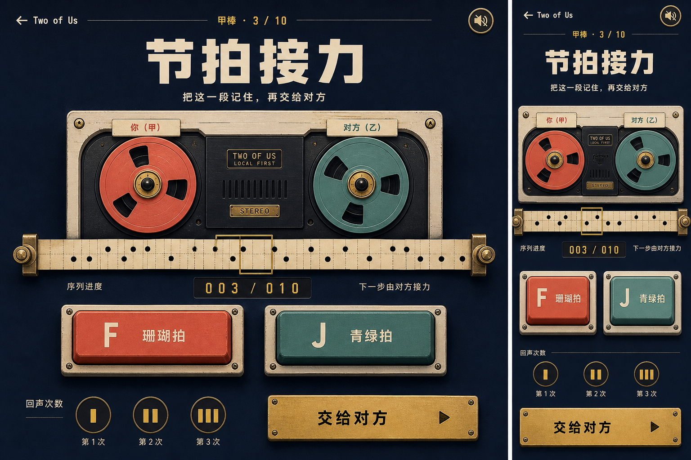

# A 级「节拍接力」双人合作规格

## 1. Brainstorm 结论

本批实现一款两个人轮流接住同一段节拍的短局合作：当前玩家先看见并听见一串“珊瑚拍 / 青绿拍”，按相同顺序复现，再亲手追加一拍交给对方。双方交替把 3 拍接到 10 拍即共同完成；三次失误耗尽前都可以重听同一段。

| 方案 | 价值 | 风险与成本 | 本批决定 |
| --- | --- | --- | --- |
| 只判断敲击时间间隔 | 更像真实节奏 | 移动设备音频延迟、运动能力与刷新率会影响公平 | 不采用 |
| 两种明确音色 / 色块组成序列 | 规则 20 秒可懂，键盘和触屏等价 | 接近经典记忆序列类型 | 采用，并用双人接力与交接隐私形成差异 |
| 每人各有一段独立序列 | 可做对抗 | 不产生“把同一段交给对方”的合作感 | 不采用 |
| 每次成功后系统随机加拍 | 实现简单 | 玩家只是复现，没有共同创作 | 不采用 |
| 成功者亲手选择下一拍 | 每个人都参与塑造下一人的挑战 | 需要独立 `append` 阶段 | 采用 |
| 实时同屏抢按 | 热闹 | 与反应力、拔河、心跳冲刺已有输入模型重叠 | 不采用 |
| Web Audio 音色 + 视觉脉冲 | 有听觉记忆，同时照顾静音和听障路径 | 必须由用户手势创建 AudioContext | 采用；视觉始终是完整信息源 |

作品名为「节拍接力」，目录 ID 为 `rhythm-relay`，主分类为双人合作，等级 A。它补齐仓库当前没有的“轮流听觉/视觉记忆 + 共同增长序列”模型，不新增第三方依赖。

## 2. 受众、唯一任务与语气

- **受众**：围在同一台电脑、平板或手机前，想用一两分钟完成合作挑战的情侣或伴侣；
- **唯一任务**：轮流复现并追加一拍，把共享序列从 3 拍接到 10 拍；
- **语气**：轻松、鼓励、无关系测试；失败描述为“回声散了”，不评价记忆力或默契；
- **首局理解目标**：进入页面后 20 秒内能开始，交接页一句话说清“递给对方，别偷看”。

## 3. 严格最小范围

只实现：

- 两种输入：`coral` 与 `sage`；
- 键盘 `F / J` 与两个原生触控按钮；
- 固定 3 拍起始序列，目标长度 10；
- 甲、乙两棒轮流，当前棒完成复现后选择并追加一拍；
- 交接遮挡、序列播放、复现进度、追加、失误、完成和重新开始；
- 3 次共享回声，失误后同一玩家重听同一序列；
- Web Audio 双音色，可静音；视觉脉冲提供等价信息；
- 页面隐藏、失焦或重开时取消播放计时器和音频节点。

明确不做昵称、难度选择、速度设置、自由录音、商业音乐、麦克风、震动、排行榜、历史、本地存储、分享、AI、联网房间或局域网同步。

## 4. 状态机

```text
intro
  └─ START(initialSequence) → handoff
handoff
  └─ READY → playback
playback
  └─ PLAYBACK_DONE → repeat
repeat
  ├─ TAP(correct, not complete) → repeat
  ├─ TAP(correct, sequence complete) → append
  └─ TAP(wrong, echoes > 1) → miss
       └─ RETRY → playback
  └─ TAP(wrong, echoes = 1) → failed
append
  └─ APPEND(beat, length < target) → handoff（换棒）
  └─ APPEND(beat, length = target) → complete
failed / complete
  └─ RESTART → intro
```

状态至少包含：

```text
phase, sequence, playerIndex, echoes, inputIndex, lastExpected, lastActual
```

不把播放动画、定时器 ID、AudioContext、DOM 引用或文案放进纯状态。`sequence` 与返回状态递归冻结，调用方不能在 reducer 外修改历史回合。

### 4.1 起始与目标

- `START` 只接受长度恰好 3、元素全为 `coral | sage` 的序列；
- 浏览器层用 `crypto.getRandomValues` 生成三个等概率输入；不可用时显示稳定错误，不退回 `Math.random`；
- 目标长度固定为 10，不作为首版设置；
- 第一棒固定为甲，之后只有合法追加才换棒。

### 4.2 复现与失误

- `repeat` 阶段每次只消费一个合法 `TAP`；
- 正确时 `inputIndex + 1`，完成整段后进入 `append`；
- 错误时扣一个共享回声，记录期望拍和实际拍，`inputIndex` 清零；
- `miss` 不接受更多拍，必须明确点击“再听一次”；
- `failed` 不保留可继续输入的半局；重新开始生成全新 3 拍序列。

### 4.3 追加与胜利

- `append` 只接受一个合法 `APPEND`；
- 追加后长度小于 10：玩家换棒、进入 `handoff`，序列在 DOM 中被遮挡；
- 追加后长度等于 10：进入 `complete`，共同展示双方交替留下的十拍；
- 完成页不区分“谁贡献更多”，因为两人追加次数由固定轮换决定。

## 5. 纯逻辑接口

`logic.js` 采用仓库现有 A 级的经典脚本 factory，既能从 `file://` 加载，也能由 Node 测试导入：

```text
createRelayState()
startRelay(state, initialSequence)
markReady(state)
finishPlayback(state)
tapBeat(state, beat)
retrySequence(state)
appendBeat(state, beat)
restartRelay()
validateInitialSequence(sequence)
```

所有函数都返回新冻结状态或原引用；非法阶段、畸形状态、未知 beat 和超长序列不能抛出未处理异常、产生 `NaN` 或跳过 Gate。

至少测试：

- 初始状态与 3 拍输入校验；
- handoff → playback → repeat 的唯一合法路径；
- 正确复现逐拍推进，未完成时不能追加；
- 错误拍扣一次回声、清空输入并锁到 miss；
- retry 不换玩家、不改序列、不重复扣回声；
- 三次错误进入 failed；
- 追加一拍后换棒并重新遮挡；
- 第 10 拍进入 complete；
- 非法阶段、未知 beat、重复事件和畸形状态保持安全；
- 所有嵌套状态冻结且不共享调用方数组。

## 6. 浏览器编排与音频

### 6.1 播放计划

浏览器层按固定节奏播放：每拍亮起 `360ms`，间隔 `180ms`，前后各留 `300ms`。播放期间两拍按钮禁用，页面只显示“先听这一段”。播放结束由单一计划器派发 `PLAYBACK_DONE`，不能让多个悬空 timeout 重复推进。

每次开始新播放前先取消旧计划；`visibilitychange(hidden)`、`blur`、重新开始和页面卸载也执行相同清理。恢复页面后不自动继续或偷偷完成播放，而是回到可见的“重新播放”动作。

### 6.2 Web Audio 边界

- AudioContext 只在用户点击“开始接力 / 我准备好了 / 再听一次”后创建或恢复；
- 珊瑚拍使用较低、柔和的正弦音，青绿拍使用较高的三角音；
- 单拍 oscillator 与 gain 明确停止、断开，不保持常驻节点；
- 静音只关闭声音，不改变视觉脉冲、状态机或规则；
- Web Audio 不可用时自动采用完整视觉路径，不阻塞游玩；
- 不读取麦克风、媒体文件或设备音量，不记录任何音频数据。

## 7. 输入 Gate

- `F` 对应珊瑚拍，`J` 对应青绿拍；大小写等价；
- 只在 `repeat` 或 `append` 阶段接收，`event.repeat === true` 一律忽略；
- 只拦截 F/J，保留 Tab、Enter、Space 的原生按钮语义；
- 触控采用两个至少 64px 高的 `<button>`，同时显示颜色、图形、文字和键位；
- 播放、交接、失误和终局时按钮 disabled，避免视觉可操作而 reducer 拒绝；
- 同一物理动作只经 keydown 或 click 进入一次，不在 pointerdown 与 click 两处重复派发。

## 8. 交接隐私与数据边界

这不是安全加密，而是同机热座礼仪：

- `handoff` DOM 不包含序列文本、颜色列表或上一轮输入；
- 只有当前玩家点击“我准备好了”后才进入播放；
- 播放完成后只显示复现数量，不把整串答案作为静态提示；
- 完成页可以展示十拍共同作品，因为挑战已经结束；
- 序列只在当前页面内存存在，不写 localStorage、sessionStorage、IndexedDB、Cache API、URL、服务端或日志；
- 刷新页面即清空本局。

## 9. 视觉方向

方向是 **双磁带录音机 + 纸带打孔记录**，避免继续使用暖纸情书、运动海报、夜航地图或游戏机霓虹。



此概念由 OpenAI ImageGen 根据本规格生成，只作为构图、色板和控件层级的设计基准，不是运行时素材，也没有复制第三方作品。

### 9.1 颜色与字体

| 角色 | 值 |
| --- | --- |
| 深蓝机身 | `#17233f` |
| 奶油面板 | `#f4ecd8` |
| 珊瑚拍 | `#e66b5b` |
| 青绿拍 | `#5f8f82` |
| 黄铜细节 | `#d9a84e` |
| 墨色正文 | `#202535` |

- 标题使用紧凑粗黑无衬线，正文使用系统无衬线；
- 进度与拍号使用等宽数字；
- 不加载远程字体或图标，磁带盘、纸带孔与按键图形用 CSS / 内联 SVG 完成。

### 9.2 布局

```text
┌────────────────────────────────────────────┐
│ ← Two of Us             甲棒 · 3 / 10     │
│                                            │
│              节 拍 接 力                  │
│        把这一段记住，再交给对方            │
│                                            │
│      (磁带盘) ─── 纸带进度 ─── (磁带盘)   │
│                                            │
│    [ F  珊瑚拍 ]       [ J  青绿拍 ]       │
│               [ 当前主动作 ]               │
│          回声：● ● ●        [静音]        │
└────────────────────────────────────────────┘
```

唯一视觉签名是横向穿过双磁带盘的纸带：播放时纸带孔依次点亮，复现时只增加中性的进度孔，追加后新孔才显出对应颜色。状态权威仍来自 reducer，CSS 动画不能反推规则。

## 10. 响应式、动效与可访问性

- 常见桌面首屏完整看到标题、磁带、两拍按钮和主动作；
- 390×844 单列压缩但保留两拍按钮并排；320px 时允许上下排列，不压缩到 44px 以下；
- 无横向溢出，安全区使用 `env(safe-area-inset-*)`；
- `prefers-reduced-motion` 下取消磁带旋转和纸带滑动，亮灯仍即时呈现每拍；
- `aria-live="polite"` 只宣布阶段、失误与完成，不逐拍刷屏；
- 纸带进度使用可读文本“已接到 6 / 10 拍”，颜色不是唯一信息；
- 焦点环清晰，交接主按钮在阶段切换后获得焦点；
- JavaScript 不可用时显示明确说明。

## 11. 文件、集成与启动等级

```text
experiences/co-op/rhythm-relay/
├── index.html
├── styles.css
├── logic.js
├── logic.test.js
├── app.js
└── README.md
```

同时更新 `experiences/catalog.json`、门户内置 catalog、`experiences/co-op/README.md`、根 `README.md`、`docs/README.md` 和 catalog 测试。

A 级要求：

- 经典相对脚本、相对 CSS、原生 DOM、Web Audio；双击 `index.html` 即玩；
- 公网依赖与第三方运行依赖均为无；
- 不使用 ES Modules、`fetch`、XHR、WebSocket、CDN、远程字体、Service Worker 或持久化 API；
- 作品目录可单独复制，不依赖根 setup/start；
- Web Audio 失败只降级为视觉，不把作品升级为 B 级。

## 12. 借鉴与独立实现声明

- 创意来源是本仓库 [`40-idea-backlog.md`](./40-idea-backlog.md) 的 C15“节奏接力”，本规格把它细化为两色序列、交接遮挡、玩家追加与共享回声；
- 玩法属于常见的序列记忆类型，但本批不复制、改写或引入任何开源项目代码、视觉、音效、题库或素材；
- 状态机、双人接力规则、Web Audio 合成、DOM、CSS、文案、测试与全部实现均由本仓库自行完成；
- 若实现阶段实际查阅或引入开源项目，必须在 README 和本节补充固定来源、commit、许可证、借鉴内容与未复制边界后才可提交。

## 13. Chrome 验收

- 从 intro 完成一次甲 → 乙 → 甲的合法接力；
- 用受控序列验证正确复现、错误一次、retry、追加、换棒和最终 10 拍；
- 播放期间 F/J 与按钮不可提前输入，系统 repeat 不重复计拍；
- 交接页 DOM 不残留答案，完成页才展示全序列；
- 静音与 Web Audio 不可用时视觉路径完整；
- 页面隐藏、窗口失焦、重开会取消旧播放，恢复后不自动推进；
- 1269×774、390×844 与 320×700 无横向溢出、主控制不裁切；
- reduced motion、键盘 Tab/Enter/Space、F/J 和触控按钮均可完成核心路径；
- 控制台无 error/warning，Network 无非本地或公网资源。

## 14. 完成与提交标准

- 两人可在同一设备轮流把 3 拍接到 10 拍；
- 状态机、回声、换棒、遮挡、完成与畸形输入有纯逻辑测试；
- 音频是渐进增强，视觉与键盘/触控路径完整；
- A 级双击成立，无第三方依赖、公网请求和持久化；
- README 有明确独立实现与未来引用更新义务；
- `npm test`、`npm run verify`、语法检查和 `git diff --check` 通过；
- Chrome 桌面与移动核心路径通过；
- 新 bug 写入 `bugs/`，跨作品经验写入 `learn/`；
- 本规格与完整作品分别形成独立提交。
