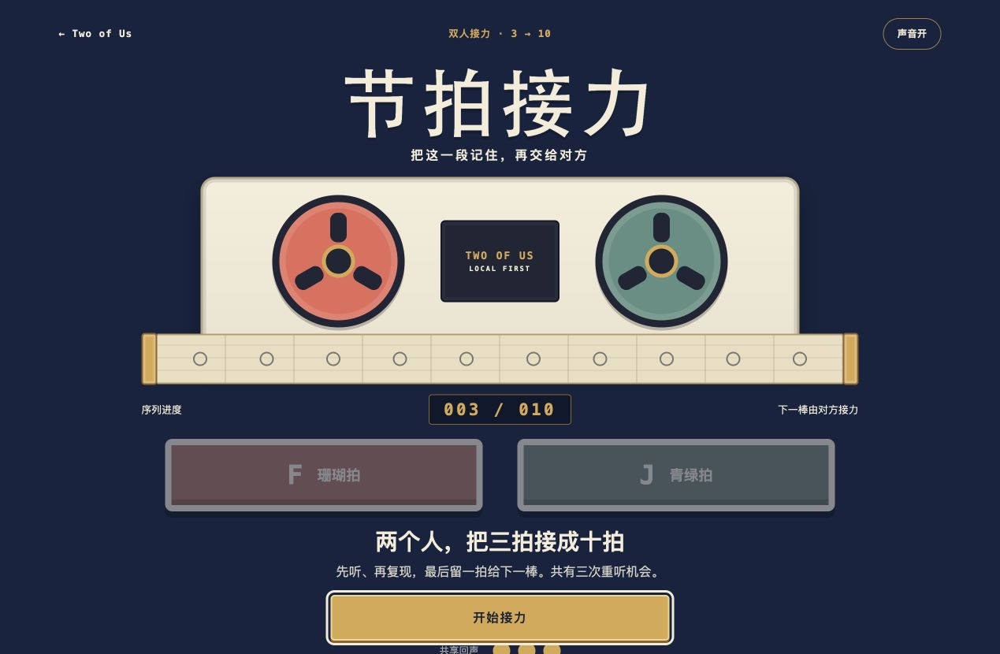
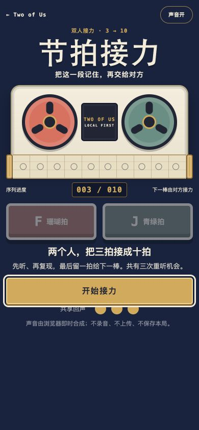

# A 级「节拍接力」设计与验收记录

验收日期：2026-07-17。

对应提交：

- `472d1b8`：玩法、状态机、视觉与验收规格；
- `2aac7fd`：完整 A 级作品、统一门户与视觉证据；
- `6030075`：320px 触控目标回归修复与 bug 记录。

## 1. 交付范围

「节拍接力」是原创的单设备热座合作体验。甲、乙轮流看见并听见双音序列，完整复现后亲手追加一拍；把三拍接到十拍即共同完成。作品没有第三方运行依赖、公网请求、持久化、麦克风或服务端状态。

运行入口：[`experiences/co-op/rhythm-relay/index.html`](../experiences/co-op/rhythm-relay/index.html)。A 级静态边界由 catalog 测试检查：经典相对脚本、无 ES Module、无远程 `src/href`，并拒绝 `fetch`、XHR、WebSocket、持久化 API 与 Service Worker。

## 2. 自动检查

| 检查 | 结果 |
| --- | --- |
| `node --test experiences/co-op/rhythm-relay/logic.test.js` | 8 / 8 通过 |
| `npm test` | 239 / 239 通过 |
| `npm run verify` | 20 个作品入口、1 个能力声明、资源与借鉴声明通过 |
| `node --check logic.js` / `node --check app.js` | 通过 |
| `git diff --check` | 通过 |

纯逻辑覆盖三拍开局校验、handoff → playback → repeat 唯一路径、正确复现、失误单次扣回声、重听、三次耗尽、追加换棒、第十拍完成，以及未知输入和畸形状态。

## 3. Chrome 实玩

浏览器自动化安全策略不允许直接导航 `file://`。因此双击边界由上述静态契约验证，视觉与交互使用只绑定 `127.0.0.1` 的临时静态服务器加载同一目录、同一相对资源；作品代码没有为测试引入服务依赖。

本次真实流程：

1. 从根门户找到“合作 / A 级 / 节拍接力”卡片并打开，入口、标题和首屏均正确；
2. 开始后交接页只包含当前棒、长度与准备动作，纸带已占用孔没有 `coral` / `sage` 类名，两枚拍键禁用；
3. 本局前三拍为 `sage / sage / sage`，故意输入 `coral` 后只扣一次共享回声，阶段锁在 miss；
4. 点击“再听一次”仍得到同一组三拍，随后用键盘 `J` 完整复现；
5. 甲追加珊瑚拍后交给乙，乙完成四拍并追加青绿拍，再交回甲；
6. 继续从页面实际亮起的纸带孔读取并复现 5–9 拍，最终进入 `010 / 010`；
7. 完成页展示十拍共同序列，两枚拍键禁用，“再接一盘”可用；
8. 作品页控制台没有 warning 或 error。

页面为 `blur`、`visibilitychange(hidden)`、restart 和 unload 共用同一取消函数；取消会清除全部 timeout、活动拍与旋转状态，恢复后只能明确从头重播。当前浏览器自动化后端不能可靠切换真实前台标签，因此本轮没有把合成的标签切换当作 live 通过证据；该生命周期仍保留为代码审查项，未来在人工最小 Gate 中复核。

## 4. 响应式验收

| 视口 | 结果 |
| --- | --- |
| 1269×830 | `scrollWidth = innerWidth = 1269`；标题、磁带、双拍键和主动作均在首屏，页面总高 893px |
| 390×844 | `scrollWidth = innerWidth = 390`、`scrollHeight = 844`；拍键各 72px，主动作底部约 597px |
| 320×700 | `scrollWidth = innerWidth = 320`、`scrollHeight = 727`；拍键修复后各 64px，主动作底部约 658px |

320px 首版实测拍键约 63.60px，修复与回归证据见 [`bugs/2026-07-17-rhythm-relay-narrow-touch-height.md`](../bugs/2026-07-17-rhythm-relay-narrow-touch-height.md)。窄屏允许 27px 纵向滚动，但没有横向溢出，也没有压缩核心触控目标。

## 5. 概念稿忠实度账本

| 比较点 | 概念基准 | 实现结果 | 判定 |
| --- | --- | --- | --- |
| 信息层级 | 顶栏 → 大标题 → 磁带 → 拍键 → 主动作 | 顺序与主要占比保持一致 | 对齐 |
| 色板 | 深海军蓝、奶油、珊瑚、青绿、黄铜 | 使用规格中的六个固定色值 | 对齐 |
| 视觉签名 | 双盘录音机与横穿纸带 | CSS 双盘、中心铭牌和十孔纸带完整保留 | 对齐 |
| 输入识别 | F 珊瑚拍 / J 青绿拍两枚大键 | 桌面并排、320px 单列，文字与键位不依赖颜色 | 对齐 |
| 进度 | `003 / 010` 等宽读数与纸带孔 | 读数、孔位和完成序列均由状态派生 | 对齐 |
| 移动端 | 同一结构缩排，不换成另一套页面 | 390px 保持双键并排，320px 才切单列 | 对齐 |
| 主动作 | 黄铜大按钮作为唯一强调动作 | 阶段文案变化，但同一位置只保留一个主动作 | 对齐 |
| 质感 | 概念为高细节复古机械材质 | 实现采用更扁平的 CSS 机身与卷盘，减少装饰螺丝和写实纹理 | 有意偏离：保证纯静态、可缩放和小屏文字清晰 |

概念稿只作视觉设计基准并存放于文档，不进入运行时资源；实现截图来自最终浏览器页面。

## 6. 借鉴与来源声明

创意来自本仓库 [`40-idea-backlog.md`](./40-idea-backlog.md) 的 C15“节奏接力”。本项目没有查阅、复制、改写或引入任何开源项目代码、视觉、音效、题库或素材；状态机、双人换棒规则、Web Audio 音色、DOM、CSS、文案和测试均为本仓库独立实现。

视觉概念由 OpenAI ImageGen 根据规格生成。若未来实际参考或引入开源项目，必须按 [`05-reference-and-attribution-spec.md`](./05-reference-and-attribution-spec.md) 补充固定来源、commit、许可证、借鉴内容与未复制边界。
