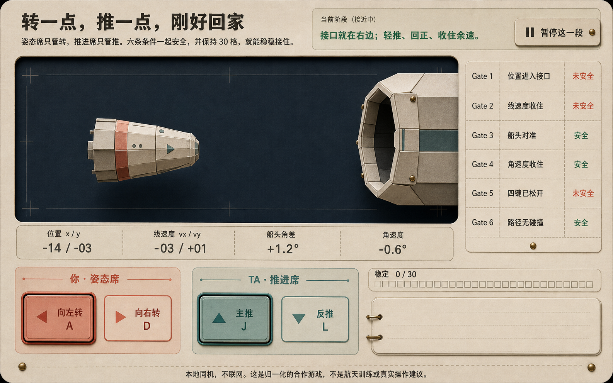
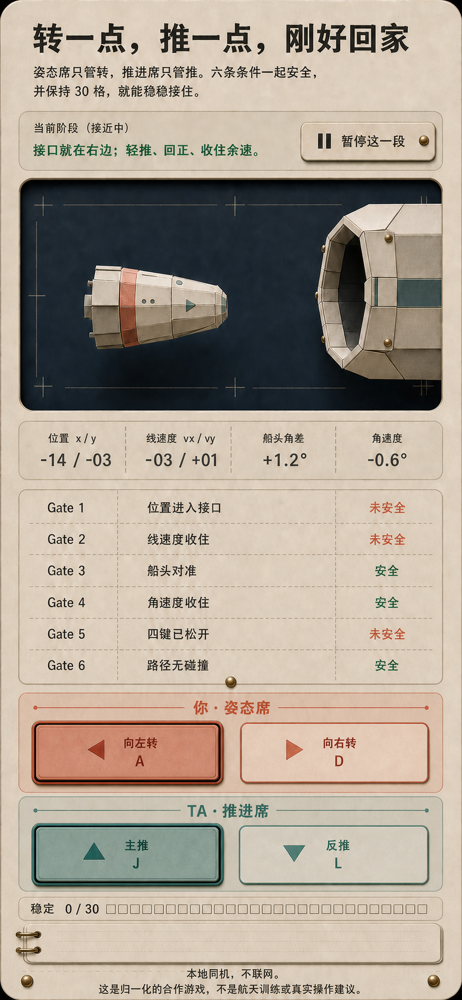

# capsule-docking 统一视觉方向提案

- 日期：2026-07-25
- 状态：**等待用户确认；未授权生产 UI 实现**
- 项目：`转一点，推一点，刚好回家`
- 唯一候选方向：**纸质近地轨道训练台**
- 视觉简报：[208-capsule-docking-imagegen-brief.md](./208-capsule-docking-imagegen-brief.md)
- 冻结规格：[177-capsule-docking-spec.md](./177-capsule-docking-spec.md)
- 核心复核：[349-capsule-docking-core-verification.md](./349-capsule-docking-core-verification.md)
- 生成账本：[GENERATION.md](./assets/capsule-docking/GENERATION.md)

> 本提案只请求确认一个统一方向，不声称存在“三个候选”，也不把概念图当成已经
> 完成的网页。确认后才能进入 `index.html`、CSS、输入层和浏览器验收阶段。

## 1. 本次请审阅的两张完整概念

### desktop active

[打开 1586×992 原图](./assets/capsule-docking/d05-desktop-approaching-partial.png)

### mobile active

[打开 853×1844 原图](./assets/capsule-docking/d12-mobile-390-approaching.png)

两张图表现同一个 active / approaching / 部分 Gate 安全状态。它们共同回答的是
“这个游戏应该长什么样”，不是用图片指定数值、规则、真实 viewport 或碰撞区域。

## 2. 方向结论

采用一块摊开的温暖纸质训练台承载整个合作过程：

- 深炭蓝观察窗是唯一强舞台；
- 一艘共享纸模舱体面对右侧原创接口；
- 珊瑚红只标识姿态席，青绿色只标识推进席；
- 象牙刻线、少量黄铜装订点和轻微丝网错位提供作者感；
- UI 像一张可以一起操作的教学模型桌，而不是军事驾驶舱、商业航天品牌页或
  通用太空海报；
- 页面不采用 bento、导航、侧栏、徽章、pill、玻璃拟态、霓虹网格或假统计。

它适合这个玩法，因为“同一张桌、同一艘船、两套等权但不同职责的控制”在第一眼
就能成立；浪漫来自共同把船接稳，而不是额外叠加爱心、烟花或个人贡献榜。

## 3. 用户确认后冻结的视觉角色

本阶段冻结角色与关系，不伪造尚未从浏览器实现中校准的精确像素 token。

| 角色 | 冻结方向 | 禁止漂移 |
| --- | --- | --- |
| 页面底色 | 暖灰纸张，低对比自然纤维感 | 纯白 SaaS 面板、紫蓝渐变、星空海报 |
| 主舞台 | 深炭蓝低噪点观察窗，象牙刻度 | 霓虹 HUD、真实星图、未来路线 |
| 姿态席 | 低饱和珊瑚红，配席位名、动作与键位 | 只靠红色表达职责或状态 |
| 推进席 | 低饱和青绿色，配席位名、动作与键位 | 只靠绿色表达职责或状态 |
| 安全状态 | 青绿文字 + 线型 / 结构差异 | 只有绿点、勾或颜色 |
| 未安全状态 | 珊瑚文字 + 线型 / 结构差异 | 报错式闪烁、责怪某一席 |
| 结构点缀 | 少量黄铜铆点、纸边与短阴影 | 大面积写实金属、glow、玻璃 |
| 标题 | 端正温暖的粗黑体系统回退 | 远程字体、英文品牌字、装饰花体 |
| 正文 / 控件 | 清晰人文无衬线系统回退 | 图片文字、过细字重 |
| 遥测数字 | 等宽系统回退 | 伪装真实航天仪器的单位和精度 |

精确色值、字号、间距、圆角、阴影和 SVG stroke 应在获批后的生产实现中，从这
两张原图提取初值，再以目标浏览器、200% zoom 和 forced-colors 结果校准。未经
真实 DOM 验证，概念图像素不升级为不可变合同。

## 4. 页面信息架构

`main` 的直接子级、DOM 顺序、键盘顺序和移动端视觉顺序固定为：

1. 页头：H1 与固定短规则；
2. 阶段面板：阶段、唯一 `statusText`、当前唯一主动作；
3. 完整比例舞台；
4. 四项遥测；
5. 六条 Gate；
6. 姿态席控制；
7. 推进席控制；
8. 稳定进度；
9. 完成日志；
10. 视觉隐藏的 live region。

desktop 概念中 Gate 位于舞台右侧，只可用来判断“舞台较强、Gate 紧邻”的空间
关系。生产布局不得为了逐像素复刻而反转第 3–5 项阅读顺序；优先采用舞台、
遥测带、Gate 区依次向下，再让两席控制在足够宽时等权并列的开放式训练台。

mobile 概念已经表现冻结顺序。姿态席必须是完整全宽组，推进席在其下方成为第二
个完整全宽组；两个席位组不得在 390px 宽度并排。每个组内部的两个大按钮可以
并排，但必须保持足够触控尺寸和完整 accessible name。

## 5. active 状态的视觉合同

本次两张图锁定：

- 当前阶段：`接近中`；
- 唯一状态：`接口就在右边；轻推、回正、收住余速。`；
- 唯一主动作：`暂停这一段`；
- 一艘共享舱体与一个右侧接口；
- 四项遥测全部可见；
- 六条 Gate 恰好是部分安全示例；
- 姿态席 `A` 与推进席 `J` 同时显示 pressed；
- 稳定进度为 `0 / 30`；
- 完成日志为空；
- 本地同机与非训练边界始终可见。

图中的静态数字、角度符号和英文 Gate 编号不是合同。生产状态只能投影 core 的
public view，不得用视觉稿补全、修正或覆盖 reducer 结果。

## 6. 其他阶段如何沿用同一系统

本阶段不再生成 11 张图片来制造虚假的完整度。用户若接受这个方向，所有阶段按
同一纸质训练台和同一信息架构实现：

| 阶段 | 保持不变 | 唯一允许突出的变化 |
| --- | --- | --- |
| intro | 舞台、四遥测、六 Gate、两席结构仍可理解 | 控制原生 disabled；主动作 `开始对接` |
| leg-intro 1–3 | 同一训练台与公开遥测 | 航段文案、初态空间位置、开始本段 |
| approaching | 所有信息区可见 | pressed、Gate 与稳定格实时投影 |
| failed | 舱体停在最后安全位置 | 共同失败文案、路径未安全、控制 disabled、重新靠近 |
| docked | 六 Gate 与 30 / 30 | 克制接口锁定、共同日志、进入下一段 |
| mission-result | 训练台不变 | 隐藏 Gate / stable，三段共同汇总成为主层级 |
| complete | 训练台不变 | 默认赠言与 `再对接一次`；不切换成通用贺卡 |

这张表冻结状态层级，不替代后续真实页面状态截图。实现阶段仍必须逐状态跑 core
fixture，并以浏览器截图建立 fidelity ledger。

## 7. 规则边界：视觉无权改变的事实

- 只有一个共享刚体；
- 姿态席只管 `A / D` 转向，推进席只管 `J / L` 主推和反推；
- 逻辑以 60Hz 整数 tick 运行；
- 成功必须同时满足六条 Gate，并连续稳定 30 个规则 tick；
- 六条 Gate 固定为：
  1. `位置进入接口`
  2. `线速度收住`
  3. `船头对准`
  4. `角速度收住`
  5. `四键已松开`
  6. `路径无碰撞`
- 每条只显示 `安全` 或 `未安全`；`allOk` 不是第七条 Gate；
- failed 时即使舱体停在最后安全位置，`路径无碰撞` 仍按 lastResult 的公开结果
  显示未安全；
- 位置、线速度、角度、角速度、Gate、稳定格、航段和共同日志只读 public view；
- 页面不推导下一键、不展示金路径、个人 control tick、个人失误或个人贡献；
- 不增加分数、燃料、倒计时、排行榜、最佳路线或真实单位。

概念中的形状、坐标、距离、角度、喷口、接口和刻度均不能进入规则运算。生产舞台
可以显示 core 状态，但碰撞绝不能读取 DOM/SVG 的实时几何或图片像素。

## 8. code-native 与图片边界

必须由 HTML / CSS / 原生 SVG / JS 生成：

- 所有文字、数字、单位、按钮、键帽和进度格；
- 六条 Gate、其安全文字、边框、线型和 forced-colors 替代；
- 焦点环、pressed、disabled、hover 与错误 / 完成状态；
- 舱体可视几何、接口可视几何、喷口方向和观察窗刻度；
- 碰撞几何及其与可视几何的同源映射；
- 响应式布局、日志、live region 与 reduced-motion 分支。

当前两张 PNG 必须继续留在 `docs/assets/capsule-docking/`，不得：

- 整张作为生产背景；
- 裁切成按钮、Gate、文字、键帽、舱体或接口；
- 充当碰撞遮罩、点击热区或隐藏教程；
- 因为“看起来像最终页”而跳过语义 DOM 和状态投影。

如后续确实需要纸纹或纸模资产，只允许生成无字、无状态、无命中语义的独立原子
资产，并补齐新的 `GENERATION.md`、hash、尺寸、透明通道、运行时用途和图片阻断
回退。最小生产实现可以完全用 CSS / SVG，不强制增加图片依赖。

## 9. 隐私、本地与诚实表达

- 必须可以在本地通过仓库定义的入口启动；不向网络上传昵称、按键、轨迹或日志；
- 不引入 analytics、远程字体、CDN、广告、登录、分享、排行榜或远程存档；
- 固定显示：
  `本地同机，不联网。这是归一化的合作游戏，不是航天训练或真实操作建议。`
- “你 / TA”只是可选称呼，不证明真实身份，也不保存伴侣关系；
- 共同日志只保留本局公开汇总，不暗示永久记忆、云同步或可恢复历史；
- 不使用 NASA、SpaceX、ISS 或任何商业航天品牌、徽标、真实舱段轮廓和训练背书；
- 不把归一化玩法包装成真实飞行、工程建议或安全训练。

## 10. 输入与可访问性边界

- 四个可见控制都必须是真正的 `<button type="button">`；
- 完整 accessible name 固定为“姿态席，向左转，A”等，而不是只读一个字母；
- 键盘与 Pointer Events 共享同一输入状态机，但支持两指同时按住不同席位按钮；
- `keydown.repeat` 不制造额外 PRESS；`keyup`、`pointerup`、`pointercancel`、
  失焦、页面隐藏、暂停、失败和卸载都必须释放控制；
- 阶段变化与共同结果进入克制 live region；逐 tick 遥测不刷屏；
- Gate 同时使用文字、结构 / 线型和颜色；
- `:focus-visible` 必须清楚，不能被纸纹或 pressed 阴影吞掉；
- reduced-motion 关闭星流、喷焰抖动和过渡，不改变状态与空间位置；
- forced-colors 下保留按钮边界、焦点、Gate 文字和 pressed / disabled 区分；
- 200% zoom 不能横向滚动；320 / 390px 下不裁切主动作、两席或固定边界；
- 无图片、无 CSS、无 JS 时分别保留可理解标题、规则、按钮语义和回退说明。

生成图中的按下描边、按钮厚度和可读中文不构成这些验收已通过的证据。

## 11. 响应式与动效

### desktop

- 单一开放训练台，不在纸面里再堆多层卡片；
- 舞台保持最强面积，遥测形成一条连续带；
- Gate 是一组连续清单，不拆成六张卡；
- 两席控制等权，不让“你”在面积、阴影或位置上压过“TA”；
- 日志可以较安静，但不能被永久裁掉。

### mobile

- 严格自然堆叠，不用 CSS `order` 或 `display: contents` 重排；
- 舞台保持可操作比例，不变成不可读缩略图；
- 遥测可以 2×2 排列，但 DOM 仍按四项固定顺序；
- 六条 Gate 保持六行完整中文；
- 姿态席完整一组在前，推进席完整一组在后；
- 底部必须出现 stable、日志和本地说明。

### 动效

- 只允许短喷焰、轻微星流、纸质 stable 刻度推进和 docked 锁定；
- 不使用持续呼吸光、全屏晃动、闪烁、庆祝粒子或运动模糊；
- 动画是 public view 的短暂表现，不反过来驱动物理 tick；
- `prefers-reduced-motion: reduce` 时全部可以关闭。

## 12. 生成幻觉隔离表

| 图中看见的东西 | 审批时可以接受 | 生产时必须纠正 / 验证 |
| --- | --- | --- |
| 纸张、炭蓝窗、珊瑚 / 青绿、黄铜 | 色彩角色与材质气质 | 浏览器对比度、forced-colors、无图回退 |
| 一艘纸模舱体与右侧接口 | 原创、温和、非品牌的造型语言 | SVG 与 core 碰撞几何同源但互不读取 |
| `Gate 1`—`Gate 6` | 六行的节奏 | 不把英文编号当新增冻结文案 |
| `+1.2°`、`-0.6°` 等数字 | 等宽遥测气质 | 改为 public view 与 `角度格` / `角度格/tick` |
| A / J 的压下效果 | 两席能同时操作的视觉关系 | DOM pressed、焦点、释放路径与多指测试 |
| 静态安全 / 未安全 | 状态文字的层级 | 每 tick 只按 public view 投影，不抄图片 |
| 纸模与接口间距 | “正在接近”的构图 | 不能当位置、Gate 或路径安全证据 |
| desktop 的 Gate 侧置 | 紧邻舞台的空间关系 | 生产不反转冻结的语义与阅读顺序 |
| 853px 宽长图 | 移动端纵向密度参考 | 不是 390 CSS px；须在真实 390 / 320 viewport 验证 |
| 看起来完整的页面 | 可用于方向审批 | 不代表按钮、键盘、离线、file:// 或可访问性已实现 |

## 13. 借鉴声明

本视觉方向没有输入第三方图片、品牌素材、真实空间站照片或其他开源项目 UI。
舱体、接口、纸质训练台、配色和排版为本次独立生成与整理。

非视觉机制只研究下列开源项目的抽象点，当前没有复制、改写、翻译、链接、打包
其代码、API、参数、测试、界面、品牌或素材，也没有把它们加入运行依赖：

- Farama Gymnasium：只研究状态类别分层；
- p2.js：只研究固定 dt、accumulator、最大子步和规则 / 渲染分离；
- SAT.js：只研究粗排除、精确碰撞和安全判定分层；
- Phaser：只研究按下 / 抬起、repeat、失焦复位和监听器清理职责；
- NASA NTRS 资料：只作位置、速度、姿态和姿态率四类背景理解，不是代码、
  参数、视觉或训练结论来源。

固定 commit、许可证、版权主体和逐项排除范围以
[`experiences/co-op/capsule-docking/ATTRIBUTION.md`](../experiences/co-op/capsule-docking/ATTRIBUTION.md)
为正式声明。任何未来第三方代码或资产引入都必须先停止“零第三方运行依赖”
结论，并重新做文件级许可证审计。

## 14. 获批后的 fidelity ledger

实现阶段至少维护以下逐项对照；“像”不能替代功能与规则证据：

| 对照项 | 概念锚点 | 生产证据 | 允许差异 |
| --- | --- | --- | --- |
| 整体方向 | 两张 active 原图 | desktop / mobile 浏览器全页截图 | 为语义顺序、对比度和真实 viewport 调整比例 |
| 舞台与共享舱体 | desktop 主舞台 | SVG 截图 + core 坐标投影测试 | 不复刻生成图静态坐标 |
| 四遥测 / 六 Gate | 两图完整区域 | DOM 数量、文案、单位与状态测试 | 删除生成的英文 Gate 编号 |
| 双席控制 | A / J pressed 视觉 | 键盘、多 Pointer、失焦和 disabled 测试 | focus / pressed 以可访问性为先 |
| 移动端顺序 | mobile 长图 | 390 / 320 截图与 DOM 顺序检查 | 真实 CSS px 下自然增高 |
| 纸纹与色彩 | 两图材质 | CSS / SVG 实现截图、无图回退 | 可减少纹理以保证文字清晰 |
| stable / 日志 | 两图底部 | 0 / 30、17 / 30、30 / 30 与结果态截图 | 不照抄静态空格数量 |
| 隐私边界 | 两图页尾 | 网络面板、源码和文案检查 | 无 |

## 15. 审批范围与下一步

如果用户确认，批准的是：

- “纸质近地轨道训练台”作为唯一统一视觉方向；
- 两张 active 图作为桌面与移动端视觉锚点；
- 本文的 code-native、规则、隐私、借鉴和可访问性边界。

确认不等于：

- 批准生成图中的具体数值、单位、文字错误或几何；
- 认为生产 UI 已完成；
- 允许修改 core、catalog、Board、共享索引或引入网络依赖；
- 允许把两张概念 PNG 放进运行页面。

获批后下一独立阶段才可实现生产 UI，并按状态、viewport、zoom、键盘、多指、
BFCache、reduced-motion、forced-colors、图片阻断和 `file://` 三层入口验收。

**请使用这句完整确认：**

> 确认 capsule-docking：接受“纸质近地轨道训练台”统一方向，以 desktop active 与 mobile active 两张当前概念为视觉锚点；生产 UI 按 369 的 code-native、隐私、规则、无障碍和生成幻觉边界实现。
