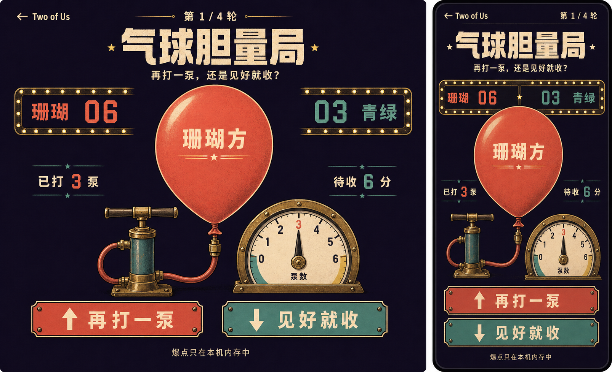
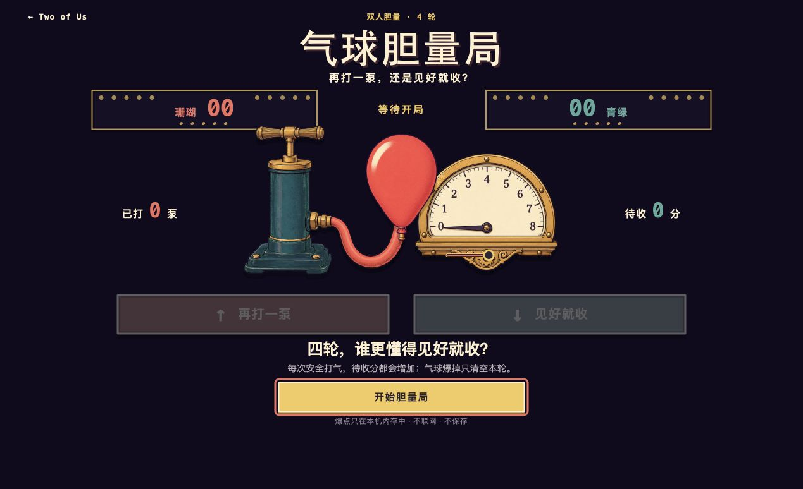
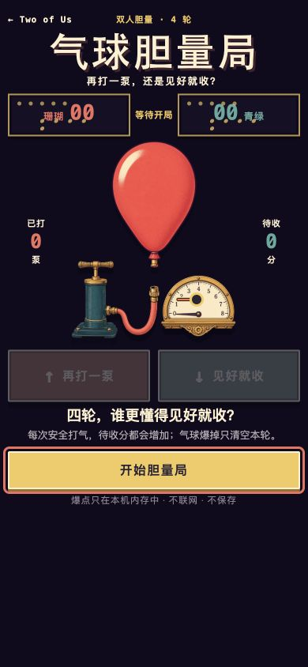
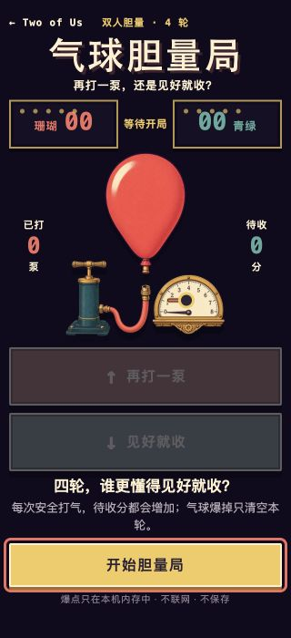

# A 级「气球胆量局」设计与验收记录

验收日期：2026-07-17。

对应提交：

- `9d3bdf4`：玩法、公平性、隐私、视觉与验收规格；
- `4b75944`：完整 A 级作品、统一门户、原创生成资产与逻辑测试；
- 本记录所在提交：浏览器证据、bug 记录与可复用知识沉淀。

## 1. 交付范围

「气球胆量局」是原创的单设备热座对抗体验。珊瑚方与青绿方各拥有四只独立气球，每次可以再打一泵或把待收分存入总分；达到第 4–8 泵中的隐藏爆点，只清空本回合待收分。四轮共八个回合全部完成后比较总分。

运行入口：[`experiences/versus/balloon-dare/index.html`](../experiences/versus/balloon-dare/index.html)。作品没有第三方运行依赖、公网请求、存储、账号或设备权限；经典相对脚本与本地 PNG 资源可直接从 `file://` 打开。

## 2. 自动检查

| 检查 | 结果 |
| --- | --- |
| `node --test experiences/versus/balloon-dare/logic.test.js shared/runtime/catalog.test.js` | 27 / 27 通过 |
| `npm test` | 250 / 250 通过 |
| `npm run verify` | 21 个作品入口、1 个能力声明、资源与借鉴声明通过 |
| `node --check logic.js` / `node --check app.js` | 通过 |
| `git diff --check` | 通过 |

纯逻辑覆盖固定八回合顺序、无偏爆点映射、handoff Gate、前三泵安全、三角数计分、爆球清零、收分幂等、结果推进、平局/胜负和畸形输入。目录测试另外证明页面没有 Module、远程资源、网络 API、持久化 API，且不会把 `burstPoint` 写入 DOM。

## 3. Chrome 完整实玩

浏览器自动化安全策略不允许直接导航 `file://`。因此双击边界由静态契约与仓库验证器检查；视觉和交互使用只绑定 `127.0.0.1` 的临时静态服务器加载同一目录与同一相对资源，作品本身没有为验收增加服务依赖。

本次真实流程：

1. 从根门户找到“对抗 / A 级 / 气球胆量局”卡片并打开；
2. 珊瑚方交接后，零泵时“见好就收”禁用，使用键盘 `↑` 连打三泵得到待收 6 分，再用 `↓` 收分，总分变为 6；
3. 青绿方连续打气，在本局随机第 8 泵爆球，待收 28 分清零，总分保持 0；
4. 后续六个回合各安全打一泵并收下 1 分，交接顺序依次为青绿、珊瑚、珊瑚、青绿、青绿、珊瑚；
5. 第八回合后才出现最终结果，本局比分为 `9 : 3`，珊瑚方获胜，“再来四轮”可用；
6. handoff DOM、按钮属性、内联样式和可访问快照都不含 `burstPoint`、`data-burst` 或隐藏阈值；
7. 页面日志为空，没有 warning 或 error。

随机爆点不可作为固定快照断言；验收只断言它位于 4–8、前三泵安全、爆球时待收分清零且总分不倒扣。

## 4. 响应式验收

| 视口 | 结果 |
| --- | --- |
| 1269×774 | `scrollWidth = innerWidth = 1269`、`scrollHeight = 774`；双决策键各 64px，隐私说明底部约 674px |
| 390×844 | `scrollWidth = innerWidth = 390`、`scrollHeight = 844`；主动作 48px，隐私说明底部约 641px |
| 320×700 | `scrollWidth = innerWidth = 320`、`scrollHeight = 700`；决策键切为单列且各 64px，主动作底部约 644px |

320px 首版的隐私说明与主动作描边过近，修复与回归证据见 [`bugs/2026-07-17-balloon-dare-privacy-spacing.md`](../bugs/2026-07-17-balloon-dare-privacy-spacing.md)。修复后主动作与隐私说明正文的几何间距为 6px，没有横向溢出或文字遮挡。

## 5. 概念稿忠实度账本

概念稿原生尺寸为 1606×979；浏览器实现截图分别以 1269×774、390×844 与 320×700 的显式视口保存。截图来自浏览器插件控制的真实 Chrome 页面，不是静态重绘。

| 比较点 | 概念基准 | 实现结果 | 判定 |
| --- | --- | --- | --- |
| 信息层级 | 顶栏 → 大标题 → 比分 → 气球机械 → 决策键 | 桌面与移动端都保持同一阅读顺序 | 对齐 |
| 色板 | 紫黑夜幕、奶油、珊瑚、青绿、黄铜 | 六个固定视觉令牌贯穿比分、按钮与机械 | 对齐 |
| 视觉签名 | 大气球、复古手泵、机械压力表 | 三项都由本地透明生成资产组成，气球随公开泵数变大 | 对齐 |
| 比分 | 两侧灯牌对称，中间标记当前方 | 对称灯牌与当前方文字保留，不靠颜色单独表达 | 对齐 |
| 决策 | 珊瑚“再打一泵”与青绿“见好就收” | 桌面并排、320px 单列，键盘符号与文字同时可见 | 对齐 |
| 移动端 | 同一舞台压缩到单列设备 | 390px 保持并排决策，320px 才切单列 | 对齐 |
| 文案 | 嘉年华灯牌式中文 | 全部改为 HTML 原生准确文字，不使用概念图中的生成字形 | 有意改进 |
| 装饰密度 | 大量灯泡、纹理与宽幅机械 | 减少非功能灯泡，保留生成纹理和机械焦点 | 有意偏离：提高小屏清晰度与首屏完整性 |

最终桌面实现仍让气球与机械表共同占据首屏视觉中心；相较概念稿，气球略小以确保 774px 高视口中决策和主动作都完整可见。

## 6. 生成资产与借鉴声明

运行资产原生尺寸：`balloon.png` 1086×1448、`pump-gauge.png` 1717×916、`balloon-burst.png` 1254×1254。三张资产与概念稿均由 OpenAI ImageGen 按本仓库规格生成，再用本地 chroma-key 工具去除纯色背景；来源与处理方式记录在 [`assets/ATTRIBUTION.md`](../experiences/versus/balloon-dare/assets/ATTRIBUTION.md)。

创意来自本仓库 [`40-idea-backlog.md`](./40-idea-backlog.md) 的 V03“气球胆量局”。push-your-luck、三角数奖励和固定机会轮换是通用游戏机制；本项目没有查阅、复制、改写或引入任何开源项目代码、视觉、音效、题库或素材。

若未来参考或引入开源项目，必须按 [`05-reference-and-attribution-spec.md`](./05-reference-and-attribution-spec.md) 补充固定来源、commit、许可证、借鉴内容与未复制边界。
