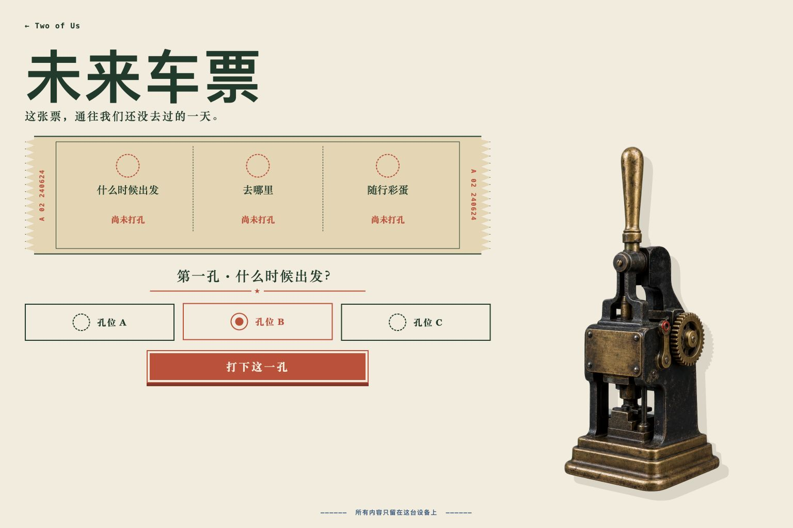
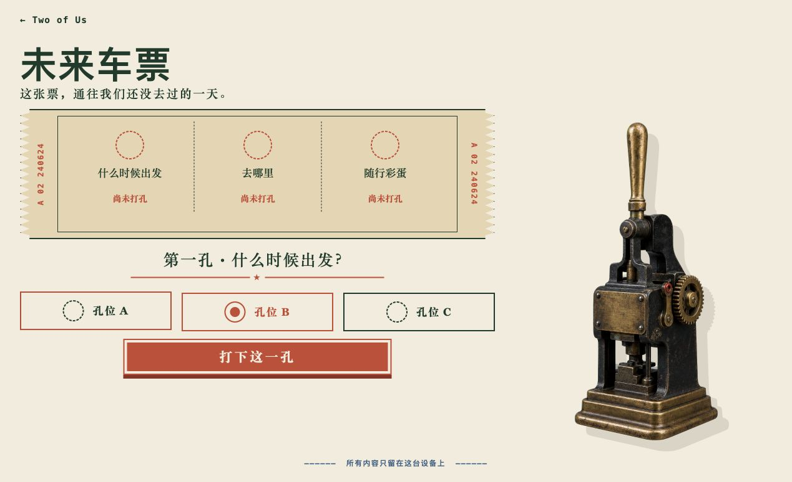
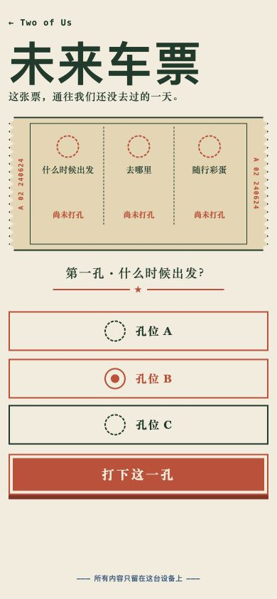
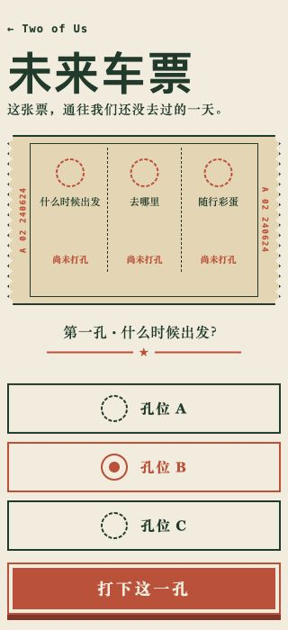

# A 级「未来车票」设计与验收记录

验收日期：2026-07-17。

对应提交：

- `b58b4d3`：玩法、配置、隐藏信息、视觉与验收规格；
- `5393fd0`：完整 A 级作品、统一门户、原创生成资产与测试；
- 本记录所在提交：浏览器证据、bug 记录与可复用知识沉淀。

## 1. 交付范围

「未来车票」是一款可预先准备的本地惊喜。准备者在 `config.js` 中写好时间、地点、彩蛋三组候选；体验者每步只看到 A / B / C 三个孔位，选择并打孔后才揭晓一项，三孔完成后签发完整车票。

运行入口：[`experiences/surprises/future-ticket/index.html`](../experiences/surprises/future-ticket/index.html)。作品没有第三方运行依赖、公网请求、持久化或设备权限；经典相对脚本和本地 PNG 可从 `file://` 直接打开。

## 2. 自动检查

| 检查 | 结果 |
| --- | --- |
| `node --test experiences/surprises/future-ticket/logic.test.js shared/runtime/catalog.test.js` | 30 / 30 通过 |
| `npm test` | 262 / 262 通过 |
| `npm run verify` | 22 个作品入口、1 个能力声明、资源与借鉴声明通过 |
| `node --check logic.js` / `config.js` / `app.js` | 通过 |
| `git diff --check` | 通过 |

纯逻辑覆盖默认配置深冻结、合法配置复制、整份回退、intro Gate、三孔选择、未选择禁止打孔、单项揭晓、punching Gate、第三孔完成、重新组合和畸形状态。目录测试另外检查无 Module、无远程资源、无网络/存储 API、HTML 不包含默认九条隐藏候选、没有秘密 data 属性，也不使用 `innerHTML` 写配置文本。

## 3. Chrome 完整实玩

浏览器自动化安全策略不允许直接导航 `file://`。因此双击边界由静态契约和仓库验证器检查；视觉与交互使用只绑定 `127.0.0.1` 的临时静态服务器加载同一目录与相对资源，作品本身没有新增服务依赖。

本次真实流程：

1. 从根门户找到“惊喜 / A 级 / 未来车票”卡片并打开；
2. intro 的三个字段均为“尚未打孔”，三个孔位禁用，“开始打孔”是唯一主动作；
3. 开始后未选择时“打下这一孔”禁用，页面正文、元素属性和可访问快照均不含九条候选；
4. 第一孔使用键盘 `2 + Enter` 选择 B，只揭晓“周六午后”；
5. 第二孔点击 A，只新增“去看晚霞”；第三孔点击 C，新增“留一小时给未知”；
6. 完成页显示 `车票已签发`、三项结果、`给最想同行的你`、`由我全程负责` 和最终留言；
7. 点击“重新组合”后三个字段恢复“尚未打孔”，已揭晓文本从 DOM 消失；
8. 页面日志为空，没有 warning 或 error。

候选保存在本地 `config.js`，会查看源码的人仍能读到；验收证明的是正常页面流程不提前揭晓，而不是密码学保密。

## 4. 响应式验收

| 视口 | 结果 |
| --- | --- |
| 1536×1024 | 与概念原生尺寸一致；`scrollWidth = innerWidth = 1536`、`scrollHeight = 1024`；孔位 72px、主动作 64px |
| 1269×774 | `scrollWidth = innerWidth = 1269`、`scrollHeight = 774`；孔位 62px、主动作 58px，首屏完整 |
| 390×844 | `scrollWidth = innerWidth = 390`、`scrollHeight = 844`；三个孔位单列且各 56px，主动作底部约 698px |
| 320×700 | `scrollWidth = innerWidth = 320`、`scrollHeight = 735`；三个孔位各 56px，主动作底部约 683px，可纵向滚动查看隐私说明 |

320px 允许 35px 纵向滚动，但标题、车票、问题、三个孔位和主动作均可到达且没有横向溢出。原生尺寸首版的纵向构图漂移修复见 [`bugs/2026-07-17-future-ticket-native-vertical-drift.md`](../bugs/2026-07-17-future-ticket-native-vertical-drift.md)。

## 5. 概念稿忠实度账本

概念稿与最终原生截图均为 1536×1024。实现截图由浏览器插件控制的真实 Chrome 页面生成，不是静态重绘；最终对比使用 choosing 阶段、孔位 B 已选择、CTA 为“打下这一孔”的相同状态。

| 比较点 | 概念基准 | 实现结果 | 判定 |
| --- | --- | --- | --- |
| 信息层级 | 返回 → 大标题 → 车票 → 问题 → 孔位 → CTA | 顺序、占比和首屏完整性保持一致 | 对齐 |
| 色板 | 真纸色、森林绿、朱红、钴蓝、黑铁黄铜 | 固定七色令牌，无 CSS 渐变 | 对齐 |
| 车票结构 | 锯齿边、双序列号、三字段、虚线分栏 | clip-path 锯齿、原生序列号和三栏全部保留 | 对齐 |
| 视觉签名 | 右侧复古桌面打孔机 | 使用独立生成透明资产，材质与比例匹配 | 对齐 |
| 选中状态 | 孔位 B 朱红边框与实心孔 | 边框、同心实心孔和 `aria-checked` 同时变化 | 对齐 |
| 主动作 | 朱红直角大按钮“打下这一孔” | 文案、颜色、双层边与位置匹配 | 对齐 |
| 移动端 | 标题、票据、问题、三孔单列、CTA | 390px 与概念保持同一重排；320px继续缩排 | 对齐 |
| 文字实现 | 概念提供准确中文层级 | 所有界面文字均由 HTML/CSS 原生渲染 | 对齐 |
| 打孔机铭牌 | 概念资产带英文装饰字 | 最终资产使用空白黄铜铭牌 | 有意偏离：避免生成文字与品牌误识别 |
| 机械动作 | 概念暗示手柄下压 | 单张资产整体下沉 14px | 有意偏离：首版不拆分第二张手柄资产 |

首版在 1536×1024 下因内容列 `align-self: center` 导致标题明显低于概念；改为从导航下方固定起排，并在移动端移除额外上边距后，标题、票据与控件重新对齐。概念与最终截图同次 `view_image` 复核后，没有剩余可修复的重大视觉差异。

首屏文案 diff：标题、说明、三个字段、`尚未打孔`、第一孔 prompt、A/B/C、`打下这一孔` 与隐私说明全部一致；未添加 eyebrow、badge、统计或第二 CTA。

## 6. Bug、知识与借鉴声明

- 机器校验无法识别非标准来源标题：[`bugs/2026-07-17-future-ticket-attribution-heading-contract.md`](../bugs/2026-07-17-future-ticket-attribution-heading-contract.md)；
- 原生尺寸纵向构图漂移：[`bugs/2026-07-17-future-ticket-native-vertical-drift.md`](../bugs/2026-07-17-future-ticket-native-vertical-drift.md)；
- 可组合惊喜与逐步揭晓：[`learn/2026-07-17-composable-surprise-progressive-disclosure.md`](../learn/2026-07-17-composable-surprise-progressive-disclosure.md)。

创意来自本仓库 [`40-idea-backlog.md`](./40-idea-backlog.md) 的 S18“未来车票打孔”。玩法、配置、状态机、DOM、CSS、文案和测试均为本仓库原创实现，没有查阅、复制、改写或引入任何开源项目代码、视觉、字体、音效或素材。

概念稿与 `ticket-punch.png` 由 OpenAI ImageGen 按规格生成；后者原生尺寸 1024×1536，经本机 chroma-key 工具生成透明 PNG。完整来源见 [`assets/ATTRIBUTION.md`](../experiences/surprises/future-ticket/assets/ATTRIBUTION.md)。

若未来参考或引入开源项目，必须按 [`05-reference-and-attribution-spec.md`](./05-reference-and-attribution-spec.md) 补充固定来源、commit、许可证、借鉴内容与未复制边界。
