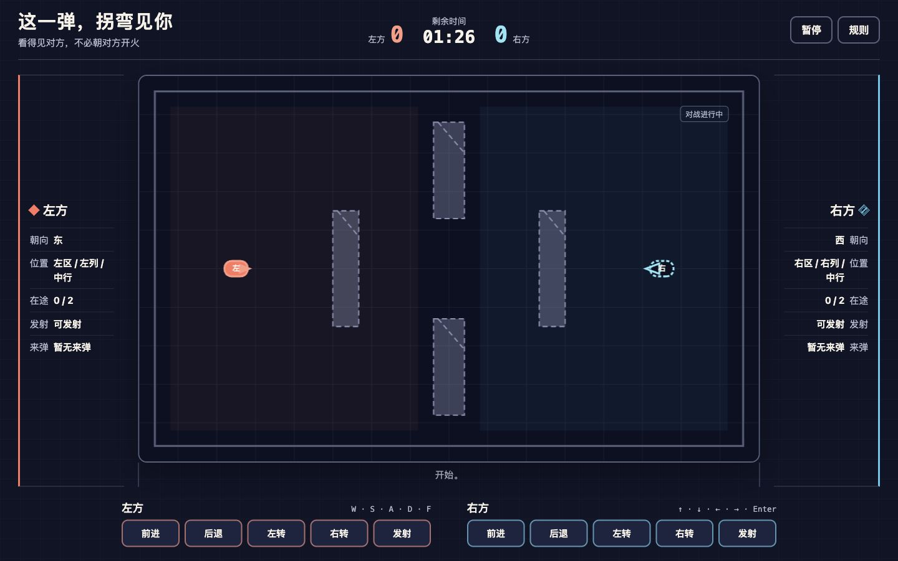

# 「这一弹，拐弯见你」生产 UI 最终验收

日期：2026-07-26
工作树：`{worktree-base}/ricochet-tank-duel-production-ui`
分支：`codex/exp-ricochet-tank-duel-production-ui`
基线：`d6b783d`

## 结论

`ricochet-tank-duel` 已在冻结的非视觉核心之上补齐 A 级生产 UI：
两位玩家可以在同一设备上同时用键盘或触屏驾驶折光车、发射最多四枚在途光点，
并通过墙面反射争先命中三次。页面使用经典相对路径脚本，玩家运行时没有第三方
依赖、外部网络请求、远程字体或持久化，可直接双击 `index.html`。

本分支只修改：

- `experiences/versus/ricochet-tank-duel/**`
- 项目专属的 `bugs/**` 与 `learn/**`
- 本验收文档

catalog、Board、门户、分类 README、根索引、共享依赖和 launcher 均未修改，
由主集成分支统一安装。

## 提交序列

1. `f974809` — 冻结生产 UI 契约测试
2. `dc80716` — 完成语义页面、输入、Canvas 渲染、状态投影和固定步接线
3. `61f04df` — 完成本地使用说明与借鉴声明
4. `3530968` — 红测：暴露指针点击后按钮焦点锁死键盘输入
5. `4bdf6de` — 修复混合输入焦点边界
6. `9634fd3` — 沉淀混合输入焦点边界
7. `8089935` — 红测：暴露窄屏双方文本状态被隐藏
8. `9ba5477` — 保留窄屏状态投影并沉淀移动 HUD 原则
9. `cf7d269` — 红测：暴露移动顶栏触控目标不足 44px
10. `e6c2fb5` — 恢复移动触控目标并记录 Chrome 失败
11. `0b0e672` — 红测：暴露无脚本模式的假交互壳
12. `287a76b` — 用静态说明与返回入口替换无响应控件
13. 最终验收文档提交 — 本文与最终浏览器截图

## 实现合同

- 世界尺寸固定为 960×600，逻辑固定 60 Hz；Canvas 尺寸和 DPR 只影响显示。
- 页面按 `config → constants → fixed → geometry → simulation → input → renderer
  → accessibility → app` 加载经典脚本，兼容 `file://`。
- 左方使用 W/S/A/D/F，右方使用方向键与 Enter；十个触屏按钮由独立
  `pointerId`、pointer capture 和精确释放管理。
- `blur`、`hidden`、`pagehide`、长帧、补算超限和逻辑不变量异常会同时清空
  双方输入并暂停；恢复后重新走完整 3、2、1。
- Canvas 外持续显示比分、时间、朝向、粗粒度位置、在途数、冷却、来弹和结果。
- 左方使用实心楔/实心弹体，右方使用条纹楔/空心弹体，不只靠颜色区分。
- `prefers-reduced-motion` 只移除装饰运动；`forced-colors` 使用系统色并保留
  阵营文字与形状。
- 无脚本回退只显示静态说明和隐私边界，不伪装成可玩状态。

## 自动化门禁

### 项目定向

最终 HEAD 复核命令：

```bash
node --check experiences/versus/ricochet-tank-duel/js/*.js
node --test experiences/versus/ricochet-tank-duel/tests/*.test.js
```

结果：

```text
tests 56
pass 56
fail 0
```

其中既有核心 47 项保持通过，生产 UI 契约新增 9 项通过。契约覆盖经典脚本与
直开边界、六阶段语义表面、十个原生按钮、多来源输入、生命周期清理、固定步、
Canvas 投影、响应式、系统显示模式、诚实 no-JS 回退、README 和来源声明。

### 全仓边界

当前工作树未安装共享运行时所需的完整根依赖。`npm test` 得到：

```text
tests 2412
pass 2408
fail 4
```

四项失败都在本项目范围之外：

1. `scripts/start-reuse.integration.test.mjs` 的三项 launcher 复用测试等待输出超时；
   子进程明确报告 `node_modules/pannellum/build/pannellum.css` 缺失。
2. `shared/runtime/server.test.js` 无法加载 `shared/runtime/server.js`，因为根依赖
   `qrcode` 未安装。

`npm run verify` 另报告既有 `panorama-memory` 的两个 vendor 文件缺失：

```text
/vendor/pannellum/2.5.7/pannellum.css
/vendor/pannellum/2.5.7/pannellum.js
```

这些问题在生产 UI 修改前已存在，也不属于授权范围，因此未修改共享依赖、
`panorama-memory` 或 launcher。

## 浏览器验收

### 本 Session 已完成

实际 Chrome 页面：
`http://127.0.0.1:4181/experiences/versus/ricochet-tank-duel/index.html`。

- 页面标题为“这一弹，拐弯见你”，CSS viewport 为 1728×962，
  `scrollWidth === innerWidth`，无横向滚动。
- 页面语义树包含六个阶段面板、双方状态投影、十个触屏按钮、规则 dialog 和
  无脚本说明。
- 从说明进入完整倒计时后抵达 `playing`；发射会更新在途数与冷却。
- `P` 和 `Escape` 都能进入暂停；暂停文案明确说明双方输入已清空，十个按钮的
  `aria-pressed` 均归零。
- “继续”后重新经过完整倒计时，不追赶暂停期间的时间。
- 规则 dialog 打开后焦点进入标题，关闭后返回触发按钮。
- 规则按钮保留焦点时，左方 F 仍能发射；Enter 不会穿透为右方发射。
- console warning/error 均为空。
- 本机网络日志只包含项目 HTML、CSS、经典脚本和 favicon；没有外部请求，
  favicon 也没有 404。

当前 Chrome 连接器不能模拟 viewport、系统媒体模式或浏览器双触点，也不提供
Chrome 页面截图；这些工具限制不算产品失败，但对应项不能由本 Session 声称通过。

### 独立 Chrome/CDP 验收

独立 Session 在最终触控修复 `e6c2fb5` 上完成 viewport、双触点、完整流程、
系统媒体模式、焦点和网络复核；随后在 no-JS 修复 `287a76b` 上补做无脚本复验。

#### 六档响应式矩阵与回流代理

| 视口 | 文档滚动宽×高 | Canvas | 最小按钮 | 结果 |
| --- | --- | --- | --- | --- |
| 1440×900 | 1440×901 | 992.71×618.94 | 68×44 | playing；无横向滚动 |
| 1280×720 | 1280×819 | 863.86×538.41 | 68×44 | 全部区域纵向可达；无横向滚动 |
| 768×1024 | 768×1137 | 740×461 | 68×44 | 双状态轨回流；无横向滚动 |
| 844×390 | 844×1186 | 816×508.5 | 68×44 | 横屏纵向滚动可达；无横向滚动 |
| 390×844 | 390×850 | 370×229.75 | 52.164×44 | 状态轨 `flex` 可见；无横向滚动 |
| 320×568 | 320×806 | 300×186 | 玩法 46×44；顶栏 52.164×44 | 状态轨 `flex` 可见；无横向滚动 |
| 752×523 | 752×— | 724×451 | 68×44 | 200% 回流代理；控制区 728×177.117 可达，开始 84×44 首屏可见 |

七项均满足 `scrollWidth === clientWidth`。752×523 的独立结果只返回横向滚动宽，
未伪造未测的文档总高度。

#### 输入、生命周期与系统模式

- 真实双指针 `pointerId` 2 / 3 同时按住左右“前进”，两车定点 x 分别变化
  `+49152 / -49152`；双方来源互不覆盖，独立释放后按下态归零。
- 键盘、指针和聚焦按钮混合输入通过；F 在规则按钮保留焦点时仍发射，Enter
  不会穿透为右方发射或重复激活。
- 完整说明、倒计时、playing、暂停、恢复倒计时、结果与重开流程通过；暂停会
  清空双方按下态，不后台追赶时间。
- 规则 dialog 打开后焦点进入标题，关闭后返回触发按钮。
- `prefers-reduced-motion: reduce` 的 media query 命中；transition duration 为
  `1e-05s`、iteration count 为 1、scroll behavior 为 `auto`，逻辑状态不变。
- `forced-colors: active` 的 media query 命中；赛场使用系统白底、黑字和黑边，
  阵营文字与实心/条纹形状仍存在。
- 最新 no-JS 修复的独立补测通过：`.duel-app` 不可见，17 个按钮、1 个 Canvas、
  1 个 dialog 的可见数均为 0；静态面板、唯一 H1、隐私文案和“返回作品集”
  可见，链接真实点击可到根门户。
- no-JS 网络只有 4 个本地 200 响应，没有脚本请求，也没有 console、runtime 或
  network 异常。
- console error/warning 为 0；网络只包含本机 HTML、CSS、经典脚本与 favicon，
  没有产品外部请求或 favicon 404。

最终 playing 截图：



- 格式 / 尺寸：JPEG，1440×901
- SHA-256：`38af806d83827e0f5938f64550cb7699319caa9aa9c1e8461e91a7e10d969393`
- 检查：同轮用 `view_image` 原尺寸检查；标题、比分、时间、赛场、双方状态轨、
  五键控制、阵营冗余编码和 playing 状态均清楚可辨。

## 参考图保真清单

两张内部 ImageGen 概念图已在原生尺寸下重新检查；它们只作为设计证据存放在
`docs/assets/`，没有进入产品运行时。

1. **标题与语气**：公开标题严格使用“这一弹，拐弯见你”，副标题使用已接受的
   “看得见对方，不必朝对方开火”。
2. **主构图**：保留深靛开放折光桌、中央 16:10 赛场、两条等权状态轨和两组等权
   控制带，赛场仍是唯一主视觉。
3. **阵营系统**：保留珊瑚橙左方与湖蓝右方，同时增加实心/条纹、实线/虚线、
   实心/空心三组冗余编码。
4. **顶栏与反馈**：保留比分、时间、暂停、规则和单条低频事件带，不添加排行榜、
   装备栏、模式选择或装饰性假数据。
5. **折光语言**：棱镜墙、胶囊折光车、方向楔、光点和静态接触刻痕都用原创
   Canvas/CSS 原语重建，没有描摹或引用概念 PNG。
6. **规格优先的差异**：概念图中不符合冻结 AABB 地图的斜墙、路线和位置只是
   图像幻觉；生产赛场严格按 `constants.js` 的四面墙、活动区和出生点渲染。
7. **输入纠偏**：概念图中的错误键位与缺失按钮没有进入产品；生产 UI 每席恰好
   五个文字按钮，键盘映射严格使用 W/S/A/D/F 与方向键/Enter。
8. **阶段差异**：概念图展示 playing / 双双命中氛围；生产页面必须按真实状态机
   呈现 instructions、countdown、playing、round-result、paused 和 match-result，
   不为了还原静态图伪造比赛状态。
9. **移动意图**：320 px 版本保留 16:10 赛场、双方等权五键控制和无横向滚动；
   具体测量以独立 Chrome/CDP 表格为准。

## 真实问题与学习沉淀

生产 UI 验收发现并修复四项真实问题：

- `bugs/2026-07-26-ricochet-focused-button-keyboard-lockout.md`
- `bugs/2026-07-26-ricochet-mobile-status-projection-hidden.md`
- `bugs/2026-07-26-ricochet-mobile-header-touch-target.md`
- `bugs/2026-07-26-ricochet-noscript-inert-controls.md`

指针点击原生按钮后，按钮会保留焦点。旧的“输入上下文”判断把任何聚焦按钮都当成
文字输入区，导致同一位玩家随后按键盘方向键或发射键无效。修复后：

- 文本输入控件仍屏蔽全部游戏键；
- 聚焦按钮只屏蔽会激活按钮的 Enter；
- 其他游戏键继续进入来源集合，keyup 仍能精确释放。

另一个问题是 480 px 媒体查询曾用 `display: none` 删除双方状态轨，使朝向、
位置、在途数、冷却和来弹同时退出视觉与可访问性树。修复后字段完整保留，只压缩
字号与间距，并由失败契约禁止窄屏再次隐藏语义 HUD。

独立 Chrome/CDP 又在 390×844 和 320×568 测得顶栏按钮最小高度只有 40px。
根因是同一媒体查询覆盖了全局 44px token。修复后顶栏按钮精确恢复到 44px，
并由只解析该声明块的契约锁定；最新 Chrome 实测为 52.164×44。

禁用 JavaScript 时，初版只在长页面末尾增加提示，却保留了全部无响应按钮和
Canvas。修复后 no-JS 专用样式隐藏整个 `.duel-app`，独立静态面板只显示标题、
启用说明、隐私边界和返回入口。

可复用结论记录在：

- `learn/2026-07-26-mixed-input-focus-boundaries.md`
- `learn/2026-07-26-mobile-game-hud-compression.md`
- `learn/2026-07-26-noscript-remove-inert-game-shell.md`

## 借鉴、依赖与资产

- 玩家运行时第三方依赖：0。
- 外部开源游戏直接借鉴：0。
- 外部代码、地图、数值、测试、字体、图片、音频和品牌复制：0。
- 固定学术论文与 W3C/WHATWG 规范只用于理解连续碰撞、固定步、调度、
  Pointer Events 和无障碍合同；权利状态与未复制范围逐项登记在
  `experiences/versus/ricochet-tank-duel/ATTRIBUTION.md`。
- 内部 ImageGen 概念图只借鉴构图与氛围，不是玩家资产。
- favicon 是项目手写 SVG，没有第三方图形或品牌。

## 集成后复核

主分支补 catalog / 门户入口并统一安装依赖后，建议执行：

```bash
node --check experiences/versus/ricochet-tank-duel/js/*.js
node --test experiences/versus/ricochet-tank-duel/tests/*.test.js
npm test
npm run verify
git diff --check
```

只有定向测试、仓库资源门禁和入口检查都通过后，才应把项目标记为 installed。

### 主分支实际结果

2026-07-26 已在 `main` 完成共享安装与复核：

- 项目定向测试：`56 / 56`；
- 项目、共享 catalog 与体验合同定向组合：`249 / 249`；
- 全仓测试：`2452 / 2452`；
- `npm run verify`：通过，`73` 个入口、`65` 个 A 级直开、`8` 个非 A 启动器；
- 根门户中标题、卡片和入口各唯一，真实点击可进入本体验；
- 桌面与 390×844 门户/体验均无横向溢出，双方发射可独立推进；
- 正常模式新增可见“返回作品集”相对链接，真实点击可回到根门户；
- 门户、体验及返回后的 console/runtime 日志为空。

统一入口复核发现正常脚本路径缺少返回作品集入口。问题先由失败合同
`a0aa840` 复现，再由 `56019aa` 最小修复；记录见
`bugs/2026-07-26-ricochet-missing-portal-return.md`，可复用结论见
`learn/2026-07-26-local-experience-navigation-loop.md`。

共享安装提交为 `2a80d1d`。至此本项目由生产分支的历史环境结论升级为主分支
**PASS / installed**。
