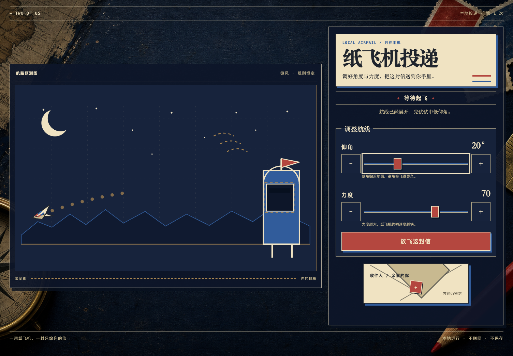
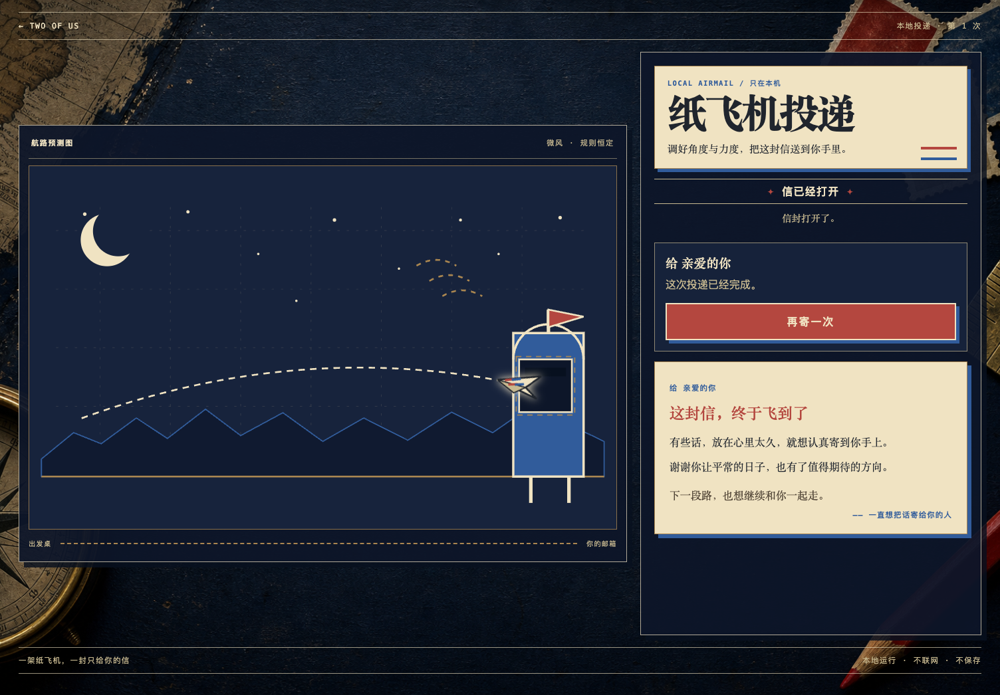
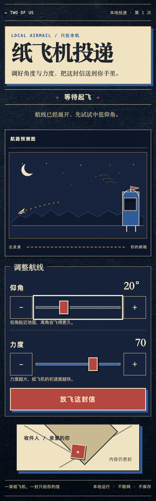

# A 级「纸飞机投递」验收记录

- 日期：2026-07-18
- 实装 commit：`ce26d72 feat: add paper plane mail surprise`
- 触控修复 commit：`ebc45d2 fix: enlarge paper plane step controls`
- 浏览器：Google Chrome 150.0.7871.125（macOS arm64，系统 Chrome）
- 入口：`experiences/surprises/paper-plane-mail/index.html`
- 结论：通过 A 级 `file://` 直开、完整投递闭环、阶段信件、响应式、reduced motion、来源声明与整仓 Gate。

## 1. 实装画面

### 1.1 1504×1046 瞄准态

### 1.2 1504×1046 揭信态

### 1.3 390×844 移动长页

三张图均由实装页面在本地 HTTP 下直接截图，不包含概念图的浏览器外壳。桌面图为 1504×1046 首屏；移动图为 390px 宽的完整自然长页。

## 2. 自动检查

### 2.1 纯逻辑

`node --test experiences/surprises/paper-plane-mail/logic.test.js`：11/11 通过。

覆盖：

- 世界常量、力度映射、角度钳制、配置回退与递归冻结；
- 默认 `20° / 70` 以固定步长稳定命中；
- `short / low / high` 三种失败结算；
- 连续线段与邮箱 AABB 碰撞，防止跨过窄目标；
- intro、瞄准、飞行、失败、送达、揭信和重开唯一状态路径；
- retry 保留瞄准并递增尝试数，非法动作保持原引用；
- 自定义提示策略的冻结上下文、异常和非法返回回退。

### 2.2 目录与本地边界

共享目录测试确认：

- catalog 收录 installed A 级 `paper-plane-mail`，`networkRequired: false`；
- 入口使用经典脚本，没有 module、外链、网络 API、Storage、随机数或第三方运行时；
- `app.js` 不使用 `innerHTML`；
- CSS 不使用 gradient，运行背景来自相对路径 `assets/night-post-desk.png`；
- 默认最终标题、正文和落款不预埋在 `index.html` 或 `app.js`。

功能提交前整仓 `npm test` 为 347/347 通过；验收提交前在包含最新并行改动的仓库上复跑为 360/360 通过。`npm run verify` 通过，报告 30 个作品入口、1 个能力声明及完整资源/借鉴声明。

## 3. Chrome 完整流程

### 3.1 失败、重试、成功与揭信

1. intro 点击“开始投递”，下一帧焦点落到仰角 range；
2. 把力度改为 0 后放飞，页面稳定进入 `missed / short`，说明纸飞机提前落地；
3. 失败态正文不在 DOM，结果按钮获焦；
4. 点击“重新折一架”，焦点回到仰角，尝试数进入第 2 次且保留上次设定；
5. 改回 `20° / 70`，普通动画约 2.24 秒后进入 `arrived`；
6. `arrived` 只有已送达状态和密封信封，`.letter-sheet` 数量为 0；
7. 点击“打开这封信”后才创建一张 `.letter-sheet`，标题、两段正文、寄语和落款出现；
8. 点击“再寄一次”回到 intro，信纸节点被移除，尝试数归一。

焦点路径为：开始按钮 → 仰角 → 失败/送达/揭信动作 → 重试仰角或重开开始按钮。控制台全程 0 error、0 warning。

### 3.2 真实输入

- 仰角 range 按 `ArrowRight`：20 → 21；
- 点击仰角 `＋`：21 → 22；
- 在力度轨道约 62% 位置真实点击：得到 63；
- 两个原生 range、四个 ± 与主动作都在同一权威状态上更新；飞行时控制 disabled。

### 3.3 reduced motion

浏览器模拟 `prefers-reduced-motion: reduce`：默认 `20° / 70` 点击放飞后立即进入 `arrived`，状态文案为“已送达 · 信还封着”。它跳过横跨屏幕的呈现，但仍通过同一 `step()` 规则得出结果。

## 4. 尺寸与布局

| 视口 | 横向溢出 | 页面高度 | 结果 |
| --- | ---: | ---: | --- |
| 1504×1046 intro | 0 | 1046 | 导航、航图、开场、密封信封、页脚均在首屏 |
| 1504×1046 aiming | 0 | 1046 | 航图、两组控制、主动作、密封信封、页脚均在首屏 |
| 390×844 aiming | 0 | 1245 | 标题 → 状态 → 航图 → 控制 → 信封 → 页脚 |
| 320×760 aiming | 0 | 1216 | 无横向滚动，控制自然纵向排列 |
| 752×523 aiming | 0 | 自然滚动 | 作为 1504×1046 的 200% 等效 CSS 布局检查，全部操作可达 |

修复后四个 ± 在上述四档布局均为 `56×56px`；主动作高度均为 56px。相关缺陷与防回归见 [`../bugs/2026-07-18-paper-plane-step-target.md`](../bugs/2026-07-18-paper-plane-step-target.md)。

## 5. 直开、请求与隐私

- 真实 `file://{repo-root}/experiences/surprises/paper-plane-mail/index.html` 直开，开始并放飞默认组合后成功进入“已送达 · 信还封着”；
- HTTP 验收只有 6 个同源请求：HTML、CSS、`logic.js`、`config.js`、`app.js` 和本地背景 PNG；
- 不请求 CDN、字体、统计、API 或音频；
- 不写 localStorage、sessionStorage、IndexedDB、cookie 或服务端；
- 信件在 UI 中阶段化保密，但 `config.js` 是本机明文配置，README 已明确它不是加密。

## 6. 借鉴与资产

运行时无第三方代码和素材。调研只核验两个纸飞机项目的仓库元数据、许可证状态与固定 commit，没有读取、运行、复制、改写或打包它们的源代码/模型。

- 规则、状态机、SVG、文案和 CSS：本仓库原创；
- 背景：本项目生成并经人工检查为无字、无 UI 的装饰纹理；
- 详细固定 commit 与许可证判断：[`../experiences/surprises/paper-plane-mail/assets/ATTRIBUTION.md`](../experiences/surprises/paper-plane-mail/assets/ATTRIBUTION.md)。

## 7. 最终结论

纸飞机投递满足规格定义的核心闭环与启动承诺：准备者只需编辑 `config.js`，收件人可直接双击 HTML，在无网络、无账号、无保存的条件下完成确定性投递，并在命中后主动打开惊喜信件。
