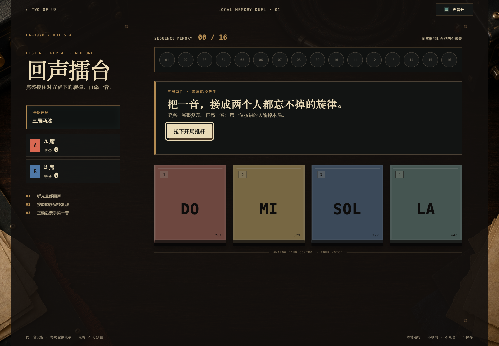
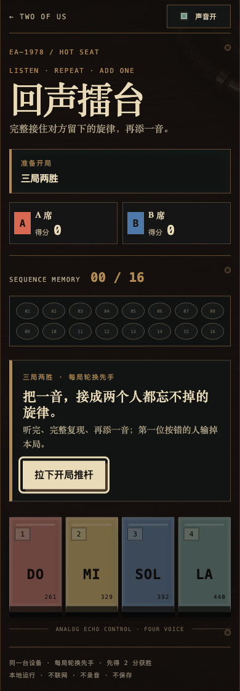

# A 级「回声擂台」验收记录

- 日期：2026-07-18
- 规格 commit：`f8e27a2 docs: specify echo arena duel`
- 共享音频 commit：`4174ecc refactor: share short tone playback`
- 实装 commit：`0365716 feat: add echo arena memory duel`
- 浏览器：Chromium 150.0.7871.125（macOS arm64，Playwright CLI headed）
- 入口：`experiences/versus/echo-arena/index.html`
- 结论：通过 A 级 `file://` 直开、三局两胜、正确复现/追加、失误计分、失焦重播、静音视觉模式、响应式、reduced motion、来源声明与整仓 Gate。

## 1. 实装画面

### 1.1 1504×1046 桌面开场

### 1.2 390px 移动完整长页

桌面图是 1504×1046 首屏，导航、比分、16 孔轨、当前动作、四音键和页脚全部可见；移动图是 390×1118 完整自然长页。

## 2. 自动检查

### 2.1 纯逻辑

`node --test experiences/versus/echo-arena/logic.test.js`：11/11 通过。

覆盖：

- 固定四音、频率、波形、快捷键与 16 音上限；
- 配置整份回退、名字规范化与状态递归冻结；
- intro、handoff、playback、repeat、append、round-over 和 match-over 唯一入口；
- playback token 单调增长，旧 token 保持原状态引用；
- 正确前缀、完整复现、追加换手与序列数组所有权；
- 错误只给对方一分并记录 actual / expected；
- 16 音共同封顶不加分；
- 一比一决胜局、同一位赢家第二分、轮换先手与重开归零；
- 非法阶段/音符保持原引用，畸形状态安全回到默认 intro。

### 2.2 共享短音层

`shared/audio/tone-player.test.js` 的 5 项测试覆盖能力缺失、AudioContext 恢复/复用、短音包络、非法参数拒绝、`ended` 节点清理、关闭与重建。节拍接力和默契电报码已在 `4174ecc` 中迁移并分别完成真实页面回归。

### 2.3 整仓与目录

验收提交前：

- `npm test`：361/361 通过；
- `npm run verify`：30 个作品入口、1 个能力声明、资源与借鉴声明完整；
- `git diff --check`：通过。

目录测试还确认本作：

- installed A 级、`networkRequired: false`；
- 使用经典脚本与相对共享音频路径，不使用 module 或远程资源；
- 不调用网络、Storage、媒体采集、Service Worker 或 `Math.random()`；
- `app.js` 不使用 `innerHTML`；
- CSS 无 gradient，背景只引用相对本地 `assets/rehearsal-desk.png`；
- 借鉴声明包含固定 commit 与“零代码、零素材借用”结论。

## 3. 浏览器完整流程

### 3.1 正确复现、追加与交接

使用受控的 `DO` 开场音验证：

1. A 席点击“开始听”，播放完成后四键才启用；
2. 键盘 `1` 正确复现，页面唯一进入“现在添一音”；
3. 点击 `LA` 追加，序列从 `01 / 16` 变为 `02 / 16`；
4. 当前玩家切换到 B 席，四键再次禁用；
5. handoff accessibility snapshot 只有“2 音”和 01–16 位置编号，没有 `do / la`、频率或答案数据。

键盘和点击走同一个 `enterNote → reducer` 路径；控制台全程 0 error、0 warning。

### 3.2 错误、轮换先手与三局两胜

受控 `DO` 开场下连续让当前玩家按 `MI`：

| 局 | 当前玩家 | 结果 | 比分 | 下一局先手 |
| --- | --- | --- | --- | --- |
| 1 | A 席 | A 在第 1 音失手 | 0 : 1 | B 席 |
| 2 | B 席 | B 在第 1 音失手 | 1 : 1 | A 席 |
| 3 | A 席 | A 在第 1 音失手 | 1 : 2 | 比赛结束 |

终局标题为“B 席拿下回声擂台”，“再来一场”可见；点击后局数回到准备开局，比分恢复 0 : 0。

### 3.3 失焦与旧计时器

播放 120ms 后触发窗口失焦：

- 所有音键保持 disabled；
- 当前文案变为“回放被暂停”；
- 只提供“重新播放”，不会直接开放复现；
- 点击后从第一音重播，完成后才启用四键。

UI 会清 timer；reducer 仍用当前 `playbackToken` 核对完成回调，形成双重边界。

### 3.4 静音视觉模式

关闭声音后，B 席通过视觉依次复现 `DO → MI`，进入添音并追加 `SOL`：

- 状态显示“静音视觉模式 · 规则不变”；
- 序列正常增长到 `03 / 16`；
- 交接回 A 席且四键禁用；
- AudioContext 是否可用没有进入 reducer，也不影响判分。

## 4. 尺寸、动作与动效

| 视口 | 横向溢出 | 页面高度 | 音键宽度 | 结果 |
| --- | ---: | ---: | ---: | --- |
| 1504×1046 | 0 | 1046 | 约 216px | 全部核心控制和页脚在首屏 |
| 390×844 | 0 | 1118 | 约 84px | 标题、比分、轨道、动作、四键、页脚自然纵向排列 |
| 320×760 | 0 | 1094 | 72px | 四键保持同一行，主动作高度 46px |

在 `prefers-reduced-motion: reduce` 下，音键 transition 的计算值为 `1e-06s`（0.001ms）；规则时序不依赖 CSS 动画结束事件。

## 5. `file://`、门户与请求

- 真实打开 `file:///Users/zenith/Desktop/two-of-us/experiences/versus/echo-arena/index.html`：标题与 H1 正常，`TWO_OF_US_TONE_PLAYER.createTonePlayer` 为函数，背景解析到本地 PNG；
- 根门户通过 `file://` 显示 30 个体验，可用唯一链接名“打开《回声擂台》”进入同一入口；
- HTTP 验收只有 7 个同源静态请求：HTML、CSS、`config.js`、共享 tone player、`logic.js`、`app.js` 和背景 PNG；
- 不请求 CDN、远程字体、统计、API、音频或商业音乐；
- 不写 localStorage、sessionStorage、IndexedDB、cookie 或服务端。

门户原先 30 个链接都叫“打开体验”的无障碍问题已最小修复并记录在 [`../bugs/2026-07-18-portal-duplicate-open-link-names.md`](../bugs/2026-07-18-portal-duplicate-open-link-names.md)。

## 6. 概念图忠实度账本

同一 QA 轮次用原始分辨率并排查看生成概念与真实 Chromium 截图：

| 维度 | 概念方向 | 实装结果 | 判断 |
| --- | --- | --- | --- |
| 材质 | 深胡桃木、烟熏黑、黄铜 | 本地无字桌面图承载木纹，CSS 机箱使用硬边和黄铜细线 | 保留 |
| 四音键 | 珊瑚、赭黄、钴蓝、氧化青纵向矩形 | 四键同色同序，带编号、唱名、频率和机械压下反馈 | 保留并增强语义 |
| 形态边界 | 避开圆形四色象限 | 桌面/移动始终是四枚独立纵向直键 | 完全保留 |
| 序列轨 | 16 孔硬件轨道 | 16 个编号孔，填充与当前播放环可独立表达 | 保留 |
| 比分 | A/B 双席机械计分 | 左栏/移动双列卡显示名字、比分、当前席与赢家 | 保留 |
| 信息层级 | 桌面标题在顶栏，玩法区占右侧 | 实装把大标题放入左侧说明栏，顶栏留给返回、产品编号和声音 | 有意调整，换取首屏规则与比分聚合 |
| 移动顺序 | 标题 → 比分 → 状态 → 轨道/四键 → 声音/隐私 | 实装为导航 → 标题 → 比分 → 轨道 → 状态 → 四键 → 隐私 | 核心顺序保留，声音开关提前以便随时静音 |
| 装饰密度 | 概念有高密度金属包边、螺丝和凹槽 | 实装减少纯装饰，保留螺丝、轨道、黄铜线和键帽阴影 | 适度简化，文字与焦点更清楚 |

概念图用于方向而非像素复制；运行 UI 没有从概念图裁切按钮、文字或机箱。

## 7. 借鉴与资产

- 通用机制只通过 Hasbro 官方说明核验；
- 两个开源仓库只检查元数据、许可证和固定 commit；
- 代码、音色、中文文案、状态机和布局均为仓库原创；
- 背景及桌面/移动概念由内置 OpenAI ImageGen 生成；运行时只使用无字背景；
- 详细边界见 [`../experiences/versus/echo-arena/assets/ATTRIBUTION.md`](../experiences/versus/echo-arena/assets/ATTRIBUTION.md)。

## 8. 最终结论

回声擂台满足首版目标：两个人可以直接双击 HTML，在无账号、无网络、无录音和无保存的条件下，用同一台设备完成视觉与声音均可辨认的四音记忆对抗；胜负、交接、轮换先手和三局两胜都由可测试 reducer 决定。
