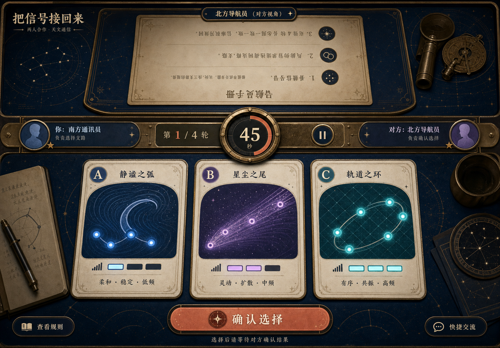
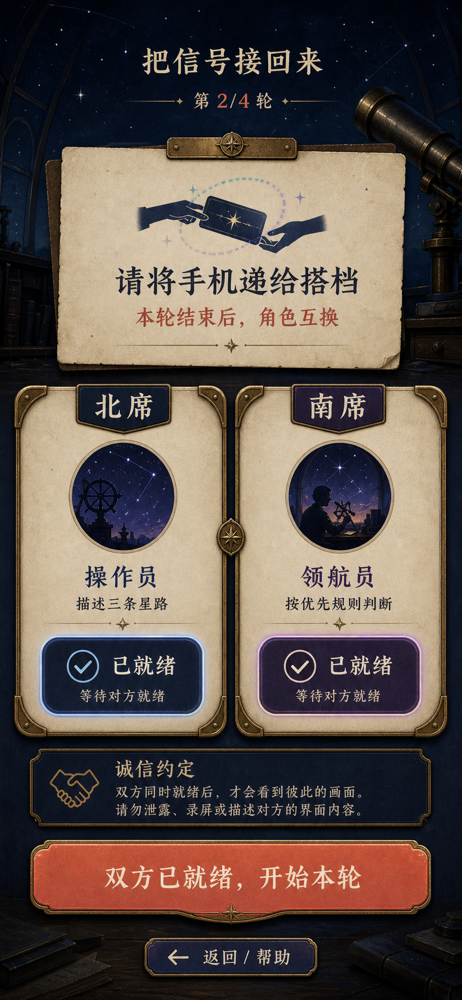
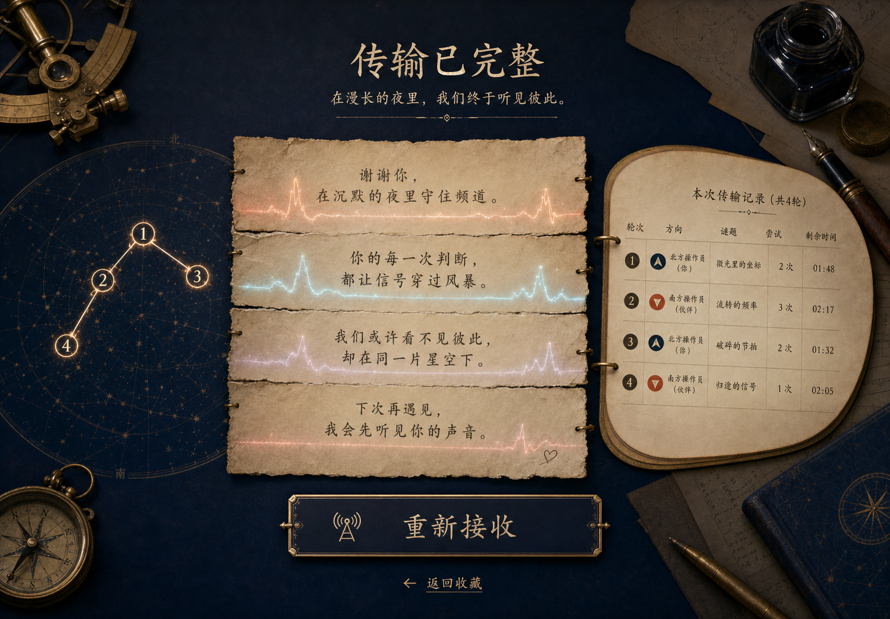

# 「把信号接回来」视觉设计

> 设计日期：2026-07-18。对应规格：[`87-signal-repair-manual-spec.md`](./87-signal-repair-manual-spec.md)。三张完整状态概念与一张正式背景均由内置 ImageGen 生成；题面、规则、符号、节点、纹理、控件和全部中文由前端原生实现。

## 1. 视觉结论

作品是一块两个人面对面共用的午夜通讯桌：温暖纸卡承载可读信息，深蓝桌面留出安静空间，黄铜只用于结构与刻度，珊瑚色只用于主要行动或成功，青紫信号光只用于氛围和局部状态。

不是：SaaS dashboard、玻璃拟态、赛博朋克驾驶舱、军工危险面板、商业游戏手册复印件、古董仪器陈列或卡片墙。装饰永远退后于规则、分支、时间和身份。

## 2. 获选概念

### 2.1 桌面进行态



- 原生尺寸：1504 × 1046；
- 采纳：北席规则纸整体 180°、南席三张星路卡、中间共享仪表、纸/黄铜/深蓝材质；
- 不采纳：望远镜、杯子、笔记本等无功能道具；额外“确认选择”按钮；生成式错误中文；过多发光和拟物阴影；
- 实现：操作员直接点击 A/B/C 分支，成功/错误由 reducer 判定；北席只旋转一层容器。

### 2.2 移动交接态



- 原生尺寸：853 × 1844，作为 390 × 844 的纵向构图参考；
- 采纳：强交接提示、角色同等权重、两席准备状态、深蓝与纸卡层级；
- 不采纳：两席在 390px 并排；“双方已就绪，开始本轮”第三道 Gate；人物插画；“不录屏”等多余诚信条款；
- 实现：两席纵向堆叠，第二席 READY 后直接进入 playing；不增加额外确认。

### 2.3 桌面完成态



- 原生尺寸：1504 × 1046；
- 采纳：四段私人传输为视觉中心、四节点星图、中性四轮记录、安静的完成仪式；
- 不采纳：指南针、墨水瓶、钢笔等实物；像语音录音的真实波形；较重的表格边框；
- 实现：使用抽象信号线和四张 HTML 纸条，不暗示页面曾录音；记录用语义列表而非数据密集表格。

## 3. 生产资产

| 文件 | 尺寸 / 格式 | 用途 | 失败降级 |
| --- | --- | --- | --- |
| `experiences/co-op/signal-repair-manual/assets/signal-dust.webp` | 1536 × 1024 WebP，约 144KB | 页面最底层无字星尘纸纹理 | 纯深蓝 + 两层 CSS radial/linear gradient |

资产中央 70% 低对比，轨道、星点与黄铜细线集中在边缘。CSS 应先声明纯色和渐变，再叠加图片；图片不得承载规则、身份、按钮、答案或状态。

三张概念位于 `design/signal-repair-manual/`，只用于设计和最终 fidelity 对照，不进入运行页面。

## 4. 色板

```css
:root {
  --night-950: #07111f;
  --night-900: #0c182b;
  --night-800: #142744;
  --paper-100: #f1e8d2;
  --paper-200: #e1d4b8;
  --paper-ink: #1d2638;
  --brass-500: #ad844a;
  --brass-300: #d0ad72;
  --coral-500: #d66f5c;
  --coral-300: #efa08f;
  --signal-cyan: #6bc9d5;
  --signal-violet: #9b8be5;
  --text-main: #f4ead3;
  --text-muted: #aeb9cd;
  --focus: #ffd78a;
  --danger-free-error: #e5a27d;
}
```

- `danger-free-error` 只表达“这条还没有接通”，不用红灯、警告三角或失败警报；
- 北/南席不能只靠蓝/紫区分，必须同时显示席位名、角色名和几何徽记；
- A/B/C 不能只靠青/紫/蓝区分，必须同时显示编号、纹理名、节点数、符号名和信号档位；
- 正文和按钮按实际实现检查 WCAG 对比，不因概念图颜色自动视为合格。

## 5. 字体与文字层级

不引入外部字体：

```css
--font-display: "Songti SC", "STSong", "Noto Serif CJK SC", serif;
--font-body: "PingFang SC", "Microsoft YaHei", system-ui, sans-serif;
--font-mono: ui-monospace, "SFMono-Regular", Consolas, monospace;
```

- Display 只用于作品名、阶段标题和完成传输；
- 规则、字段、按钮、状态与辅助说明用 body；
- 秒数可用 mono，但不能做七段数码管效果；
- 最小正文 `0.95rem`，规则 `clamp(1rem, 1.4vw, 1.2rem)`，桌面标题不超过 `clamp(2rem, 4vw, 4rem)`；
- 200% 文本缩放允许卡片纵向增长，不截断私人片段。

## 6. 桌面容器模型

```text
page-shell (max 1280px)
└── game-table
    ├── north-workspace [visual rotate(180deg)]
    │   └── rule-sheet
    ├── shared-gauge
    └── south-workspace
        └── branch-grid [A | B | C]
```

- 桌面 Gate 建议同时满足 `min-width: 900px` 与 `min-height: 720px`；否则取消旋转并进入单列模式；
- 北席只在 `.north-workspace__rotator` 一层 `transform: rotate(180deg)`，内部不再反转；
- 旋转不改变 DOM 顺序、Tab 顺序或 `aria-*`；
- `game-table` 是一个完整焦点，不拆成许多浮动 dashboard 卡；
- shared gauge 视觉高度约占舞台 12–16%，包含轮次、时间、角色与暂停；
- 桌面分支三等列，纸卡至少 220px 高，点击面覆盖整卡。

## 7. 移动容器模型

```text
mobile-shell
├── compact-header
├── role/handoff notice
├── navigator rules
├── shared gauge
└── operator branches [A / B / C vertical]
```

- 取消 180° 旋转，保留真实 DOM 顺序；
- handoff 两席卡纵向堆叠，不使用概念图的窄并排；
- playing 同页展示完整规则与完整分支，允许自然纵向滚动；
- 三分支纵排，单卡至少 64px 高，主要字段两行内重排；
- 320px 宽隐藏非语义铜线、星尘和大面积装饰，保留边框和层级；
- 使用 `padding-bottom: max(1rem, env(safe-area-inset-bottom))`。

## 8. 原创星路组件

每条分支是一个真实 `<button>`，视觉结构：

```text
branch button
├── branch-id (A/B/C)
├── texture-field (CSS background + text)
├── signal-path
│   ├── original symbol [aria-hidden]
│   └── N node dots [aria-hidden]
├── node-count text
└── signal meter + text
```

### 8.1 纹理

- `ripple`：两个低对比 radial/curved gradient，文字“波纹”；
- `grain`：稀疏 radial dots，文字“星砂”；
- `lattice`：两组交叉 linear gradients，文字“网格”；
- `forced-colors` 或背景关闭时仍有文字，纹理不是答案唯一载体。

### 8.2 符号

- `moon`：一条不闭合月弧；
- `comet`：小圆核 + 两条短彗尾；
- `ring`：椭圆轨道 + 中心点；
- 优先用 CSS border/pseudo-elements；若 inline SVG，更改 `currentColor`，`aria-hidden="true"`，不含文字。

### 8.3 状态

- default：纸卡 + 低对比信号；
- hover：轻微抬高或边框亮度变化；
- focus-visible：至少 3px 暖黄外框，不只加阴影；
- wrong-lock：保持焦点，显示“还没有接通，继续听对方说”，不摇晃、不红闪；
- correct：珊瑚印章/边线 + 文字“信号接通”；
- disabled：不降到不可读，使用图标和文字说明锁定。

## 9. 阶段构图

### intro

- 作品名、两句玩法、面对面摆放示意、一个“开始校准”按钮；
- 首屏不展示题卡、规则或最终传输；
- 来源/隐私说明放次级区域，不抢主流程。

### handoff

- 明确本轮北/南角色、交换提示、两个同权 READY；
- 单边 ready 后只改变该席状态，不出现题面；
- 不增加概念图中的第三个开始按钮。

### playing

- 桌面结构以第一张概念为准；
- 规则纸只有三条编号规则；分支纸卡只有玩法需要的字段；
- shared gauge 永远可见，但不做巨大倒计时压过双方信息。

### paused

- 覆盖题面并只保留“这一轮暂停了”“继续这一轮”；
- 进入时不宣布答案，不自动恢复。

### timeout

- 使用暗下的信号线和中性文案“信号淡出了，再听一次”；
- 不显示正确分支、规则索引或命中规则。

### round-result

- 一张合并结果纸显示分支与首条命中规则；
- 下一轮提示角色交换；按钮“交换位置，继续”。

### complete

- 以第三张概念的四段传输为中心；
- 四轮记录是辅助列表，星图四节点是装饰性进度；
- “重新接收”次于私人文案，不加分数、星级或胜者。

## 10. 允许文案

视觉实现可直接使用以下短文案；需要改变玩法含义时先改规格。

| 场景 | 主文案 | 辅助文案 / 按钮 |
| --- | --- | --- |
| intro | 把信号接回来 | 面对面放好这台设备。一个人描述星路，一个人按规则领航。 / 开始校准 |
| handoff | 这一轮，交换视角 | 两边都准备好以后，题面和规则才会同时出现。 / 我准备好了 |
| playing | 听对方说，再接回一条星路 | 第 N / 4 轮 / 暂停 |
| wrong | 这条还没有接通 | 继续听对方说，短暂停顿后再试。 |
| paused | 这一轮暂停了 | 时间和信号都停在这里。 / 继续这一轮 |
| timeout | 信号淡出了 | 不公布答案。原题再听一次。 / 再听一次 |
| result | 这一段接回来了 | 命中第 N 条优先规则。 / 交换位置，继续 |
| complete | 传输已完整 | 在漫长的夜里，我们终于听见彼此。 / 重新接收 |

## 11. 动效

- 背景星尘：极慢、低幅 opacity/position，或完全静态；
- READY：只做边框和勾选变化；
- 信号节点：playing 可有 1.8–2.4s 柔和呼吸，不改变可读性；
- wrong-lock：一次短边框收缩/褪色，不横向抖动；
- correct：一次 220–320ms 珊瑚线扫过；
- 传输片段：按 DOM 顺序淡入，不从随机方向飞入；
- `prefers-reduced-motion: reduce`：所有位移、脉冲、扫线和渐变动画关闭，时间与锁定仍由 reducer tick 推进。

## 12. Fidelity ledger

最终浏览器 QA 至少对照以下项目：

| 项目 | 概念承诺 | 运行时 Gate |
| --- | --- | --- |
| 空间结构 | 上规则 / 中仪表 / 下分支 | 1504×1046 首屏同时可见且北席单层旋转 |
| 信息层级 | 私人传输 > 四轮记录 | complete 首屏私人文案面积和对比更高 |
| 材质 | 深蓝纸桌、暖纸、细黄铜 | 资产存在/404 两种情况下层级都成立 |
| 分支可读性 | 三张大卡、属性冗余 | 编号/文字/节点/符号/刻度齐全，关闭颜色仍可解 |
| 角色公平 | 两席等权、逐轮交换 | READY 同尺寸，四轮南北各操作两次 |
| 移动重排 | 单列明确交接 | 390/320 不保留桌面旋转，两席/三分支纵排 |
| 完成仪式 | 四段拼合、无胜负 | 无分数/星级/赢家，四段配置文案完整 |
| 控件 | 拟物但语义真实 | 全部原生 button、48px+、可见 focus |

## 13. 有意偏离清单

1. 移动概念两席并排 → 实现纵向堆叠，原因是 390px 和 200% 文本缩放；
2. 移动概念额外“开始本轮” → 删除，原因是规格规定第二席 READY 直接开始；
3. 桌面概念额外“确认选择” → 删除，原因是分支按钮本身就是明确 action；
4. 概念中的望远镜、指南针、杯子、钢笔、人物 → 删除，原因是无功能且占用信息空间；
5. 完成概念真实波形 → 改抽象信号线，原因是页面不录音；
6. 概念生成中文 → 全部不用，原因是文案必须来自规格和 `textContent`；
7. 概念的厚重拟物阴影 → 压低，原因是可读性、性能和 reduced motion。

## 14. ImageGen 记录

### 14.1 桌面进行态

- 最终文件：`design/signal-repair-manual/concept-desktop-playing.png`；
- 原始生成：`/Users/zenith/.codex/generated_images/019f6391-1492-74c1-ad81-58b3f8721526/exec-90591e06-81c2-493f-b234-eb72cc331eaa.png`；
- 提示词摘要：1504×1046 面对面双朝向网页，北席三规则手册、南席 A/B/C 三分支、中部 45 秒/1 of 4 仪表；午夜天文台、纸卡、黄铜、珊瑚、青紫信号；明确排除炸弹、电线、危险、军工、七段数码管和既有手册版式。

### 14.2 移动交接态

- 最终文件：`design/signal-repair-manual/concept-mobile-handoff.png`；
- 原始生成：`/Users/zenith/.codex/generated_images/019f6391-1492-74c1-ad81-58b3f8721526/exec-307543a7-36cc-4448-b439-efa59926ac05.png`；
- 提示词摘要：390×844 单列 handoff、轮次、交换提示、北/南两席同权角色和 READY、未显示题面答案；48px、安全区、无横向溢出；同一原创天文材质并明确排除危险表达。

### 14.3 桌面完成态

- 最终文件：`design/signal-repair-manual/concept-desktop-complete.png`；
- 原始生成：`/Users/zenith/.codex/generated_images/019f6391-1492-74c1-ad81-58b3f8721526/exec-4b7cbdb0-8f59-4466-a9d5-514b2740083e.png`；
- 提示词摘要：1504×1046 完成态，以四段拼合私人传输为中心，四轮中性记录和四节点星图为辅，无分数、评级、胜负或彩纸。

### 14.4 生产背景

- 最终文件：`experiences/co-op/signal-repair-manual/assets/signal-dust.webp`；
- 原始生成：`/Users/zenith/.codex/generated_images/019f6391-1492-74c1-ad81-58b3f8721526/exec-726adfbe-9c8b-45f8-a8f7-32e5a00a338c.png`；
- 完整边界：1536×1024 深蓝手工纸纹，边缘稀疏星尘/轨道/黄铜细线，中央 70% 低对比；无字、无数字、无 UI、无卡片、无对象、无人、无 Logo、无炸弹/电线/危险符号；
- 转换：`baoyu-compress-image` 通过临时 Sharp 以 quality 82 输出 WebP，2,682,073 bytes → 144,098 bytes；不增加项目依赖。

## 15. 前端交接 Gate

前端编码前必须确认：

- 三张概念和生产背景都能从仓库路径读取；
- 只把概念当布局/材质参考，不从图中抄取中文、规则或人物/物件；
- 使用第 4–12 节冻结的令牌、布局、组件、文案、动效和偏离；
- 所有玩法图形代码原生实现；ImageGen 生产背景失败时 CSS 完整；
- 不新增图片、字体、图标库或音效；确需新增先修订设计和借鉴声明。
