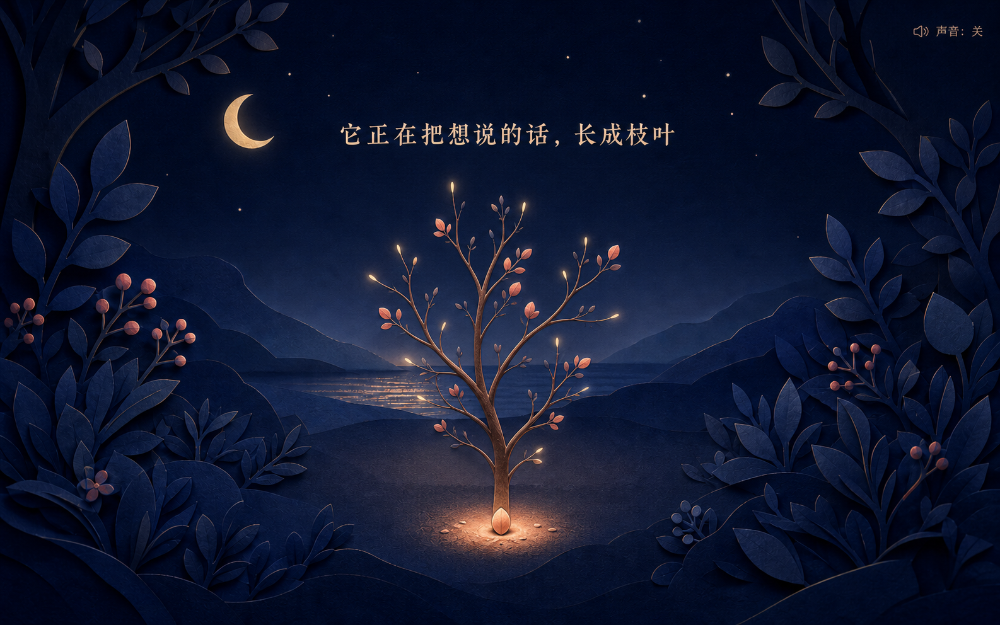

# Love Tree clean-room 视觉概念

> 用途：视觉方向评审，不是生产 UI 或生产素材
> 方向：暮蓝纸雕花园
> 生成日期：2026-07-25
> 前置文档：`docs/366-love-tree-clean-room-brainstorm.md`、`docs/367-love-tree-clean-room-spec.md`、`docs/368-love-tree-clean-room-plan.md`

## 1. 概念总览

这组图展示同一个完整体验的四个状态：

| 文件 | 尺寸 | 状态 | 评审重点 |
|---|---:|---|---|
| `concept-01-desktop-idle.png` | 1586 × 992 | 桌面初始 | 唯一心形入口、留白、静音控件 |
| `concept-03-desktop-growing.png` | 1586 × 992 | 桌面生长中 | 枝干层次、推进感、文案安全区 |
| `concept-02-desktop-reveal.png` | 1586 × 992 | 桌面揭晓 | 心形花冠、树下信件、阅读层级 |
| `concept-04-mobile-reveal.png` | 853 × 1844 | 手机揭晓 | 纵向构图、窄屏信件、触控空间 |

图像 SHA-256：

```text
601af49f8d935f775a3cb3b595215d2f72eeb1088a93184ccf9c7d8364bb2244  concept-01-desktop-idle.png
3d7964cae0a49d9df8c89543835a21e08a6d84f9098192903842169ce3acabd6  concept-02-desktop-reveal.png
08ec4c69a52867022cec1029de7964ce8c6f4eafec9e6c44e0019abd0d8bca7a  concept-03-desktop-growing.png
ed1cd18850fe98f4cc1bd5a158420a330af84e41899cd102d17848e711448290  concept-04-mobile-reveal.png
```

## 2. 共同设计语言

### 场景

- 深暮蓝至墨靛的夜色；
- 纸雕般的山、叶片、月亮和树木；
- 根部与水面使用低强度暖光；
- 画面是一个连续舞台，不是导航、面板或卡片的组合；
- 前景叶片构成自然边框，但主交互与正文保持安全区。

### 树

- 枝杈有自然的不对称；
- 花冠由珊瑚、莓红、暖杏和少量月白心形叶片组成；
- 最终轮廓能读成心形，但不是完美图标；
- 枝干层、花瓣层与微光层可拆解为未来程序化绘制层；
- 概念中的复杂纹理是艺术方向，不代表生产实现必须逐像素复刻。

### 文案

- 标题与情书采用中文衬线气质；
- 状态、计时和控件采用更直接的界面排版；
- 生产实现必须使用真实 HTML 文本；
- 概念图中的文字只用于确认位置、层级与节奏，不得从图片中裁切复用。

### 交互

- 初始态只有一个主要动作；
- 声音开关保持在右上角，默认关闭；
- 生长态不展示信件；
- 揭晓态的信件与树根连续，不使用模态框；
- “再看一次”在最终态才出现。

## 3. 各概念说明

### 3.1 桌面初始态


文件：`concept-01-desktop-idle.png`

提示词意图摘要：

- 16:10 完整网页画面；
- 暮蓝纸雕花园；
- 中央心形实体按钮和一株小芽；
- 标题“有一棵树，想长给你看”；
- 主动作“轻触这颗心”；
- 右上角“声音：关”；
- 无导航、卡片、仪表盘、Logo 和浏览器外壳。

评审结论：

- 入口的视觉优先级明确；
- 负空间足够，适合把第一次触碰变成仪式；
- 月亮、前景叶片和远山提供层次，但不抢入口；
- 未来实现应让小芽与心形按钮的关系更清楚，避免两者看起来像两个独立触发点。

### 3.2 桌面生长态



文件：`concept-03-desktop-growing.png`

提示词意图摘要：

- 延续初始态的纸雕材质和构图；
- 心形入口转为根部发光种子；
- 树干和 5–7 组主枝已长出；
- 只出现约四分之一花瓣；
- 枝梢光点表示动画仍在推进；
- 不展示最终信件。

评审结论：

- 主干、主枝、细枝和枝梢光点形成可实现的动画层次；
- 树木不机械对称；
- 中间态自身完整，不会像加载占位；
- 未来实现应让花瓣更接近“从枝梢长出”，不使用随机全屏粒子。

### 3.3 桌面揭晓态


文件：`concept-02-desktop-reveal.png`

提示词意图摘要：

- 完整自然心形花冠；
- 树根暖光；
- 暖象牙纸页从根部向左下方展开；
- 信件、共同时间和“再看一次”形成三级层次；
- 不使用通用浮层或卡片。

评审结论：

- “盛放”是第一视觉高潮；
- 信纸与树根连接，揭晓方式具备独立记忆点；
- 心形轮廓明确但仍保留枝叶呼吸区；
- 信纸在桌面端占比合适；
- 未来实现要降低部分超大心形叶片的比例，让花冠更自然；
- 计时必须由 HTML 实时计算，图中数值只是布局示例。

### 3.4 手机揭晓态


文件：`concept-04-mobile-reveal.png`

提示词意图摘要：

- 390 × 844 比例的移动端完整场景；
- 树冠位于上半屏；
- 根部连接纵向展开的信纸；
- 计时拆为天数与时分秒两行；
- “再看一次”提供可实现的触控高度；
- 不是桌面图的裁切版本。

评审结论：

- 纵向树木与信纸很适合手机；
- 树、根、信件的连续性比桌面端更强；
- 计时拆行避免了旧版横向挤压；
- 最终实现应减少画面边缘叶片密度，为小屏性能和正文留出空间；
- 揭晓后允许滚动，信件不必强行塞入第一屏。

## 4. 图像生成说明

当前环境的独立 `imagegen` 技能未出现在可用技能列表中，且常见本地技能路径不存在。因此本轮：

1. 完整读取并遵循 `frontend-app-builder` 的视觉概念评审要求；
2. 直接使用图像生成工具创建完整页面状态；
3. 使用图像查看工具按仓库内绝对路径逐张检查；
4. 保留原始生成文件，复制一份进入本目录；
5. 不把生成图自动视为批准的生产资产。

图像未指定任何在世艺术家、商业品牌、影视作品或受保护角色的风格。生成提示只描述原创的纸雕材质、颜色、构图、响应式结构和交互状态。

## 5. 借鉴声明与非复制边界

本组概念借鉴的是仓库历史 Love Tree 可公开观察的体验命题：

> 用户触发后，树木生长、心形花冠盛放，并展示情书与共同时间。

历史 README 记录旧页面迁移自 `cryanskl/html_lovetree`，但没有可确认的上游许可证。本组概念没有读取、复制、改写或提取以下内容：

- 旧 `index.html` 的实现；
- `renxi/*.js` 或 `renxi/*.css`；
- 旧动画参数、时间线、绘图路径或算法；
- 旧 `renxi.mp3`；
- `archive/source-packages/html5-love-original.rar`；
- 旧页面的文案、米白底布局或具体花冠图形。

当前视觉概念没有参考任何新的开源项目、模板或第三方 UI 实现，因此没有新增开源许可证条目。若后续实现参考开源代码或算法，必须先核对许可证，并在生产目录的 `ATTRIBUTION.md` 中写明项目、作者、URL、许可证、借鉴范围和独立改写范围。

## 6. 非生产声明

这些 PNG 用于确认：

- 色彩；
- 构图；
- 视觉层级；
- 动画状态之间的连续性；
- 桌面与移动端的响应式方向。

这些 PNG 不用于：

- 作为整页背景直接上线；
- 从图中裁切按钮、文字或树木；
- 替代 HTML 文案；
- 替代真实响应式布局；
- 作为已批准的最终生产资产。

收到用户确认后，生产 UI 才会使用原创 HTML / CSS / JavaScript 和程序化 Canvas / SVG 重新实现。实现目标是复现设计语言和体验节奏，不是逐像素复刻生成图。

## 7. 需要用户确认

请逐项确认：

1. 整体是否采用“暮蓝纸雕花园”？
2. 最终花冠保持当前“自然但可读为心形”，还是进一步强化心形轮廓？
3. 信件是否保留“从树根展开”的纸页形式？
4. 桌面最终态采用“左下信件 + 中央树”，手机采用“树上信下”的布局，是否通过？
5. 声音开关是否保留在右上角并维持低存在感？

**必须等待用户明确确认这些视觉问题；未确认前不得修改 `experiences/surprises/love-tree/` 的生产 UI、脚本、样式或资产。**
